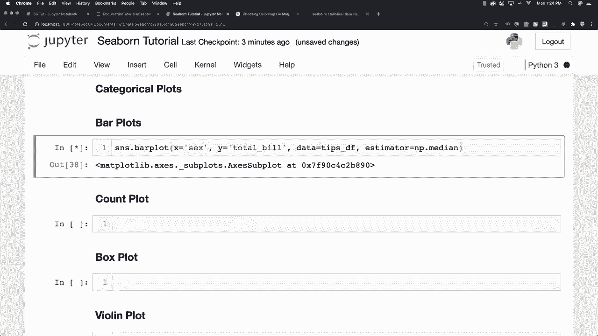
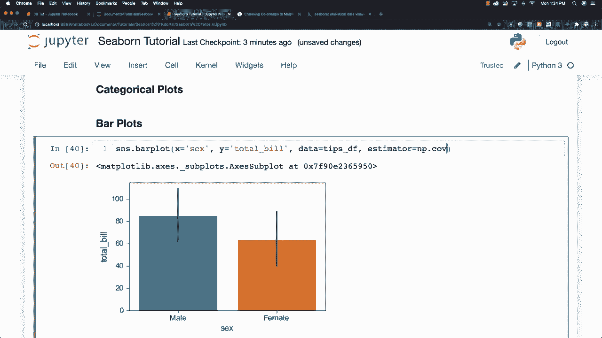

# 更简单的绘图工具包Seaborn，P11：L11- 条形图 

关于分类绘图 现在有了分类图。我们将重点关注使用分类数据的分布，并参考其中的一些数值数据，首先我要谈论的是我们的条形图。因此，我将使用SNS和条形图，假设我们要分析有关不同男性和女性的小费信息，所以我们会说x等于性别，而y等于总账单，所以总账单，当然我们还要说明我们将从哪里获取数据，这将来自小费数据框，在这里你可以看到与我们的小费数据中的总账单相关的性别差异，而这里的小条形图正是对此的引用。

男性与总账单金额之间的方差等，默认情况下。这些数据将基于均值进行聚合，但你可以修改它。因此，估算器是你将如何更改它，你也可以基于中位数进行计算，并且能够使用各种numpy公式。因此，这些数据是基于中位数的，你也将能够基于标准差进行计算。

以及协方差与COV。你也可以创建自己的函数并将其插入估算器，以精确更改数据的聚合方式。这是条形图的粗略估计。

