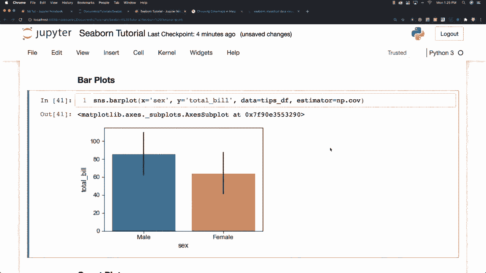
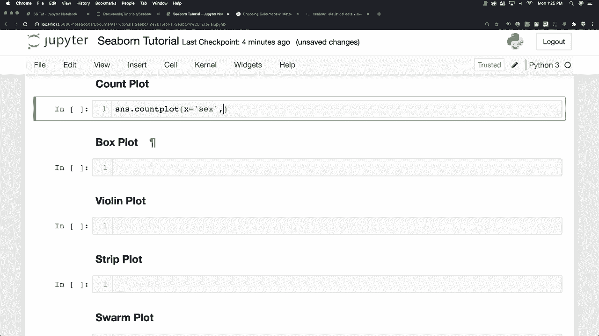
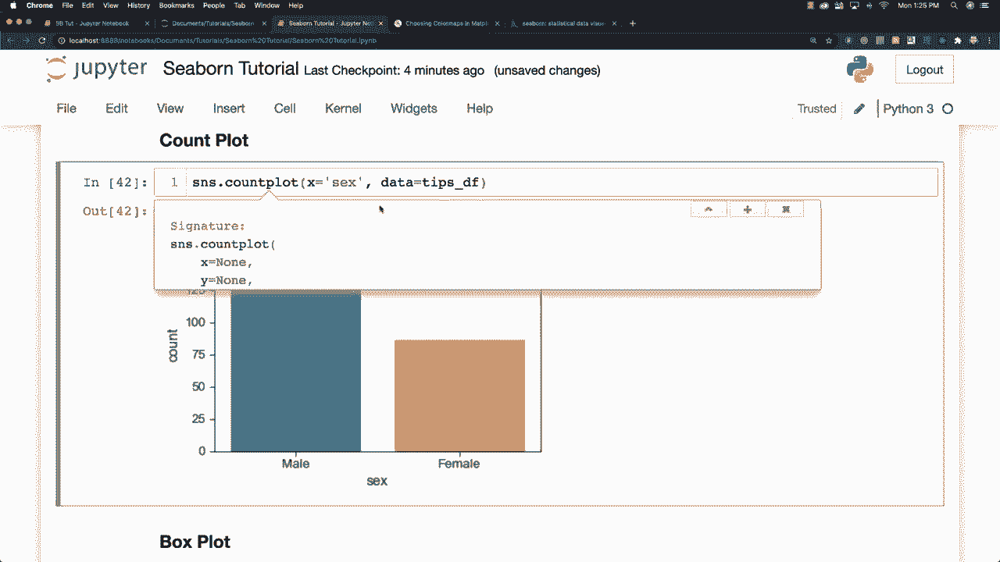
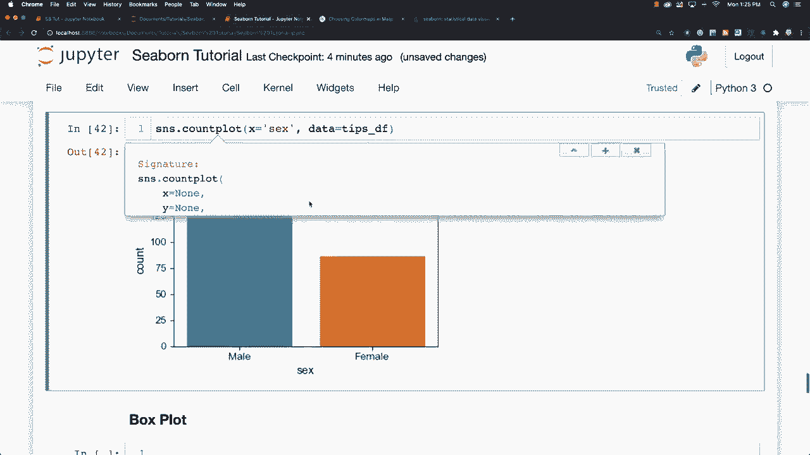
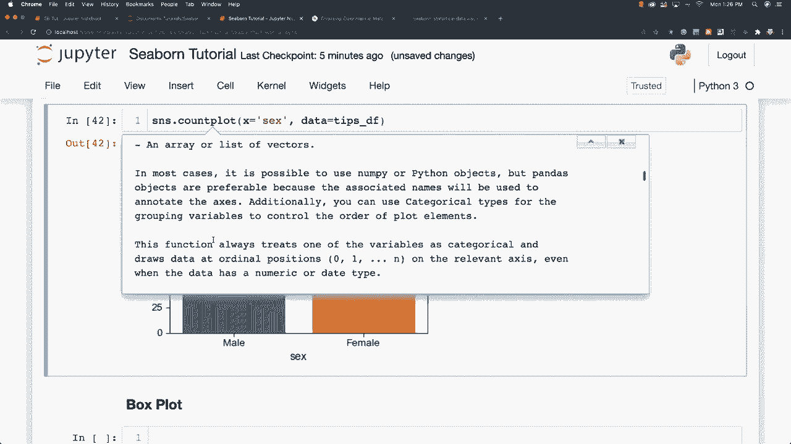
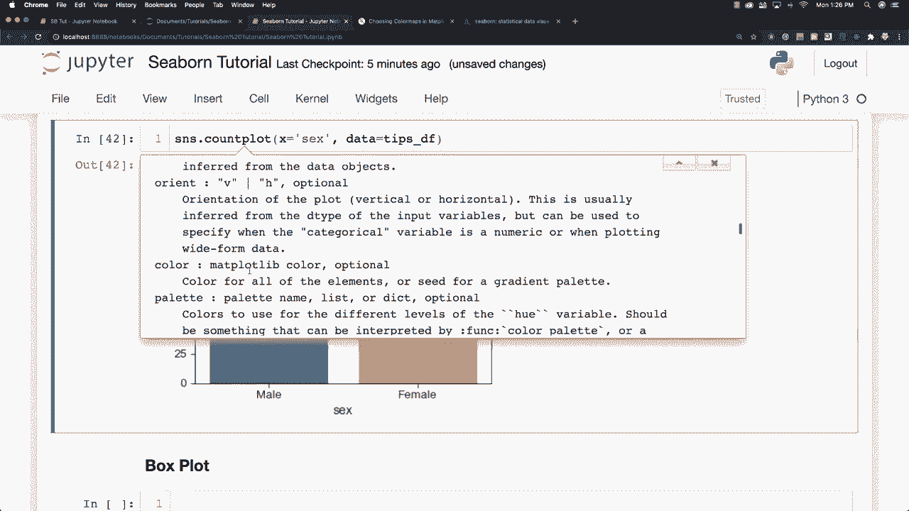
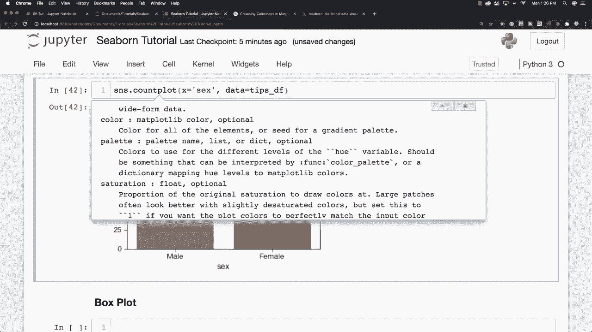

# 更简单的绘图工具包Seaborn，P12：L12-计数图 

现在我想谈谈计数图，计数图有点像条形图，但估算器只是简单地计算出现的次数。我们可以称之为计数图，并在X轴上，比如说我们想找出数据框中男性和女性的数量，你可以看到男性总数与女性总数的比较，正如我所说的那样。

你可以在这个函数后点击Shift和Tab查看所有额外选项。这里有Hue，我们之前已经讨论过，可以改变顺序，改变我们正在使用的颜色、调色板和饱和度，我将谈论Dodge以及其他不同选项，随着下面内容的深入，你还可以阅读所有不同可用的内容和所有不同参数的更多细节。

好的，这就是计数图。现在我想谈谈箱形图。
