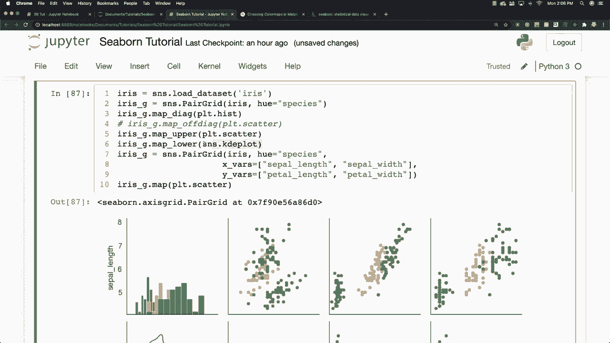

# 更简单的绘图工具包Seaborn，P20：L20- Pair对网格 

好的，我们在这里想做什么？基本上我之前在这里提到过成对图，成对图的工作方式是你插入数据，它会给你一堆不同的图，但当你想要更具体地控制图和数据的显示位置时，那就是成对网格的用武之地。

所以我想在这里做的是，首先我将再次使用Iis，我想基于这个鸢尾花数据创建一个空的网格系统，我说成对网格和Iis。

h将等于物种，因此我们将根据不同的鸢尾花数据框中的物种进行上色，然后我想在上、下和对角线上放置一个散点图。那么我该怎么做呢？我使用Iis G map。

然后我像这样调用绘图和散点图，我还必须加载我们的鸢尾花数据，并且我输入的是app而不是map，好的，所以这就是成对网格的样子，你可以看到到处都是散点图，你也可以看到所有的数据会在行和列中对齐，这些数据的交互和相关性将在我们的图中基本呈现出来，但如果我们决定想要在不同的地方放置散点图，会发生什么呢？

在上、下以及对角线上绘制图，我将说I G map绘制散点图，假设我想在对角线上放置一个直方图，我可以说I G map和对角线和绘制直方图，现在你可以看到我们有一个直方图，但我们也有其他的散点图仍然显示在这里，所以让我们去掉散点图，假设我们想让散点图在对角线的上部和下部显示。那么我们说I G和map在对角线外部绘制我们的散点图，现在我们得到了不被散点图遮挡的直方图，并且我们在成对网格的上部和下部得到了散点图。

但是我们想说我们要去放置不同的散点图。

上面的东西和下面的另一种不同的图。好吧，我们可以直接过来。让我们复制这个，我不需要再打一次。所以我想说在上面我想使用。

这是一个散点图，下面我想输入一个Kde图。实际上这是seaborn的一部分。所以这是Kde图，你可以看到它正好为我们完成了这个。如果你想查看可用的不同选项，当然可以按Shift和Tab。按这个加号按钮，你可以查看与该函数相关的所有不同选项。

太好了，这真是很酷的东西。你可以制作非常，非常自定义且看起来很棒的图表。我们可以在这里定义X和Y的变量，用于我们的自定义网格，方法是输入Iris。

G等于SN S。Para grid。Iris？我将说色调将基于物种，然后X变量将基于萼片长度。我想我发音正确，但我对花朵不太了解，所以如果我说错了，请原谅。然后是萼片宽度，Y变量将等于……让我们复制这个，然后把它改为pal，再把它改为pal，然后我们可以说我们想绘制一个散点图，接下来去掉这一部分，然后我们也可以在这里添加一个图例，你可以看到我们能够创建我们的自定义图表，太好了。

这真是非常酷的东西。接下来我想谈谈另一个网格。

