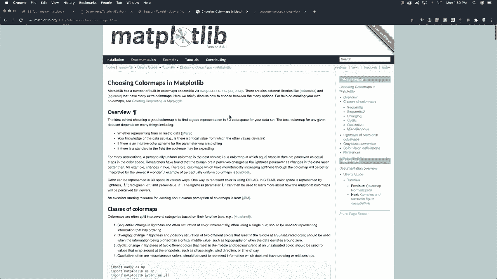
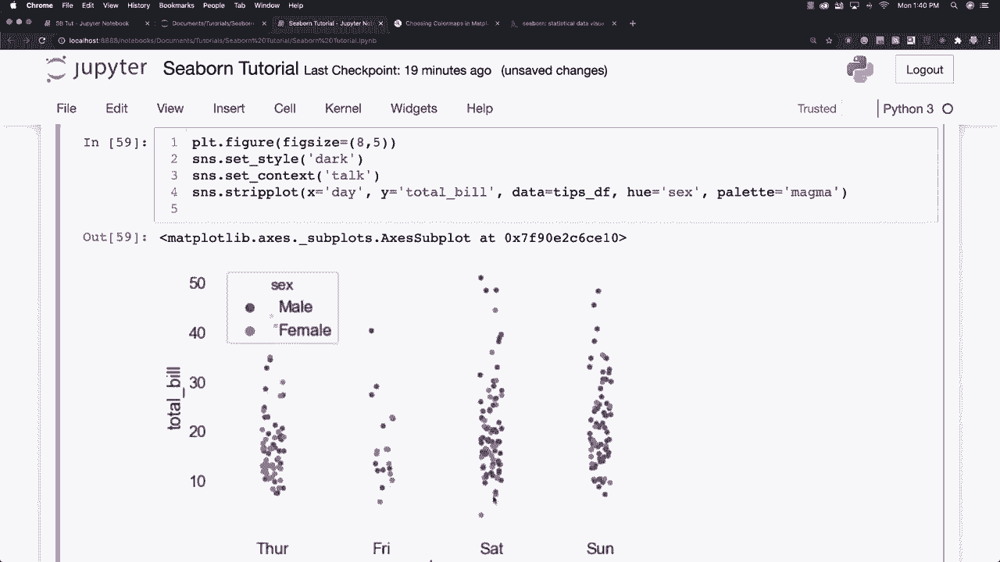
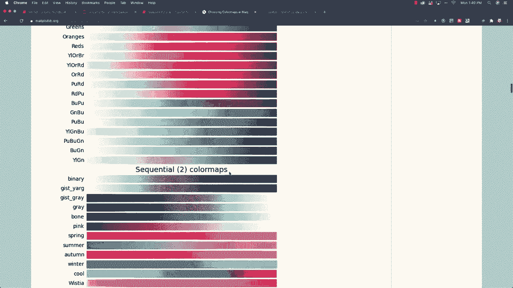
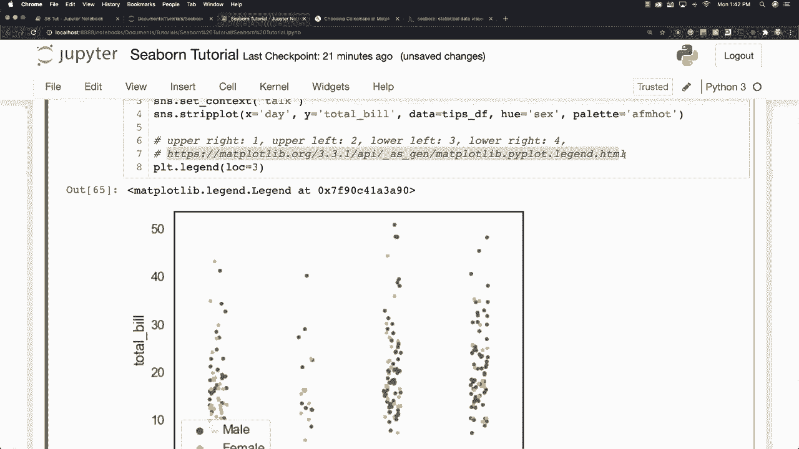
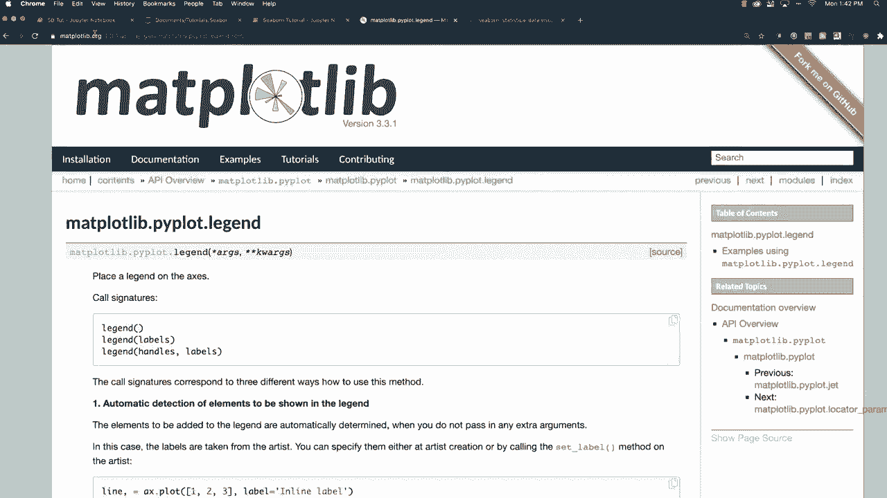
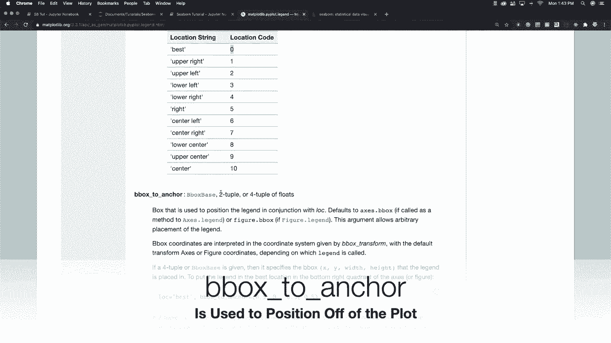

# 更简单的绘图工具包Seaborn，一行代码做到Python可视化！1小时教程，学会20种常用图表绘制~＜实战教程系列＞ - P17：L17- 调色板 

这样可以让我们的图表看起来更好，所以我要改变图表的大小，并且在这里设置我的网格样式，使用更深的颜色，我会把它变得更大，呈现出一种演示的样子，通过调用talk，现在我想要做的是创建一个条形图，让我们坚持我们习惯的样式。

这是我们的小费数据和总账单。我们的数据来自小费数据框，让我们使用h等于性别。在这里你可以看到它最终会呈现的样子。现在我们使用的这些不同颜色，有时候看起来很棒，有时候则不然。如果你想改变它们，你可以设置调色板。

然后你可以为自己找到不同的颜色选项。通过访问matplotlib，特别寻找颜色映射。如果你输入matplotlib颜色映射，它会带你到这个页面。你可以看到很多，这些都是可供你使用的不同颜色映射的示例。

如果你向下滚动，你会在这里看到它们的一个例子。你会得到的颜色。那么假设我想得到像magma这样的颜色。我可以在这里输入。

把它设为magma并运行，你可以看看这样是否更好，你也可以尝试其他不同的样式，比如说你也可以输入purple blue green。让我们试试AFM hot，好吧，让我们试试AFM hot，我也不知道。

我只是随机选择了一些。

这看起来很不错，当然我们可以把头发的颜色改成白色。等等。好了，有一些不同的方法可以改变你的图表颜色，正如我之前所说，有时候这个图例会出现在错误的位置。嗯，很经常你可以通过简单地设置图例的位置为0来解决这个问题，它就会保持在原位。所以如果你想要其他选项来移动它，你可以尝试改变图形的大小，现在它不会遮挡任何数据。

至少这是你可用的另一个选项，或者如果你不喜欢最佳选项，也就是零会给你的，你可以尝试把它放在右上角，方法是输入值一。所以让我们在里面放一个一，现在它在右上角。如果你也不喜欢这样，你可以尝试。

或者左侧，已经是原来的位置，如果有两个的话，可以放在左下角三个位置，所以我们可以试试。而且这仍然有点阻碍，我认为左上角绝对是最佳选项，这是最好的选择。如果你想了解所有其他可用选项。

你可以去 Macplotlib，专门查找 pi plot 图例，它会显示所有其他不同的选项，你还可以选择具体放置，选项包括左上、右上、左下、右下等等，这里是所有这些不同位置的代码数字，你还可以通过使用元组将其特定放在 XY 轴上。所以有很多不同的方法可以通过改变调色板和位置来样式化图例等等。接下来我想讨论一种完全不同的图表，称为矩阵图。

