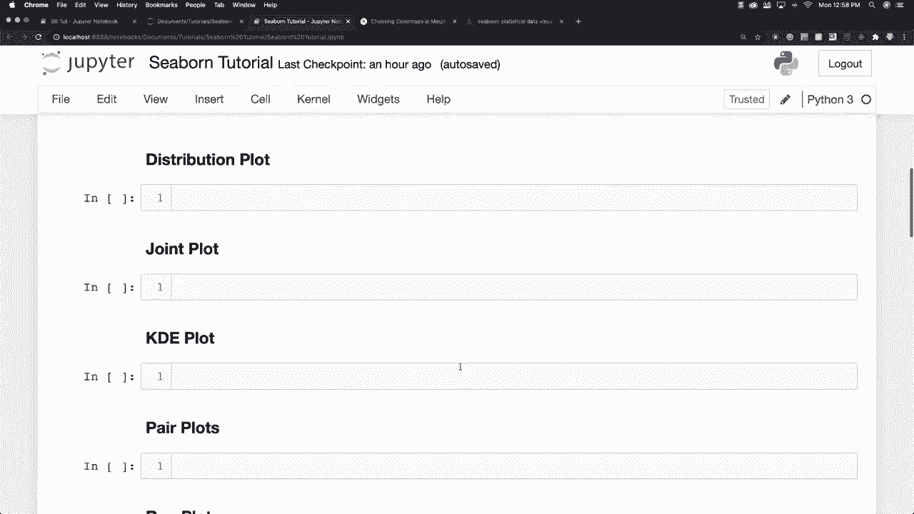
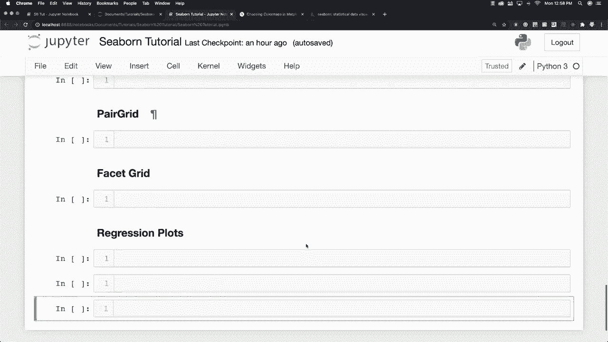
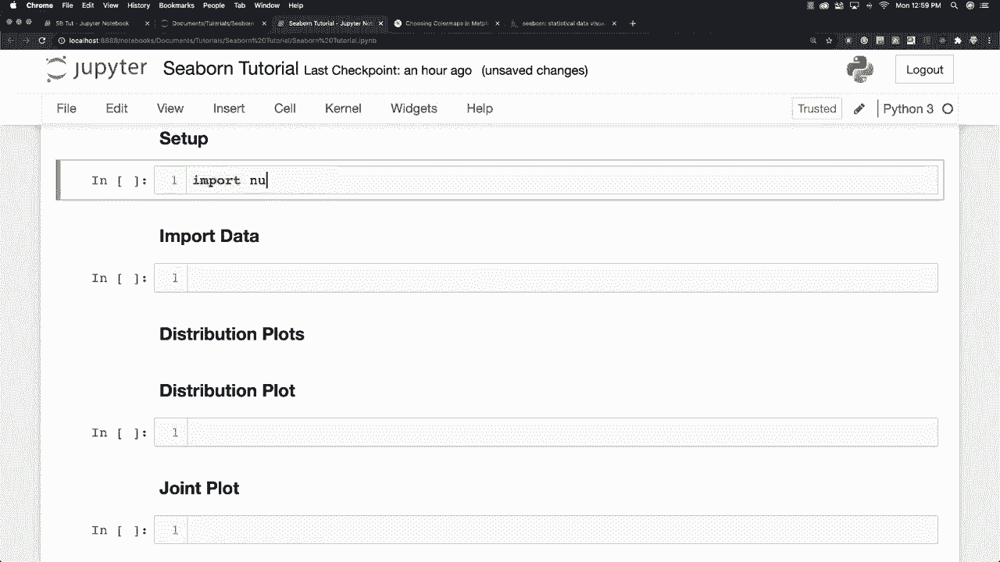
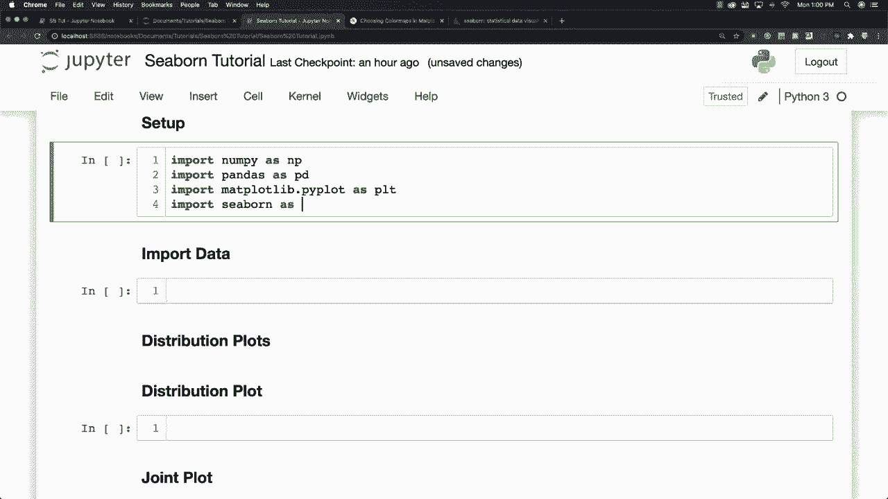
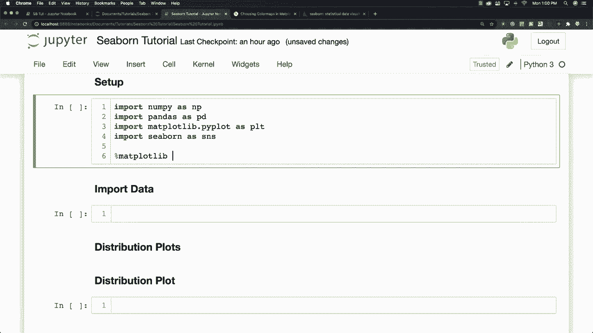
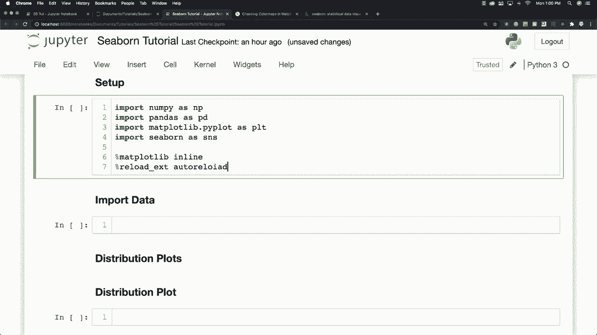

# 更简单的绘图工具包Seaborn，一行代码做到Python可视化！1小时教程，学会20种常用图表绘制~＜实战教程系列＞ - P2：L2- 设置 

现在这是Jupiter notebooks，在这里我会完成所有的内容，你可以看到我将在这个教程中涵盖的所有内容，视频下方也会有一个目录，供你跳转到任何你可能感兴趣的部分。现在，在Mattplotlib中，你通常需要写多行代码来创建一个图表，但正如你将看到的，Seaborn会根据你的需求做出假设，这通常会使你用一行代码获得完全相同的图表，因此它真的很酷。你可以通过使用Anaconda环境标签来安装它，或者在终端中输入这些命令，既可以说`pip install seaborn`，也可以说`conda install seaborn`，所以这两种方式都会让一切正常运行。接下来我会做什么。

首先，设置一切需要导入nuy，我还会导入pandas和Madplotlib，当然还要导入seaborn。如果不这样做，做seaborn教程会很困难，我还会做其他一些事情。

我将设置我的图表直接显示在Jupiter notebook中，然后添加其他命令以实现自动重载。

你不需要做这些，但这可能会对你有帮助。好了，一切设置好后，我只需按控制和回车来加载所有内容。

