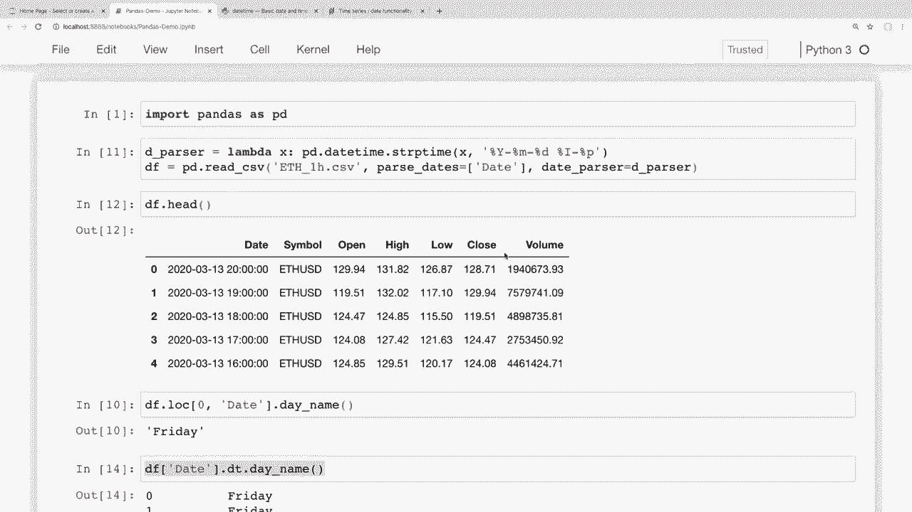
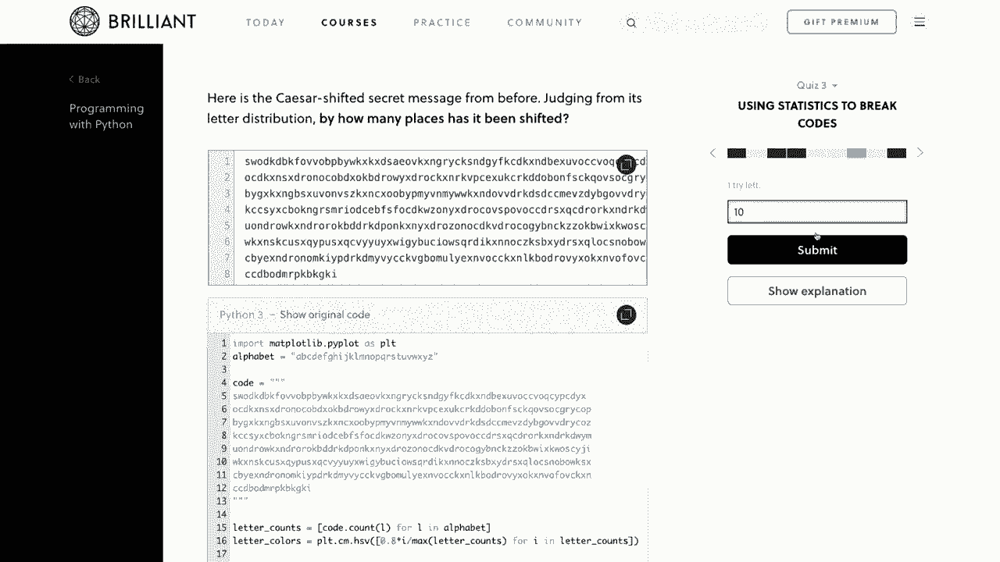

# 用 Pandas 进行数据处理与分析！真实数据&实时讲解，学完就能上手做数据分析了！＜实战教程系列＞ - P10：10）特殊格式 - 日期和时间序列数据处理 

大家好，最近怎么样？在这个视频中，我们将学习如何在 Pandas 中处理日期和时间序列数据。现在，我们可以用日期时间数据做很多有趣的事情，我们将在这里学习这些内容。所以我们将学习如何正确读取数据，以便能够使用日期时间功能。

我们还将看到如何按日期时间进行筛选，如何通过重新采样时间框架对日期进行分组，我们还会看看如何使用我们的时间序列数据进行一些简单的绘图。现在，我想提到的是，我们确实有一个赞助商为这个系列视频提供支持，那就是**Brilliant**。

我真的想感谢 **Brilliant** 赞助这个系列。如果你们能通过下面描述部分的链接查看他们的内容并支持赞助商，那将是太好了。我会在稍后谈到他们的服务。所以说完这些，让我们开始吧。好的，首先。

到目前为止，我一直在使用 Stack Overflow 调查数据。但那个数据集实际上没有任何日期或时间序列数据。所以我不得不为这个视频选择一个不同的数据集。我下载了一些历史的加密货币数据，我们可以在这个视频中进行分析，和往常一样。

我将在下面的描述部分提供下载数据和我正在使用的笔记本的链接。所以我已经打开了我的笔记本，正在读取这个 CV 文件的数据，我们来看看这是什么样子的。我们可以看到，我正在加载这个 CV 文件，我将其命名为 ETH_1H，因为这是以小时为单位的以太坊历史数据，这是一种加密货币。这些数据被分解为每小时的段落。所以如果我们查看这个数据的头部，我们可以看到有一些列在这里。

第一个是日期列，这些数据按小时分解，我们还有一些其他信息，比如符号、这些小时的开盘和收盘值、最高和最低值，以及交易量。因此，这里所有数据都是关于3月13日的，时间是晚上8点、7点。

6点等等。现在，记住，如果你想查看更多关于你的数据框的信息，比如有多少行和列，我可以运行 `df.shape`。我们可以看到这里有23000行，差不多24000，所以我们有相当多的数据可以处理。现在我们就开始处理日期时间数据吧。所以我们这里有这个日期列。

这看起来只是给我们每个小时的数据，但现在这实际上并不是一个日期时间对象。我之所以能这样判断，是因为它的格式并不是日期时间通常显示的格式，但如果你想确认，可以尝试在这个数据上运行 ada 数据 pandas 日期时间方法，看看是否有效。所以让我先获取这个数据框的第一行，并抓取那个日期值。

然后我将继续尝试运行一个日期时间方法。为了获取第一个值，我只需说`Df Lo`，我们可以看到这里的`.X`只是零，因此我将传入`a0`，并想要抓取那个日期列。因此，如果我运行现在的内容，我们可以看到我已经提取出了第一个日期。

所以现在我们就试着在这个上运行一个日期时间方法。有一个叫`day_name`的方法可以告诉我们这个日期是星期几，但如果我现在运行这个，并说`ok.day_name`对这个值，如果我运行它，我们可以看到出现了一个错误，提示字符串对象没有属性`day_name`，因为我们当前将其作为字符串读取。那么我们如何将其转换为日期时间呢？

我们可以用几种不同的方式来做到这一点，我们将在这里讨论其中一些。如果你想像我们这里的那样将一列转换为日期时间，那么我们可以使用`pandas`的`to_datetime`方法。为了做到这一点，我可以简单地说我们将访问那个日期列。

我们将这个日期列设置为，然后我们只需说`pd`，这是我们导入的`pandas`的`to_datetime`。现在我想传入那个相同的列以将其转换为日期时间。现在，我不会立即运行这个，因为如果我这样运行，pandas将尽力弄清楚日期时间的格式并相应地转换，但我这里的日期时间格式相当不同。

我怀疑这行不通，但我们还是试试看吧。好吧，我预期会出现一个错误。如果我们向下滚动查看错误，可以看到它提示未知字符串格式。因此，它不知道如何解析这个日期。但正如我之前所说，取决于你的日期格式。

那么这实际上可能适合你。恰好是以一种格式显示，pandas无法自动转换，除非我们告诉它我们的日期是如何格式化的。因此，我们需要在这里传入一个格式字符串，说明日期是如何格式化的，以便它能够正确解析。现在我提前为这个特定日期创建了正确的字符串格式。

不过要明确的是，我从来没有真的记住这些格式化代码。 我总是需要去Python文档中查找这些代码。所以我这里打开了那个页面。我会在描述部分留下这个链接。不管你的日期是如何格式化的，我们的日期是以年份开头的。

所以我们可以看到那是`%Y`，然后我们有月日，因此我们可以在这里找到。另一个例子是像`8 PM`这样的格式。所以我们可以看到这里的这些`I`，这个`I`是指12小时制，这是我们所用的。然后这个`%p`是指当地的上午或下午的表示。

所以这些将会在我们的格式字符串中，但我会留一个链接以防万一你的日期格式不同，需要你自己创建。因此我需要传入的格式字符串基本上是在告诉 pandas 如何解析我们的日期，我们将先看到年份，然后是一个破折号，然后是月份，再然后是日期，中间有破折号，然后是一个空格，接着是百分比，我记得是12小时制。

然后是一个破折号，然后是百分比 P。所以让我来运行这个。如果我把它正确地输入，那么这个应该会工作。好的，所以我们没有得到任何错误。但让我们确保一下。因此我将查看这里的日期列。我们可以看到这些现在看起来更像是我们在编程中习惯看到的 datetime 对象。

所以它将晚上11点转换为23。抱歉，我以为晚上11点是第一个。不，它是晚上8点。好的。所以它将晚上8点转换为20，晚上7点转换为19，以此类推。现在这已转换为 datetime，我们应该能够运行这些之前给我们带来错误的 datetime 方法。所以在这里我们得到了这个错误，当时我们尝试抓取这些的日期名称。

我将复制这个并粘贴到这里，现在让我们尝试重新运行这个，我们可以看到现在它表示我们系列中的第一个日期，这个 3 月 13 日是一个星期五，所以这很好，看起来它工作了。现在我们这样做的方式是，在用这一行加载数据后将其转换为日期，但如果我们希望在加载数据时就将其转换为日期，那么我们也可以这样做。所以如果我回到顶部，在这里加载的这行读取 CSV。

然后我可以实际上传入一些参数来读取 CSV，以便它将某些列加载为日期时间，然后我们可以传入我们的格式字符串，以便在读取数据时解析它们。因此为此我们需要在这里传入这个解析日期参数，现在我只是要传入一个列的列表。

将会有日期。我们这里只有一个，所以这将只是一个包含一个项目的列表。抱歉，我本来想写日期，而不是日期们。现在，就像之前一样，如果你的日期已经以 pandas 能解析的方式格式化，那么你这里不需要添加其他内容。但我们之前已经看到需要传入特定的格式。

因此在这里我们不能仅仅传入格式字符串，我们需要传入一个将每个字符串转换为 datetime 对象的函数。所以首先，让我们创建那个函数。在这个系列中我们见过 lambda 函数，但以防你不熟悉，你也可以简单地创建一个普通函数，如果你更习惯这样，但这只是一种更简短的方式。所以要创建这个 lambda 函数。

我会把这个叫做 D underscore parser，我将把它设置为一个 lambda 函数。我会把 x 用作这里的变量。那么我们想要返回什么呢？所以当我们在这里使用 P do2 date time 时，我们实际上是将整个序列传递给 PD2 date。Time，但现在这实际上只是将每个单独的字符串通过这个函数。

因此，为了进行转换，我们可以使用一个名为 PDd dot date time dot SP time 的函数。这就是我们将字符串转换为时间的方式。然后我们只需传入。我们将字符串转换为日期时间，然后格式也已经在这里了。所以我会直接复制并粘贴到这里。

这就是我们所需的日期解析函数。因此，日期解析器的参数是 date underscore parser。我将把它设置为那个 D pars 变量，该变量设置为我们的 lambda 函数。好的，现在如果我运行这个单元格。然后我们可以看到没有出现错误。所以这很好。

现在如果我运行这个 D F dot head，这里。😊，那么我们可以看到现在我们的数据框已经以日期时间的形式加载。因此，我们不必在后续进行任何转换。它在读取 CSV 文件时就已经完成了。好的，现在让我们看看一些我们可以对日期时间做的更有用的事情。因此，我将删除下面的销售数据，以便不再转换这些列，因为它们已经作为日期加载进来了。

所以我会删除那个，因为之前是用来进行转换的，我也会删除那个。我会保留这个供参考，因为我之后会把这些放到我的 GitHub 上。好的。在这里之前，我们看到如何对单个值运行 datetime 方法，当我们使用这个 day name 方法时，但如果我们想对整个序列运行该方法呢？假设我们想查看这一整列日期的日期名称。

为此，我们可以访问序列对象上的 Dt 类，并以这种方式访问 datetime 方法。所以这样做。我们可以首先获取那个序列，所以日期列将返回一个序列。如果我运行它，我们可以看到得到所有那些值。现在，如果我们想要在序列对象上访问 Dt 类，我们可以直接说 .Dt。

现在我们想使用的日期时间方法。如果我想获取所有这些值的日期名称，我可以直接用 day name。然后如果我运行它，我们可以看到得到这个序列中每个日期的星期几。因此，在序列对象上使用 Dt 类非常类似于我们如何在整个序列上访问字符串类或 STR 类的字符串方法。我们在之前的视频中看到了这一点。所以这肯定是非常有用的。

假设我们想创建另一列，以便快速参考所有这些交易发生的日期。为了做到这一点，我们可以直接提取我们这里的内容，然后我可以简单地创建一个新列。😊。通过简单地像访问一列那样，所以我可以称这个列为星期几，并将其设置为并粘贴该日期时间方法。如果我运行这个，然后我们查看我们的数据框。

然后我们可以看到，现在我们可以快速看到右侧，好的，13号是星期五，然后在底部有这些日期，这是一周六，所以能看到这些交易实际上发生在哪些日期真是不错。

现在让我们看看如何探索我们的数据。通过查看最左侧的索引，我们可以看到这个数据集有超过20000行。那么让我们看看如何查看这个数据集中最早和最新的日期。为此，我们可以使用最小和最大方法。所以为了查看最早的日期，我可以简单地访问。😊。

这个日期序列。然后我可以直接对其运行最小方法。如果我运行这个，那么我们可以看到给出的最早日期是2017，0，7，0，1。现在如果我想看看那是什么。那是2017年7月1日。为了查看我拥有的最近日期，它应该是我下载这个数据的日期。

然后我可以看看这里的最大值。如果我运行这个，然后我们可以看到这是2020年3月13日，实际上是我下载这个数据的那一天。日期时间的一个非常酷的地方是我们实际上可以减去日期，以查看这两个日期之间的时间。这被称为时间差。所以为了获取这两个日期之间的时间跨度。

那么我可以简单地说取最大值，然后减去最小值。😊，如果我运行这个。然后我们可以看到这个时间差，它表明在我们数据集中最早的日期和最近的日期之间几乎有1000天。所以在这整个加密货币数据集中，我们有986天，差不多1000天。如果我们想找到一些特定的范围，这确实会是很多天需要查看。

那么如果我们想通过日期做一些过滤呢。比如说，假设我们只是想查看2020年的数据。现在我们已经将这些转换为日期时间，我们可以像在之前的视频中那样创建过滤器，并且我们应该能够使用格式像日期时间的字符串，或者可以使用实际的日期时间对象。

我们将查看这两者。所以让我们看看这个例子和一些代码，这样它就更有意义了。首先，我将创建一个在单独变量中的过滤器，就像我在之前的视频中所做的那样。但如果你更喜欢这样做，也可以在行内进行。我只是觉得将过滤器分开会稍微容易阅读一些。所以假设我想要我们的日期序列。

我想要大于某个值的对象或行。然后我现在只会传入一个字符串。这里我可以传入2020年。Pandas会知道我在说2020年。让我们实际进行一个大于或等于的操作。好的，现在我有了这个筛选。

让我们再做一次Df do Lo。我们在之前的视频中见过这个。然后我会传入那个筛选。所以如果我运行这个，那么我的底部行应该是2020年1月1日。确实是。我们可以看到这里有17000小时的2020年数据，或者抱歉，是1700小时的2020年数据。好的。这不超过2020年的原因很简单，因为我们的最新数据已经没有了。因此，我们没有2021年的数据，因为2021年还没有发生。但如果我们想要2019年的数据呢😊？那么为了做到这一点，我们还需要设置一个上限。

我将说，好吧，我们希望我们的数据大于或等于2019年。我们只是想在这里进行一个筛选。我会把这个复制过来，然后将其替换为小于，并且我们会说小于2020年。如果我运行这个，我们可以看到底部行是2019年1月1日的午夜，顶部行是2019年12月31日晚上11点。所以这给了我们2019年的所有数据行。

现在我们只是使用字符串进行这些比较，但我们也可以使用实际的日期时间。为了做到这一点，我可以说我只需说PDd datetime，然后让我传入月份和日期。所以我会说我想要的日期大于2019年1月1日，然后我会抓取这个并替换2020年。并且我希望这个日期小于2020年1月1日。所以现在如果我运行这个，哎呀，我得到了一个错误，说需要整数。

得到一个字符串可能不太合理，我在这里所做的是我不想使用PD datetime，这是我的错误，我想做我们之前所做的事情，转换为日期时间，以便将这个字符串转换为日期时间。所以我们来对这两个都使用PD。2 datetime并运行它，现在我们可以看到，我们得到了与之前相同的结果，2019年的所有行。关于日期的一个好功能是，如果我们设置索引以使用日期，这对这个数据集实际上是个好主意，因为所有的日期或时间戳都是唯一的，那么我们实际上可以通过使用切片来做到这一点。所以让我们看看这看起来是什么样子，以便更易理解。

所以首先让我们设置索引，以便它使用这个日期列。所以在底部，我会说Df set underscore index，然后我将传入我们希望将索引设置为日期。如果我运行这个，那么看起来很好，我们已经将索引设置为使用日期，现在看起来不错。

它实际上并没有进行那项更改，我想说将`in place`设置为`true`以使更改永久化，所以我会运行它，如果我们再次查看我们的数据框，那么现在我们将该日期作为索引，现在通过该日期索引，我们实际上可以通过将日期传递到我们的括号中来过滤日期，所以如果我们想要2019年的数据，我可以直接说我想要2019年的数据，将其传递到我的括号中，如果我运行它，那么我们可以看到我们得到相同的结果，这里我们获得了1月1日的值和顶部值。

这是12月31日，所以当这些是我们的索引时，直接在括号中访问会更简单，而不是创建过滤器。如果你想抓取特定范围的日期，那么可以使用切片。假设我们想要2020年1月和2月的所有数据，那么使用这个切片，我可以说好的，我想要从202001开始，也就是1月，然后我可以使用冒号做一个切片，然后说好的，我想要到2020年2月，所以如果我运行这个，第二个值是包含在内的，所以我们可以看到2020年1月1日在底部，这个切片一直到2月29日，因为这是一个闰年，现在这非常有用。

为了分析我们的数据，因为假设我们想要获取以太坊在这些日期的所有行的平均收盘价，做法很简单。我们可以直接抓取这个收盘列，然后计算平均值或均值。为了做到这一点，我们可以说，让我先复制这一部分。让我访问那个收盘序列，如果我运行它。

然后我们可以看到我们获取到所有这些天每个小时的收盘值。现在为了得到均值，我可以直接说`Dot mean`。这给了我们在该时间范围内所有行的平均收盘价。并且要记住，每一天都是按小时报告的。

但是如果我们想以不同的方式查看这些数据呢？如果我们想要按天而不是按小时查看这些数据呢？首先，我们需要考虑什么样的视图适合按天查看。例如，假设我们想查看每天的高点。那么现在。

我们将这些高点按小时划分，实际上让我查看一下第一个。让我抓取这个日期范围，然后我们看一下前24个，这样我们可以获取24小时的数据。所以我们可以看到在2月29日，我们有这些不同的小时，每个小时都有不同的高值。但是如果我们说，好吧，我们看到所有这些不同的高值。

但那天的最高值是什么呢？所以实际上，让我抓取一天的高值，然后我们看看那天的高值。所以我们不查看所有这些日期，只抓取2020年1月1日，然后我们将查看那一天的高值。所以再次。

我们并不关心每一天每小时的高值，我们只想知道整天的高值。为此，我们只需获取该系列的最大值，我们已经看到如何做到这一点，方法就像在这里运行mean一样，我们只需说.dot max，如果我运行这个，我们可以看到那天的高值是132。

68 所以现在让我们记住这个值132.68，因为我们将看到如何对数据进行重采样，以便获得我们数据中每一天的高值。然后我们将使用这个值来与2020年1月1日进行比较。所以，现在我们的数据是按小时划分的。

如果我们想重新处理，使其按天、周或月划分，那么我们可以通过重采样来实现这一点。所以让我们看看这是什么样子。如果我想重采样并查看按天的高值。那么我可以简单地访问这个高列。在那个系列上，我可以说，好的，我想对这个进行重采样。

现在我们必须告诉重采样我们想如何重采样这些数据，现在是按小时的。如果我输入一个D，那么它会重采样为按天。如果我输入1 d或2 d，你可以随意选择。你可以用w表示周，这里有各种不同的代码。就像这些日期时间格式一样，我几乎从不记得这些。

所以我总是需要在文档中查找它们。所以我在这里拉取了pandas文档中的这些日期偏移量，并且我将在下面的描述部分中留下这个页面的链接，如果你们想尝试其中的一些。但我们可以看到，我们有小时、分钟、秒、毫秒。

微秒，各种各样的事情。如果你在做财务，你可以按季度等进行处理。所以我想每天做一次。因此，我将在这里放一个D。现在我们必须告诉它，好的，那么我们想对这些重采样做什么，如果我查看的是整天的数据。

如果我取这个整天的第一天，我想对这个高值做什么。我们只是说，我们想要每一天的最大值。所以如果我运行这个，我们可以看到这给我们提供了一个系列，包含每一天的高值。那么现在我们将这个系列保存为一个新变量，并查看之前使用的特定日期。

我将把这个保存为一个变量，称之为highs。接下来，让我们访问20200101这一天的高值。现在，由于我们使用的是相同的日期，我们应该得到132.68这个值。所以如果我运行这个。

然后我们可以看到那天的高值实际上等于我们在这里做的值，所以这有效。但现在，不像之前一次只获取一天的数据，现在我们重采样后，我们有了数据中每一天的高值。好吧，那为什么这种做法有用呢？我的意思是。

你知道，这可能很有用，因为它很有趣。但我们也可以做其他事情。假设我们想要绘制这个图。但不是逐小时查看这些价格的图，现在我们可以做一个按天划分的总价格图。在Jupyter Notebook中，绘制信息非常简单。我实际上会做一个关于使用pandas绘图的整个系列，所以我不会在这个视频中详细讲解，但我们将看到如何在这里做一个非常简单的折线图。首先，我们需要在Jupyter Notebook中使用这个特殊行，允许我们的图表在浏览器中显示。所以我们所要做的就是在这里加一个百分号，然后可以说matplotlib inline。我想提到的一件事是，我确实必须在我使用的虚拟环境中安装matplotlib，所以如果你只安装了pandas，那就要回去安装matplotlib，否则你会在这里遇到导入错误。

但我在我的虚拟环境中安装了这个，以便我们可以看到它在那里工作，现在用这一行代码，我们可以直接在我们的Jupyter笔记本中显示图表。所以我可以简单地对这个重采样的数据框变量运行绘图方法，获得图表。所以我只是说，好吧，我想要高值的图表。所以高值.dot图表。我会运行这个。

我们可以看到这里有一个不错的matplotlib图。好吧，所以这对于，知道吗，只是几行代码来说，挺不错的。现在你可能会想知道是否可以一次重采样多个列。我们可以通过在整个数据框上运行重采样方法来做到这一点，而不是在单个系列上。那么，举个例子，我这是什么意思。好吧，每当我说，知道吗。

一次重采样多个列。我是说如果我们想按天重采样。到目前为止，我们只看到如何获得高值，但如果我们说，好吧，我想按天重采样。但是我还想要，知道吗。整天的平均收盘价。我想要那整天所有交易量的总和。

然后我想要知道😊，最大高值。我想要最小低值。我们在这里通过访问单列的方式来做这件事，而用这种方法我们无法做到。所以为了重采样并使用多个列，方法如下。我们可以通过在整个数据框上运行重采样方法来实现。

所以如果你想在所有列上使用相同的聚合方法。举个例子。假设Df进行重采样。现在我们在这里重采样整个数据框对象。现在我们要传入我们想要重采样的内容。我们把“天”换成“周”。现在我们将按每周进行重采样。

所以如果你想对所有内容使用相同的聚合方法，你只需在那里放入该聚合方法。如果我运行这个，那么这将给我每个列的周均值。现在这很酷，我们可以这样做，有时你可能想这样做，但在这种情况下，使用均值来获取所有列的平均值并不合理。所以例如。

实际上没有必要每小时获取平均交易量之类的东西。你可能希望对整个时间段进行求和，或者对于我们的高低值，这些给出了平均高和平均低，但高低值的意义在于了解该时间段的最高和最低值。所以我们可能也不想在这里使用均值。那么，我们如何重采样以便可以重采样并使用多个列，同时也使用多个聚合方法呢。

我们实际上在之前的视频中已经看到过这个方法。但是我们这里想用的是AG方法，ag方法还接受我们希望在该列上运行的列和聚合函数的映射。例如。

现在，让我们用这些值来做，看看。我们将处理收盘列，高列和低列，然后我们也将处理交易量。所以我要从上面获取这些。然后我们将进行D F.dot.resample，并传入W以进行按周计算。现在，代替传入dot.mean。

就像我们在这里所做的，我将传入dot.AGG。现在我可以传入列名的字典，然后值将是我们希望在该列上使用的聚合函数。所以。例如，假设对于收盘值，我确实想获取其均值。

然后我会说高列。我想为此使用最大值聚合函数。因为我们想要低列的最大值，所以我想获取最小值。对于交易量，我将直接对整个时间段的交易量进行求和。好的，所以再次强调，我们传递给ag的方法中的字典的键。

这是列名，这里是聚合函数。所以我们正在计算收盘价的均值。我们在整个周期间计算高价的最大值，低价的最小值，然后对交易量求和。所以如果我们运行这个，它将给我们提供每周的高低概述。

还有收盘成本的平均值。同时我们也有交易量的总和。所以，你知道，这真的涉及到我们在pandas中可以对日期时间和时间序列数据做的事情。就像我刚才说的，我确实计划做一个关于pandas绘图的完整系列，我们将涵盖更高级的话题，比如绘图和滚动平均等。

在结束之前，我想感谢本视频的赞助商，那就是Brilliant。我非常喜欢Brilliant提供的教程，并且绝对推荐你们去看看。在这个系列中，我们学习了Pandas以及如何在Python中分析数据。Brilliant将是一个很好的补充，帮助你通过他们的实践课程来扩展在这里学到的知识。

他们有一些优秀的课程和课件，深入探讨如何正确思考和分析数据。对于数据分析基础，我强烈推荐他们的统计学课程，它教你如何分析图表并确定数据的显著性。我也推荐他们的机器学习课程。

这将数据分析提升到一个新的水平，你将学习被用来让机器做出决策的技术，而这些决策涉及的变量对于人类来说实在是太多了。因此，支持我的频道并了解更多关于Brilliant的信息，你可以访问brilliant.org/forgelash/cs，注册免费账户。此外，前200位访问该链接的人将获得20%的年费折扣。😊。

高级订阅。你可以在下面的描述部分找到那个链接。再次强调，那是brilliant.org/flashC。好的，我想这就是本期Pandas视频的内容。我希望你能对如何在Pandas中处理日期和时间序列数据有个很好的理解。正如我所说，我们还有很多内容可以覆盖与日期时间数据相关的知识。

我觉得我们所做的应该为你提供能够转换、分析和重采样数据的基础，以便你能够进行所需的精确分析。在下一个视频中，我们将学习如何从不同来源读取Pandas中的数据。

到目前为止，在这个系列中我们只涵盖了文件，但我们将学习如何从Excel、网站、SQL数据库和其他一些来源读取数据。请务必关注这一内容。如果有人对本视频中所涉及的内容有任何疑问，请随时在下面的评论区提问。

我会尽力回答这些问题。如果你喜欢这些教程。😊，也可以通过点赞来支持它们。还有一些其他方式可以做到这一点。最简单的方式就是给视频点个赞，并且分享这些视频给你认为会觉得有用的人。如果你有条件的话，可以支持我的Patreon。

在下面的描述部分有一个链接。请务必订阅以获取未来的视频。感谢大家的观看。😊。
