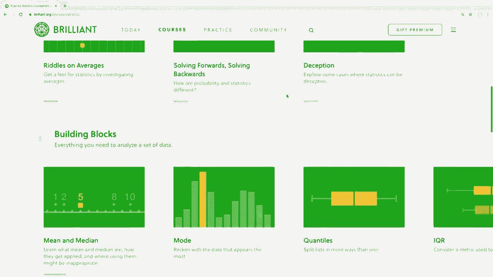
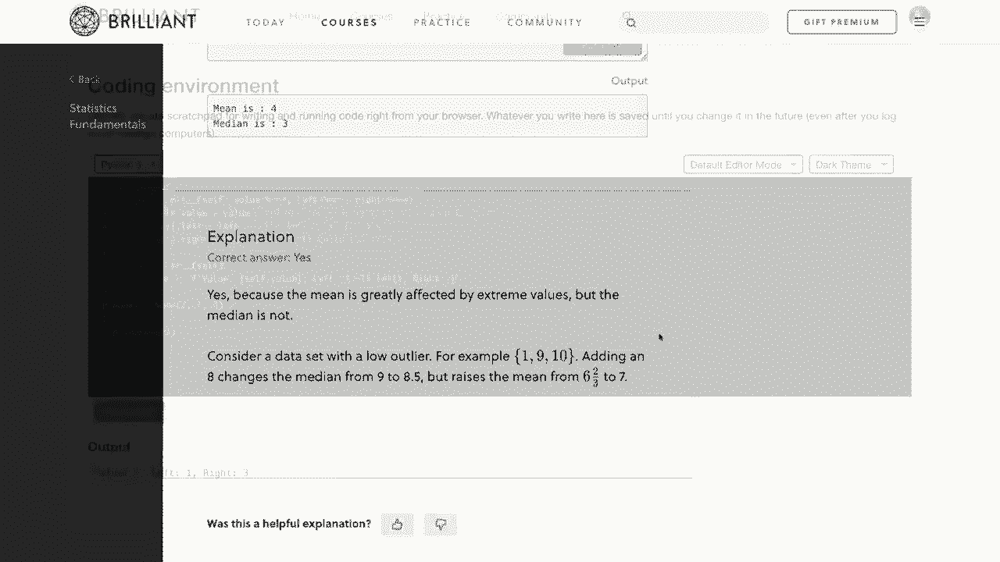
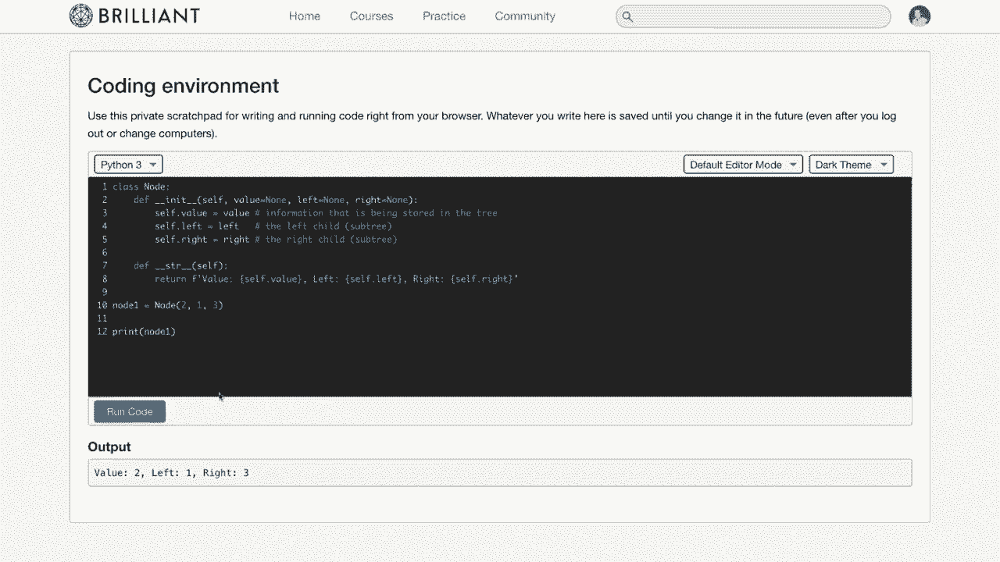

# 用 Pandas 进行数据处理与分析！真实数据&实时讲解，学完就能上手做数据分析了！＜实战教程系列＞ - P11：11）更多数据源 - Excel、JSON、SQL 等格式数据读写 - ShowMeAI - BV1M64y187bz

嘿，大家好，最近怎么样？在这个视频中，我们将学习如何读取和写入不同来源的数据。所以我们将学习如何使用 CV 文件、Excel 文件、Json 以及 SQL 数据库进行数据的读取和写入。到目前为止，在这个系列中，我们一直在从 CV 文件中读取数据。但在数据科学中。

数据存储的方式有很多种。因此，在这个视频结束时，你应该能够将数据进出 pandas，无论你使用什么数据格式。现在，如果你观看这个视频是因为你在寻找如何读取和写入特定文件格式，那么我会在下面的描述部分添加时间戳，指向我们从每种不同格式读取和写入的地方。

现在，我想提到的是我们确实有一个赞助商来支持这一系列视频。那就是 **brilliant**。所以我非常感谢 **brilliant** 赞助这个系列。如果大家能通过下面描述部分的链接查看他们，并支持赞助商，那就太好了。我会在稍后更多地谈论他们的服务。因此，话说回来。

让我们开始吧。好的，首先，让我们看看 CV 文件，因为我们已经在这一系列中使用过这些😊。我们应该已经熟悉从 CSV 中读取数据，因为到目前为止我们一直在做这个。但如果这是你观看的系列的第一部视频，让我们再复习一遍，然后我们也将学习如何写入 CV 文件。

所以在我笔记本的顶部，我们可以看到我正在读取这个 CSV 文件，这个 Cv 文件位于与文件系统中的 Jupyter 笔记本相同位置的一个数据文件夹中。如果你在系统的其他地方加载了一个 cv 文件，那么你需要传递该文件的完整路径，而不仅仅是我们这里的相对位置。

我们可以看到在读取我们的 Cv 文件时可以传递不同的参数。所以在这个例子中，我将索引自动设置为此受访者列，即每个参与此调查的人的受访者 ID。当我读取 Cv 时，我们可以看到它将这个数据框架设置为相等。

到数据，我们可以在底部打印出这些数据。所以这是读取 CSV 的方法，它允许我们将数据导入到 pandas 中。现在让我们学习如何将这些数据写回到 CSV 中。也许你会对数据框进行一些更改和不同的分析，然后我们想将其导出回文件系统以便后续使用，或者与其他人分享之类的。

例如，我们可以过滤这个调查中的特定位置，可能你正在为你的特定国家进行一些分析，你只想看到来自该位置的调查结果，我们在之前的视频中见过这一点。但是如果我们想过滤，我们可以简单地说我会在这里创建一个过滤器，只要说我想要这里的国家，如果国家等于印度。所以假设你在做一些分析，你只想要来自印度的调查结果，现在我要在这里创建一个新的数据框。

我将称之为 Indiadf 并做一个 Df do Lo 并传入过滤器。所以现在如果我做一个 Indiadf do head 来查看这个新数据框的开头，如果我们在国家列中查看，那么我们可以看到这里所有的国家现在都设置为印度。所以现在假设我们想将这个新的过滤数据框导出到一个 CSv 文件。因此，为此我们可以使用两个 CSv 方法。

所以我们可以说我会说印度下划线 Df，这就是我们的数据框 do2 下划线 CSv，现在我将把它传入那个数据目录中的相同位置，然后我将称之为这个修改后的 do cv。所以如果我运行这个，我们可以看到没有任何错误，现在如果我回去看看我的文件系统，那么我有这个修改后的 do cv。

所以如果我点击这个。那么我们可以看到这现在是一个小块在一起，因为这是一个 CSV 文件。我们正在查看一个 Ros CSsv 文件。但我们可以看到我们有所有的列名在这里。然后第二行应该是第一个结果，我可以看到这里我们有印度作为那个国家，如果我查看第二个结果，我们可以看到我们再次有印度，并且在这里再次有印度，我可能看不到，但你知道我们可以假设它在那里，看起来很好。

实际上，它就在那儿。所以我们可以看到我们确实将这个数据框导出到一个新的 CSv 文件中，所以这很简单。现在让我们看看如何读取和写入一些其他格式。所以你可能会遇到一个制表符分隔的文件，这几乎与 CSV 文件完全相同。

但是你的数据不是用逗号分隔，而是用制表符分隔。因此，为此，我们仍将使用我们已经看到的相同的 CSV 方法，但我们将传入一个自定义分隔符，所以我们可以通过将文件扩展名更改为 TSV 来写入一个制表符分隔的文件，我还将指定一个分隔符参数。所以我会说ep SP。然后你想传入你的分隔符。

如果你想传入任何内容，例如用井号分隔的文件或其他内容，但逗号和制表符可能是最常见的。所以我将在这里放一个反斜杠 T，因为这就是我们在 Python 中指定制表符的方式。现在，如果我运行这个单元，我将返回到我们的数据目录，我们可以看到现在我们有这个修改后的 do TSv。如果我点击它，我们可以看到这看起来几乎和逗号分隔的文件一样。

但是现在我们这里有制表符而不是逗号。现在，如果你正在读取制表符分隔的 CSV 文件，你只需要将 SP 设置为反斜杠 T。你可以将其作为参数添加到这里的 read CSV，这基本上是相同的。好的，现在让我们继续其他文件格式。

在处理这种数据时，非常流行的文件格式是 Excel。现在，如果我们想写入 Excel，那么我们需要 Pip 安装几个软件包。所以我打开了我的终端，当前环境是我在使用的 Jupyter notebook。让我抓取我的另一个终端。所以我在 Jupiter 中使用的是相同的环境。

你想确保使用相同的环境，以便你的 Pip 安装在正确的位置。现在我们要安装几个软件包。首先，我要说 Pip install。这是 Xl W T。Xwt 将写入较旧的 Xls Excel 格式。但如果你想写入较新的 Excel 格式。

然后我们还需要安装 open pi XL。你可以通过列出所有软件包来安装多个。😊，但只需在这里列出它们。最后，如果我们想读取 Excel 文件，那么我们可以安装 X LRD 包。所以我认为这是我们在处理 Excel 文件时所需的三个软件包。所以我将继续安装所有这些，让它们完成。一旦安装完成。

让我们回到我们的笔记本。现在让我们尝试写入一个 Excel 文件。为了写入 Excel 文件，我将写入我们这里的相同修改后的数据框。我们将使用两个下划线 Excel 方法。这就像传入一个参数一样简单。比如说，我将把它保存在那个数据文件夹中。我将其命名为 modified dot Xls X。

所以我将写入较新的 Excel 格式。如果我运行这个，它可能需要一段时间来完成，因为它实际上是在后台创建这个 Excel 文件。让我们等它完成，当这个从星号变为数字时，我们就可以知道它完成了。好的，完成后，让我们翻到数据文件夹，我们可以看到确实有那个 dot Xlsx 文件。

现在，这在 Jupiter 中可能无法打开，因为这是一个 Excel 文件。我们可以看到，我们无法在浏览器中打开它。我们实际上需要 Excel。所以让我打开我的查找器窗口。我在这里打开了它。我在这个数据文件夹中，我们可以看到我们有修改后的 dot Xsx 文件。

现在我实际上在这台机器上没有 Excel，我有 Numbers。所以我将在 Numbers 中打开它。它在 Windows 上基本上应该是一样的，但你可以直接用 Excel 打开。再次说明，这可能需要一秒钟来打开，因为我们这里的数据仍然有很多行。好的。

所以我们已经在 Excel 中打开了这个文件。再次说明，我用的是 Numbers，因为我在 Mac 上，没有安装 Excel。但它在 Excel 中也应该能正常打开。让我放大一点，以便我们可以看到，如果需要，我们可以格式化这些内容。例如，我们可以在这里更改列的大小，使所有内容适应，但我们可以看到我们的回应者是。

如果我查看国家，我们可以看到它确实导出了我们希望导出的过滤数据框。所以一切看起来都很好。现在，我们还可以对 Excel 做一些更高级的操作。如果你熟悉 Excel，可能知道我们有不同工作表的概念，可以在一个 Excel 文件中有多个电子表格。如果你想读取或写入特定工作表。

那么你可以将工作表参数传递给这些方法。实际上，我正在尝试滚动到我的笔记本上。让我滚动到最底部。正如我所说的，如果你想读取或写入特定工作表，你可以将工作表参数传递给这些方法。还有一种方法可以从不同的列和行开始。

但我不打算在这里深入探讨这些小细节。如果你在谷歌上搜索这个方法名称与 Excel 相关的内容，你可以找到可以传入的参数和文档中的所有额外细节。所以现在，让我们继续，看看如何读取我们刚创建的同一个 Excel 文件，并确保这能够正常工作。默认情况下，它会加载一个默认索引，就像我们读取 Cv 文件时一样。

所以我们需要指定我们的索引列是那个回应者列。为了做到这一点，我就叫它测试，因为我们将从刚创建的 Excel 文件中创建一个新的数据框。我们将使用 `read_excel` 方法，并且我想传入位置，我会复制这个位置。

这是我机器上的修改版 Xl S X。现在我要将索引列设置为回应者，在你的数据中可能会不同，但我希望我的索引列等于那个回应者。所以我将运行那个单元格并加载它，然后查看测试数据框。在我运行这个之前，我会确保这个处理完成，并且这个星号消失。

这可能需要一些时间，因为它实际上是在从Excel加载数据，这比从CSV加载要复杂一些。那么现在如果我们查看这个测试数据框，让我只看一下头部，而不是查看整个内容。如果我查看头部，那么我们可以看到这里有一个与上面相同的数据框。

所以这被导出到Excel并正确导入了。好的。那么现在我们来介绍一些其他流行的文件格式。现在JSon在这种数据中也非常流行。那么我们来看一下。首先，让我们将修改后的数据框写入一个Json文件。对于写入Json文件，我们可以使用to_json方法。

所以你可能开始看到一个模式。这些方法名称非常直接。现在这个稍微有点不同，因为我们可以为Json使用一些不同的方向。因此，只需使用默认参数，我可以说，这就是India_Df.to_json。然后我将传入一个文件位置，但不是Excel文件，而是Json文件。

现在我将暂时使用默认参数。然后我会告诉你如何稍微改变一下。所以如果我运行这个。我们可以看到它运行得非常快。如果我返回到我的数据文件夹。那么现在我们有了这个JSon文件。如果我在这里查看。好的。

这只花了一秒钟就能在我的机器上打开。再说，我们这里确实有很多数据。但是如果我们在这里查看，就会发现这非常像字典。所以我们这里有一个主分支键，然后该键的值是仅针对该列的所有响应。如果我向下滚动，就能找到其他键和其他响应。因此，默认情况下，这就像一个字典类型的Json。现在，我们也可以用不同的方式来编写Json文件。

再次，我不会深入到每一个细节。但假设我们希望这个Json是列表形式而不是默认的字典形式。那么为了做到这一点，我们可以更改orient参数。所以我们在参数中添加一个。并且我会说orient等于。如果我们传入records，并且lines等于true。

然后这将使其变成记录形式，即列表形式。并且lines等于true。让我拼写正确。好吧，只是让每个都在新的一行上。这样可能更容易阅读。如果你想查看可以传递给orient的确切参数，那么再次查看pandas的to_json方法。它会带你到文档中，那里有所有可以传入的不同内容。

所以让我运行这个。现在让我们返回并重新加载我们的Json文件，看看它的样子。现在我们这里有的更像是列表形式。因此在之前我们有一个单一的字典，其中的值是所有响应的列表。但是现在我们一次只有一个响应。所以我们有主分支。然后这实际上是这里的第一个。如果我向下滚动。

我们可以看到这是第二个。😊这实际上是整个第一个响应。所以我们有主要分支，然后是答案，然后是开源，然后是答案，依此类推。我们在这里看到，对于国家，我们有印度。每个调查中的响应实际上都在不同的行上。

这与之前的情况有点不同，但我们可以根据需要以不同的方式导出这些 Json 文件。好的。那么现在我们已经将数据写入 Json 文件。现在让我们也读取这个 Json 文件，以确保我们知道如何做到这一点。

现在，由于我们在这里使用这些不同的参数写了 Json 文件。那么在读取数据时，我们也需要使用相同的参数。所以，如果你在读取 Json 文件时遇到任何问题，那么你可能需要调整不同的参数以适应你尝试读取的数据。

在这种情况下，我要复制整行。然后我会说 test 等于。实际上，让我先抓取这部分。我会说 pd.read_json，然后将所有这些参数传递在这里。所以我们从这个位置读取 JSON 文件。我们知道 Orient 是列表而不是字典，并且这些都是在新行上。

同样，根据你的 JSON 数据，你可能需要根据数据的外观来调整这些设置。所以如果我运行这个，看看。如果我们有之前导出的相同数据。看起来是这样的，这看起来与我们导出数据时完全相同。好的。那么我们要查看的最后一种文件格式。

让我们学习如何从 SQL 数据库读取和写入数据。现在，这可能是最复杂的，因为你需要先设置数据库以及所有相关的配置。但为了本视频的目的，我将假设你已经有一个带有正确登录凭据的数据库。因此，我在我的机器上设置了一个 Postgres 数据库，将用于读取和写入。

首先，让我们看看如何连接到这个数据库。现在，就像使用 Excel 一样，我们需要安装一个包来实现这一点。所以让我打开我的终端。我要关闭这个数字文件。让我试着退出这个，实际上，我会把它最小化。关闭时遇到了一些麻烦。好的。

让我回到我希望能打开以安装一些不同包的终端。这是我的 Jupyter notebook。我的另一个终端在哪里？来了。好的。那么要连接到我们的数据库，我们需要安装 SQL Alchemy。这是一个非常流行的 Python ORM，它使我们更容易处理数据库。

如果你不知道什么是 ORM，它是对象关系映射的缩写。这只是我们用 Python 对象连接到数据库的一种方式。我计划将来制作一个关于 SQLAlchemy 的完整视频或系列教程。但现在，让我们继续安装这个。所以这是 Pip install SQLAlchemy。我将安装它。

根据你使用的数据库，你可能在这里不需要做其他任何事情。例如，如果你使用的是 SQLite 或类似的东西。但由于我在这个教程中使用的是 Postgres 数据库，我还需要安装 psycopg2 包，以便我们能够使用 Postgres。

我不确定这是否是这个包的正确发音，但我一直都是这么称呼它的。所以 Pip install 以安装这个与 Postgres 一起使用的包，它是 psycopg2-binary。所以我将安装它，安装了这些包后，让我们回到我们的笔记本，看看能否使用 SQLAlchemy 连接到这个数据库。

首先，我们需要导入所有需要的内容。所以从 SQLAlchemy 中，我将导入他们的创建引擎，这将允许我们连接到数据库。现在我还需要导入 psycopg2。所以让我运行这个单元，现在这些都已导入，我们应该能够创建引擎。

这基本上是我们的数据库连接。再次假设你已经创建了这个数据库并拥有用户名和密码。为了创建它，我可以说 engine 等于，并使用我们刚刚从 SQLAlchemy 导入的 create_engine 函数，现在我们需要我们的 Postgres 连接字符串。如果你不知道如何创建 Postgres 连接字符串，他们在 SQLAlchemy 网站上也有相关信息。让我确保我拼写正确，应该是 PostgresQL，然后我们要传入数据库的用户名和密码。在我的案例中，我只创建了一个名为 Db_user 的用户和一个密码 Db_pass。还有一点我想提到的是，你可能不应该像这样在代码中放置凭据。我会在下面的描述部分留一个链接，展示如何在 Python 中使用环境变量或配置文件来隐藏这些信息，但为了本教程的方便，我就直接放在这里。

但是如果你在做生产代码，我强烈建议使用环境变量，这样你就不会在代码中暴露用户名和密码。好的，所以我们有了我们的用户名和密码。现在是我们想要连接的数据库。这是在本地主机上。这是在我的本地机器上。它运行在 5432 端口，现在是数据库的名称。

现在我在这里打开了 Pg 管理器，可以看到我的数据库。我们可以看到我刚刚创建了一个名为 sample underscore Db 的空数据库。这就是我将要连接的数据库。好的，如果我在这里输入的内容正确，那么我应该能够连接到这个数据库。

现在让我们尝试将修改后的数据库框架写入这个数据库中的一个表。这个表不需要当前存在。默认情况下，它会为我们创建这个表。如果它已经存在，我们需要添加另一个参数来处理。但我们马上就会看到这一点。为了做到这一点，我可以直接说 India underscore Df。

这是我们想要导出的数据框。接着是 to underscore S Q O。现在我们想要写入此数据的表。我将其称为 sample underscore table。现在，这个表目前不存在，但它应该会被创建。现在我们需要传入我们的数据库连接。

我称之为引擎。现在让我们传入它。如果我运行这个，我们来看看它是否有效。好的，所以在我读取或写入时没有出现任何错误。但现在让我们回到我的 PG 管理器，看看我能否看到这个表。首先，我只需右键单击并刷新。我喜欢在进行任何更改时这样做。

我们可以在这里看到，我们在下面有一个样本表。我将右键单击它，选择查看和编辑数据，查看所有行。我们可以看到这确实有效。我知道在我的屏幕上可能有点难以看到，但我们的所有数据都写入了数据库。好的。

所以能够将数据从 pandas 导入 SQL 很好。但是如果我们更新了数据并希望将其重写到这个数据库中怎么办？让我们回到我们的笔记本，看看这将是什么样子。现在，如果我尝试再次运行这行，将其导出到 SQL。

然后我们实际上会得到一个错误，因为这个表已经存在。如果你想覆盖一个表，我们可以添加一个额外的参数。我们想要添加的参数称为 if underscore exists 等于。现在，如果这个表已经存在，我们该怎么办。现在，在我的情况下。

我将把那个表替换为我们的新数据。

但还有其他选项。我们可以让它抛出一个错误，这就是默认情况下的行为。我们也可以将数据追加到一个表中。因此，如果你在进行每日脚本以分析信息，你可以将每日数据追加到现有表中，但对于这个例子来说。

我只是要用这个替换表。现在运行这个，处理完成后我会回到PG admin，再次让我上去刷新一下，深入数据库，关闭这个视图，看看我们是否仍然有这个数据。好的，我们可以看到这个有效，我们能够重新运行那个命令，并且用我们的新数据替换了原有表中的数据。在这个情况下，它是相同的。

是的，但这就是你要怎么做的。好了，最后，现在我们已经看到如何将数据添加到数据库。现在让我们看看如何使用SQL读取相同的数据。如果你跳到视频的这一部分，使用下面描述部分的时间戳。

那么请回去查看我们如何将数据写入数据库，并看看我在这里是如何设置这个数据库连接的，因为我们将重用那个连接来读取我们的数据。好了，所以这现在很简单，因为我们实际上已经设置好了这个数据库连接来做到这一点。

我们可以简单地说我会称之为`SQL_df`。然后我们会说`pd.read_sql`，现在我们想传入我们要读取的表。那个是`sample_table`，现在传入我们的数据库连接。我这里的连接。

我称之为`engine`。而且，我还会传入一个索引列，就像我们在读取CSV时所做的那样。所以我会说索引列等于，这将是你数据中的这个`respondent`行，可能会有所不同。因此，无论你想要什么作为索引，都可以传入。如果你想让pandas使用默认索引，那么你可以完全省略这个。好的，如果我运行这个，那么让我们看看`SQL_df.head`以确保这个有效。

我们可以看到这运行得很好，我们仍然有与开始时相同的数据框，我们将这些国家筛选为仅来自印度的结果。现在可能有一些情况，你不想加载整个表，而是想运行一个特定的SQL查询来加载我们的数据。

我们可以使用方法`read_sql_query`来运行一个特定的SQL查询。所以让我复制我在这里所做的，并粘贴到这里。现在我不打算读取整个表，而是实际上要在这里运行一个查询。所以我会做`read_sql_query`。现在在这里不再是表名。

我实际上要传入一个SQL查询。现在我只是要在这里加载所有内容。所以我会说`select * from sample_table`，其他所有内容都将是相同的。我们仍然有我们的数据库连接，并且我们仍然希望索引列等于`respondent`。所以这仍然会抓取所有行，但如果你想自定义这个。

然后你可以在这里添加一个 where 子句来过滤数据。让我来运行一下。现在我们来看一下我们的 SQL 数据框。我们可以看到这也成功了。因此，我们使用 SQL 查询加载这些数据，而不是简单地读取整个表。这在处理大数据库时特别有用，你只想通过查询加载特定数据。

好的，我们快要完成了。但在结束之前让我再给你一个提示。你可能见过一些人使用 URL 而不是特定文件加载数据，这对于我们之前看过的一些方法是可以的。你只需确保使用正确的方法来处理 URL 上的数据格式。

例如，在我的 Flask 和 Django 系列中，我创建了一个 Json 文件，其中包含该系列网站的一些示例帖子。这个 Json 文件在我的 GitHub 页面上。如果我想将其引入 pandas，那么我可以简单地使用读取 Json 方法，并传入那个 URL。实际上我不需要先下载那个 Json，然后再以那种方式传入。

我在这里打开这个。如果你不知道，GitHub 上可以查看原始文件。我们可以看到这里有一个很长的 URL，但我会在下面的描述部分发布这段代码，方便你跟进。所以我将复制这个 URL。这不在我的文件系统上。现在看看我们是否可以直接加载它。我将这个命名为 post_df。

我将其设置为 P D.dot.read_json，因为这是 URL 上的 Json。如果是 Cv，你需要使用 read_csv，依此类推。现在我可以在这里粘贴那个 URL。现在让我们运行这个单元格。我们可以看到没有出现错误。现在我来查看一下我们数据框的头部。我们可以看到我确实有我的示例帖子。

这些是我在那个网站系列中使用的示例帖子。因此，根据那个 URL 中的数据，你应该能够使用我们看到的方法，从 URL 加载数据，就像我们在这里做的一样。在结束之前，我想感谢本视频的赞助商，那就是 Brilliant。我非常喜欢 Brilliant 提供的教程，绝对推荐你去看看。

Brilliant 是一个问题解决网站，通过主动完成指导课程来帮助你理解基础概念。Brilliant 是补充你在这里学到的内容的绝佳方式，提供动手课程。他们在数据科学方面有一些优秀的课程和课程，深入探讨如何正确思考和分析数据。因此，如果你在看我的 Pandas 系列，是因为你想进入数据科学领域。

那么我强烈建议你也去查看 brilliant，看看你可以学习哪些其他的数据科学技能。他们在统计课程中甚至使用 Python，并会考你如何正确使用。😊。

在该语言中组织数据。它们的指导课程会挑战你，但你也可以获得提示甚至解决方案，如果你需要的话。它真的很注重理解材料。所以支持我的频道并了解更多关于 brilliant 的信息。

你可以去 brilliant.org 注册免费账户，并且前 200 位访问该链接的人将获得年度高级订阅 20% 的折扣，你可以在下面的描述部分找到这个链接。再次提醒，那是 brilliant.org，所以我认为这段 pandas 视频就到这里。

我希望你能对如何从多个不同来源读取和写入数据有一个清晰的认识。我们在这里讨论的内容应该涵盖你在数据科学领域会看到和使用的大多数文件格式。现在，在这段视频之后，我可能会暂时中断这个 pandas 系列，制作几个我一直想要覆盖的单独视频。但我知道 pandas 还有很多主题需要探讨，我会在未来的视频中涉及那些更高级的话题。

😊。

但与此同时，如果你想找到一个学习 pandas 的好资源，那么我强烈建议你查看 Data School 频道。这个频道由 Kevin Markham 运营，他已经在 Pycon 上做了几年的 pandas 教程，他并没有让我推荐他的频道，我只是认为他做得很好。其实他的频道完全致力于 pandas 和数据科学。

他已经涵盖了一些我计划在未来视频中讨论的更高级主题。如果有人对本视频中的内容有任何问题，请随时在评论区提问，我会尽力回答。

如果你喜欢这些教程并想要支持他们，还有几种方式可以做到这一点。最简单的方法是给视频点个赞，并分享这些视频给任何你认为会觉得有用的人。如果你有能力的话，可以通过 Patreon 贡献支持，相关链接在下面的描述部分。

确保订阅以获取未来的视频。感谢大家的观看。
