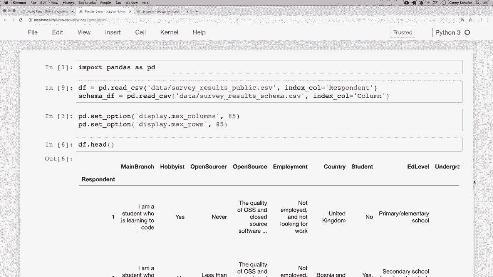
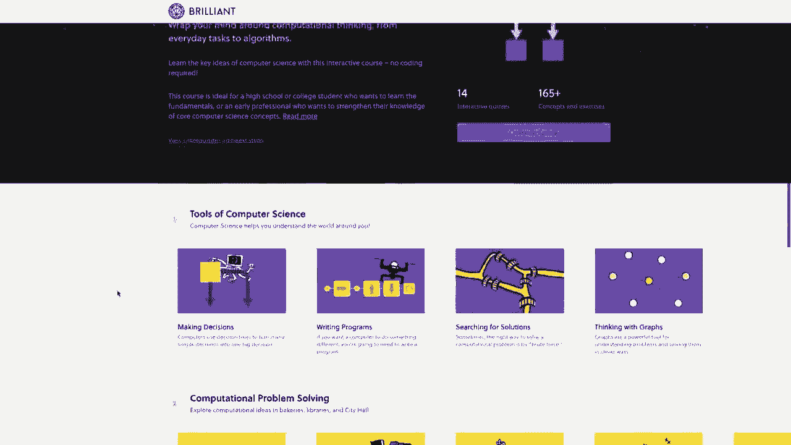
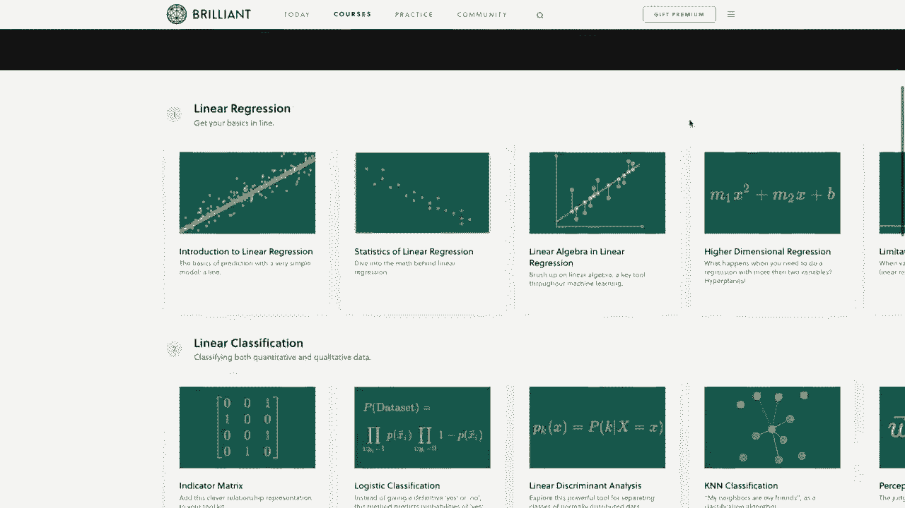
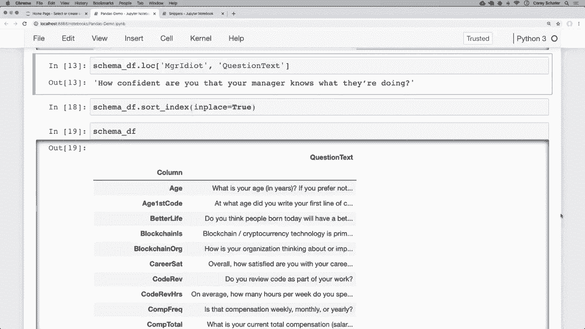

# 用 Pandas 进行数据处理与分析！真实数据&实时讲解，学完就能上手做数据分析了！＜实战教程系列＞ - P3：3）索引 - 如何设置、重置和使用索引 

大家好，最近怎么样？在这个视频中，我们将深入学习索引。我们在之前的视频中见过基本的默认索引，但在这个视频中，我们将学习如何设置自定义索引及其好处。现在，我还想提到我们有这个系列视频的赞助商。

而且这是 brilliant.org。因此，我真的想感谢 brilliant 赞助这个系列，如果你们能通过下面描述部分的链接查看他们并支持赞助商，那就太好了。我稍后会更多地谈谈他们的服务。所以话虽如此。

让我们开始吧。好的，我在这里打开了我的代码片段文件，以便我们可以使用一个简单的数据框查看索引，然后我们将看到如何将这些与我们在系列中使用的大型调查数据集结合使用。

在这些代码片段中，我们有在上一个视频中看到的同一个小数据框，我们只有三个人的名字、姓氏和电子邮件地址。这个数据框显示在右下角。😊正如我在之前的视频中所说，我们的数据框左边有一个没有名称的列，这就是索引。所以由于我们到目前为止看到的都是默认索引，这目前只是一个数字范围，基本上是行的整数标识符。

所以这是 a0，a1 和 a2。有时为每一行设置不同的标识符可能更有意义，这将基本上是该行的标签。所以通常是唯一的。现在 pandas 实际上并不强制索引必须是唯一的，有时它们不会，但大多数情况下这些将是唯一值。那么我们这里的示例数据可能更好的索引是什么呢？

嗯，电子邮件地址可能是这个数据的一个好索引，因为这通常是大多数人的唯一值。所以现在，如果我想查看所有的电子邮件地址，我们可以说 Df 并访问电子邮件。我们在上一个视频中见过这一点，但我们可以看到它显示了所有这些电子邮件地址。现在。

如果我们想将这些电子邮件地址设置为这个数据框的索引，那该怎么办呢？要做到这一点，我们可以说 D set underscore index，然后我们只需传入我们想要作为索引的列名。如果我现在运行这个，我们可以看到电子邮件在最左侧，并且它是**粗体**的，实际上看起来像一个正常的列，因为这个索引有名称，它与我们设置时的列名相同。所以我想在这里展示给你们看，我们可以在这个单元中设置这个索引，但如果我再次查看我的数据框。

所以下面如果我说`Df`打印出这个数据框，那么我们可以看到我们的数据框实际上没有变化，左边仍然有默认索引，这是因为`pandas`不会做很多这些更改，除非我们特别告诉它这样做。这实际上很好，因为它允许我们实验而不必担心以意想不到的方式修改我们的数据框。

假设我们实际上想把索引设置为电子邮件列，并让这些更改延续到未来的单元格。为了做到这一点，我们可以在上面提到的`set index`的地方再加一个参数，说`in place`等于`true`。现在如果我运行这个。

然后再次运行数据框，现在我们可以看到，它实际上设置了那个索引并修改了数据框，我们可以通过说`Df index`来具体查看那个索引，如果我运行它，那么我们可以看到这里有一个索引，它的值是所有索引值的列表，并且它还告诉我们，名称等于`email`，好的。

这真的有用吗？嗯，正如我之前所说，电子邮件地址作为索引为我们的行提供了一个不错且独特的标识符。并且请记住，在之前的视频中，我们使用了`do lo`通过标签搜索数据框。好吧，这些索引就是这些行的标签。因此，在之前我们只是使用默认的范围索引。

但现在我们可以通过传入那个标签来找到特定的行。所以如果我说`Df do lo`，实际上看一个例子会更简单，如果我说`Df do lo`，之前我们是传入`a0`作为标签，但现在我可以说，好吧，我想查看`Corium Schefffer`在`Gmail.com`的信息，然后它会返回说，好吧，那个人的名字是`Cory`，姓是`Schchaefffer`，等等。

所以现在我们得到了那个特定电子邮件索引的行。正如我们在上一个视频中看到的，我们仍然可以传入特定列的值。所以如果我们想要姓，那么我可以把它作为第二个值传入。所以我只需说我想要姓，我们可以看到那里得到了`saferffer`。

现在，我们实际上不再使用那些默认的整数作为我们的索引，因为现在它使用的是电子邮件。所以如果我尝试使用之前用过的整数，那么如果我说我想要第0行使用`Lo`，那么我们将会得到一个类型错误。我收到一个错误，因为它不再有那个标签的索引。

如果你想使用整数位置而不是标签，那么你仍然可以使用`ilo`索引器。我们在上一个视频中也看到了这一点。所以如果我把这个改成`i Lo`而不是`Lo`，那么它仍然会给我们第一行。所以这仍然有效。现在，如果你意外地设置了索引并想要重置它。

然后我们可以使用重置索引方法来做到这一点。所以在这里我将说Df do reset underscore index。我会将in place设置为true，以便这些更改能够生效。然后我会打印出该数据框。所以如果我运行这个，我们可以看到现在我们又回到了将电子邮件作为一列和默认范围索引。

现在，如果在创建数据框时你实际上知道索引应该是什么，那么你可以直接在那里设置，而不是稍后使用设置索引方法来设置。我们也可以在从Cv或其他来源加载数据时这样做。那么让我切换到我们在整个系列中使用的堆栈溢出数据的另一个笔记本，我们将看看使用索引的实际案例。

对于那些到目前为止一直在关注系列的人，这应该看起来很熟悉，但如果你还没有关注，这是你观看的第一部视频，下面是一个简要概述我们正在做什么：我们在这里加载pandas，我们也在这里加载一些cv文件，我在下面的描述部分中有一个链接，指向我们用于这些CSv文件的数据，然后我们还在pandas中设置一些选项，以便显示最大列数，使我们能够查看所有列，以及最大行数，以便我们能够查看这些行中的很多，然后这就是我们的数据框的样子。

这些只是来自堆栈溢出的调查结果。因此到目前为止，如果我们查看在系列中的数据框，我们一直在使用这个默认索引，我们可以在这里看到它只是012和3的范围。现在如果我们查看调查响应数据，它看起来实际上有。

数据本身每行的唯一值。所以如果我们看一下这个回应者列，这个回应者列实际上是一个唯一的ID。所以它是respondent1、respondent2、respondent3，依此类推。因此，我们可能应该稍微整理一下，只用这个回应者ID作为我们的数据框索引。现在我们可以像之前看到的那样，通过在这里说Df do set index来做到这一点，或者我们可以在实际读取数据时，通过向read CSv方法传递一个额外的参数来做到这一点。所以在这里加载数据的地方，我们就添加另一个参数。

我们将这个参数称为index underscore call等于我们想要作为索引的列的名称，在这种情况下，我希望它是这个回应者唯一ID。因此，我将说我们的index call等于respondent。我将重新运行该单元格。

现在我将回到这里并重新运行我们的数据框头。现在我们可以看到这稍微清理了一下，因为现在我们将这个回应者作为我们的实际索引。所以现在这些是标签。如果你想要第一个回应者，那么我们可以直接说Df dot Lo，那就是1。所以这是第一个回应者。好的。

让我删除那个单元格。好的，现在让我给你展示一个我会使用这个的真实案例。如果你记得系列早些时候，我们有我们的调查数据，可以在这里看到。但我们还有另一个数据框，告诉我们这些列在调查数据中实际是什么意思。让我快速展示那个数据框。例如。

如果我想知道“爱好者”是什么意思，那么我们可以查看我们的模式数据框，我们可以看到他们在调查中回答的问题是“你把编程当作爱好吗”。所以当我们看到“爱好者”上面的“是”和“否”问题时，他们是在回答“你把编程当作爱好吗”。那么，有一个问题。如果我想定位某一特定列的含义，而不需要手动搜索整个数据框该怎么办。

好吧，在这种情况下，我们可以简单地将列名设置为索引，并使用`dot Lo`索引器。因此我会在这里设置索引，正是在我们加载模式数据框的地方。让我回到这里的顶部。我们希望这一列作为索引，因为这些都是唯一的值。

所以我将获取这一列的名称，恰好就是“列”。然后在这里，我会说我想要索引。等一下，让我把它放在字符串里面。好的，索引调用等于列。运行它。现在让我们重新运行我们的模式数据框。现在我们可以看到该列是**粗体**的。

所以这就是我们的索引。现在我们可以直接使用`dot Lo`来搜索这些列。如果我想查看爱好者列的信息，我可以说，让我向下滚动。我可以说模式数据框`dot Lo`。然后我们可以传入我们想要的索引标签。

所以如果我想看看“爱好者”是什么。那么我们可以看到，哦，好吧。“爱好者”的问题文本是“你把编程当作爱好吗”。那么让我们回到我们的调查数据，看看我们能否找到一个对我们没有太多意义的列。如果我在这里滚动一下，好吧，比如，这个“M G R”是什么意思。😊，笨蛋，好的。

N GR 笨蛋。所以让我向下滚动。现在我会将其粘贴到模式Df `dot Lo`并重新运行。现在我们可以看到该列的信息。实际上，文本在Jupiter笔记本中默认被截断，但如果我们希望查看整个问题文本，我们可以更改该设置。

不过我想保留，因为我们有这么多数据要显示。但是相反，如果你想查看那个问题的完整文本，那么你可以直接通过传入列名到`dot Lo`中，访问该行和列中的数据。

就像我们之前看到的，当我们使用dot Lo时，这是我们想要的行。那么我们想要哪个列呢？我们想要读取问题文本。所以我将其粘贴进来。现在如果我再运行一次，我们可以看到完整的问题文本为：M GR idiot的意思是你对你的经理是否知道自己在做什么的信心有多大。

这是一个很好的例子，说明设置这些索引是多么有用，因为它让我们能够非常轻松地按标签搜索这些行，就像我们在这里使用模式一样。现在，让我在结束之前再给你展示一件事情。我们可以看到，我们成功地设置了索引，这一切看起来都很好。

但如果索引按字母顺序排序，可能会使读取模式数据框变得稍微容易一点。因此，做到这一点的方法就是简单地说schema Df dot sort。underscore index。让我们运行一下。让我往下滚动一点。我们可以看到这些索引现在按字母顺序排序了。

所以如果我们知道想要获得就业或其他信息，这将会更容易找到你要寻找的内容。如果你想将其按降序排序，那么我们可以简单地将ascending设置为false。

现在我们可以看到，这里呈现的是反向顺序。因此，根据你的数据，这可能会让阅读变得更容易。我们将在未来的视频中深入讨论更高级的排序，但这些只是关于如何将索引整理好的一些基础知识。现在，像往常一样，我们来看我们的数据框。

如果你希望排序是永久性的，并且能够影响未来的单元格，那么你应该将in place设置为true。我们在整个系列中会看到很多这种用法，因为这样做可以让我们看到数据框的样子，而不会实际影响数据框本身。所以在这里，数据框仍然是未排序的，但如果我在这里说sort index in place等于true。

重新运行它，然后再重新运行我们的模式数据框，现在我们的模式数据框是永久排序的。因此，根据你的数据，学习这些索引将非常有用，特别是在使用dot Lo时，因为它允许你通过标签进行搜索，这在你搜索的数据类型上是极其有用的。好的，在我们结束之前。

我想提到这个视频的赞助商，那就是**Brilliant**组织。

在这个系列中，我们一直在学习关于pandas以及如何在Python中分析数据的内容。**Brilliant**将是一个极好的补充，帮助你通过他们的动手课程来巩固在这里学到的知识。他们有一些优秀的课程和课程内容，可以深入探讨如何正确思考和分析数据，尤其是数据分析基础。我非常推荐查看他们的统计课程。

该视频展示了如何分析图表并确定数据的重要性。我还推荐他们的机器学习课程，它将数据分析提升到一个新水平，你将学习到机器在考虑过多变量时如何做出决策的技术。因此，支持我的频道并了解更多关于 brilliant 的信息。

你可以访问 [brilliant.org/Cs](https://brilliant.org/Cs) 注册免费账户。前 200 位访问该链接的人将获得年度高级订阅 20% 的折扣。你可以在下面的描述部分找到该链接。再次强调，这个链接是 [brilliant.org/Cs](https://brilliant.org/Cs)。😊

好的，我想这就是这段关于 pandas 视频的内容了。希望你能对如何使用索引以及它们为何有用有一个清晰的了解。正如我所说，你不必使用索引，但根据数据的不同，有时使用索引会更有意义。例如，在这个视频中，设置模式数据框索引让我们更容易查找列名。

在下一个视频中，我们将开始学习如何过滤数据框，并抓取符合特定标准的数据。也许我们只想查看薪资高于某个数额的数据，或者我们只想查看在这次调查中表示使用 Python 的人的数据。在下一个视频中，我们将看看如何根据这种类型的标准过滤数据框。

如果有人对这里涵盖的内容有任何问题，请随时在下面的评论区提问，我会尽力回答。如果你喜欢这些教程并希望支持它们，有几种方式可以做到。最简单的方式就是给视频点赞并点击赞👍。

另外，这是一个😊，请分享这些视频给你认为会觉得有用的人。如果你有能力，可以支持我的 Patreon。该页面的链接在下面的描述部分。请务必订阅以获取未来的视频。感谢大家的观看。

