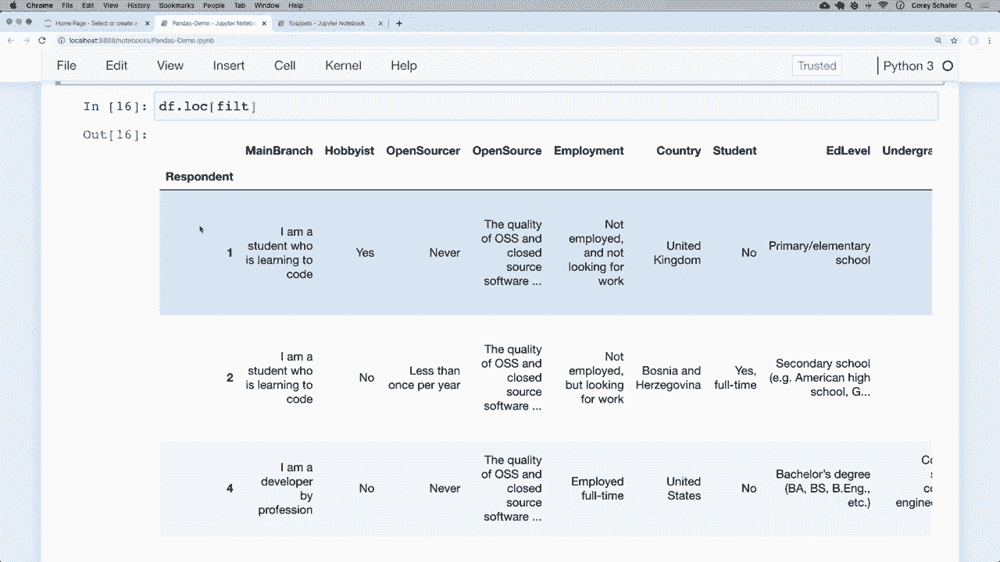
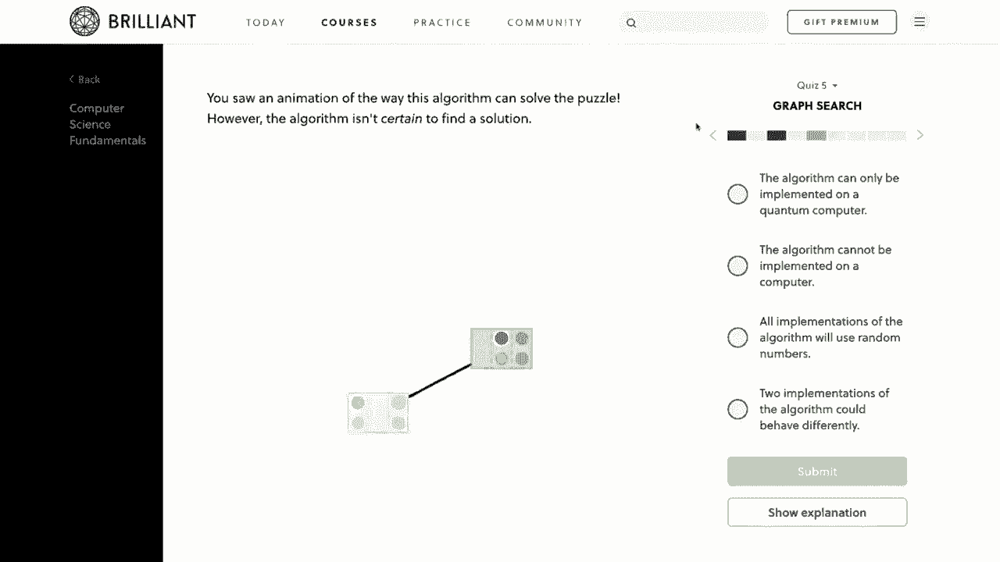
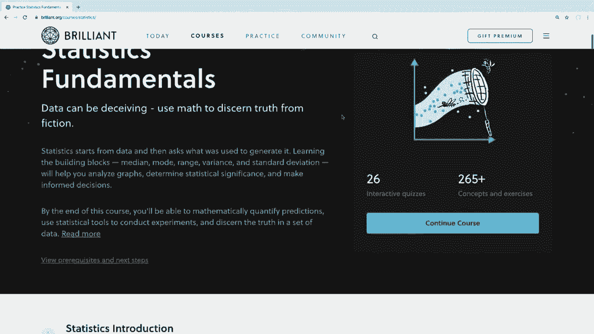
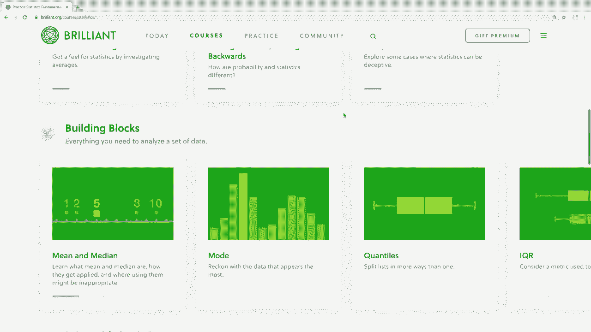
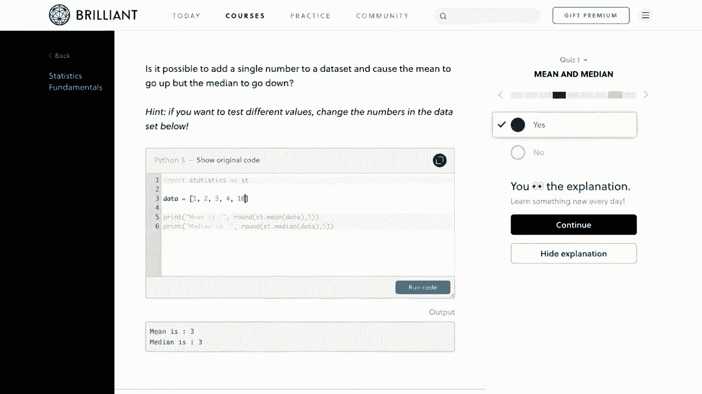
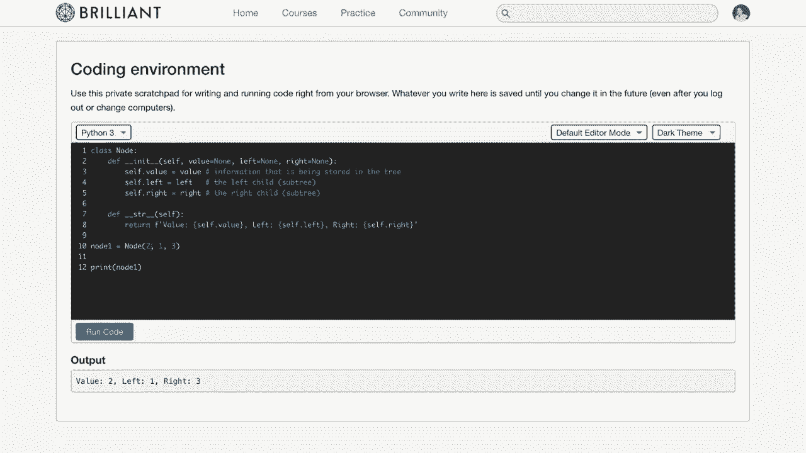
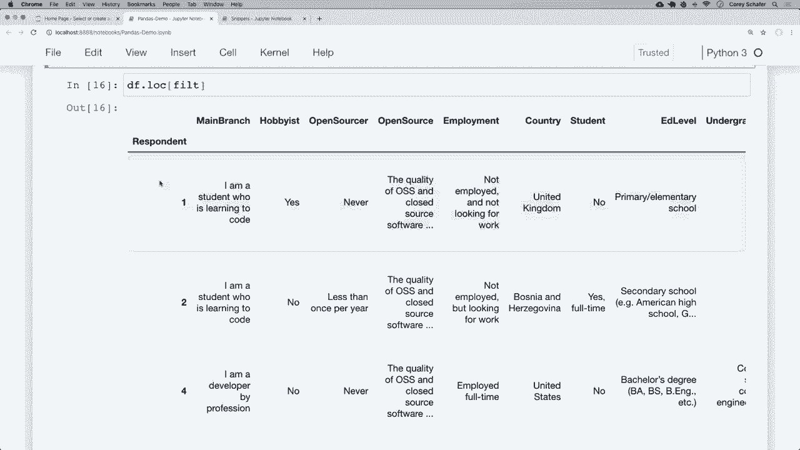

# 用 Pandas 进行数据处理与分析！真实数据&实时讲解，学完就能上手做数据分析了！＜实战教程系列＞ - P4：4）过滤 - 使用条件过滤行和列 

大家好，你们过得怎么样？在这个视频中，我们将介绍如何从数据框和系列对象中过滤数据的基础知识。所以，例如，如果我们想查看我们的调查数据并只查看会使用Python的人。我们可以过滤出那些数据。或者也许我们只想查看来自特定国家的结果，或者是拥有特定薪资范围的人。

类似这样的事情。我们可以通过过滤我们的系列和数据框对象中的数据来做到这一切。我们将在这个视频中学习如何做到这一点，所以过滤是学习pandas的主要内容之一，因为这基本上是我们通过过滤我们想要的数据与不想要的数据来开始每个项目的方式。

现在，我还想提到我们有一个赞助商为这个视频提供支持。那就是brilliant org。所以我真的很想感谢brilliant赞助这个系列。如果你们能通过下面描述部分的链接去查看他们并支持赞助商，那就太好了。我稍后会多谈谈他们的服务。所以话说回来。

让我们开始吧。好的，首先让我给你们展示一些将成为我们过滤基础的内容。如果我们进行基本的比较，使用我们的数据框。那么我们将得到一些有趣的结果。让我们看看这个是什么样的。所以现在，我打开了我们在系列中看到过几次的代码片段笔记本。

在这里底部，我要进行一个基本的比较，看看结果是什么样的。所以假设我想要数据框中姓氏为“do”的每个人。应该有两个，因为我们在数据框中有一个Jane do和一个John Do。所以在我们底部的单元格中，我将放入一个比较，表示Df。

然后我们想要访问那个姓氏列。现在我们可以简单地说，如果那个姓氏等于“do”。所以如果我运行这个，那么我们得到的将是一个系列对象。这可能不是你所期望的。所以也许你认为我们会得到一个包含所有满足我们条件的值的数据框。但我们得到的是一个带有一堆真值和假值的系列。😊 现在。

这些真值和假值实际上对应于我们的原始数据框，真值是满足我们的过滤条件的行，而假值是未满足过滤条件的行。所以你可以基本上把这个想象成一个掩码。因此我们可以在这里看到，在我们的简单数据框中，姓氏为shaffer的值是假的。

这两个姓氏中的“do”是真的。所以这是一个过滤掩码，当你将它应用于数据框时，它会给你所有满足该过滤条件的行。那么现在我们来将这个过滤器应用于我们的数据框。首先，我要将这个返回的序列赋值给一个变量。

我就把这个变量叫做过滤器。所以我会说Fil等于，然后这个比较。现在filter是Python内置的关键字。所以请确保使用其他名称。每次我分配这两个变量时，我通常只使用这个fil关键字。我们不是关键字，而是变量名。现在。

我通常也喜欢将整个过滤器用括号括起来，因为我觉得这样更容易阅读。所以这不会改变任何事情，但我只是把整个内容放在括号里，这样我就可以看到这个赋值和这个等号是分开的。

好的，所以现在我们有这个过滤器。记住，这个过滤器变量等于这系列的真和假值。现在让我们将这个过滤器应用于我们的数据框。我们可以通过几种方式做到这一点。所以你可能会看到一些人这样做。我们可以直接传入，就像我们在搜索一个列一样。我们可以在这里传入一个过滤器。如果我运行这个，哦，不。

我在这里遇到了一个错误，因为我没有运行这个单元来设置那个变量。所以我会重新运行它。现在如果我运行这个，然后我们可以看到返回了一个数据框，其中包含所有有姓氏“Do”的行。😊现在，我们只是在不同的行上分配过滤器，因为我觉得那样更容易阅读。但你可能会看到一些人将这些比较直接放在数据框的括号中。

所以你可能会看到像这样的情况。我现在就把它注释掉，抓取这个整个过滤器。你可能会看到一些人这样做，直接粘贴或放进去，我们也可以看到那样也有效。现在我觉得这比仅仅将其分配给变量更难以阅读。所以我会将其用作变量，但你应该知道这是一种可能性，因为你会看到一些人直接将过滤器放进去。

好的，这是一种缩小这些行的方法。现在你可以做的另一种方法，我更喜欢的方式是使用我们已经看到几次的点lo索引器。我稍后会讲讲我为什么更喜欢这个。但如果我们将布尔值传入点lo，那么它应该给我们与当前相同的结果。

所以如果我说Df点lo并传入相同的过滤器，我们可以看到得到完全相同的结果。这给我们带来了与我们下面的点lo相同的结果。这是pandas让人感到困惑的一个原因，因为你可以将多个东西传入这些不同的括号以获得不同的结果。正如我之前所说，do lo用于按标签查找行和列。

但是如果你传入一系列布尔值，就像我们这里做的那样，你也可以过滤数据。现在，我喜欢使用**dot Lo**的原因是因为我们仍然可以抓取我们想要的特定列。例如，如果我想要电子邮件列，我可以简单地在**dot Lo**中传入第二个值，并说我们想要那个电子邮件列。如果我运行这个。

然后我们可以看到匹配那些姓氏的电子邮件。所以记住，**dot Lo**的第一个值是我们想要的行，第二个值是我们想要的列。由于我想要电子邮件列，它给我返回了一个那些姓氏等于**Do**的电子邮件系列。所以让我们快速看看其他一些过滤数据的方法。

首先，让我们看看**与**和**或**操作符。现在，我们不能使用Python内置的**and**和**or**关键字作为我们的过滤器，所以我们将使用其他符号，我们将在这里使用的符号是&作为**与**，让我把这些写下来。

**与**的符号是&，**或**的符号是竖线。这些符号沿用了其他编程约定，所以你可能以前见过它们。例如，假设我们想要过滤所有姓氏为**Do**且名字为**John**的行，这应该只返回这个结果。为此，我们可以回到我们的过滤器，并且我会去掉这个单元格，因为接下来我只会使用**dot Lo**。

现在，使用我们的过滤器，假设我们想要姓氏等于**dough**，我们将使用&，并且我们想要名字等于**John**。所以我会把这个放进去。我还会把它们分开。我喜欢把每一个都用括号括起来。我认为这样阅读起来更容易。所以如果我重新运行那个过滤器，然后重新运行我们的**dot Lo**。

然后我们可以看到现在只得到了那个单一的电子邮件地址。这个电子邮件地址是所有姓氏等于**Doe**且名字等于**John**的结果。所以在这种情况下，只有一个结果。那么现在我们来看一个使用**或**操作符的例子。为此，我们可以使用竖线字符。

假设我想要一个过滤器，其中姓氏等于**shaeffer**或名字等于**John**。好吧，如果我想让姓氏等于**chaeffer**，或名字等于**John**，我们在这里使用一个竖线字符。因此，如果我重新运行这个，就可以看到我们得到了所有的行或所有的电子邮件地址。

😊，最后一个名字等于沙弗，或者第一个名字等于约翰。所以在这种情况下，这正是这两行。现在我们也可以得到一个过滤器的相反结果。假设我想获得这个过滤器的完全相反结果，即我们希望所有最后一个名字不是沙弗，且第一个名字不是约翰的行。现在我可以在这里调整一下我当前的查询，尝试把一切弄对。

或者我可以简单地在这个过滤器的开头添加一个波浪号，它会给我所有不匹配该过滤器的结果。所以如果我在这里输入一个波浪号，那么它将否定那个过滤器，并给我相反的结果。所以我们可以看到这里得到了简·多，因为所有结果中最后一个名字不是沙弗，或者第一个名字不是约翰。

这回到了我们可能在学校学习过的真值表。如果有人对真值表不熟悉，请告诉我，也许我可以在未来的视频中讨论这个主题，但这更多是数学相关的，而不是编程相关，尽管这两者确实经常重叠。好的，这基本上涵盖了对小数据框进行过滤的基础知识。

但现在让我们回到更大的调查数据集，看看一些我们可能想要查看的过滤器的现实例子。我将打开我的另一个笔记本，这里是我们在整个系列中使用的Stack Overflow调查数据。

再次提醒，如果你想跟着做，你可以在下面的描述部分找到这段代码和数据的链接。好的，现在我们了解了一些基本的过滤方法。让我们看看能否对我们的调查数据运行一些过滤器。例如，假设我们想查看那些薪水超过某一金额的人的数据。

也许我们想看看哪些语言的薪水更高，或者其他类似的事情。因此，为了做到这一点，我将首先创建一个过滤器。如果你不知道数据框中的哪一列给出了薪水，那么你总是可以通过我们在整个系列中看到的模式数据框找到，它告诉我们这些列的含义。

但是为了节省时间，我只告诉你这个关于薪水的列在这里。如果我在这里找，我想我可以很快找到它，它就是这个转换后的薪资。所以如果我们滚动查看这些调查结果，我们可以看到这个人说他们的收入大约是9000，另一个人赚61000，这些都是转换为美元的。让我刷新一下这个页面，以确保我运行了所有这些单元，并且这些变量都已初始化。

好的，如果我们想要获取所有高薪的过滤器，那么让我过来这里，再次复制这个列名。现在让我们创建一个过滤器，我称之为高薪，并将其设置为条件，其中我们说我们想要数据框中这个转换薪资列的`Df`，希望它超过7000。

你知道这有点主观，但我们将把它作为过滤器。现在让我们将该过滤器应用到我们的数据框中。就像之前看到的那样。我可以说`Df do Lo`，然后将高薪过滤器传入。现在我们可以看到一些结果，但这并不是我们所有的受访者。

现在我们可以看到受访者6、9和13。如果我滚动到我们的转换薪资，那么这些薪水都应该超过70000，看起来确实如此。现在，为了稍微缩小这些列，让我们只抓取一定数量的列。所以我将抓取国家。

编程语言和薪水。因此，为了做到这一点，请记住。我们可以将这些传入`dot Lo`。在这里，我们正在进行`dot Lo`。我在这里放一个逗号。现在我将列出我们想要的列。假设我们想获取国家，我们还想获取这些人所使用的编程语言。

这里，正如我所说，你可以在架构中查找所有这些。但这是在“使用的语言”下。我们可以看到这个人会Java、R、SQL等等。因此我将其粘贴为我们想要的列之一。我还会获取转换薪资，所以我也将其粘贴。现在让我们运行这个。

现在我们可以看到我们不仅得到了符合这个高薪标准的人员过滤器，而且我们只获得国家、他们知道的语言和他们的薪水。所以我们的过滤器似乎确实被正确应用，这样运行得很好。现在我看到这些国家，这让我想起我们可能想用多个值进行一些过滤。

例如，我的YouTube观众主要来自美国、印度、英国、德国和加拿大。好吧，这就是观看视频的观众中最大比例的来源。所以假设我想过滤出这里的调查结果，只查看这五个国家的结果，现在我可以在这里创建一个超级长的过滤器，我说。如果国家等于美国，或者如果国家等于印度，或者如果国家等于英国。

这会占用很多空间。因此，让我们创建一个国家的列表。然后我将向你展示一个我们可以用来过滤这些的好技巧。那么现在，在这里，而不是使用这个高薪过滤器，我将创建一个国家的列表。我会把这个等于……我打字有点慢，所以让我快速打出来。

好的，现在如果我们想要所有这些调查结果，其中受访者表示他们来自这五个国家之一，那么我可以简单地说，我将在这里设置一个新的过滤器。实际上，让我在这里做这个。我会设置一个新的过滤器，并将其等于 DF 的国家。所以国家在……我们想要国家在这个国家列表中。所以我要运行这个单元格，现在。

让我们将这个过滤器应用到我们的数据框中。因此，如果我运行这个，并且只是为了缩小这些结果，以确保我们能立刻看到国家。我将只抓取国家。所以如果我运行这个，我们可以看到好的，我们得到了英国、美国、加拿大和印度。

看起来这也应用得很正确。现在，让我给你展示一个你可能会经常使用的常见过滤操作。因此，我们实际上也可以在 pandas 中使用字符串方法来对数据框进行一些修改，或者在这种情况下帮助处理条件。让我告诉你我想表达的意思。

假设我们只想查看那些回答自己知道 Python 作为编程语言的人。那么我们看看该怎么做。首先，列出每个人说他们知道的编程语言的是“所用语言”列。让我们看看这看起来如何。这里，我只是抓取“所用语言”。

所用语言列，哎，我把“语言”拼错了。所以是“所用语言”。我没说错吧？好的，我们可以看到这里有一些编程语言，每种语言之间用分号分隔。因此，我们不能仅仅查询“所用语言”是否等于 Python，因为该列的实际值将是调查中列出的任何语言组合。因此，我们可以采用的方法是使用字符串方法，看看 Python 是否在他们知道的这些语言字符串中。

为了做到这一点，我将重新编写我的过滤器。我只是想说我的过滤器将等于，并且我们要抓取每个人的“所用语言”，然后我们将使用一些字符串方法。所以我将说 dot STR dot contained。

然后我将传入 Python。现在我们还可以看到这里有一些 inN 值，但不是数字。现在我们还需要为那些设置一个填充值，否则我们可能会得到一个错误，所以这是 contains 方法的一部分。我可以说 in 等于 false，我们不会对那些做任何操作。所以让我再解释一次。我们这里放置的这个过滤器。

它说，好的，对于这一列，这里的语言是处理过的。这些结果都是在这里。我们在说这一列中的字符串是否包含 Python。所以这就是我的过滤器。我将运行那个单元，现在让我们通过调用 dot Lo 并传入这个过滤器来应用到我们的数据框中，现在让我们还抓取一下处理过的语言列，以确保这一点。正常工作。因此，如果我运行它，那么所有这些结果或者说这些行都应该在它们的已知语言中包含 Python。

所以我们可以看到那里有 Python。所以是的，似乎在所有这些结果中都有。现在这个编号 8 的地方我们实际上看不到，但这里有省略号，所以可能只是被截断了。在我上一段视频中，我一直在说这些是被连接的。我是指被截断。一些人指出了这一点。所以是的。

这里被截断了，所以我们无法看到 Python 的值，但它们确实存在。我可能会在将来做一个关于字符串方法的完整视频，因为我们可以用这些方法做很多其他事情，比如替换文本、拆分值等各种不同的操作。

所以这些字符串方法在 pandas 中非常有用。这是对我们数据框进行一些过滤的基本概述。再次强调，关键点是我们可以在这里进行这些条件筛选，并将它们作为过滤器，另外让我仅仅打印出这个过滤器，而不应用到数据框上。

我们可以看到过滤器返回了一系列的真和假的值，当我们将其应用到数据框时。这些真假的值基本上对我们的数据框应用了一个掩码，我们得到所有的真值，而不是假的值。所以如果我看这里，我们有响应者 12、4 和 5 是真的，而 3 是假的。所以如果我查看我的数据框，我们可以看到我们得到了 1、2、4 和 5，而 3 不在那，因为那个值是假的。

这就是过滤器的工作原理。再一次，这是 pandas 的一个重要部分，因为这是我们在加载数据到 pandas 中时首先要做的事情之一。好的，在我们结束之前，我想提一下，我们为这个视频找到了一个赞助商，那就是 brilliant.org。

Brilliant是一个解决问题的网站，通过积极参与指导课程帮助您理解基本概念，Brilliant将是补充您在这里学习的知识的绝佳方式，他们提供动手课程。他们有一些关于数据科学的优秀课程和课程，深入探讨如何正确思考和分析数据。

因此，如果您正在观看我的熊猫系列，因为您正在进入数据科学领域，那么我强烈建议您也查看一下Brilliant，了解您可以学习哪些其他数据科学技能。他们甚至在统计课程中使用Python，并会对您如何正确分析语言中的数据进行测验。他们的指导课程会挑战您，但如果您需要，您也可以获得提示甚至解决方案。

它真正侧重于理解材料。因此，为了支持我的频道并了解更多关于Brilliant的信息，您可以访问brilliant org，免费注册。此外，前200位访问该链接的人将获得年度高级订阅的20%折扣。

您可以在下面的描述部分找到该链接。再次说明，这是brilliant org forge。😊。

好的，所以我想这就是本期熊猫视频的内容。希望您能清楚地了解如何在数据框中过滤数据，以找到您所寻找的信息。正如我所说，这是熊猫中的一项基本技能，通常是我们处理数据时首先要做的事情。在下一个视频中，我们将学习如何更改数据框中的数据并进行修改。我们将学习如何更改特定值。

以及如何在整个数据框中一次性进行多项更改。例如，您可能希望将所有电子邮件地址转换为小写，以便更容易搜索。或者您可能想删除列名中的空格，并用下划线替换它们。这些内容将在下一个视频中介绍，请务必关注。

但如果有人对本视频中涉及的内容有任何疑问，请随时在下面的评论区提问，我会尽力回答。如果您喜欢这些教程并想支持它们，那么您可以通过几种方式做到这一点。最简单的方法是😊，给视频点赞并点个赞。还有。

与您认为会觉得这些视频有用的任何人分享这些视频是非常有帮助的。如果您有能力，您可以通过Patreon支持我。该页面的链接在下面的描述部分。请确保订阅以获取未来的视频。感谢大家的观看。😊。

