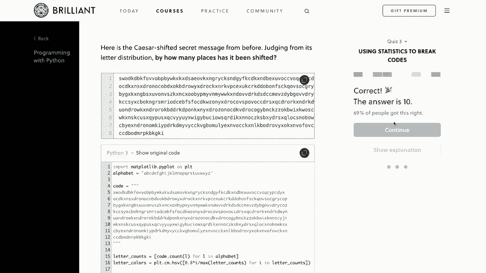
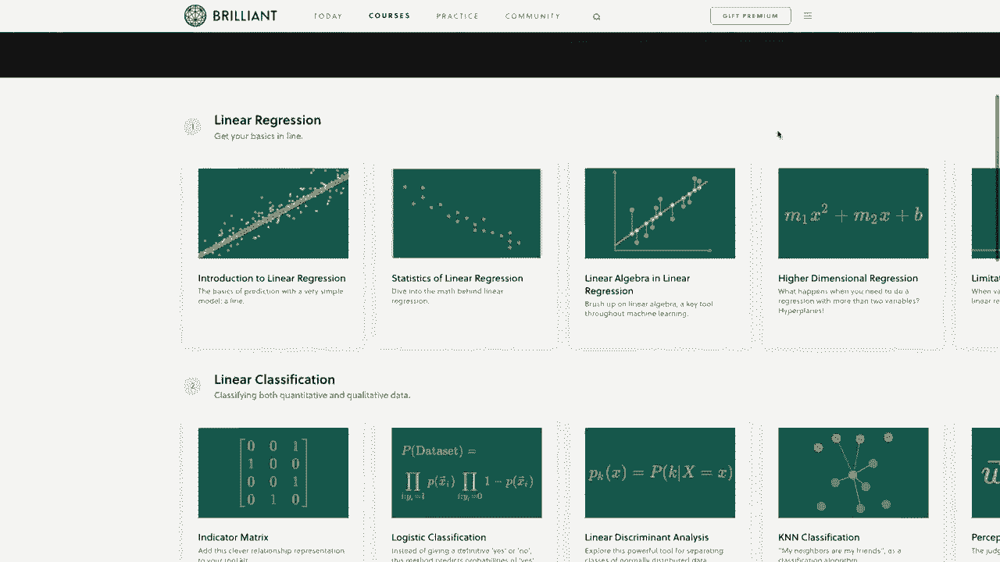

# 用 Pandas 进行数据处理与分析！真实数据&实时讲解，学完就能上手做数据分析了！＜实战教程系列＞ - P6：6）增删 - 从Dataframe中添加与删除行和列 - ShowMeAI - BV1M64y187bz

大家好。你们过得怎么样？在这个视频中，我们将学习如何从数据框中添加和删除列。我们还会看看如何将多个列的信息合并为一个。现在，在我之前的视频中关于更新行和列的内容，那个视频比较长。

但这个应该短很多。现在，我想提一下，我们这系列视频有赞助商，那就是 Brilliant。因此，我真的想感谢 Brilliant 赞助这个系列，如果你们都能通过下面描述部分的链接查看他们并支持赞助商，那就太好了。我稍后会多谈谈他们的服务。所以说到这里。

让我们开始吧。正如我所说，在上一个视频中，我们看到了如何更新行和列中的信息。现在我们将看到如何添加和删除行和列。首先，让我们看看添加列。添加列对我们来说会很简单，因为这基本上与我们更新值时所做的相同。

我们可以简单地创建一个列，并传入我们希望该列具有的一系列值。因此我现在在这里打开的代码片段文件是我们之前视频中见过的。😊。我们可以在较小的数据上查看这是什么样子，像往常一样，如果你想一起操作，我会在下面的描述部分提供代码、笔记本和我在本系列中使用的数据的链接。

假设我们想把名字列和姓氏列合并成一个单独的列，并称之为名字。那么首先，为了获取合并后的名字和姓氏的序列，我们可以简单地说，当我来到这里的底部时，我们可以抓取第一列，然后将这些列相加，并在中间加上空格。

然后我将添加姓氏，如果我运行这个，哎呀，我漏掉了第二个加号，现在如果我运行这个，我们可以看到我们得到了名字和一个空格，这就是这一部分在做的事情，然后是姓氏。所以现在我们有了一系列的值。

我们可以看到我们有三个值。为了将这些值添加到新列中，我们可以简单地说 Df，然后是我们想要的新列的名称。我将把这个叫做全名，然后我只需复制之前给我们这个序列的内容，并将这个全名列分配给那个返回的序列。所以如果我运行它，然后查看我们的数据框，那么现在我们可以看到我们的数据框这里有了这个新列，它是名字和姓氏的组合，再次。

我在这里使用字符串，但你也可以使用我们在上一个视频中看到的 apply 方法创建一个新列，以便为数据框中的另一列进行某种数学分析。现在，我想指出的是，当像这样分配一列时，不能使用点符号，我们必须使用括号，如我们在这里所做的，以便进行这些分配，因为如果你使用点符号，Python 会认为你试图将一个属性分配到数据框上。

并不是一列。那么，我们就来看一下如何向数据框添加一列。现在我们来看一下如何删除列。既然我们有了全名列，我们可以说我们不再需要或想要我们的名字和姓氏列，所以要删除这些。我可以在我们的数据框上使用 drop 方法。所以这就像说 Df do drop 一样简单。

现在我们想删除什么呢？我们想删除列，而这些列将等于。我将传入一个列表，因为我们想删除多个列。所以我想删除第一列和最后一列。如果我运行这个，我们可以看到它返回一个没有这些列的数据框。就像我们之前看到的。

这只是给我们一个视图，显示我们的数据框看起来会是什么样子，但如果我们对这些更改满意，它并不会实际应用这些更改。那么我们可以将 in place 参数设置为 true，以便它在原地更改我们的数据框。所以我可以在这里说 in place 等于 true，在我们的 drop 方法内。如果我运行这个。

然后我们查看我们的数据框，现在我们可以看到我们的数据框不再有名字和姓氏列。如果我们想反转这个过程，将全名列分割成两列，那就稍微复杂一些，但仍然相对简单。

在这个系列中，我们已经看过几次字符串分割方法。现在我们来对全名列运行一下，看看我们得到什么。我将说 Df，并访问那个全名列。现在我将对我们的系列使用字符串类，然后我们将进行分割。

我们将根据空格进行分割。现在分割默认是基于空格的，但我想在这里明确一下。所以如果我们运行这个，那么分割方法的结果是我们得到名字和姓氏的列表。因此，名字是第一个值，姓氏是第二个值。现在，如果我们想将这两个分配到不同的列中。

然后我们需要扩展这个列表，使它们实际上分布在两列中。要在 pandas 中做到这一点，我们可以使用 expand 参数，让我们看看这是什么样子。所以这是在分割方法内，我们可以传入另一个参数，并说 expand 等于 true。

如果我运行这个，那么我们可以看到结果非常相似。但现在我们列表中的所有内容都被分割成了列。因此我们在这里有两个分割结果的列。现在我们需要做的是将数据框中的两列设置为刚刚返回的这两列。所以我们可以说，如果我们记得在系列早期的内容，如果我们想访问多列，那么在括号内我们可以传入一个列表，因此我们将有两个括号，内层括号是我们的列表。

关于列。我想添加第一列和最后一列，我们将把其设置为我们在这里使用split方法所做的那样。如果我运行这个，那么我们的第一列和最后一列应该已被分配到这些列中。让我们看看我们的数据框，看看这是否有效。我们可以看到现在我们添加了第一列和最后一列，并且它们的值是我们在这里返回的。

好的，这就是我们如何添加和删除列的方式。现在让我们看一下添加和删除数据行的方法。有几种不同的方法可以将行添加到我们的数据框中。首先，我们可能只是想将一行新数据添加到我们的数据框中。其次。

也许我们想将两个数据框合并成一个，通过将一行附加到另一行。所以首先，让我们看一下添加一行数据。我们可以使用附加方法来做到这一点。如果我想添加一行数据，我可以直接说Df do append。现在我们可以在这里传入我们的值。我将传入一个字典，并传入一个名字为Tony。

如果我运行这个，我们可以看到我们得到一个错误。现在，这是因为目前没有索引。有时很难读取这些pandas错误并弄清楚问题所在。但在这种情况下，它确切地告诉我们该怎么做。它在底部说只能在ignore index等于true或系列有名称的情况下附加一个系列。

所以我们就忽略索引，我们现有的数据框将自动为这一新行分配一个索引。在顶部，我们可以简单地传入一个参数ignore underscore index，并将其设置为true。现在如果我运行这个，就能看到它成功了。我们不再收到错误，并且在底部也没有问题。

我们可以看到这个新名称是附加的。现在我们只为这一行分配一个名字值。因此我们可以看到这里将其分配为Tony，其他所有列的值都设置为一个表示缺失值的非数字值。所以你可以传入一个完整的系列或信息列表，以便添加你想要的任何信息的单行数据。

现在如果我们有一个想要附加到现有数据框的数据框，我们也可以做到这一点。所以让我从顶部的现有值创建一个新的数据框。我将向上滚动，抓取我们最初创建数据框时的第一个字典，并稍微修改一下。所以我只会保留这两个名字。

取出这些第三个值，然后我们将继续更新这些。所以更新这些。对于第一个名字，我将用托尼和史蒂夫，对于姓氏，我将用斯塔克和罗杰斯，对于电子邮件地址，让我们看看，我将用Ironman@Avenge.do.co，对于第二个，我将用cap@Avenge.do.co。现在我将根据这个新字典创建一个新的数据框。

现在我要调用这个Df2。所以现在我可以说PD.t数据框，并传入那个people字典。现在我们应该有第二个数据框。好的。那么现在假设我们想将这个添加到现有数据框中。我们可以简单地将一个数据框附加到另一个数据框。

现在这些有冲突的索引，并且它们的列顺序也不同。因此，我们再次希望在附加时忽略索引，以便正确分配索引。所以我将说Df.append，并传入Df2，以便将其附加到我们的原始数据框中。然后我将说ignore_index等于true。

如果我在这里运行，那么我们可以在底部看到它添加了这些新行。现在，如果你收到警告，那么原因是因为在附加时我们没有以相同的顺序传入所有列。这给我们带来了一个警告，说明有不同的方法可以对列进行排序。所以不必太担心，但在未来的pandas版本中。

它将默认将排序设置为false，实际上，pandas版本1在我录制这个系列时刚刚发布，所以这可能已经完成，但我们暂时可以忽略它。如果我们想的话，可以传入sort等于false的值，以消除这个警告。所以如果我回到这里，传入sort等于false，并且当我运行时，它将不再对这些列进行排序。

然后我们可以看到不再出现那个警告，现在它也不再对列进行排序了。与drop方法不同的是，如果我们想让这些更改永久生效，那么我们就没有一个就地方法可以使用，而是必须通过复制这个返回的数据框来设置数据框，然后我们可以说Df等于。

然后将返回的数据框传入。所以如果我运行这个。然后我们看看我们的原始数据框，我们可以看到那些行被添加上去了。老实说，有些人可能想在下面的评论区问为什么有些有inplace参数而有些没有，但说实话，我也不太确定，我相信是有原因的，但我还需要再深入探究一下，确切地找出原因，但这个append方法没有像drop方法那样有inplace参数，所以我们必须这样做。

最后，让我们看看删除行。假设你是一个钢铁侠的粉丝，你想从数据框中删除史蒂夫·罗杰斯。现在我们几乎可以以与删除列相同的方式做到这一点，但不是指定我们想删除的列，而是简单地传入我们想删除的索引。因此我可以在这里说Df do drop，我们可以在最左边看到，如果你看过我关于索引的视频，这个索引是四，所以让我们。

假设我们想删除索引为四的行。所以如果我运行这个。我们可以看到我们仍然有钢铁侠和托尼·斯塔克，但不再有史蒂夫·罗杰斯。因此第四个索引被删除了。而且，如果你想实际将其应用于数据框，那么你需要将inplace参数设置为true。

现在你可能想做一些更复杂的事情，并使用条件删除行。现在我可能会像在之前的视频中那样使用Lo，我们学习了如何从数据框中过滤数据。所以我们也可以使用drop。因此如果我想删除所有姓氏等于do的行。我们这里有两个这样的值。然后我可以传入那个过滤器的索引。

让我来展示一下这是什么意思，没那么复杂。所以我可以说Df do drop。现在我要说index等于。接下来我将放入我的条件。所以如果你还记得。从过滤视频中，我们实际上可以在括号内传入条件。因此，现在我可以说，好吧，我想要一个条件，其中该列的姓氏等于do。

现在，唯一的区别在于。我们这里有一个条件。因此我们想要索引，因为我们说index等于。所以就在这里最后。我将使用这个方法，直接说.dot index。所以如果我运行这个。我们可以看到它移除了姓氏为do的那些值。现在。

正如我在那个过滤视频中所说，我不太喜欢将所有内容挤在一起，因为我觉得这样很难阅读，你总是希望你的代码对其他开发者来说容易阅读。因此，我会将条件提取到自己的变量中，而不是。

我会这样说。我会说filteril的过滤条件等于。然后我会抓取我们的条件。😊，把它剪切出来并粘贴到这里。现在我们可以说我们想要将我们的过滤应用到那个数据框上，然后抓取它的索引。所以如果我运行这个，我们可以看到这给我们带来了完全相同的结果。

但那样更容易阅读，所以这就是关于从数据框中添加和删除行和列的概述。在结束之前，我想提一下本视频的赞助商，赞助商是brilliant。因此，在这个系列中，我们一直在学习pandas以及如何在Python中分析数据，而brilliant将是补充你在这里所学内容的绝佳方式，提供他们的实践课程。

他们有一些出色的课程和教学，深入讲解如何正确思考和分析数据，以掌握数据分析的基础。我真的推荐查看他们的统计课程，它教你如何分析图表并确定数据的显著性。

我还会推荐他们的机器学习课程，它将数据分析提升到一个新水平，在那里你将学习被用来让机器进行学习的技术。😊。

决策中变量太多，无法让人类考虑。因此，为了支持我的频道并了解更多关于brilliant的信息，你可以去brilliant org forgelash cms注册，免费注册。此外，前200个访问该链接的人将获得年付高级订阅的20%折扣。

你可以在下面的描述部分找到那个链接。再次提醒，那个是brilliant org forge。好吧，我想这就是本期pandas视频的内容。我希望你能对如何添加和删除数据框中的列和行有一个好的理解，并且能自信地做到这一点。在下一个视频中，我们将学习不同的排序数据的方法。

如果任何人对我们在这个视频中讨论的内容有任何问题，请随时在下面的评论区提问，我会尽力回答这些问题。如果你喜欢这些教程并希望支持它们，有几种方式可以做到这一点，最简单的方法就是给视频点赞并给予好评。

同时，将这些视频分享给任何你认为会觉得有用的人也是一个很大的帮助。如果你有条件，可以通过Patreon进行支持。这个页面的链接在下面的描述部分。😊。

确保订阅以获取未来的视频，感谢大家观看。
