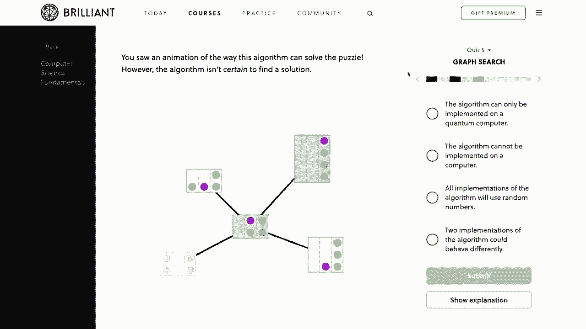
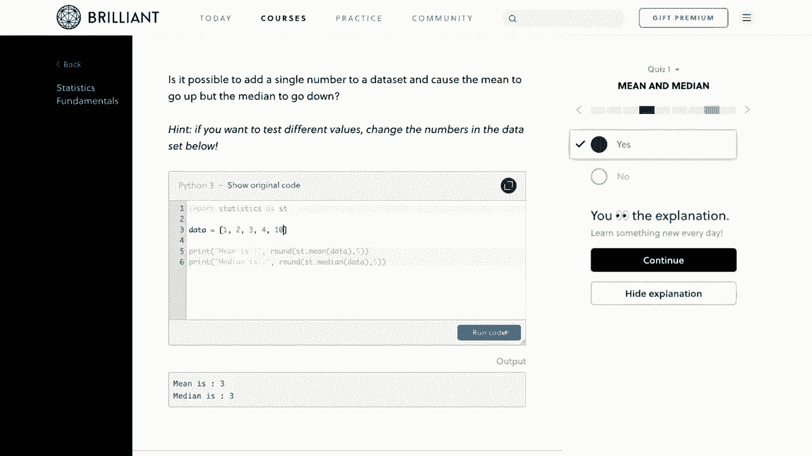
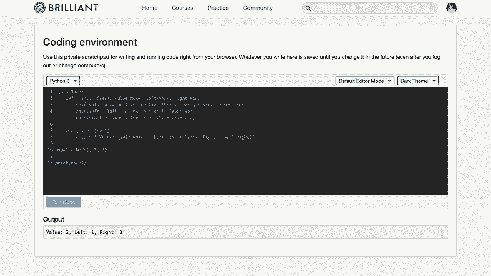

# 用 Pandas 进行数据处理与分析！真实数据&实时讲解，学完就能上手做数据分析了！＜实战教程系列＞ - P7：7）排序 - 数据排序 

大家好，最近怎么样？在这个视频中，我们将学习如何在 Pandas 中对数据进行排序。所以我们将看看如何对列进行排序，如何对多个列进行排序，以及从不同的行中提取最大和最小值。和往常一样，我们将首先看看如何在小数据集上做到这一点。

然后我们将看到这如何应用于更大的数据集，比如我们在整个系列中使用的堆栈溢出调查数据。现在，我一直在阅读你们对这个系列的评论和建议，并努力将这些建议纳入其中。很多人表示希望视频更短。

所以我会尽力制作更短的视频，同时不牺牲我认为重要的细节。现在，我还想提到我们有一个赞助商为这个视频系列提供赞助，那就是 Brilliant。因此，我真的想感谢 Brilliant 赞助这个系列。如果大家能够通过下面描述部分的链接去了解一下并支持赞助商，那就太好了。

然后我会稍后详细介绍他们的服务。所以话不多说，我们就开始吧。好的，我现在打开的是我们在整个系列中看到的代码片段笔记本。再次提醒，如果有人想要跟着做，我提供了链接。😊这个代码和下面描述部分的数据。

假设我们想对这里的小数据框进行排序。首先，让我们决定一下想如何排序。现在，一个合理的方法是按姓氏排序。因此，为了做到这一点，我们可以使用这些排序值的方法。为了按姓氏排序，我只需说 `df.sort_values`。

然后我们将按姓氏排序，并将 `by` 参数设置为列名，这里是 `last`。所以如果我运行这个，就可以看到返回的数据框中姓氏按字母顺序排序。如果这些是数字，那么它们将从小到大排序，我们在查看堆栈溢出数据时会看到这一点。

现在，如果我们想按降序排序，我们可以传入一个参数，只需说我们希望 `ascending` 设置为 `false`。所以如果我运行这个，现在我们可以看到这些数据是按降序排序的。现在，有时你的排序可能会有点复杂。也许你想按多个列排序。

当你排序的第一个值具有相同的值时，你会这样做，然后你想按第二个值进行排序。为了做到这一点，我们可以传入一个我们想排序的列名列表。假设我们希望按姓氏的升序进行排序。

如果有重复的姓氏，我们想在此之后按名字排序。为了做到这一点，我们只需传入一个需要排序的列的列表。所以我实际上要在这里换一行。现在不只是按姓氏排序。我可以在这里传入一个列表。假设我们想先按姓氏排序。

然后我们想要按名字排序。如果我运行这个，我们可以看到这是按姓氏的升序排序的，正如我们之前看到的那样。但如果有相同的姓氏，名字也会按降序排序。所以我们可以看到简在这里是第一个。

现在是约翰，因为这是按降序排列的。有时你可能会遇到需要按多个列排序的情况。所以你可能想要一个降序，另一个升序。让我再往数据框中添加一个名字，以便在我这样做时更加清晰。

所以我会在字典顶部再添加一个名字。就叫这个亚当，并保持重复的姓氏是杜。然后我将传入一个电子邮件，比如email@do.com。现在让我继续重新运行所有这些单元。

所以我就说运行所有单元。现在在底部，我们可以看到我们的姓氏，所有这些都是降序的。但是假设我们想要像这里那样按姓氏降序排序的数据框。那么我们希望名字按升序排列。为了做到这一点。

我们可以简单地向升序参数传入一个布尔值列表。所以让我复制一下我们这里的内容，展示一下这看起来有什么不同。所以我们不只说升序等于假，而是传入一个列表，这些将对应我们的列。如果我说我想要姓氏按降序排列。

那么我们可以将其保持为假。但是如果我想让名字按升序排列，我可以为第二个值传入一个真。所以现在如果我运行这个，我们可以看到我们的姓氏仍然是按降序排列的，但我们的名字现在是按升序排列，亚当在这两个名字之前。

正如我们在系列中多次看到的，如果我们想保存这个数据框并使这个排序永久生效，那么我们可以将inplace值设为真。所以如果我这样做，我只是会在末尾加一个inplace等于真。如果我运行这个。

现在我查看我们的数据框，发现我们的数据框已被修改为一种可以看到这些值按我们指定的方式排序的顺序。现在，如果你想把它恢复到之前的样子，并让那些索引被排序，那么我们可以通过排序索引来做到这一点，所以这次我们不使用排序值的方法。

我们将使用 sort index 方法，因此我可以说 Df.do sort _index，然后运行它。现在我们可以看到，索引在最左侧按我们添加的顺序排序。现在我还想指出，如果你只想对单列进行排序，我们也可以很容易地对那个单一系列进行排序。

series 对象也有 sort value 方法。因此，如果我们只想查看已排序的姓氏，而不是整个数据框，那么我可以简单地访问那一列。在括号中传入姓氏列，然后我可以说 sort，_values。我将所有参数保留为默认值并运行它。现在我们可以看到这些是按升序排序的。好的，这只是一个简要概述。

现在我们来看看我们的调查数据，看看在更大的数据集上这是什么样子。我们还将看到一些简单的方法来查看我们数据中最大的和最小的结果。好的，我这里打开了我们的 Stack Overflow 开发者调查，这是我们整个系列中看到的内容。如果你想下载这些数据以便跟随。

然后我在下面的描述部分中有链接。好的，有一种方法可以对调查结果进行排序，就是按国家名称。我们可以看到这里有一个国家列，受访者回答了他们来自哪个国家。因此，也许你正在对来自不同国家的信息进行一些分析。

看到它们排序后会更容易一些。例如，我们想看看国家和薪资。因此，要按国家对这些调查结果进行排序，我们可以简单地到下面说 Df.dot.sort，_values。然后我想按国家进行排序并将其设置为国家。

现在我还将对此进行原地修改，以便它更改我们的数据框。所以现在我们来看看这个数据框前 50 个结果左右的国家列。我将访问那个国家列的前 50 个，并使用 head 方法来获取它们。如果我运行这个。

然后我们可以看到这些是按字母顺序排列的。因此，我们有来自阿富汗的开发者的结果，而在底部，结果显示阿尔巴尼亚。现在我们这里只有前 50 个结果，但如果我们查看所有这些，我们会看到所有这些国家都是按字母顺序排列的。

好的，现在我们来看一下这些国家报告的薪资。因此让我把它添加到我们的输出中。我会通过访问 converted comp 列来实现，所以这是 converted comp。现在，请记住，这里有一个错误，一些人在访问多个列时，必须将其放在方括号内的列表中。

我们这里将有两组括号。好吧，现在让我们运行这个。每个受访者的薪资将列在右侧，我们可以看到这里有很多非数字对象，这只是意味着他们跳过了这个问题。

但是如果我们想要一个关于更高薪资的一般概念，那么我们可以按降序排列这些薪资。所以就像我们在之前的例子中看到的，如果我们想要将国家按升序排列，而薪资按降序排列，那么我们可以通过在这里传入多个要排序的列来实现。因此，我们希望按国家排序，并且还希望按这个转换的薪资列排序。

我将在这里传入一个升序参数，并将其设置为一个列表。这将对应我们的列名，看看我们是否希望这些以升序排列。对于国家，我将传入`true`，因为我们确实希望按升序排列。但我想先看到最高的薪资，这意味着我们希望将其设置为`false`，以便薪资按降序排列。

如果我运行这个排序，然后我们再看看这个头部。那么我们可以看到现在这里有阿富汗，所有最高薪资都列在了顶部，显示人们所说的收入。如果我们向下滚动，可以看到低薪资为零和非数字的情况，然后一旦我们到达阿尔巴尼亚，就会重新开始该国的高薪资。

现在，我们可以看到这里有一些大的异常值。这比其他人所说的收入要高得多。现在，有一些技术可以用来处理异常数据。我们将在下一个视频中专注于此，讨论数据聚合和分组。

在结束之前，我还想看看一些其他有用的方法，以查看最大和最小值。所以也许你只是为了从特定的数据框中抓取最大或最小值而对结果进行排序。如果你这样做，那么实际上有一个更简单的方法。所以也许我们想要查看调查中10个最高的薪资。为了做到这一点。

我们可以简单地使用`nlargest`方法。所以首先，我将对此进行处理。假设我想获取那个转换的薪资列，也就是薪资。我将获取`nlargest`，并希望获取10个最大薪资。如果我运行这个，那么我们可以看到报告的10个最大薪资。

所有这些薪资都是200万。所以我假设这个调查将他们的薪资上限设置为200万。我觉得这相当高，所以我很好奇这些人是怎样的开发者，他们是否在管理职位上。再一次，我们将在下一个视频中看到如何进一步分析这些结果。

但你知道，如果你们中有人作为开发者年收入200万美元并正在招聘，请告诉我，因为你知道我目前不在找额外的工作，但我确实认为在年薪200万美元的情况下，我会破例。现在你可以看到，当我们从这一列中提取出10个最大值时，它只给我们那一列的10个最大值，但如果我们想查看这些行的其他调查结果呢？那么，为此我们可以简单地在整个数据框上运行这个方法。

并传入我们想要获取最大结果的列。因此，我可以说`df.nlargest`，然后我想从`converted comp`列中获取10个最大值。如果我运行这个，那么这些将给我相同的行，但现在我们有他们所有的调查结果，而不仅仅是工资。所以如果我在他们的索引上查看，这里是25983，那么我们可以看到第一个是25983。

所以如果我在`converted comp`上向右滚动，我们可以看到这些都是200万美元。如果我们想查看最小值而不是最大值，那么可以简单地使用`nlargest`替换为`nsmallest`。所以如果我查看这里的最小工资，这将给我们调查中的最小工资值。现在我假设这可能只是对那些人来说是零。

当前没有工作，没错，这里是零。好的。那么，这就是如何对我们的数据进行排序以及如何在多个列上排序并获取最大和最小值的简要概述。现在，在结束之前，我想提到一下本视频的赞助商，那就是**Brilliant**。Brilliant是一个问题解决网站，帮助你通过积极参与指导课程来理解基本概念。

而**Brilliant**将是补充你在这里学习内容的绝佳方式，他们提供实操课程。他们在数据科学方面有一些优秀的课程和教程，深入探讨如何正确思考和分析数据。因此，如果你因为进入数据科学领域而观看我的熊猫系列，我强烈推荐你也去看看Brilliant，了解你还能学习哪些其他的数据科学技能。

他们甚至在统计课程中使用Python，并会考你如何在该语言中正确分析数据。他们的指导课程将对你提出挑战，但如果需要，你也可以获得提示甚至解决方案。这真的很适合理解材料。因此，为了支持我的频道并了解更多关于Brilliant的信息，你可以访问brilliant.org/Forge。😊

注册是免费的，前200个访问该链接的人将享受年度高级订阅20%的折扣，你可以在下面的描述部分找到该链接，这真是太棒了。orgm。好的，我想这就是本期pandas视频的内容了。

我希望你能对如何整理我们的数据框有一个良好的概述。在下一个视频中，我们将学习聚合和分组数据。现在，这将是很多人期待的视频，因为这正是大多数人想到数据分析时的想法。例如。

我们将看看如何按国家对我们的调查数据进行分组，然后获得每个国家的中位数薪资，以及其他类似的内容。这也将处理之前解决的一些异常数据。掌握这个技能在pandas中绝对是一个好技能，并将为进一步探索你的数据打开许多可能性。

但是如果有人对本视频中将要涵盖的内容有任何疑问，请随时在下面的评论区提问，我会尽力回答。如果你喜欢这些教程并想支持它们，有几种方法可以做到。最简单的方法就是点赞并给视频一个好评。

而且，把这些视频分享给你认为会觉得有用的任何人也是一个巨大的帮助。如果你有条件，可以通过Patreon进行支持。相关链接在描述部分。😊。请确保订阅以获取未来的视频，谢谢大家的观看。

