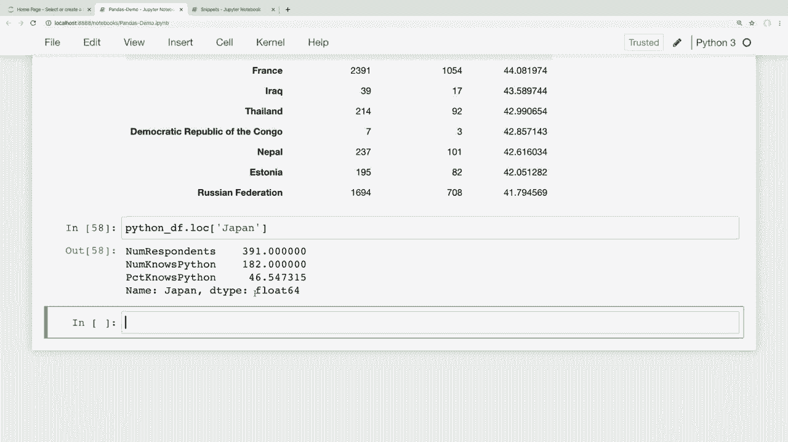
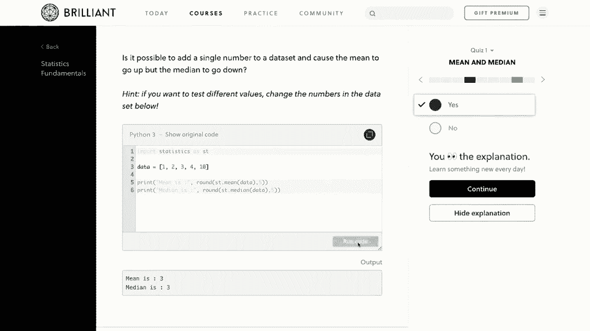
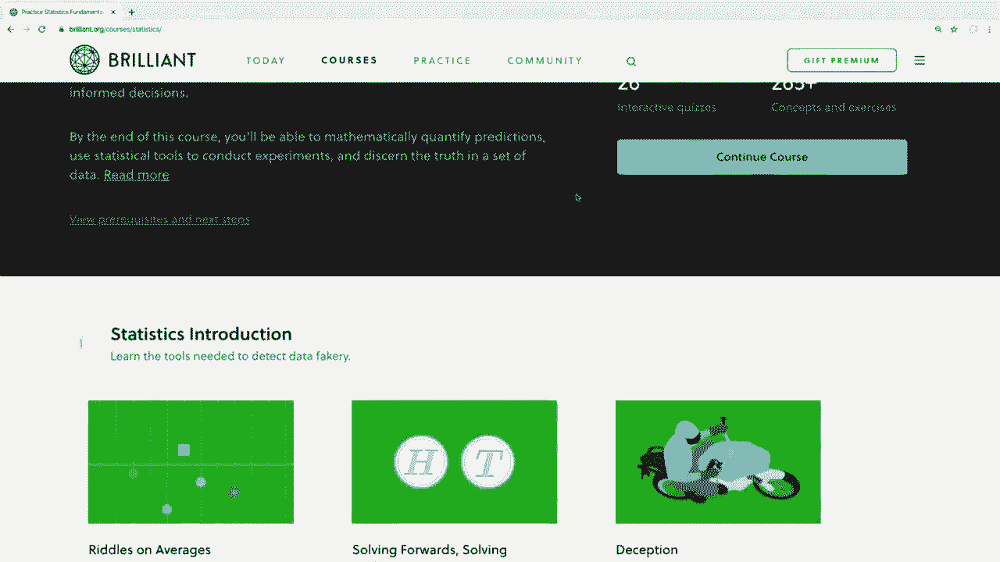

# 用 Pandas 进行数据处理与分析！真实数据&实时讲解，学完就能上手做数据分析了！＜实战教程系列＞ - P8：8）分组和聚合 - 数据的分析和探索 - ShowMeAI - BV1M64y187bz

大家好，最近怎么样？在这个视频中，我们将学习如何对数据进行分组和聚合。如果你不知道分组和聚合到底是什么，建议你继续观看这个视频，因为基本上。

这是大多数人想到有意义地分析数据时的想法。因此，这将是我们第一次从数据集获取一些统计数据，而不仅仅是以不同的方式修改数据框。

例如，也许你想知道开发者的平均薪资是多少。或者你想知道每个国家有多少人会Python或其他编程语言。我们将在这里学习的内容将帮助我们回答这些类型的问题。现在，我想提到我们这一系列视频有一个赞助商，那就是Brilliant。

我真的想感谢Brilliant赞助这一系列。如果大家能通过下面描述部分的链接查看他们并支持赞助商，那将非常棒。我稍后会更多地谈谈他们的服务。那么，既然这样，我们就开始吧。在开始进行一些更高级的数据分析之前。😊

我们将慢慢开始，然后逐步进入更高级的内容，以确保这一切都是有意义的。我这里打开了我们在整个系列中使用的开发者调查数据。如往常一样，如果你想跟着做，我在下面的描述部分中提供了代码和数据的链接。让我们看看一些基本的聚合。如果你不知道聚合的意思，基本上。

这意味着我们将把多个数据片段合并为一个结果。例如，如果你曾经在数学中使用过平均数、中位数或众数，这些都是聚合函数，因为它们取多个值并给出这些结果的平均数、中位数或众数。因此，如果我们想对这次开发者调查进行一些分析，我们可能会问的问题是。

好吧，回答这个调查的开发者的典型薪资是多少？如果你正在找工作并想了解目前的薪资情况，这可能是一些很好的信息。因此，为此，我们可以获取数据框中的平均薪资。首先，让我们看看这些薪资。在这个数据框中的薪资列叫做转换薪资。

这转换为美元。实际上在调查中还有进一步的信息。就在这里。所以我会复制它。首先，让我们看看这一列。正如我们之前看到的，我们可以像访问字典的键一样访问这一列。我将抓取前15个薪资。

所以我将查看结果的前几行。这些是开发人员在这次调查中填写的工资，而这些N N值在这个上下文中意味着非数字，表示他们在调查中跳过了那个问题。好的，所以我们可以看到这次调查的中位数工资。

只需在这个序列上运行中位数方法。因此，接下来我将复制我在这里的内容。现在，不再查看头部，我可以直接在那个序列上运行中位数。所以如果我运行这个，我们可以看到这次调查的中位数工资大约为57000。

所以这取自我们调查中这个序列的所有工资响应。它给我们提供了所有这些的中位数值，并忽略了N N值。因此，这可能没有提供我们真正想要的信息。例如，不同国家的薪资不同，因为生活成本和其他因素各不相同。

因此，如果我们能查看按国家划分的中位数工资就好了。当我们学习分组数据时，我们将稍后查看这一点。所以首先，我想在继续分组之前再讲几个基本概念。我想查看的是对整个数据框运行这些聚合函数。

😊，让我们看看如果对整个数据框运行我们刚才运行的中位数函数会得到什么。所以这里我只是说Df do median。我们不再仅仅访问单一列。如果我运行这个，可能需要一点时间来加载。当我这样做时，它会查找我们的数据框，并找到包含数值的列，以便可以获取中位数值，其中一些可能不适合用中位数，但其他的可能对我们很有用。

例如，我们可以看到这次调查的中位数年龄在底部为29岁，而每周的中位工作小时数为40小时，这很标准。所以这很合理。现在，如果你想对你的数据进行广泛的统计概述，我们可以使用describe方法，而不是对我们的数据框运行。于是，我如果改为运行describe。

而不是中位数。我运行这个，这将为我们提供一些不同统计数据的概述。所以如果我们查看这里转换的补偿列，我们可以看到一些关于这一列的不同统计数据。它给我们提供了计数、均值、标准差、最小值，以及25%、50%和75%分位数。

现在，这个50%的标记只是中位数值。就像我们之前看到的，当我们具体查找这个中位数值时，大约是57000。这里是科学记数法，所以看起来有点不同。基本上，这意味着我们只需从小数点向右移动4个位置。所以1、2、3、4。

所以这里会是57000。因此，这个描述方法会在一个地方给我们提供一堆聚合数据。如果我们只想快速浏览我们的数据。现在，如果你在想，为什么我想查看薪资的中位数而不是平均数，其实是因为平均数会受到异常值的影响太大。

这并不是一个好的指标，因为少数异常值可以极大地影响平均数。我们可以看到上面的平均薪资，如果我强调这一点。如果我们要计算这个，那么实际上大约是127000的平均值，但这给我们一个不切实际的期望，关于典型开发者的薪资，因为数据集中的最高薪资将平均值拉得太高。

所以在这种情况下，你肯定想使用中位数，我认为那是更好的表示，抱歉，你会想使用中位数，因为那是更好的表示。现在，如果我们只想获得单列的概述，我们也可以在单列上运行这个描述方法，并得到相应的结果。

现在，你可能在想，这些描述结果顶部列出的计数值是什么。计数值是非缺失行的数量，这基本上意味着它计算了非缺失行。因此，在这次调查的上下文中，缺失行仅意味着受访者没有回答特定问题。

如果我查看转换的comp列的计数。我将会上去抓取这个。而不是抓取中位数，我只是要抓取计数。我们可以看到，只有大约55000到65000人回答了这个问题。现在，我想这个数据大约有89000行，这意味着大约有30000人没有回答这次调查的薪资问题。

现在，我有时会看到一些人犯错，他们认为计数函数会计算特定行中的个别值，并报告这些值在列中有多少个。但是如果这就是你想做的，那么我们应该使用值计数函数。

现在，如果这听起来有点不太明白。我们来看一个例子，看看这是什么样子的。例如，我们在调查中有一个问题，问每个人是否在空闲时间把编码当作爱好。为了查看这个问题的所有回答，我们可以查看爱好者列。所以我会访问这个爱好者列并运行它。

我们可以看到这里返回了一系列数据。这些只是一些是或否的问题。每个人都回答了一个是或否的问题。因此，当你可能收到调查结果时，你可能会想，好吧，我可以在调查中看到响应，但我只想知道有多少人回答了是，有多少人回答了不。那么我们该如何做到呢？我们可以通过值计数函数获得这些信息。所以如果我只看值计数，那就是value underscore counts。如果我们对那个系列运行这个方法，那么这将给我们一个回答人数的细分。

是的，还有多少人回答了不，是否将编码作为一种爱好。因此，我在探索数据时总是使用值计数。通过对一些不同的字段使用这个，我们可以从我们的调查中发现一些有趣的事情。例如，这个调查中有一个问题。😊。

询问每个人最常使用哪个社交媒体平台。因此，如果你在构建一个应用程序或网站并想跟踪最受欢迎的社交媒体网站，那么你可能会对这个问题的最受欢迎答案感兴趣。为了查看这些结果，我们可以访问调查的社交媒体列。所以让我这样做。在我对这个运行值计数之前。

让我给你展示一下这个列是什么样的。因此，这一列叫做社交媒体，所以我将运行这个。我们可以看到，受访者编号一说他们使用Twitter比其他任何社交媒体更多，这个人还使用了Instagram、Reddit、Facebook、YouTube等等。到目前为止，我在之前的视频中提到过这一点。

但如果你忘了，或者这是你第一次观看这个系列的视频，那么在我的笔记本顶部，我也在这里加载了一个模式数据框。这个数据框告诉我们每个列名在调查中提出的确切问题。例如，如果我们想看到这个社交媒体列所提问的确切问题。

然后我可以直接访问那个模式数据框并进行点选择，因为索引将是列名。然后我们可以搜索社交媒体，如果我运行这个，我们可以看到调查中他们具体问的问题是你最常使用哪个社交媒体网站，因此我们可以看到这里有几个不同的回答，但这些中哪个是最受欢迎的呢？所以要找出这个。

让我们看看这个系列的值计数，以了解这些开发者的总体最受欢迎社交媒体网站是什么。因此，我将运行这个，然后在这里运行值计数函数。现在我们可以看到，Reddit在顶部是最受欢迎的，大约有14000人，然后我们有。

YouTube、Whatsapp、Facebook、Twitter、Instagram，我不使用社交媒体是其中一个答案。我们还有一些外国社交网络在这里。我从未听说过这些，但我相信这些是中文字符。所以这可能是一个中国社交媒体网站。我对俄文不太了解，但我猜这可能是俄文。

这可能是一个俄罗斯社交媒体网站。看到来自世界各地的这些不同答案真有趣。还有一个小提示，如果我们想看到按百分比划分的结果，而不是原始数字，我们可以将归一化参数传递给值计数函数，并将其设置为true。让我给你展示这是什么样子。所以我可以说normalizedize等于true。

现在我们将按百分比进行划分。所以17%的人说他们使用Reddit，16%说YouTube，约16%说Whatsapp，等等。好的，所以我们可以看到这里有一些来自其他国家的社交媒体网站。这显然可能是地区性的问题。我猜社交媒体平台的受欢迎程度。

这因国家而异。那么我们如何拆分这些结果，以便看到每个国家最受欢迎的社交媒体网站呢？为此，我们需要学习如何对数据进行分组。所以这又是一个初看可能会让人困惑的话题。让我慢慢开始，以便我们确切了解这里发生了什么。首先。

如果我们想看到基于国家或其他某一列的特定结果，那么我们需要在那个特定列上进行分组。我们有用于此的group by函数。那么，使用group by函数实际上意味着什么呢？在pandas文档中，它说分组操作涉及某种组合。

拆分对象、应用函数和组合结果。所以我将尝试逐一讲解每个过程，以便我们确切了解这是如何工作的。所以在pandas文档中，它说分组操作涉及某种组合，拆分对象、应用函数，然后组合这些结果。让我们逐一进行。首先，作为参考。

让我们显示每个国家的值计数，以便看到在这次特定调查中结果最多的国家。为此，我们只需访问国家列。如果我运行这个，我们可以看到每个受访者所说的国家。

如果我们查看这个的值计数，这将汇总所有独特的响应，因此我们可以看到大多数调查是由美国的开发人员回答的。其次是印度，然后是德国、英国、加拿大等。好的。

现在让我们看看如何在我们的国家列上使用分组函数。所以首先，我们将拆分对象，然后应用一个函数。然后它将组合这些结果。所以首先，让我们看看拆分对象。在这种情况下，我们想按国家分组所有结果。所以为此。

我们可以简单地说`DF.group_by`。然后我们将传入。这将是我们想要分组的列的列表。我将只传入一个列，这里是国家。如果我运行这个，那么我们返回的是这个数据框的分组对象。

那么这个对象是什么，我们到底可以对其做什么？所以首先，让我们稍微解释一下这是什么。这个对象包含一堆组。为了更好地理解这是什么，让我们看一下这个数据框的一个单独组。在我们这样做之前，我将把它设置为一个变量，以便我们可以重用它，而不必反复输入代码，同时它也更容易阅读。

我将这个称为国家组，我将其设置为这个`DF.do_group_by`，现在不必每次都输入这个，我们可以只引用这个国家组变量。那么现在让我们看看这些组中的一个。由于我们按国家分组了我们的行，所以我们可以通过国家名称抓取特定组。

所以我会获取美国的组。为此，我们可以说国家组做`git_group`，然后传入组的名称，在这种情况下，我想获取美国的组。如果我运行这个单元，哎，这告诉我国家组没有定义。

这是因为我在设置变量后没有重新运行上面的这个单元。所以如果我运行这个并获取美国的组，然后我们可以看到这里返回了一个包含一些调查结果的数据框。所以这看起来似乎没什么特别的。但是如果我查看每个调查结果的国家名称。

国家就在这里列出。那么我们可以看到所有这些回应都是来自声称他们来自美国的人。如果我查看印度的组。如果我把美国换成印度并获取那个组。

如果我们查看这里的国家，那么这些都是声称他们来自印度的人的调查结果。所以这就是我们之前看到的数据框分组对象的组成。它已将所有不同的回应按国家名称分成了组。因此这类似于在我们的原始数据框上运行过滤器。

所以我应该能够获得这些相同的结果，对于单个国家，只需按照我们在之前视频中看到的做并创建一个过滤器。所以我可以说，好的。我想抓取。我希望我们的过滤器等于国家等于美国时。然后我可以通过说，好的，将其应用于我们的数据框。

数据框调用Lo并给我所有符合该过滤器的结果。如果我运行这个单元，那么我们可以在国家列中看到所有这些结果都是来自美国的响应者。所以如果我们只是想获取单个国家的信息，那么这与我们在这里创建一个过滤器非常相似。

但不是仅仅获取一个国家的结果。按组分组会将所有这些响应按国家名称拆分。所以现在我们已经将所有这些按国家名称拆分和分组。现在我们可以应用一个函数，并将这些结果合并在一起。

那么我们想应用什么样的函数呢？正如我之前提到的，也许我们想看看按国家划分的最受欢迎的社交媒体网站。现在，如果你只是想获取美国或印度最受欢迎的社交媒体网站，那么我们已经看到过如何做到这一点。所以在这里我有一些过滤后的结果，涉及到美国的响应。

因此我们可以做我们之前做的事情，即在社交媒体列上运行值计数方法。所以我可以在这里说，在最后。我可以访问那个过滤后的数据框的社交媒体列。然后我可以运行值计数。在这里。所以如果我运行这个，那么我们可以看到对于美国，Reddit、Twitter、Facebook和YouTube是四大社交媒体网站。

如果我们想具体查看印度的情况，那么我可以将过滤器更改为印度，然后运行这个，我们可以看到Whatsapp排在第一，接着是YouTube，LinkedIn和Facebook。所以这是针对一个特定国家的结果。

但是如果我们在数据框上按对象进行分组，那么它会给我们所有这些国家组的结果。所以如果这有助于你理解，可以想象这类似于运行一个过滤器，然后应用一个函数，就像我们在这里对一个国家所做的那样。

但是当我们使用分组功能将这些数据分组，然后应用一个函数时，它会将这些组合并，以便给我们所有独特国家的结果。所以我认为一旦我们在这里看到这一点就会明白。所以记得我在这里调用了我们的组。

国家组，所以如果我们到这里底部，我们可以说，好吧，对于国家组。现在我想查看社交媒体列，并获取该列在整个国家组的值计数。所以如果我运行这个，那么返回的是一个系列，按国家划分的最受欢迎社交媒体网站。

现在，这实际上在这里提前截断了一点。所以让我获取这个系列更大的一部分，以便更好地了解它的样子。所以在这里的结尾，我就说.dothead，看看前50个结果左右。所以如果我们运行这个，那么我们可以看到，第一个国家是阿富汗。我们可以查看那里的最受欢迎社交媒体，然后继续往下列表，阿尔巴尼亚。

阿尔及利亚、阿根廷等等。现在这实际上是返回一个系列，而这个系列有多个索引。它有国家索引和社交媒体索引。现在我们还没有讨论这个系列中的多个索引。但是如果有人对这如何运作感到好奇，或许可以在下面的描述部分留言。

也许我们可以在未来的视频中讨论这个话题。但国家是第一个索引。我们可以像处理任何其他系列一样获取这些数据。所以，如果我想获取印度最受欢迎的社交媒体网站，那么我可以直接来到这里，使用那个返回的系列。

让我们再看一下。这是这里的索引。我可以通过说点点Lo来获取这个系列，然后查找印度。我们可以看到这些结果和之前得到的是一样的。现在，你可能会想，嗯，如果这些结果和我之前得到的是一样的，那这还有什么用呢。

这很有用，因为现在我们可以查看任何国家的结果，而不需要对世界上每个国家单独运行过滤器。所以，例如，如果我想查看美国最受欢迎的社交媒体网站，那么现在，除了不断更改过滤器，我可以直接查看这个返回系列的美国索引。

现在我们可以看到这些结果。所以我觉得能够像这样玩弄数据并进行探索真的很有趣。我非常喜欢看到不同国家的不同结果，而这些网站中有很多我从未听说过。所以例如，如果我们查看中国或俄罗斯最受欢迎的社交媒体网站。

那让我在这里看看中国。我们可以看到，这确实看起来像是一个中国社交媒体网站，可能是微信，然后我猜这个发音是微博，但我觉得这非常有趣。如果我们想看看俄罗斯，那么在这个调查中我们不能仅仅说俄罗斯，俄罗斯被称为俄罗斯联邦。我之前犯过这样的错误，只输入俄罗斯，它会告诉你找不到这个名称的索引，所以实际上是俄罗斯联邦。如果我们搜索这个，那么我们可以看到我不知道该怎么发音，但我之前认为是俄文的那个，确实看起来是俄文。请记住，如果你觉得查看百分比比单纯的原始数字更有意义，你总是可以将normalizedize设置为true，这样它会给你百分比结果，而不是原始数字。

我们可以看到这个俄罗斯社交媒体网站有30%的人表示这是他们最受欢迎的社交网络。如果我们回到中国，我们可以看到顶部的这个，有67%的开发者表示这是他们使用最多的社交媒体网站。所以我觉得能玩弄这些数字，看到不同国家的不同结果真的很有趣。

一旦掌握了这些技能，我们就可以做这样的事情。在很多时候，能够以这种方式探索数据本身就是一种乐趣，并发现数据中可能未曾预料到的东西。现在回到视频开始时讨论的内容，我们也可以用它来运行更传统的汇总函数，如均值、中位数等。

所以前面我们查看了整个调查的中位数工资。但现在让我们将其拆分。😊因此，就像我们查看社交媒体列的值计数一样，我们可以查看工资列的中位数，该工资列标记为转换的补偿。

所以要做到这一点，我可以直接抓取我们国家组的数据。我们想查看这个转换的补偿列，现在我们需要告诉它我们想看到什么汇总函数。我想查看所有国家的中位数工资。如果我运行这个，我们可以看到结果显示正常。

这是阿富汗的中位数工资，这是阿尔巴尼亚的，依此类推。所以如果你想看到像德国这样的地方的中位数工资，我们可以简单地查看这里。这就是我们得到的结果，这些是我们的索引。索引是国家名称。如果我想获取特定国家的数据，我可以使用点符号，输入国家名称。

如果我运行这个，我们可以看到德国的中位数工资大约为63000。现在，或许你正在进行一些分析，想要对数据进行分组，同时想在你的组上运行多个汇总函数。假设我们不仅想看到中位数，还想看到均值。

所以要做到这一点，我们可以使用 ag 方法 A G G，并传入我们想要使用的所有汇总函数。为了做到这一点，我可以说，让我抓取我们运行中位数的地方。我们将使用这个 ag 方法，而不是仅仅运行中位数汇总函数。现在我们将传入一个汇总函数的列表。

假设我想先获取中位数，然后我也想能够看到平均数。如果我们运行这个。然后我们可以看到得到一个包含每个国家的平均和中位数工资的数据框。再次，如我们之前所做的那样。如果我想按特定国家缩小范围，那么我们只需通过国家名称获取这些索引之一即可。

如果我们想查看加拿大的平均和中位数工资。那么我可以直接在这里输入dot Lo，然后传入加拿大。让我拼写正确。现在我们可以看到加拿大的中位数工资和平均工资。根据你的需求，你可能会遇到一些意想不到的问题。

举个例子，假设你想知道每个国家有多少人会使用Python。在我们对组进行此操作之前，先看看我们如何使用之前使用的过滤方法来处理一个国家。

我要滚动到我们有那个过滤器的地方。然后我将复制并粘贴到这里。然后我将删除这个值计数部分。因此，目前我们这里的过滤器是我们将国家过滤到自称来自印度的人。

现在，为了弄清楚在这项调查中有多少人表示知道Python。我们将使用之前视频中见过的字符串方法。如果你不记得这些是什么样的。那么我们可以这样做。通过做这样的事情，我们可以说，好吧，我想要所有表示来自印度的人的回应。

现在，当我得到这个结果时，请记住，这个结果只是我们数据框的一个过滤版本。我们的原始数据框，现在我们可以说，好吧，我还想要。使用的语言是他们实际使用的不同语言。因此，如果我们查看这个语言工作列。

然后我们可以看到他们列出所有自称会的语言，以检查Python是否在这一列中，然后我可以说dot STR并在返回的系列上使用字符串类，表示。好吧，我们想要STR.dot包含Python的地方。因此，这将为包含Python的行返回true，而对不包含的回应返回false。所以如果我运行这个。

然后，这将返回一系列真假值，告诉我们每个受访者在语言工作列中是否包含那串Python字符串。现在，如果我们想实际计算知道Python的人数。那么我们可以使用sum函数将这些值相加。通常，你会认为sum只适用于数值数据，但它也适用于布尔值。

它将把所有的真值计为 1，把所有的假值计为 0。所以要找出多少人知道 Python，我只需在最后做一个 dot sum。如果我运行这个，那么我们可以看到大约 3100 名来自印度的调查者表示，他们知道 Python 是他们使用的语言之一。现在，在我们想要对数据框组对象运行类似的聚合函数之前。

我们对组对象采取了相同的方法。所以例如，你可能会认为我们可以这样做，看看有多少人来自每个国家知道 Python。你可能会认为我们可以说，好吧，我应该能做到这一点。我可以说，对于这个国家组。

我想查看这个语言工作的列，然后查看包含 Python 的字符串并将其相加。但是如果我在这里运行这个，我们可以看到出现了一个错误。正如我在之前的视频中所说，有时阅读这些 Pandas 错误并理解我们做错了什么可能很困难。但在这种情况下，它实际上给了我们一个相当不错的线索，说明我们做错了什么。

它告诉我们，无法访问系列组对象的字符串属性。然后它说，尝试使用 apply 方法。因此，我们在这里得到这个错误的原因是，因为这不再只是一个系列，而是一个系列组对象。它告诉我们改用 apply 方法。所以当我们对像这样的组对象运行 apply 方法时。

我们将指定一个函数，在这个组中的每个系列上运行。我知道这可能听起来有点困惑，所以让我们看看这是什么样子。希望这能稍微清晰一些。所以，不是直接访问这里的字符串类，而是使用 apply 方法。对于任何跟随的或将要下载这个的人。

我将继续保留这个单元格中的错误，以便你可以运行它并重现该错误。然后我将在这个单元格中做正确的方式。所以再次强调，不是直接在这个系列组对象上使用字符串类，而是使用 apply 方法。所以让我把它剪切掉，然后我会说点 apply。

现在我们可以应用一个我们想在这个组中的每个系列上运行的函数。如果你看过之前的视频，你会知道如果我们只想要一个简单快捷的函数，我们可以使用 lambda 函数。如果你愿意，可以写另一个单独的函数。但在这里我将使用 lambda。所以这里的 lambda 是。😊，一个系列。所以现在我们可以说。

好吧，我们想要返回什么？好的，我想返回 X，然后。由于这是一个系列，我们可以说 x.dot.string.dot.contains Python.dot.sum。所以再次强调，就再来一次，我们正在对这个系列组运行 apply 方法，然后传递一个将在这些系列上运行的函数。

我们想要的函数或返回的内容是该系列中包含字符串Python的值的总和，这将在我们使用这个国家分组时为每个国家执行此操作。所以如果我运行这个。

那么我们可以看到，在阿富汗，8名受访者表示他们会使用Python，阿尔巴尼亚则有23名，等等。现在，仅仅看到这些数字并没有太大的帮助，因为我们想了解每个国家声称会使用Python的人的百分比，单靠这些结果，我们只能看到一个数字，我们需要来回比较。

每个国家的调查有多少人回答，以及其中有多少人会使用Python。然后我们可以从那里计算出这个国家中会使用Python的人的百分比。但我们不想手动计算，这样太繁琐了。所以我们想找到一种方法，让Python和pandas为我们完成这个计算。

现在，很多人都让我整理一些编程问题，以便练习我们在这些视频中学到的内容。所以你可以把这个当作练习。所以我将在这里进行尝试。那么，你们中有没有人想过一个方法，我们可以算出每个国家中会使用Python的人所占的百分比？如果你认为你能找出这个问题，可以在这里暂停视频，自己试着解决。

而且这将结合我们在这一系列课程中讨论的一些主题来完成这个任务。话虽如此，我将继续我的解决方案。所以如果你想自己试着找出这个问题，可以暂停视频，试着自己解决。如果你这样做了。

然后我希望你能够在这里找到一些解决方案。但如果没有，那也没关系，让我们继续来看看我的解决方案，这样你可以用它作为练习，提升自己在pandas方面的技能，以便将来能够进行这种类型的分析。

正如我所说，为了计算每个国家会使用Python的开发者百分比，我们将结合我们在这一系列课程中学到的一些不同的知识。现在，回答这个问题可能有几种不同的方法。如果你有不同的解答方法，欢迎分享。

如果你找到了方法，请在下面的描述区留言，让大家可以看到不同的方法。你知道，绝对有可能有比我接下来要做的更有效的方式。如果有的话，我会强调一下，这样其他人也能看到最佳方法。但是我打算这样做。首先，我将获取每个国家的总受访者人数。

这样我们就知道每个国家回应这项调查的人数总和。所以我将称之为国家回应者，并将其设置为。我们想要获取这里国家的值计数。所以。如果我打印出我们得到的结果。我们之前见过这个。哎呀，我在这里出错了，因为我写成了县。

我把它改回国家。所以如果我看看这个。那么这些是说他们来自每个国家的总回应者人数。我们在视频中也看到过这个。所以现在我将获取每个国家知道 Python 的总人数。

我们刚才就在这里做过这个。但我会继续这样做，并将其设置为变量，以便我们记录所有这些步骤。所以我将抓取。我们刚刚计算出的所有内容。现在我将把这个设置为一个变量。我将称之为，你知道的。国家使用 Python。然后我将把它设为等于这个。现在。

让我们也打印出那个变量。所以让我在下一行进行，这让我电脑。有点让我烦恼。好的，这些是来自每个国家的所有人，他们说他们知道如何使用 Python。所以现在我们有一个变量是一个系列，包含来自每个国家的总人数，称为国家回应者。然后我们还有另一个变量是一个系列。

这是来自每个国家的知道 Python 的总人数。所以现在我们需要将这两个结合起来。现在，我实际上将使用一个在这个系列中还未讨论过的方法。所以如果你在这里卡住了，那是完全可以理解的。我可能应该在我们将行附加到数据框的那段视频中提到这个。

但是我们可以使用 pandas 的 concat 函数将多个系列组合在一起。所以让我们看看这会是什么样子。我可以说，我就叫这个数据框 Python Df。现在我要创建一个数据框，我们可以将这两个系列连接在一起。所以我可以说 P D.dot concat。现在我要传入一个我们想要拼接的系列列表。

所以我希望这些是我们国家的回应者。而且我还想。加入这个国家使用 Python 的系列，现在。我们还想将轴设置为列，因为默认情况下。它会尝试在行上进行拼接，但我们希望将索引匹配，这样才能以那种方式进行拼接。所以我们想说轴等于列，然后最后。

我还将设置 sort 等于 false。现在，如果你观看了之前的视频。这不是绝对必要的，但如果你在没有设置 sort 等于 false 的情况下运行它。它会给你一个警告，告诉你在未来版本的 pandas 中。它会默认排序或默认不排序。

所以最好直接指定你是否希望结果数据框排序。现在让我们看看这个连接的数据框。好的，现在我们有一个数据框，其中这两个系列已被连接，并在相同的索引上匹配。这更有用，因为现在我们可以看到，大约有20000或21000。

1000名声称来自美国的人和大约10000名声称知道Python的人，所以这肯定是更好和更有用的信息。现在关于这个新数据框的一件事是，有些列与我们正在讨论的内容并没有真正的关系。我们可以看到这个叫做国家，而这个叫做使用的语言，所以让我们重命名这些，使它们在我们实际尝试做的上下文中更有意义，我们也看到如何在之前的视频中重命名列。

但是如果你忘记了，那么你可以通过抓取我们的数据框来做到这一点，我会说Python Df，也就是我们的数据框.dot rename，现在我们想要重命名什么呢？我们想要重命名列，我将传入一个字典。

关键在于之前的值，而这个值将是更新后的值。所以我将其称为回应者数量。然后我还想更改这个“使用的语言”列。我想把它改成，我们称之为知道Python的人数。如果我运行这个，我们可以看到这看起来不错。我们有来自美国的回应者数量和知道Python的数量。

所以这看起来不错。由于它看起来不错，我将说in place等于true，这样它实际会修改我们的数据框。如果我运行这个，然后再查看我们的数据框，那么😊，我们可以看到它已用这些新列更新。现在我们有来自每个国家的回应者总数，以及每个国家知道Python的人数，所有这些都在一个数据框中。

所以我们有计算百分比所需的所有信息。现在我们所需的就是创建一个新列并进行计算。所以如果你还记得，为了创建一个新列，我们可以简单地赋值。所以我将这个列称为PCt，用于表示知道Python的百分比。

现在我们想要这个等于什么呢？好吧，如果你不知道如何用数学计算百分比，基本上你需要先取出部分，然后用它除以整体，再乘以100。所以这里的部分是知道Python的人数。

所以我会抓取这个，叫做on underscore DF，并访问那个系列，访问那个列。然后我想用这个部分除以整体，而整体是来自那个国家的总人数，也就是回应者数量。现在，如果我们想要这个是一个整数百分比，那么我们可以乘以100。好的，如果我做了所有这些正确的话。

而且很有可能我犯了一个错误。但如果我正确地完成了所有这些，那么我们应该在这里有一个数据框，显示每个国家知道 Python 的人所占的百分比。现在我们可以像处理任何其他数据框一样处理这个数据框。所以假设我们想要对这些结果进行排序。

现在我们在之前的视频中学习了如何对系列中的值进行排序。所以假设我们想按照知道 Python 的受访者所占的最大百分比来排序各个国家。为此，我可以简单地说 `Python D F.t sort.Underscore values`。如果你忘记了如何做这些事情，那么你可以随时回到我们的 pandas 视频，那里我们学习了排序。

所以为了按照知道 Python 的人或其百分比进行排序，我们可以说，好吧，按什么排序。我在这里称之为“知道 Python 的百分比”。然后我实际上希望这以升序排列。`Order` 等于 `false`，因为我希望知道 Python 的人所占的最大百分比排在最上面。然后我本来打算先将 `in place` 设置为 `true`。但让我们看看这是什么样子。好的。

所以看起来那个排序有效，并且效果不错。所以现在我会说 `in place` 等于 `true`，这样它就会修改我们的数据框。现在我们可以在这里查看我们的结果。因此我们可以看到这里的一些数据有点误导，因为你知道。来自圣多美和普林西比的 100% 的人不懂 Python。

但我们只有一个来自这个国家的人回答了调查。而他恰好知道 Python，或者她。因此这是 100%。所以相反，让我们看看头部，并抓取。看看我们能否找到一个受访者数量更多的国家。所以，好吧。我们有 72 名来自乌干达的人，其中 47 名知道 Python。所以这是 65%。这相当不错。

我们有哦，好的，这是美国，情况也不错。这里大约有 21000 人，大约有 10000 新的 Python 使用者。所以这是 48%。所以这在较高的范围内，这很好。所以，是的。我认为这是练习使用 pandas 的好方法。而且，能够以这种方式探索你的信息也很有趣。

现在我们有一个包含所有这些信息的数据框。然后我们还可以检查特定国家，以查看来自特定国家的开发者中知道 Python 的百分比。所以，举个例子，我想查看日本，而不是逐一查看所有这些。我可以简单地说，好吧，`Python.😊，D F dot Lo`。

由于我们的国家名称是这里的索引，所以我们可以简单地对日本使用 `dot Lo`，然后我们可以看到我们得到了该特定国家的统计数据。好的。所以我知道这可能有很多内容需要消化，并且我们在这个视频中覆盖了很多内容。我们确实涵盖了一些比之前视频更高级的主题。

不过，我希望这能让你对使用pandas所能做的事情感到兴奋，以及我们可以解决的问题类型。你知道，当你像这样探索数据时，你可能会在过程中犯很多错误。

我在使用pandas时仍然会犯错误，甚至在这些视频中，我也犯了一些错误。而且这些都是我事先准备好的。所以这确实会发生。但是你知道，每一个我们解决的问题类似于这个，都让后续处理其他问题变得越来越容易。

所以如果你需要回去重看这些步骤，以便自己解决这些问题，那是完全正常的。😊，不要觉得如果这似乎很困难，那就是你有什么问题。

这类信息确实很多，理解起来很正常。而且，正如我之前所说，如果你有其他解决我们在这里回答的问题的方法，那么请在下面的描述部分留言分享你的解决方案，我会看一下这些方案，如果它们比我在这里的做法更好，我会特别提及。

好的，在我们结束之前，我想提一下本视频的赞助商。那就是**Brilliant**。在这个系列中，我们学习了关于pandas以及如何使用Python分析数据，**Brilliant**将是一个很好的补充，提供动手实践的课程，他们有一些优秀的课程和课程内容，深入探讨如何正确思考和分析数据。

对于数据分析基础，我强烈推荐查看他们的统计课程，它教你如何分析图表并确定数据的显著性。我还推荐他们的机器学习课程，它涉及数据分析。

提升到一个新层次，你将学习到如何让机器在变量过多的情况下做出决策的技术。为了支持我的频道并了解更多关于**Brilliant**的信息，你可以去brilliantg cs注册免费账户，前200位访问该链接的人将获得年度高级订阅20%的折扣。你可以在下面的描述部分找到这个链接。

所以我认为这就是我们本次关于pandas视频的全部内容，希望你对如何使用这些聚合函数以及如何对数据进行分组以探索数据有了良好的理解。我真的鼓励你在观看完这个视频后花点时间玩玩数据，看看能否回答某些人可能对这些数据提出的问题。

例如，对于回答这项调查的人，最常见的教育水平是什么，这绝对是我们可以通过这里学到的知识来回答的问题。😊 我希望你感觉自己对回答这类问题有了很好的介绍。

在下一个视频中，我们将学习如何处理缺失数据以及如何清理数据。数据中缺失值是非常常见的，因此了解如何清理和整理我们的数据绝对很重要。如果有人对我们在这个视频中讨论的内容有任何问题，请随时在下面的评论区提问，我会尽力回答。

如果你喜欢这些教程并想支持它们，有几种方法可以做到。最简单的方法就是点赞视频并给予好评。此外，与任何你认为会觉得有用的人分享这些视频也是一个很大的帮助。如果你有能力的话，可以通过Patreon进行支持。

下面的描述部分有一个链接指向该页面。请确保订阅你未来的视频，感谢大家的观看。😊！
