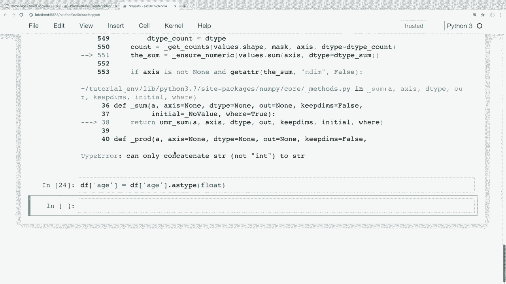
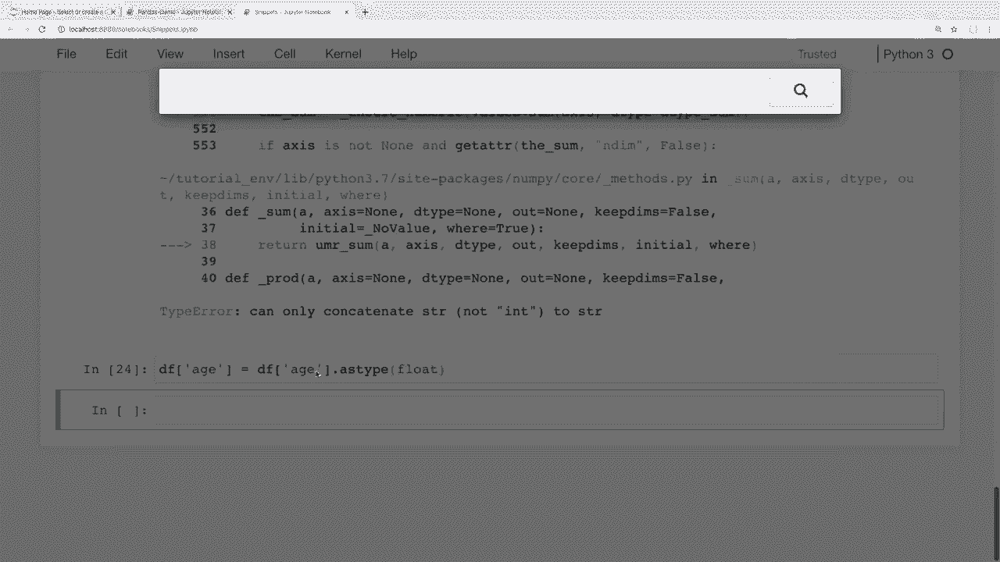
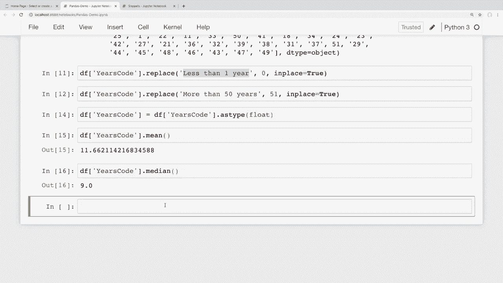
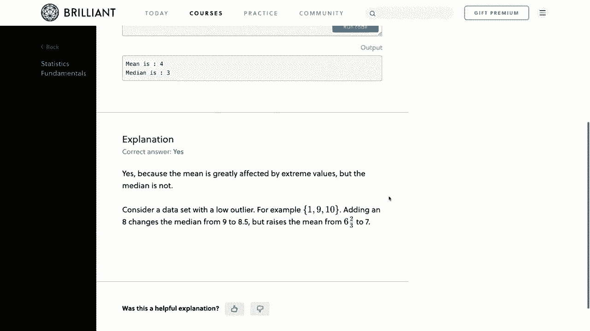
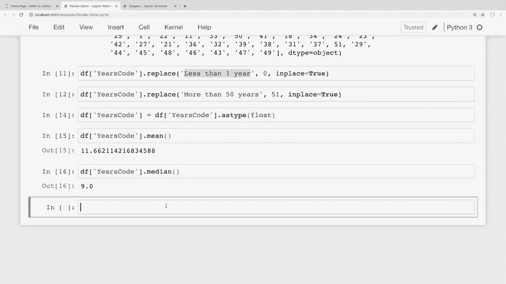

# 用 Pandas 进行数据处理与分析！真实数据&实时讲解，学完就能上手做数据分析了！＜实战教程系列＞ - P9：9）数据清洗 - 转换数据类型和处理缺失值 - ShowMeAI - BV1M64y187bz

大家好，你们过得怎么样？在这个视频中，我们将学习如何处理缺失值，以及如何稍微清理一下我们的数据。几乎每一个你要处理的数据集都有可能包含一些缺失数据，或者是我们希望清理或转换为不同数据类型的数据。因此，我们将在这里学习如何做到这一切。现在，视频接近尾声时。

我们将结合在这里学到的内容，能够查看我们的 Stack Overflow 调查数据，并计算回答调查的开发者的平均工作年限。所以一定要保持关注，这将是对我们在这里所学内容的极佳实践。现在，我想提到的是，我们确实有这系列视频的赞助商。

这真是太棒了。因此，我非常感谢 Brilliant 赞助了这个系列。如果你们能通过下面描述部分的链接去了解他们，那将是极好的，并支持我们的赞助商。我会在稍后详细谈谈他们的服务。那么，就让我们开始吧。好的，首先，让我们谈谈如何删除缺失值。

我这里打开了我的代码片段文件，我们在之前的视频中看到过这个。如果有人想跟着一起做。😊，我会在下面的描述部分提供所有这些笔记本和数据的链接。正如我们在之前的视频中看到的，我们将首先在较小的代码片段数据框中学习如何做其中的一些操作，然后再看看如何在更大的 Stack Overflow 数据集上做一些有趣的事情，以便在一些真实世界的数据上进行工作。

在这个视频中，我在我们的代码片段数据框中添加了一些之前没有的空值。我添加了一些额外的名字，我们可以看到我这里只有一个是 nu do N，也就是不是数字的值。我在顶部也导入了 nu，这里只是一个 nu 值。我还添加了一些自定义缺失值。

这个只是一个 NA 字符串，而这个只是一个缺失的字符串。因此，我在数据中随意放了一些 N、一些 nuns 等等，以便我们有一些缺失值。所以你会看到，当我们使用 pandas 时，这种情况会经常出现。😊我们会有一些缺失数据，具体取决于你想做什么。

你可能想用不同的方法处理缺失数据。所以，你可能想做的一件事就是简单地删除它。对于我们这里的小数据框来说，假设我们要对数据框中的这些人进行一些分析，但如果他们没有名字、姓氏和电子邮件地址，那么我们就无法进行所需的操作。因此，我们将删除那些缺少这些值的行。为了做到这一点，我们可以使用`drop`方法。

所以让我们这样做，然后我会解释结果并讨论这些。因此，我在这里对我的数据框所做的只是说Df drop in a，我们现在将不带任何参数运行它。因此，当我们运行时，我们可以看到现在我们只得到四行数据，而在上面我们有45行。

所以我们得到了这四行，因为它们没有缺失值。现在我们底部的这一行仍然存在，这里有一些自定义缺失值。但我们将看看如何处理这些。不过现在，让我们讨论一下drop in a实际上在这里做了什么。

这里的背景是drop in a正在使用一些默认参数。所以我将手动填写这些默认参数。这样可能会更清楚我们为什么得到这个具体的结果。因此默认情况下，我将留那个参数在这里。现在我再次填写drop in a。

但我将放入它已经拥有的默认参数。这个在后台的默认参数是它将轴设置为索引，并将how变量设置为任何。所以由于这正是该方法默认使用的，我们应该得到相同的结果，我们可以看到确实如此。

我们得到的结果与我们在上面运行时是一样的。但现在让我解释一下这些参数。首先，我们有轴参数。这个可以设置为索引或列。这将告诉pandas我们希望在行缺失值时丢弃值，当这里设置为索引时。

如果我们将此设置为列，那么如果列中有缺失值，它将会丢弃列。我们马上会讨论这个。现在，第二个参数是我们想如何丢弃这些。或者我想说一个更好的方式是，这是它用来丢弃行或列的标准。因此默认情况下，这被设置为任何。所以我们在查看行，因为这被设置为索引。

这里也被设置为任何。因此它将丢弃任何有缺失值的行。但这可能不是你想要的。也许在我们进行的这种分析中，有缺失的电子邮件或姓氏是可以的。但必须有某些内容。不能整行都是缺失值。

所以如果是这样的话，我们可以将这个how参数改为All。这样只有当该行中的所有值都缺失时，才会丢弃行。因此现在如果我运行这个，我们可以看到我们得到了比之前更多的行，因为它保留了那些有一些缺失值，但不是全部缺失值的行。

所以我们可以看到这里缺失了电子邮件，但还有其他一些列是填好的。我们可以看到这里所有内容都缺失，但他们有电子邮件。因此，所有的值必须缺失，才能真正丢弃它们。因此看起来我们缺失索引4。如果我回到我的原始数据框这里。

我们可以看到索引中有所有缺失值。好的。如果我将这个轴改为列而不是索引，那么它将删除所有缺失值的列。我们没有任何列是完全缺失值的。因此，它应该只返回我们的原始数据框。如果我在这里说列并运行这个。那么我们可以看到。这就是我们得到的，因为这些列没有完全缺失值。现在。如果我将其设置回默认值并删除任何缺失值的列。那么我们实际上会得到一个空的数据框，因为我们有一行是完全空的，这个索引为四。因此对于那一行，每一列至少会有一个缺失值。如果我们将此设置为任何，则任何具有单个缺失值的列都会被删除，而在这种情况下所有列都是这样的。如果我将此改为任何，那么由于其中一行的所有值都是缺失的，这将给我们一个空的数据框。此时你可能会想，好的，我的数据比这复杂一些，我正在进行一些分析，我想删除一些缺失值，但我只想删除在特定列中缺失值的行，所以例如。

假设我们正在对数据进行一些分析，如果他们没有名字或姓氏也没关系，但我们确实需要电子邮件地址。如果他们没有电子邮件地址，那么我们需要删除这些行。为了做到这一点，我们可以传入一个子集参数。所以首先我将我们的访问设置回索引，以便删除行，现在我们想传入一个子集参数，这个子集将是我们检查缺失值的列名。

在这种情况下，它只会是一个单列。因此，我将说子集等于，我仍然会传入一个列表，即使这只是单个列，我会说电子邮件。所以如果我运行这个，我们可以看到返回的数据框充满了至少填入电子邮件地址的行。而且再次提到下面这个带有这些空值的行是我们自定义的缺失值，我会告诉你如何处理这些。

缺失值稍后再讨论。现在，在这种情况下，由于我们只传入一个单列作为我们的子集，我们的如何参数并没有真正发挥作用，因为它只会查看电子邮件地址的缺失值。因此，如果电子邮件地址没有填写，则在此处传入任何或所有参数都会触发该行被移除。所以即使我将其设置为所有，它也应该给我们相同的结果，因为我们只在检查一个值。

但我们也可以将多个列传入我们的子集。那么如果我们说，好吧，为了使我的数据有用，我需要他们的姓氏或电子邮件地址，但不需要两个都提供。那么为了做到这一点，我们可以说，他们需要姓氏和电子邮件的所有值。抱歉，我把这个说反了。

他们不需要姓氏和电子邮件。只是不能所有这些值都缺失。所以只要姓氏或电子邮件存在，就不应该删除那些行。如果我运行这个，那么我们可以看到一些没有电子邮件的值，但它们有姓氏。我们还会得到一些没有姓氏的值。

但确实有一个电子邮件，就像这里的一个非内联元素，它有一个电子邮件。但它没有姓氏。而且，再次说明，这是因为我们在所有参数中传入了`how`。这意味着要删除一行，两个子集列都需要缺失。现在，正如我们在之前的视频中看到的，这并没有永久改变我们的数据框值。

如果我们想永久改变我们的数据框，那么我们必须添加`inplace`参数并在这个方法中将其设置为`true`。但在这一系列中我们已经看过很多次。我觉得在这里不需要再重复。好的，现在让我们来看看这些自定义缺失值。我们可以看到这里有一行包含一些自定义的缺失值。

例如，可能获取我们数据的人不知道如何处理缺失值。所以，他们只是传入了一个字符串“N”或者传入了一个像我们这里的“缺失”字符串。那么我们该如何处理这些呢？这取决于我们如何加载数据。在这种情况下，我们是通过创建一个字典并在这里创建数据框来从头开始创建我们的数据框。

因此，我们可以在这里简单地将这些值替换为`NaN`值。现在，如果我们从一个CSV文件加载数据，那么我们可以做不同的事情。但首先，我将展示这个，然后在我查看Stack Overflow数据时再看看CSV文件。所以在我们创建数据框的顶部，我将替换这些值。

使用合适的`NaN`值。因此，为了做到这一点，我将往下走几行，我们在之前的视频中看到过这个，但我们可以在这里使用`replace`，我将替换整个数据框中的所有值。所以每当我们看到一个“NA”字符串时，我将其替换为`NaN`，而且我在这里导入了`numpy`，所以我能够使用`numpy`，然后我想说`inplace`等于`true`，因为我们实际上想要修改那个数据框，所以如果我运行它，那么这将替换那些值，但我还将把这个缺失字符串也替换为`NaN`值，我也想这样做。

所以我们继续执行这个操作，这应该替换那些值。现在如果我查看我们的数据框，可以看到我们不再有那串缺失或 N 的值。这些现在都是 N N 值。如果我们回过头来，运行删除 N 值的操作。

那么这些自定义值应该被替换，并且它应该将这些视为缺失值。所以在这里，我们可以看到之前的结果，其中自定义值的索引为 6，如果我现在重新运行，我们可以看到它消失了，同样在这里如果我重新运行，那么它也消失了。现在，如果你不想做任何更改，只想查看某些值是否会被视为 NA 值。

然后我们可以运行 NA or is in a 方法，得到一个值的掩码，以判断这些值是否被分类为 NA。让我向你展示我在这里的意思。我可以说 Df dot is NA，这将给我们一个值的掩码，表示它们是否被分类为 N 值。

我们可以看到，row4 这里全是 NA 值，row6 也是如此，我们还可以看到其他一些缺失值。现在，有时特别是处理数值数据时，我们可能想用特定值填充 NA 值。现在我正在处理字符串数据，但有时用特定值填充 NA 值也是有意义的。

例如，假设我们在为作业计算分数，或者类似的事情，而你有一些作业的值为 NA，因为学生从未提交作业。那么在那时你可以决定是否将所有缺失的作业记为零，以便你可以计算总分。因此，要做到这一点，我们可以使用 fill NA 方法，例如我可以这样说，如果我做 Df do fill NA，然后传入一个值。

为了确切展示这在做什么，我将用这个大写的缺失字符串填充我们所有的缺失值。如果我运行这个，那么我们可以看到所有缺失的值，或所有的 N 值都被填充为这个大写的缺失字符串。

如我之前所说，我并不常用某些字符串。我发现这对于数值数据最有用，具体取决于你如何进行计算。但是你可能想给 NA 值一个值，例如 0 或 -1 等。如果这与数据相符，并且你有数值数据，可以用 0 替换缺失值。

然后你可以运行 Df fill in0。如果我继续运行这个，我们可以看到这在我们的数据框中也有效。同样，就像我们之前的方法一样，如果你希望对数据框的更改是永久的，并且能在其他单元格中保留，只需添加 inplace 参数并将其设置为 true，使更改永久化。好的。

现在让我们看看我们可能需要处理的另一件常见事情。那就是转换数据类型。因此我在这里有另一列，这是我在之前视频中没有提到的。如果我们查看，这就是这个年龄列。所以假设我们想要获取这个样本数据框中所有人的平均年龄。

好的，现在这些在我们的数据框中打印出来时可能看起来像数字。实际上它们是字符串。我们可以通过查看数据框的数据类型来验证这一点。要做到这一点，我们可以说 Df 的数据类型（D types）。这不是一个方法，而只是一个属性。所以如果我在这里运行它，我们可以看到所有这些列都是对象。

当它说这是一个对象时，可能意味着它是字符串或不同事物的混合。所以在 Python 或 pandas 的最新版本中，抱歉，它们实际上进行了更新，现在有一个字符串数据类型。但我会在这一系列的最后做一个关于 pandas 版本更新的视频，因为在我编写这门课程时它们实际上发布了那个更新版本。但不用担心，这里学到的内容不会过时，基本上还是大同小异，但我们可以看到我们的年龄列是字符串，因为它是这个对象数据类型。

所以如果我们想要平均年龄，现在这样做是行不通的。那么让我们看看这个错误是什么样子的。我将获取那个年龄列的平均值，如果我运行这个，那么我们可以看到现在我们得到一个错误，如果我向下滚动看看这个错误是什么。

它显示“只能将 STR 连接到字符串，而不是 int”。这可能不是最容易理解的错误，但基本上它告诉我们，因为那一列是字符串而不是整数，所以我们需要将该列转换为数字，而不是字符串。

现在在做这件事时有一个注意事项，这可能会让一些人困惑。所以当我们在尝试将列中的 NAN 值转换为数字时，你需要使用浮点数据类型。这是因为 NAN 值实际上是一个浮点数。让我继续演示一下，以便让你看看这是什么样子的。

我将查找 N dot NA 的类型。我们可以看到这是一个浮点数。如果我们尝试将这一列转换为整数，当遇到 NAN 值时就会抛出错误，因为它无法进行转换。因此，如果我说 Df 的年龄（Of age）等于，然后我们尝试将这些转换为整数。这里转换数据类型的方式是，我们可以简单地说，我想将年龄列的类型设置为。

现在我们想传入我们想要的类型。如果我尝试将这些转换为整数，那么这会给我们一个错误，因为我们有一些naN值。所以我们可以看到，int参数必须是字符串，而不是none类型。因此，当你试图将这些数字转换时，如果有naN值，你基本上有两个选择。如果你的列没有任何缺失值。

这样就可以正常工作。我们甚至不会遇到这个错误。但如果确实有缺失值，你可以将那些缺失值转换为其他值，比如用我们之前看到的feel N方法将其转换为0，或者你也可以直接将该列转换为浮点数。现在，我认为将那些缺失值转换为0或其他数字是个坏主意。

因为我们试图计算这个案例中的平均值。但根据你的数据，这可能正是你想要做的。不过我会继续将这些转换为浮点数。所以那些naN值保持为缺失值。因此，在这里我不再使用nt，而是将其转换为浮点数。如果我运行这个，那么看起来是有效的。

现在我们可以再次查看数据类型。我可以说Df，哎呀，对不起，我在那个单元格里打错了。我可以说Df的dtypes。如果我们查看这个，我们可以看到现在我们的年龄是一个浮点对象。那么让我们看看当我们尝试计算该列的平均值时会发生什么。

所以我会说Df的mean。如果我运行这个，那么我们可以看到我们得到了这些年龄的平均值。现在，如果你有一个包含数字的整个数据框或者类似的东西，想要一次性转换，那么数据框对象也有一个as type方法。所以你可以直接说Df的as type。

然后传入你想要转换为的任何数据类型，并一次性转换数据框中的所有内容。但这里有一些混合列，所以我们不想这么做。好的，我们现在一直在查看我们的小数据集以测试这些内容。但现在让我们把在这里学到的知识应用到现实世界数据上，并对我们的Stack Overflow调查数据进行一些分析，所以首先。

我之前提到过，如果我们有自定义的缺失数据值，那么在加载cv时处理这些会简单一些。我所说的在这里是我们在顶部替换这些自定义缺失值。让我给你展示如何在加载cv时做同样的事情。所以我将切换到我的Stack Overflow调查数据。

让我重新运行这一切，以确保所有这些内容都在正常运行，所以这个笔记本仍在运行，这很好，而且这仍然是我们在整个系列中使用的 Stack Overflow 数据。如果你想跟着操作，我在下面的描述部分有一个下载链接。好的，如果我想在加载 CSV 时忽略这些自定义值。

然后我们可以简单地传入一个我们希望视为缺失的值列表作为参数。那么我们可以这样做。如果在这个 CSV 文件中有一些自定义缺失值，我可以简单地创建一个缺失值的列表，并称之为“缺失值”。然后我将传入这个列表。假设我们有一些值是字符串“Na”和一个表示缺失的字符串。

所以现在我们可以在这里添加一个参数，并说 Na 值等于我们刚刚创建的那个列表。如果我们运行这个，就不应该出现任何错误。当它读取这个 CSV 时，它会将那个值列表视为缺失值，并给出 NaN 结果。现在，在这个调查中。

他们做得很好，没有出现任何奇怪的情况。因此，这实际上不应该改变任何内容。好吧，现在让我们看看一个有趣的问题，即如何转换一些值。假设对于回答了这项调查的开发者，我们想计算他们的平均编程经验年数。

现在了解这一点可能对比较你的经验与平均水平是有帮助的。但让我们看看为什么使用这个数据集来计算可能会比较困难。我们计算这个解决方案实际上会应用到我们在这一系列中学到的几个概念。所以在调查中查看这个问题答案的列称为“编程年限”。

那么让我们看看这些答案。我将查看“编程年限”的前 10 个答案。所以我会使用 `.head()`，让我们看一下前 10 个结果。如果我运行这个，乍一看，这似乎并不会成为问题。我们只有一堆整数，表示不同受访者编程的年数。所以你可能会认为我们可以简单地通过说“好吧”来获取这一列的均值。

如果我们这里只有一堆整数和一些 NaN 值，那也没问题。让我们直接计算这一列的均值。但如果我运行这个，就会出现错误。如果我向下滚动，这里显示只能将字符串与字符串连接。我们在较小的数据集中也看到了同样的错误，那时列实际上被加载为字符串而不是数值数据。

我们应该知道如何处理这个问题，因为我们在小数据集中已经处理过了。让我们尝试一下。让我们尝试将其转换为浮点数，然后取平均值。所以让我回到顶部。😊而不是在这里运行 mean。我将说，好吧，让我们将其转换为浮点数，以便可以获取平均值。

所以我会说作为类型。我们想将其转换为浮点数，因为有 N N 值。所以如果我运行这个，我们仍然会得到一个错误。所以在我们的小数据集中没有出现错误。如果我向下滚动，它说无法将字符串转换为浮点数。无法转换的字符串是小于一年。

这可能是我们没有预料到的事情。显然，这一列不仅仅有数字和 N N 值。实际上，有一个字符串值，受访者可以选择，该值等于小于一年编程经验的字符串。所以让我们查看该列的所有唯一值，以便看到其中到底有什么，以防有更多类似的字符串。

我不相信我们在序列中实际上见过这个。也许我们见过。我记不太清楚。但如果我们想查看序列的唯一值，那么我们可以简单使用 unique 方法。所以我们也可以使用我们之前见过的 value counts 方法。如果我们想计算所有唯一值，但我们其实并不想统计它们。

我们只想查看该列中的所有唯一值。为此，我将说。DF 然后访问该 years code 列的 unique。那是一个方法。所以如果我运行这个。哎呀，我拼写错了。抱歉，今天打字有点困难。好的，如果我运行这个。那么这将给我们该列的所有唯一值。正如我们所期待的。

这里有很多数字。但我们看到这些数字中也混杂了一些字符串。现在我们在这里也有 N A N 值，但我们不需要担心这些。我们只想忽略 N A N 值，因为这只是没有回答问题的人。但我们可以看到这里的字符串都是小于一年。

超过 50 年的编程经验。好的，这就是我们唯一的字符串值。所以我将用数字替换这些，以便我们能够了解人们编程的平均年限。所以我们继续将小于一年替换为 a0，因为这基本上是同样的意思。如果某人编程少于一年，那他们实际上编程的年限就是零年。

所以要做到这一点。我可以说 D F 点 years code 并访问该列。然后我们可以直接替换。将小于一年的值替换为 a0。我们还希望这些值的 in place 等于 true，因为我们实际上想修改这个数据框。所以如果我运行这个，应该能进行替换。

现在我还要替换这里超过50年的值。这将稍微影响我们的结果，具体取决于我们想怎么做。我只是简单地用51的值来替换它。可能有些人比51年有更多的编码经验。

但我无法想象会有那么多人，您知道。编码超过50年的。所以我只会用51来填充这个。但正如我所说，具体取决于我们在这里选择的内容，它可能会稍微影响我们的结果。但在这种情况下不会影响很多。所以我只是会抓取这个相同的替换值。然后。

我想替换超过50年的数据。我将用51的值来替换它。那么现在。让我继续运行这个。如果我们想再次查看这些唯一值。然后我们可以查看这些。现在看起来这里没有任何字符串。但我们可以看到，这仍然是一个D类型的对象。

这意味着实际上并没有将其作为浮点数读取。所以如果我们向上滚动一下。哦，实际上，我想我。覆盖了那一行。是的，我确实这样做了。那我们再试一次，所以。我要做的是将其转换为浮点数。这就是之前给我们带来错误的原因，因为我们这里有这些字符串。

它不知道如何将这些转换为浮点数。但现在我们应该只需要说，好吧。我想将其转换。将类型设置为浮点数。那么让我们运行一下。我们这次没有得到错误。这很好。现在我们应该能够查看填写了此调查的开发者的编码经验年数的平均值。

所以为了做到这一点。我将说，好吧，D F数据框。访问该列并获取该列的均值。所以如果我运行这个。然后我们可以看到现在我们得到了那个平均值。所以我们得到的平均值大约是11年半的编码经验。

作为回答此调查的开发者的平均年数。现在你也可以对此进行其他分析。所以，例如，如果我们想查看中位数。那么我可以运行这个。中位数返回为9年的编码经验。所以希望这个现实世界的例子有助于解释为什么了解如何转换这些值以及理解其中发生的事情是重要的。

总会有一些数据是杂乱的或不是我们想要的格式。所以知道如何处理这些缺失值并将这些值转换为不同的数据类型在使用pandas时真的很重要。好的，所以在结束之前，我想感谢本视频的赞助商，并提到我为什么非常喜欢他们的教程。那就是brilliant。在这一系列中，我们一直在学习关于pandas的内容以及如何。😊。

在 Python 中分析数据，brilliant 将是补充你在这里所学内容的绝佳方式，他们提供了一些优秀的动手课程。这里有一些出色的课程和教程，深入讲解如何正确思考和分析数据。对于数据分析基础，我真的推荐你查看他们的统计课程，它展示了如何分析图表并确定数据的显著性。

我还建议他们的机器学习课程，该课程将数据分析提升到一个新水平，讲述了允许机器在变量过多时做出决策的技术。为了支持我的频道并了解更多关于 brilliant 的信息。

你可以访问 brilliant.org 免费注册。而且前 200 位访问该链接的人可以享受年度高级订阅的 20% 折扣。你可以在下面的描述部分找到该链接。再说一次，访问 brilliant.org。我想这就是这段 pandas 视频的内容了，希望你对如何处理这些缺失值和将数据转换有了一个良好的理解。😊。

数据类型以便我们能够精确地分析我们的数据。现在，在下一个视频中，我们将学习如何处理日期和时间序列数据。此系列的整个过程我一直在使用 Stack Overflow 调查数据，因为我喜欢向大家展示这些概念如何在现实世界中应用。但我们的 Stack Overflow 调查数据没有任何我们可以实际处理的时间序列数据。

所以我将在下一个视频中使用一个不同的数据集。我还没有确定具体使用什么，但我会确保它能让我们对一些现实世界的数据进行分析，就像我们一直在做的那样。也许我们会使用时间序列数据来分析加密货币的汇率变化，或者其他类似的内容。

但是如果任何人对本视频中的内容有疑问，请随时在下面的评论部分提问，我会尽力回答。如果你喜欢这些教程并希望支持它们，还有其他方式可以做到。最简单的方法就是点赞并给视频一个好评。此外，分享这些视频给任何你认为会觉得有用的人也非常重要。😊。

如果你有能力，可以通过 Patreon 进行支持。链接在下面的描述部分。请务必订阅以获取未来的视频。感谢大家的观看。😊。
