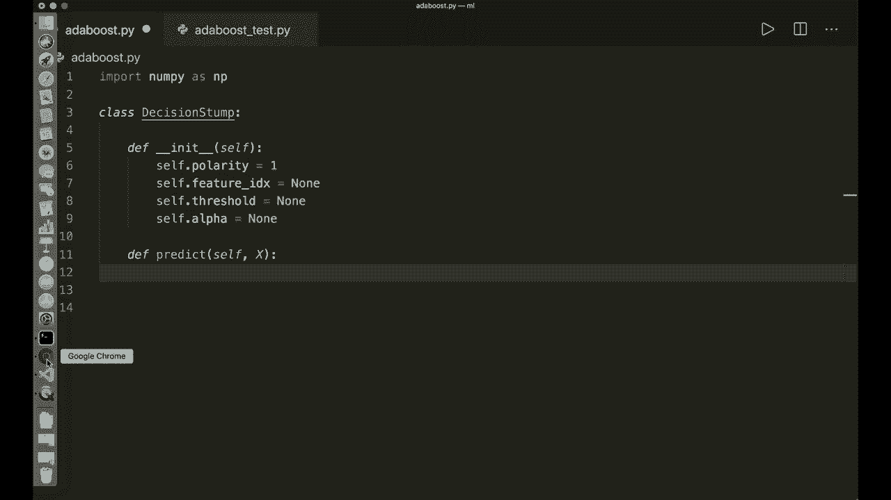
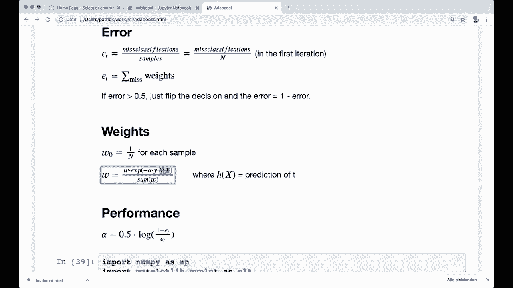

# 用 Python 和 Numpy 实现最热门的 12 个机器学习算法，P14：L14- AdaBoost 

嘿，大家好，欢迎来到另一个机器学习的 Sc 教程。今天，我们将仅使用 Numpy 和内置的 Python 模块实现 AdaBoost 算法。😊 AdaBoost 使用提升方法，这个简单的想法是将多个弱分类器组合成一个强分类器。这个方法在实践中效果非常好。所以在我们跳到代码之前，让我们先从理论开始。

让我们看看这个二维示例，以理解这个概念。这里我们的样本只有两个不同的特征，分别在 X 轴和 Y 轴上。现在，第一个分类器根据 Y 轴进行划分。在这个例子中，它在某个阈值处绘制了一条水平决策线。我们在这里看到的虚线就是。😊

我们可以看到一些预测是正确的，但也有误分类。现在，利用这些误分类，我们可以计算性能指标。也就是这个分类器的准确度。通过这个指标，我们计算并更新所有训练样本的权重。然后第二个分类器就会出现。

它利用这些权重，寻找一个不同的、可能更好的决策边界。在这个示例中，第二个分类器选择了 X 轴上的一个特征并绘制了一条垂直线。然后再次计算性能并更新权重。接着我们重复这个步骤，直到达到我们想要的分类器数量。😊 然后在最后。

我们有所有不同的决策线，以及所有不同的分类器性能。然后我们将所有分类器结合起来，可以用计算得出的性能进行加权求和。这使我们能够绘制出我们在这里看到的完美决策线，这可能比简单的线性决策线更复杂。😊

这里的想法是，分类器越好，对最终结果的影响就越大。这基本上就是这个概念。现在让我们详细看看所有不同的步骤以及背后的数学。

所以我们需要的第一件事是一个弱分类器，这也被称为弱学习器。弱学习器总是一个非常简单的分类器。在 AdaBoost 的情况下，我们使用一个所谓的决策树桩。决策树桩基本上是一个只有一个划分的决策树。所以我们在这里看到的内容是，我们只关注样本的一个特征和一个阈值。

然后根据我们的特征值是否大于或小于阈值，我们可以说它是类别 -1 或类别 +1。😊 所以这就是决策树桩。然后我们需要计算误差的公式。所以第一次，在我们迭代的第一次，误差是通过误分类的数量除以样本总数来计算的。

这是处理误差的自然方法。如果我们再次查看我们的例子，我们可以看到在这种情况下我们有10个样本。在第一个分类器中，我们有三次误分类。这意味着我们的误差率是0.3或30%。这是第一次。但下次我们也想考虑权重。

如果一个样本被误分类，我们将在下一次迭代中给予它更高的权重。这意味着我们的公式将计算为所有误分类权重的总和。如果我们的误差大于0.5，我们就简单地翻转误差。我们翻转所有决策，也翻转我们的误差。

所以这就是1减去误差。这就是误差。现在我们需要权重。每个样本的权重最初设置为1/n。这也与第一步的误差计算相匹配。如果我们说计算误差为所有误分类权重的总和。

我们还说每个权重一开始是1/n。因此它等于误分类数量除以样本数量。是的，这就是为什么初始权重是每个样本1/n。然后我们还需要这里定义的更新规则。

我们有旧权重乘以负阿尔法乘以实际y乘以h(x)，其中h(x)是我们的预测。阿尔法是分类器的准确性。如果这是-1，我们有一个误分类。如果这是+1，那么我们有一个正确分类。这个公式确保了被误分类的样本对下一个分类器有更大的影响。

是的，这就是你应该记住的权重。现在是性能。因此，我们需要为每个分类器计算性能或阿尔法，我们可以做到这一点。这是最终预测所需的，性能的公式计算如下。所以是0.5乘以1减去误差的对数除以误差。

所以让我把这个放大一点。这就是性能。我们的误差始终在0和1之间。所以我在这个范围内绘制了不同误差下的阿尔法。我们可以看到它在一个正值和一个负值之间均匀分布。误差低时，我们有一个高的正值，而当误差接近1时，情况则相反。

我们有一个很高的负值。因此，由于我们正在翻转决策，这将再次产生对负面贡献较高的正确分类。所以这里的类别是-1。这就是阿尔法的概念。现在我们需要预测。如果我们理解了这一切，那么最终的预测就很容易理解。我们只需选择这里的符号。

所有预测总和的符号，我们用分类器的性能来加权每个预测。因此，这里是`alpha`乘以预测。我们的分类器越好，对最终预测的影响就越大。分类器越好，它的指向就越倾向于负侧或正侧。

然后我们将更好的侧作为我们类别的预测。因此，是的。这就是预测的概念。对于不同的公式和侧翻可能会有点困惑，但基本概念并不难。现在让我们总结一下在代码中必须执行的不同训练步骤。因此，首先，我们初始化每个样本的权重，并将值设置为1/N。

然后我们选择想要的弱学习者数量。接着我们进行迭代。然后我们训练每个决策树桩。因此，我们进行贪婪搜索，以找到最佳的分裂特征和最佳的分裂阈值。然后我们计算这个决策树桩的错误。因此，这是用公式表示的，错误是分类错误权重的总和。然后如果错误大于0.5，我们还要翻转错误和决策。

然后我们用公式计算`alpha`。接着我们需要预测。然后利用预测和`alpha`，我们可以计算。我们可以更新权重。因此，这就是我们现在必须在代码中做的事情。是的。我向你保证，从现在开始我们有了所有的公式和所有的训练步骤。

实现是相当直接的，应该不难。所以让我们跳到代码。

所以我们做的第一件事是导入`Ny`。所以导入`Ny S`和`P`。这是我们将需要的唯一模块。然后我们为决策树桩创建一个类。所以`class decision stampump`。然后进行初始化。所以定义一个初始化，这里只需要`self`。

在这里，我们想要存储几个东西。首先，我们要存储所谓的极性。所以`self.dot polarity`等于1。这告诉我们样本应该被分类为-1还是+1，取决于给定的阈值。所以如果我们想查看左侧或右侧。这是必要的，因为如果我们想翻转错误，那么我们也必须翻转极性。

这会在一秒钟内变得更清晰。现在我们要在这里存储的第二件事是特征索引。所以`self.dot feature index`在开始时等于None。我们还想存储阈值。因此，分裂阈值`self.dot threshold`在开始时等于None。我们还想存储性能变量。所以`alpha`。

所以我们说self.dot alpha等于none。这是我们想要存储的内容。然后我们还定义一个预测方法用于决策树桩。所以我们说定义预测，它接受self和x。所以它应该预测的样本。现在我们想在这里做的事情是，只查看这个样本的一个特征，然后将其与阈值进行比较，看看如果它小于阈值，则为-1，否则为+1。

所以这就是决策树桩的整个概念。所以让我们这样做。我们可以说样本的数量等于X的形状0。然后我们只获取这个特征。所以我们可以说x column等于x。

然后我们可以使用冒号。所以我们仍然希望所有的样本，但只有这个特征索引，我们稍后在训练期间计算。所以self.dot feature index。现在我们做出预测。所以我们说predictions等于。默认情况下，我们说这是1。所以我们可以说nuy ones的大小等于样本数量。然后我们必须检查极性。

所以我们说如果self.dot polarity等于1。这是默认情况。那么我们说所有预测中，特征向量小于阈值的就是-1。所以，我们可以说，预测。在这些索引处，x column小于self.dot threshold。那么这些预测就是-1。

在另一种情况下，else。所以如果我们的极性是-1。那么我们想要完全反过来做。所以让我复制这个。但我们想说如果x值大于我们的阈值。那么这些就是-1的预测。所以，是的，这就是我们的决策树桩所做的所有事情。

然后我们可以返回预测结果。所以这是决策树桩的类。现在我们需要一个实际的加法增强算法的类。我们可以说class add boost。我们把这个名字的小写处理。现在我们需要一个初始化函数。所以定义一个初始化函数。它接受self，而唯一的参数是我们想要的分类器数量。

所以我们可以说N C，L F默认为5。然后在初始化时，我们存储这个数字。所以我们说self.dot N C，L F等于分类器的数量。然后像往常一样，我们想要实现fit和predict方法。我们先从fit方法开始。我们可以说定义fit，它接受self、X和y。所以训练样本和标签。

现在，我们首先要做的是获取这个向量的形状。所以样本的数量以及特征的数量。特征等于x的形状。然后我们要初始化我们的权重。因此，初始化权重。正如我所说，每个样本的权重在开始时都设置为1/n。所以我们可以说w等于nuy。

然后我们可以使用一个来自numpy的方法，叫做full。所以numpy full。它获取样本的大小数字。然后它获取一个初始值。在这里我们说是1。除以样本数。这将每个值设置为这个计算值。然后，这是我们的初始化。现在让我们遍历所有分类器并进行训练。

首先，我们创建一个列表来存储所有分类器。假设self.dot.C.LF's。😊，这是一个空列表。一开始。现在让我们进行迭代。假设4_在范围内。在这里我们有指定的分类器数量。所以self.dot.N.C.L.F。现在我们想要做的是贪婪搜索。

我们想遍历所有特征和所有阈值。这与我在另一个教程中实现的决策树类似。我建议你也查看一下。所以我们想在这里做类似的事情。首先，我们创建我们的分类器。假设C.LF等于decision stump。

现在让我们一开始定义一个最小误差。我们想找到最佳特征值、分割特征和分割阈值，使得这个误差最小。所以一开始，我们只是说这是float。在这里，这是一个非常高的数字。现在让我们遍历所有特征。假设对于特征。对于特征。

我在范围内。在这里我们有一开始获取的特征数量。然后我们只想获取这个特征。假设X列。这与我们在这里所做的相似。所以我们可以做同样的事情，设定x列等于这个。所以所有样本，但仅仅是这个特征索引。在这种情况下我称之为特征i。

然后我们获取唯一值。它们就是我们的阈值。假设阈值等于Nai.dot.unique。在这里，我们的列的唯一值。所以x列。现在我们遍历所有阈值。假设对于阈值在阈值中。现在我们想做的是先用极性1进行预测，然后用我在开始时展示的公式计算误差。

假设我们的极性等于1。然后让我们进行预测。所以预测等于。这与我们在这里所做的相似。所以一开始，它只是1。然后我们使用这个公式。因此，由于我们的极性是1，我们必须通过比较它是否小于阈值来进行比较。

所以预测结果是我们的列值，我们的特征值小于阈值时，预测结果为-1。现在我们预测了所有样本，接下来我们想计算误差，正如我所说，误差是错误分类样本权重的总和。让我们获取错误分类的权重。假设错误分类等于W，且w是我们的y，训练标签不等于我们刚才的预测。

这些是被错误分类的权重。现在我们想要简单地计算这些权重的总和。所以 arrow.Eror 等于这些被错误分类权重的总和。这是误差。现在如果误差大于 0.5，我们也要翻转我们的误差。所以我们说如果误差大于 0.5，我们简单地说我们的新误差等于 1 减去误差，然后我们也翻转极性。

所以我们说 P 等于 -1。现在我们有了误差，接下来检查我们的误差是否小于最小误差。如果误差小于最小误差，那么这是我们的新最小误差。所以我们说最小误差等于误差。这是我们当前的最佳拟合。因此，我们要保存这个结果。我们说 CF.dot.polarity 等于 P，对不起，只有 P。

我们还想保存阈值和特征。因此，CF.dot.threshold 等于当前阈值，CF.dot.feature index 等于特征 I。是的，这就是分类器的整个训练循环。当我们完成后四个循环时，我们要检查我是否在正确的缩进上。

现在我们需要计算性能。计算 alpha。因此我们说 CF.dot.alpha 等于。然后我们需要这个公式。

所以 0.5 乘以 1 减去误差，再除以误差。

我们还使用一个小的 epsilon，以避免除以 0。所以我们假设 Es 等于这个小值。嗯。这是我们的 epsilon。现在让我们使用这个公式。所以 0.5 乘以 nuy.dot.log。这里有 1 减去误差。然后在这里除以，假设误差加上我们的 epsilon。并将其包裹在另一个括号中。所以这个。

让我检查一下这是否正确。因此让我们在这个周围再做一个检查。这应该没问题。所以这是我们的 alpha。现在我们想更新权重。为此，我们还需要预测值。因此让我们再次检查公式。所以这是旧权重乘以刚刚计算的 alpha 的指数函数，乘以实际预测值或实际标签乘以预测值。

然后我们进行归一化。这是我们需要的公式。让我们在这里写下这个公式。首先获取预测值。所以我们可以说 predictions 等于。我们已经实现了这一点，所以我们可以简单地说 CF.dot.prediction。

X。X，没错。所以我们在这里获取列。因此我们可以把整个 x 放在这里。现在我们有了预测，现在我们可以使用它们并更新权重。因此我们说我们的权重乘以等于。然后我们说 nuy X。即指数函数。然后减去 CF.dot.alpha。乘以，和这里的实际标签。再乘以预测值。

次数，预测。所以，我们想要进行归一化。我们将其除以这个权重的总和。所以我们说w除以等于。然后这里我们说nuy的sum W。现在我们完成了。我们更新了权重，然后我们想要存储这个分类器。我们想要保存它。所以我们说self的C，L。

F点追加当前分类器。所以我们追加C，L F。现在我们完成了fit方法。这是我们add boost分类器的整个训练过程。现在，我们当然也需要predict方法。让我们在这里实现它。假设定义predict，这里得到self，也得到X。这是我之前给你展示的公式。

我们查看总和的s。在这里我们将每个alpha与预测相乘。是的。那么我们来做这个。

假设C，L F的Prats等于。在这里我们使用列表推导式。然后我们对每个分类器进行此操作。我们说C，L F的alpha乘以。在这里我们使用预测C，L F的predict。我们想要对X进行预测。我们要对每个初始分类器这样做。所以我们说对于C，L F在self的C，L Fs中。

这些都是预测的总和。现在我们需要计算总和。我们说y pre等于nuy的sum。这里我们说C，L F pres，并沿着axis 0。现在我们得到了总和。最后我们需要查看s。所以我们说y pret等于nuy的sign of this，Y pret。这是我们的最终预测。

然后我们可以返回这个。我们说返回y pret。现在我们应该完成了。现在我们有了fit方法和predict方法。这里我已经写了一个小的测试脚本。所以我从addda boost中导入我们刚刚创建的类。

然后我这里还有一个准确率测量。在这个例子中，我们从SQ learnide assets加载乳腺癌数据集。重要的是我们必须将目前所有标签为0的设置为-1，因为add boost需要标签为-1和+1。然后我们像往常一样进行训练测试分割，然后在这里创建一个add boost分类器。

在这种情况下，我放入了五个分类器。然后我们调用fit方法。接着我们调用predict方法，然后计算准确率。所以这是测试脚本。让我们运行这个，希望一切正常。假设我们用Python来进行boost测试，调用它并按下回车，它正在运行，并在计算。我希望它能正常工作。

现在我们完成了。所以，是的，这里我们有一个准确率，而且在这个例子中表现相当不错。所以我们有094。我们看到它在工作。希望你喜欢这个教程，下次见，拜！
