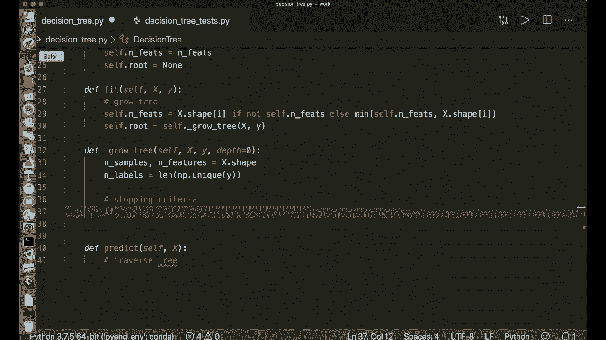

# 用 Python 和 Numpy 实现最热门的12个机器学习算法，P10：L10- 决策树第 2 部分 

嗨，大家好。欢迎来到决策树教程的第二部分。如果你还没有观看第一部分，请务必观看，因为在那里我会解释理论。所以在这里我们继续实现，我们可以立即开始。所以我们说导入numpy S和P。然后，在实现决策树类之前，我们首先。

创建我们的熵方法来计算熵。我们将其实现为全局函数。所以我们说定义熵。它将获取一个包含所有类别标签的向量y。

让我们看看这个公式。所以我们必须计算出现次数，我们可以。

用一个函数来完成这项工作。我们称之为hist或直方图。我们可以使用nuy bin count。对y进行计数。所以这将计算所有类别标签的出现次数。然后我们将它们除以总样本数。所以我们说P等于hist除以y的长度。

然后我们应用实际的公式。所以我们说减去p的x乘以log的p的x的总和。所以我们可以在一行中完成这个并说返回减去nu pi的总和。在这里我们使用列表推导。所以我们可以说P乘以nupy log2的P，适用于P中的所有P，并且我们还必须使用一个条件，如果P大于0，因为对负数不定义对数。

所以这是熵。现在我们还实现一个辅助类，称之为note。在这里我们将存储我们的note的信息。所以这将获取一个初始化。它将获取自我。然后我们来看看这个，。

如果我们处于中间状态，那么我们想存储最佳分裂特征和最佳分裂阈值。我们还想存储左右子树，因为我们稍后需要它们。如果我们现在处于叶节点，我们还想在这里存储实际值。所以最常见的类别标签。

所以，我们说特征等于无。阈值等于无，左等于无，右等于无。然后我们用一个小技巧。所以我们使用一个星号和一个逗号。然后我们说值等于无。所以现在如果我们想使用这个值参数，我们必须将其作为关键字参数使用。所以稍后当我们创建叶节点时。

这只获取值，然后我们还需要写值等于某个东西。所以这样更清楚这是一个叶节点。在这里我们简单地存储它们。所以我们说自我特征等于特征，自我阈值等于阈值。自我左等于左。自我右等于右。自我值等于值。现在我们还创建一个小辅助函数来确定我们是否处于叶节点。

定义判断是否为叶节点。它获取自点。在这里我们简单地说，如果，如果我们有一个值，那么我们处于叶节点，否则不在！

所以我们返回自点，该值不为None。如果我们有一个值，那么我们返回true。这是我们为注释准备的辅助类。现在我们可以开始实际的decision3类。因此这也获取一个init。它获取自点。然后它会获取一些停止标准。因此我们称之为最小样本分割。默认情况下，假设这是2。

所以进一步分割我们树所需的最小样本数，然后是最大深度。默认情况下，这是100。然后它还获取一个参数，我们称之为特征数量或nFes。这是None。所以我们不需要这个，但我们可以指定它。正如我所说，我们对所有特征进行贪婪搜索，但我们也可以仅循环遍历特征子集。

然后我们随机选择这个子集。这是随机因素之一。这也是为什么它被称为随机森林的原因之一。如果我们将决策树扩展为随机森林。那么这就是一个随机因素。现在我们简单地存储它们。因此我们说自点最小样本分割等于最小样本。抱歉。

min样本分割自点最大步长等于最大。深度。自点n特征等于和特征。我们还创建一个根节点。最开始时，这个值为None。因此我们后来需要知道我们的根节点，以便知道从哪里开始遍历我们的树。现在我们实现fit方法。该方法获取训练数据和训练标签。

在这里我们希望生长我们的树。然后它获取预测方法。带有测试标签。因此在这里我们想遍历我们的树。让我们开始生长我们的树。我们说自点根节点等于。现在我们调用并创建一个辅助函数自点grow3。它获取X和y。我们还应用一个安全检查。因此我们说自点和特征拟合等于。

X.dot.shape。of。1，所以这是nuy和DRA。第二个维度是特征数量。如果不是自点和喂养。如果没有指定，如果为None。那么我们简单地取最大特征数量。否则，我们取自点和特征与X.dot.shape 1的最小值。这只是确保它永远不会大于实际特征数量。

现在我们实现。生长树。方法，该方法获取自点，然后获取X和y。同时还有一个深度。最开始时为0。因此我们需要跟踪深度。现在让我们开始吧。首先，获取样本数量和特征数量。这是x.dot.shape。然后我们还想获取不同标签的数量。

这是 nuy 的长度。y 的唯一值。所以所有不同的标签。现在，首先我们在这里做的是，首先应用我们的停止标准 Tia。所以我们说如果。现在再看看我们所说的内容。我们想检查最大深度。

然后是所需的最小样本数，如果我们没有更多的类别分布，我们说如果。

我们说深度大于或等于自身的最大深度。或者，如果不同标签的数量等于一。所以如果我们在这个节点只有一个类别，或者样本数量小于所需的最小样本数。那么，如果这一切都成立，那么我们就在叶子节点。因此我们说让叶子值等于自身的最常见标签。

现在我们创建并返回我们的叶子节点。因此我们说返回节点。然后我们必须说值等于叶子值。现在可以清楚为什么我只用问风险。在这里我必须使用值作为关键字。现在很清楚这是一个叶子节点。我们还需要一个帮助函数来获取最常见的标签。

让我们把这个写下来。所以定义最常见标签，它获取自身。然后获取一个类别标签的向量。为此，我们使用一个 Python 模块，计数器模块。所以我们说从 collections 导入计数器。我在之前的视频中已经谈到过这个。

如果你对计数器模块不熟悉，请查看一下。因此在这里我们可以创建一个计数器对象。计数等于 y 的计数器。这将。嗯。计算所有 y 的出现次数，类似于 nu pin 计数。然后我们有一个最常见的函数。因此我们说最常见等于计数器的最常见值。

所以我们只需要最常见的标签。这将返回一个列表。因此我们想要列表的第一个元素。这是最常见的元组。在元组中，存储了值和出现次数。所以我们只需要值。因此我们再次说索引 0。所以请自己再确认一下。

然后我们返回这个。这将确定最常见的标签。所以现在我们有了层级。如果我们没有满足停止标准，那么我们继续。所以首先，我们选择特征索引。因此特征索引等于 nuy 随机选择。这将获取特征的数量。因此它会在 0 和特征数量之间选择随机数。

数组的大小应该是我们指定的自身的和 fes。我们还说替换等于假，因为我们不想多次出现相同的索引。现在，我们进行贪心搜索。所以，我们说最佳阈值。还有最佳，让我们反过来做。

最佳特征和最佳阈值等于 self.dot。最佳标准。这将获取 X 和 y 以及所有特征索引。所以这是另一个辅助方法。现在让我们在这里定义它。定义 self.best。标准。它获取 self 和 X 以及 y 和特征。索引。所以，在这里。我们进行贪婪搜索。

所以我们说最佳增益等于 -1。我们想要遍历所有特征和所有特征值，并计算信息增益。所以。现在，假设拆分索引和。🎼拆分阈值等于无。所以它们都是无的。然后我们有我们的第一个循环。对于特征。索引在。特征索引中。现在我们只想选择。这个 x 的列向量。所以我们说 x。X 列等于。X 的。

我们想要所有样本。 但仅在这个索引上。然后我们想要遍历所有可能的阈值，所以我们说。阈值等于 Ny，唯一。的。嗯。X 列。所以我们不想检查相同的值两次。就像在这个例子中。我们会检查 30，15，5，10。

20 和 25。现在我们遍历所有可能的阈值。所以我们说对于 th。旧在阈值中。现在我们计算信息增益，我们说增益等于 self.dot。信息增益。它获取 y 和列向量，以及当前阈值。然后我们说如果增益大于我们最佳增益，那么我们的新最佳增益就是当前增益。

我们的最佳拆分索引是当前特征索引。我们的最佳拆分阈值是当前阈值。最后，我们想要返回它们。所以我们先返回拆分。索引，然后是拆分阈值。所以这是贪婪搜索。现在我们需要另一个辅助函数来计算信息增益。

所以假设用单元格定义信息增益。然后它获取 y 和一个 X 列及阈值。所以我们称之为拆分阈值。现在。让我们再看看公式。所以。抱歉。我们想要计算父节点的熵，然后是子节点的加权平均。

所以。我们计算父节点熵。然后，我们生成。一个拆分。然后我们计算子节点熵的加权平均。然后我们返回信息增益。所以父节点熵，我们可以简单地说父节点。熵等于熵，因为我们已经有这个函数。所以父节点熵即 y 的熵。

然后我们生成我们的拆分。所以我们说左索引和右。索引等于 self.dot.split。我们根据这个 X 列和一个拆分阈值进行拆分。所以。我们需要另一个辅助函数，所以。希望你能继续跟上我。我尽量解释得尽可能清楚。但代码比通常的要复杂一些。不过是的，让我们继续。所以假设。

定义 split self。然后它获取 x 列和我们的分裂阈值。在这里我们可以说左索引。所以在这里我们应用我们的条件，我们可以使用一个叫做 nuy arc 的函数，在这里我们问 x 列的值是否小于或等于我们的分裂阈值。

所以这将返回一个数组，其中所有条件对我们 x 列中的所有值都为真，我们想要拉丁这个数组，因为我们只想要一个一维向量，请自己检查一下。我们对右索引做同样的操作，所以我们说 nuy。Arc，哪里。

在这里我们检查 X 列是否大于我们的分裂阈值。然后我们扁平化它。然后我们返回左索引和右索引。现在我们有了分裂函数。现在。如果我们有。嗯。通过这个函数，我们在这里生成分裂。首先，我们检查左索引的长度。是否为 0 或右边的长度是否为 0。

然后我们可以立即返回 0 作为信息增益。否则，我们继续。所以我们计算加权平均数。我们需要样本的总出现次数。所以，这是 Y 的长度，然后左样本的数量和右样本的数量等于 Lng 左索引和 Lng 右索引。然后我们计算熵。所以我们说 E，L 和 E R 等于 y 的熵。

所有左索引的熵和所有右索引的熵。现在，我们的子熵等于加权平均数。所以我们说 N L 除以 N 乘以左熵加上。现在 N R 除以 n 乘以右熵。所以这是子熵。现在让我们计算信息增益。这只是父熵减去子熵。

现在我们返回它。所以返回信息增益。现在我们有了这个，现在这个函数完成了。现在我们可以继续生长。所以。现在，在我们选择了最佳标准之后。我们想用这个最佳特征和最佳阈值来分裂我们的树。

所以我们说左索引和右索引等于自身的 dot split。再说一次。这里我们可以使用我们的 split 函数。所以我们说 X。Off。现在我们必须小心。所以现在我们想要所有样本。嗯。但只有最好的。特征索引。所以，这是一列。我们在这里放入最佳阈值。现在，有了我们的左索引和右索引。

我们可以继续生长。所以我们去左边并说左边。等于。我们在这里递归地调用这个函数。所以我们说 self dot。Grow tree。在这里我们说 X。然后我们只想要左索引，但我们想要所有特征。所以 S Y。我们只想要左索引。然后我们也说深度加一。

所以现在我们的深度增加了一。现在我们对右侧做同样的事情。所以我们说 right 等于 scroll3 的右索引。现在我们在中间返回一个新的节点。所以这将获得最佳。功能。最佳阈值。左子节点和右子节点。但这里没有值。这是生长方法。现在唯一剩下的就是实现预测方法。

我保证这会很简单。所以我们只需要一个辅助函数。所以我们说返回。嗯。Numpy 数组。在这里我们再次使用列表推导。所以我们遍历我们的树。所以 self.dot.traverse3，在哪里我们为大写 X 中的所有样本放入一个样本。这是我们的预测方法。现在让我们实现。Traverse3 方法作为最后一件事。

所以这将获得 self 和一个样本。它还获取我们开始的节点。所以我们必须在开始时放入 self.dot.root，因为我们从顶部开始。在这里，我们也这样递归进行。首先，我们可以检查停止标准，所以我们检查是否已经到达叶节点，所以我们可以说如果节点是叶节点。这就是我们实现这个辅助函数的原因。

然后我们返回节点的值，因为如果我们在叶子上。我们也有一个值，否则我们应用我们的问题，所以我们去左边或右边。所以。我们说如果。这节点的 X。我们存储的功能索引。是否小于或等于我们在这个节点开始的阈值。那么我们返回。Self.dot.Traverse3。

所以我们去左侧，把 X 和节点左放入。所以这就是为什么我们在节点处开始左和右节点。否则，我们返回。Self.dot.traverses3 的 x 和 no.dot.right。所以，是的，这就是整个 Traverse 实现。现在我们终于完成了。这就是我们需要的整个决策树实现。

让我们检查一下。所以我写了一点小帮助脚本。一个测试脚本。在这里我实现这个决策树类，并使用数据集。来自 psychic learn 模块的乳腺癌数据集。我将把我们的数据拆分为训练标签和训练样本，以及测试标签和测试样本。

然后我将创建我们的决策树并拟合数据。然后预测测试数据并计算准确性。所以让我们检查。让我们运行脚本，检查一切是否正常运作。需要一点时间去。嗯。对不起。作为 traverse3 缺少一个位置参数节点。嗯。Self do traverse 3 X。哦。

self do root 必须在这里，而不是这里。所以让我们清除这个，再试一次。祝我们好运。注意对象，测试没有属性功能索引。所以这是，我们怎么称呼它？

只是功能，对不起。如果注意到。功能。阈值。阈值，阈值你。所以，再一次。我希望我没有更多的错字。所以是的，现在我们有了准确性，一切都在正常运作。而且是的。我希望你喜欢这个教程。如果你喜欢，请订阅频道。在下一个教程中，我们将继续将这个决策树扩展到随机森林模型。

所以，好的，待会见，再见。😊。
