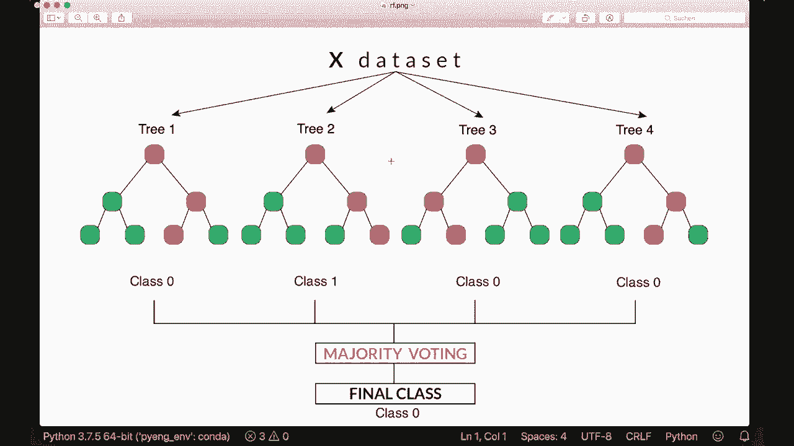

# 用 Python 和 Numpy 实现最热门的12个机器学习算法，彻底搞清楚它们的工作原理！＜实战教程系列＞ - P11：L11- 随机森林 

大家好，欢迎来到你的新机器学习Sct教程。今天我们将使用仅内置的Python模块和Ny来实现随机森林。随机森林算法是最强大且最受欢迎的算法之一。所以我很兴奋我们终于能在这个教程中实现它，在上一个教程中。

我解释了单棵决策树是如何工作的。如果你还没有观看之前的教程，那么请去观看，因为我们的随机森林模型以及实现是基于上次的决策树模型。😊如果你理解了决策树，那么随机森林的方式就非常容易理解。如果我们看看这里的图像，它展示了整个想法。

所以这个想法是将多棵树组合成一片森林。因此我们训练多棵树，每棵树获取训练数据的随机子集，因此称为随机。最后，我们用每棵树进行预测。然后我们进行成熟投票以获得最终预测。这就是整个思路。

随机森林相比单棵树有一些优势，例如。通过构建更多的树，我们有更多机会获得正确的预测，同时我们也减少了单棵树过拟合的可能性，因此随机森林的准确性通常高于单棵树，这就是它如此强大的原因。

所以，是的，现在我们可以直接跳到实现部分。当然，我们导入。

Nampy、S和P。然后我们还从上次导入决策树类。因此我们说从决策树中导入决策树。现在我们可以开始了。我们创建我们的类decision3。抱歉，现在我们有了随机森林。所以现在我们创建我们的随机森林类。这将进行初始化。

这将获取我们想要在森林中拥有的树的数量。因此，默认情况下树的数量等于100。然后它还获取我们决策树初始化器的所有参数。所以它获取分裂所需的最小样本数，获取最大深度。

它获取一些更多随机性的可选特征数量。所以我们就复制粘贴在这里。然后我们存储所有这些。因此我们说self.dot number of trees等于树，self.dot min sample split等于min sample split，self.dot max depth等于max depth，self.dot N fats等于，和feats。然后我们实现我们的预测和拟合方法。

预测方法有测试数据。我们从拟合方法开始。所以我们说拟合自己，这将包含训练数据和训练标签。还有一件事，我们想要有一个空的树数组，用于存储我们现在要创建的每一棵树。因此，我们说 self.dot trees 等于一个空列表。然后在拟合方法中。

我们想确保列表再次为空。现在，我们开始训练我们的树。因此我们说 for underscore，因为我们在范围 self.dot number of trees 中不需要这个。然后我们创建我们的树。因此我们说 3 等于决策树。这将获取所有参数。因此它获取最小样本拆分等于 self.dot min sample split。

然后它将具有最大深度等于 self dot，最大深度，特征数量等于 self dot。特征数量。现在，我们想要做的是给我们的树一个随机子集。因此我们在这里定义一个全局函数。我们称之为。这也称为引导。因此我们称之为 Boott 样本，它将获取 X 和 y。

现在我们先看看我们有多少不同数量的样本。因此 n 样本等于 x.dot shape。和往常一样，这是一个 Ny 和 D，其中第一维是样本数量，第二维是特征数量。现在我们进行随机选择。因此我们说索引等于 numpy random choice。在这里我们输入样本数量作为整数。

这意味着它将在 0 和样本数量之间随机选择。因此我们的索引在这个范围内，大小也将是样本数量。但我们还说替换等于真。这意味着一些索引可以多次出现，而其他的会被丢弃。因此我们随机丢弃一些样本，仅使用一个子集。然后。

我们返回。这些 x。哦。这些索引。同时，也返回这些索引的 y。因此现在我们只有这些选择的样本。🎼现在我们可以用这些来训练我们的树。因此首先，我们说 x 样本和 y 样本等于 bootstrap 样本与 X 和 y。然后我们说树 dot fit，X 样本和 y 样本。然后我们简单地将其添加到我们的树列表中。因此我们说 self dot。

T st a pent。3。现在我们完成了训练阶段。现在，当我们进行预测时。我们对每棵树进行预测。因此我们说树预测或树预测等于。在这里我将使用列表推导，然后将其转换为一个 numpy 数组。因此在这里我说树 dot predict，X 43 在 self.dot trees 中。

因此对于每棵树，我们现在制作我们所称的树预测方法。现在我们想进行成熟投票。但现在我们必须小心，因为我们得到的是。假设，例如，我们有三棵树和四个样本。然后假设我们的第一棵树为了简单起见仅进行一次预测。因此对于每个样本。

它这里会有一个一。第二棵树只会生成零。所以我们有零。然后第三棵树也只预测一个。所以，然后再一次，这将是。一个数组。这将是一个数组，而这个数组将是这个数组中的一个数组。但。现在我们想进行成熟度投票。那么现在我们。

实际上，我们想要一个看起来像这样的数组，所以我们想要有 10，1，10，1，101 和 101。所以。这个。从所有树中。我们想要有对应的预测。所以我们将其转换为这个结构。并且 Nmpy 中有一个非常好的函数正好做到这一点。所以我们说 tree pres 等于 Nmpy swap。作为。嗯。用这三个预测。

然后我们交换 axis0 和 axis 1。所以这正是我们所做的。现在我们可以进行成熟度投票。所以我们说预测等于。现在我们为这三次预测中的每一个预测预测最常见的标签，所以。现在，如果我们有或。1，0，1，1，0，1，1，0，1。那么现在我们逐一查看它们。然后进行成熟度投票，再对它们进行投票。

所以我们再次使用列表推导。我们说，树预测中每个树预测的最常见标签。然后我们将其转换为 nuy。数组并返回它。现在我们唯一需要的是最常见标签函数。我们在决策树类中也需要这个。因此这里我们有最常见标签函数。

作为一个类函数。所以在这里，正如你所看到的，我们需要这个很多次。因此，把它作为一个全局函数可能更好。所以我们把它放在这里，你甚至可以把它放在另一个文件中，并从一个帮助类或其他地方调用它。但我们只是把它放在这里，所以。如果你不知道这个是如何工作的，我就不再解释了。

那么请观看最后一个教程，这样我们就不需要 self 了。我们还需要从 collections 中导入。导入 counter 模块。现在我们可以进行成熟度投票，现在我们完成了。所以我这里有一个小测试脚本来测试我们的类。我将从 Ecal learn 模块导入乳腺癌数据集。然后我会生成一些训练和测试标签，然后创建我们的随机森林实例。在这里，我只使用三棵树，因为训练可能需要一些时间。我们并没有优化我们的代码，所以。在我们的视频中，我现在只使用三棵。

然后我将拟合数据，并预测测试数据，然后计算准确性。让我们运行这个，希望一切正常。然后。我们犯了一个错误，所以我们说 self。哦。我们想把它添加到我们的树中，当然。现在再试一次。希望一切顺利。现在我们得到了准确性。所以现在我们看到我们的模型正在工作。是的。

我希望你能理解一切。如果你喜欢，请订阅频道，下次见，拜拜。
