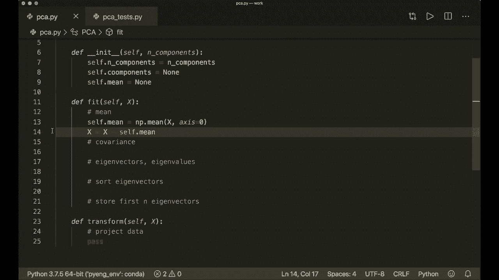
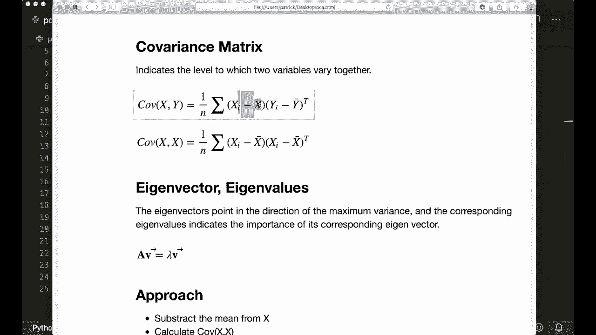

# 用 Python 和 Numpy 实现最热门的12个机器学习算法，彻底搞清楚它们的工作原理！＜实战教程系列＞ - P12：L12- 主成分分析 

嗨，大家好。欢迎来到我们的新机器学习教程。今天，我们将仅使用Python和Numpy实现主成分分析（PCA）。PCA是一个很好的工具，用于获取线性独立的特征，并减少我们数据集的维度。目标是找到一组新的维度，使所有维度彼此正交，从而线性独立，并根据数据沿着它们的方差进行排序。

这意味着我们想要找到一个变换，使得变换后的特征线性独立。然后可以通过仅保留最重要的维度来减少维度。这些新获得的维度应该最小化投影误差，投影点应该具有最大的扩展，或意味着最大的方差。

所以让我们看看一个图像，以更好地理解这一点。假设我们的二维数据分布是这样的，现在我们想将其投影到一维。我们想要找到彼此正交的轴。当我们将数据投影到这些轴上时，我们的新投影数据应该具有最大的扩展。所以在左侧，这些是正确的主轴。如果我们将它们投影到一维。

在最大的主成分上。如果我们将数据投影到这个轴上，那么它们具有最大的扩展。例如，如果我们看右侧。这些轴是错误的。那么，让我们看看投影数据的样子。所以在右侧，我们做得更糟，将其投影到Y轴上。

所以这些显然是错误的，因为我们可以看到很多数据集中在同一个点上。所以我们没有更多关于它们的信息。但在左侧，投影数据的扩展最大。所以我们可以包含大部分关于数据的信息。同时，投影误差意味着这会是。从这里到轴的线。

这是最小的，而右侧则相对较长。所以这里我们需要为每个点做一条很长很长的投影线。所以左侧是正确的答案。现在我们如何找到这些主成分呢？所以，正如我所说，我们想要最大化方差，因此我们需要一些数学。

所以我们需要样本X的方差，这个方差是通过样本数量的倒数来计算的。然后我们对每个分量求和，减去x bar，x bar是均值。所以我们从数据集中减去均值。现在我们还需要一个协方差矩阵。这表示两个变量共同变化的程度，而两个变量的协方差矩阵定义为，这样1/n，然后再次求和，这里减去均值，这里也减去均值，然后转置，在我们的案例中，我们想要两个x的协方差矩阵。

所以这也被称为自协方差矩阵。因此。我们必须计算这个，然后我们的问题被简化为特征向量或特征值问题。所以我不会在这里详细讨论特征向量，但如果你想了解更多，我会在描述中放一些链接。嗯。

但我们需要做的是找到这个协方差矩阵的特征向量和特征值，特征向量指向最大方差的方向，相应的特征值表示其对应特征向量的重要性。

所以现在如果我们再看一下左侧的这个图像。这两个我在这里画的向量，它们对应于我们数据集的协方差矩阵的特征向量。这就是我们需要做的。这里我写下了这个过程。首先我们从我们的 x 或数据集中减去均值。

然后我们计算协方差矩阵。接着我们必须计算特征向量和特征值。然后我们按特征值的降序对特征向量进行排序。然后我们可以指定想要保留的维度数量。接着我们只选择前 K 个特征向量。这将是新的 K 维度。

然后我们通过投影将原始数据转换到这些新维度中。这只是一个点积。我们的数据与新的特征向量进行点积。然后我们就完成了。这就是我们需要做的一切，再见。有一个很好的地方在于主成分分析和特征向量，它们彼此正交。

这意味着我们的新数据也是线性独立的。因此，这是 PCA 的一个小好处。

现在我们可以开始了。所以让我们导入 Ny S 和 P。然后我们创建一个类 PCA。这将初始化 self。接着我们指定要保留的组件数量。然后我们在这里存储它们，所以我们说 self.dot n components。等于 n。Components。我们想要找出特征向量。所以在这里我们称它们为组件。

这一开始都是 None。我们还想稍后存储均值。所以我们说 self 的均值等于 None。然后我们像往常一样定义我们的 fit 方法。这将获取我们想要转换的数据。然后我们不使用 predict 方法。所以现在我们调用 transform。这将会在我们拟合后转换我们的数据。

这只是投影。但现在让我们开始使用 fit 方法，所以。我们再说一次。让我们写下我们的过程。我们想要有均值。然后计算协方差矩阵。接着我们想计算特征向量和特征值。嗯，特征值。然后我们对特征向量进行排序。所以排序。特征向量。然后，我们只存储前面和特征向量。这就是我们需要做的。

这里我们必须对数据进行投影。所以，嗯，来吧，让我们这样做。我们可以说self dot mean等于，然后我们只需使用Numpy的均值函数，沿着第一个轴。然后我们减去均值。所以我们说x等于x减去self dot mean。所以。

我们必须这样做，因为如果我们再次查看我们的公式与协方差矩阵，均值总是被减去。

所以让我们在这里这样做。然后我们计算协方差矩阵。这被称为cof。然后我们简单地使用Numpy的Cof函数。如果我们在这里只放入一个输入，它将完全这样做。但现在我们必须小心。因为让我们，嗯，看看我们的数据。这将是一个Numpy和D数组，其中一行。

行是一个样本。每一列是一个特征。但如果我们查看文档，对于这个函数，情况是相反的。所以一列是一个观察值或一个样本。因此我们必须在这里转置。请自行仔细检查。然后我们继续。现在我们计算特征值。

向量，我，我不知道。这是反过来的。抱歉，特征值和特征向量。为此，我们也可以在Numpy中使用一个函数。所以合并Numpy线性。点积。像这样。😊。然后我们放入我们的协方差矩阵。这里我们也要小心。如果查看文档，它说特征向量以列向量形式返回。

一列。所有的。这里的一列是一个特征向量。为了便于计算，我们想反过来做。所以我们说特征向量等于特征向量转置。然后，我们对它们进行排序。所以为此，我们说在排序的索引中，是特征值的排序。我们想按降序排列，所以我们可以使用切片，从开始到结束。

我们先进行步骤1。所以这是一个反转列表的小技巧。现在我们有了按降序排列的特征值的索引。现在我们说我们的特征值等于特征值。使用这种顺序，特征向量也等于特征向量。根据这些索引。

现在我们存储前N个特征向量。所以我们说self dot components。嗯。这有一个小错误。self do components。等于，现在我们可以简单地说特征向量。从开始。也就是从0到self dot components。所以这就是为什么我们在这里转置它，以便可以轻松进行这种变换，还有这种变换。这是fit方法。现在我们只需进行变换。现在在这里我们。

不能忘记我们也应该在这里减去均值。所以我们说x。等于x减去self dot mean，这就是我们在这里开始的原因。现在我们可以进行投影并返回。所以我们说返回Numpy dot。然后我们将X投影到我们的。嗯。特征上。我们与self dot components进行点积。但现在我们再次需要小心。

因为在这里我们进行了转置，现在我们又想要一个列向量。所以这里我们又需要转置它。请自行仔细检查。现在我们完成了。这就是整个实现。现在我写了一个小测试脚本，使用著名的Iis数据集。然后我会创建一个PCA实例。

这个数据的维度是150乘以4，所以我们有105个样本和四个不同的特征。现在我们只想保留两个维度。因此，我们在初始化时输入2。然后我们拟合数据，接着进行转换。然后我打印出它们的形状。接下来我会绘制它们。所以现在我们有一个2D向量，可以在2D中绘制它。

让我们运行这个，看看它是否有效。哦，一页。所以我没有在这里写Python 3，但它仍然有效。让我们再测试一下。

所以这里我们有我们的4D特征向量转化或投影到2D中。我们看到所有三个不同的类别用不同的颜色绘制，所以我们可以看到我们的类别仍然很容易分开。所以是的，这很不错。这就是PCA，我希望你能理解所有内容。如果你喜欢的话。

请订阅频道，下次见，拜。😊。

