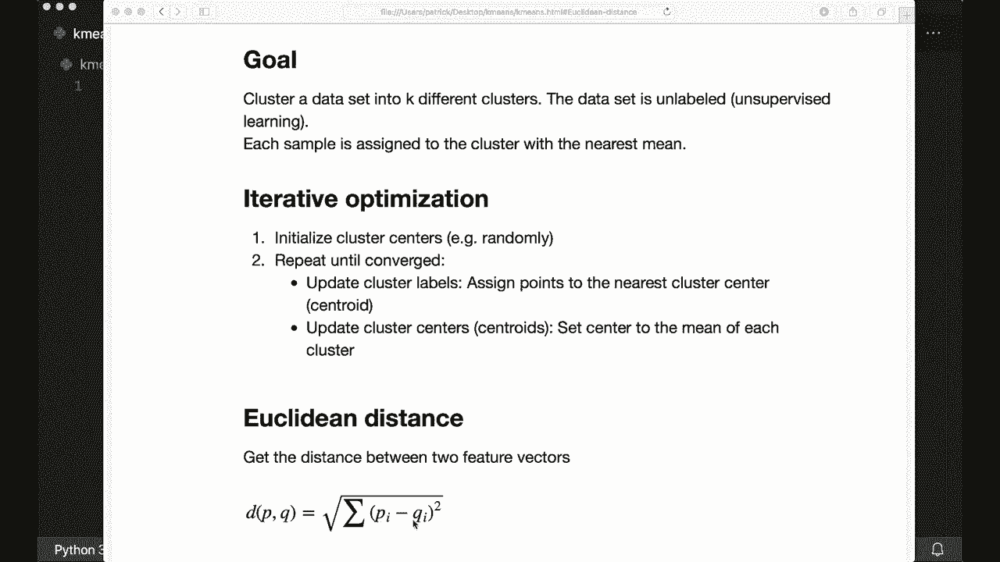
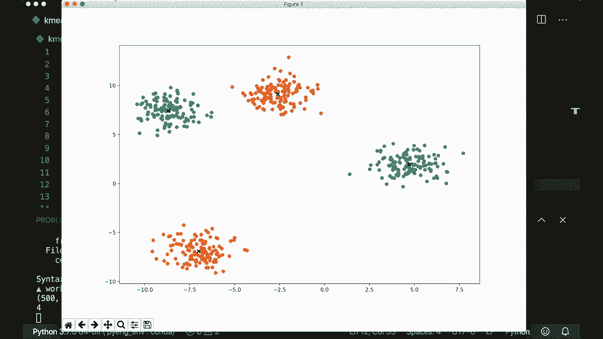

# 用 Python 和 Numpy 实现最热门的12个机器学习算法，彻底搞清楚它们的工作原理！＜实战教程系列＞ - P13：L13- K均值 

大家好，欢迎来到新的机器学习教程。今天，我们将仅使用内置和Python模块以及Numpy实现K均值算法。K均值的目标是将数据集聚类为K个不同的聚类，这里我们有一个未标记的数据集。所以我们正在处理一种无监督学习技术，每个样本应该分配给与其最近的均值的聚类。让我们看看一些图像以了解这意味着什么。

这里是我们的未标记数据，现在在这种情况下我们想找到三个不同的聚类。所以应该看起来像这样。然后我们将标签分配给最近的聚类，即最近聚类的中心。所以这是我们想要做的，我们将如何实现这一点。这是一种迭代优化技术。首先，我们初始化聚类中心，随机选择一些样本并说这些是我们的第一个中心，然后我们执行这两个步骤，直到收敛。

首先，我们更新我们的聚类标签，这意味着我们将点分配给最近的聚类中心。聚类中心也称为质心。接下来，我们更新我们的质心。现在我们将新的中心设置为每个聚类的均值，我们重复这个过程，直到没有更多变化。让我们再来一次。

看一下图像以了解这个是如何工作的。首先，我们有我们的未标记数据集。现在我们随机选择三个质心。这里我画了它们。我希望你能看到它们。这些是我们的初始质心。现在我们将标签分配给数据中与最近质心的标签。这是我们的第一次初始化。

现在我们开始优化。因此，我们更新我们的质心。我们计算每个聚类的新均值。我认为这个质心会移动到这里，而这个可能会在这里。绿色质心可能会移动到这里。让我们看看发生了什么。是的，这是新的质心。现在我们更新我们的标签。

我们的标签。所以现在我们检查每个标签的最近质心。也许这些会变成蓝色，而更多的会变成橙色。所以这是下一步。现在再次更新我们的质心。我认为这个会进一步向右移动，而这个会向上移动，这个可能会保持不变。所以这是下一步。

现在再次更新标签。我认为这些现在会变成橙色，而这些会变成蓝色。现在我们几乎完成了。也许这里有一些微小的变化。再次更新质心，然后再次更新标签，然后是质心，然后是标签。现在没有更多变化。因此，我们已经收敛了。这就是整个方法。

我们需要的唯一数学是欧几里得距离。所以我在关于K近邻算法的教程中已经向你展示过这个。两个向量之间的欧几里得距离定义为平方和的平方根。

这就是我们所需的一切。所以现在我们可以开始。让我们导入nuy作为N P，当然。然后我会说，我将设置一个随机种子，假设是42，你不需要这个，但我想稍后重现我的数据。由于我们使用随机初始化，我希望得到相同的结果，或者我想重现我的结果。所以我会在这里设置一个随机种子。

现在让我们先定义我们的欧几里得距离函数。所以两个向量的欧几里得距离。x1和x2。所以这将是一个全局函数。我们必须实现我刚才给你展示的公式，我们可以用一行来完成。所以我们说返回，nuy首先，我们有平方根。然后我们有sum nu pi sum。然后我们对所有距离求和。

我们可以说x1减去x2的平方。所以平方距离。这就是函数。现在我们可以实现我们的K均值类。所以这将有一个init。它有self。然后它会得到一个K。所以这将是聚类的数量。默认情况下，假设是5。然后它会得到一个max its。这是最大迭代次数。

我们要为我们的优化做的事情。默认情况下，假设是100。然后它还会得到一个布尔值plot steps等于false。所以你不需要这个，但我将实现一个附加功能来绘制不同的步骤，就像我们刚刚看到的那样。所以，首先，我们设置它们或存储它们。所以我们说self dot K等于K，self dot max iters等于max iters，self dot plot steps等于plot steps。

现在我们创建空的聚类和中心点。所以self dot。Clus等于。Oops。Equals。现在我们要小心，因为这很重要。所以这是一个列表的列表。每个聚类的样本索引列表。开始时，每个聚类都有一个空列表。所以我们说，我们使用列表推导，然后说我们有一个空列表，underscore在范围self dot K中。

对于每个聚类，我们初始化一个空列表。然后我们说我们的self dot centroids等于。这也将是一个空列表。这里我们将存储每个聚类的特征向量或均值特征向量。所以每个聚类的均值特征向量。这里我们有实际的样本。我们只存储索引。这很重要。现在我们可以继续。

通常我们会实现fit和predict方法。但由于我们这里使用的是无监督学习技术，并且没有标签数据，我们只需要实现predict方法。所以，我们不需要fit方法。现在让我们定义我们的predict方法。用self和X。这里，首先，让我们存储我们的数据。

self x等于x。然后是维度。因此self number of samples和self dot number of features等于x dot shape，因为我们稍后需要这个。和往常一样，这是一个nuy和D数组。因此，是的。现在让我们执行刚才讨论的步骤。首先，我们要初始化我们的。我们的中心点。然后我们进行优化。因此在这里我们可以说四个下划线在范围内self dot max its。

现在在我们的循环中，首先更新我们的簇。所以，假设我们更新簇。然后，我们更新中心点。接着检查是否收敛。检查。如果收敛了。那我们就跳出循环。最后，我们想要将样本分类为其簇的索引。因此这里我们说返回。返回。簇标签。这就是我们需要做的。现在让我们开始吧。

假设我们想要初始化我们的中心点。我们想要随机选择一些样本。因此假设随机样本索引等于。现在我们使用列表推导式。哦不，抱歉。在这里我可以使用nuy dot random dot choice。这将获取self dot number of samples和self dot K，我们还需要说replace等于false，因为我们不想选择相同的索引两次。

这将是一个大小为self dot K的数组。对于每个条目，它将随机选择0到样本数量之间的一个值。现在，我们分配。与此索引对应的样本给我们的中心点。因此我们说self dot centroids等于。现在这里我们使用列表推导式。所以我们说self dot X。

当前索引为index的随机采样索引。因此这是我们中心点的初始化。现在我们可以进行优化。因此首先。我们说更新我们的簇。因此我们说self dot clusters等于self dot create clusters。这将获取self dot centroids。这是一个帮助函数。

创建我们现在要实现的簇。因此定义create clusters，参数为self和cents。在这里，我们将样本分配给最接近的中心点以创建我们的簇。首先，我们有一个空的列表列表用于我们的簇。现在我们遍历我们的数据。

所以我们说对于index和sample在enumerate self dot X中。因此这个enumerate函数将给我们当前索引和当前样本。现在我们想要获取最近的中心点。我们想要获取它的索引。因此我们说centroid index等于self dot closest。Centroid。这将获取当前样本。

然后它将获取中心点。这将是另一个帮助函数，我们会在稍后创建。但现在我们继续。因此，当我们有中心点索引时。我们附加。或者取当前。簇，因此这个。中心点索引的簇。然后我们附加。当前索引。所以我们把当前样本索引放入最近的簇中。

然后我们返回我们的簇。这就是我们如何创建我们的簇。现在我们需要定义closest centroid函数，参数为self、样本和中心点。在这里，我们计算当前样本到每个中心点的距离。然后，我们想要获取。

质心或质心的索引，其具有最近的距离。因此，让我们用列表推导计算所有的距离。在这里，我们使用已经有的欧几里得距离函数。因此，样本与每个质心点之间的欧几里得距离。因此，点4点在质心中。

然后我们想要的，我们这里有所有的距离，现在我们想看看哪个是最小的，或者是最小距离的索引。因此，我们可以在这里使用Ny arc min。所以我们说最近的索引等于这些距离的Ny arc min。然后，你只需返回它。因此，返回最近的索引。所以现在我们有这个。

现在我们创建了我们的簇，现在我们可以继续优化。因此，在这里我们更新质心作为下一步。但在此之前，我们想要存储质心。所以我们说质心alts等于self dot centroids，这样我们可以稍后检查收敛情况。然后我们说self dot centroids等于self dot get。质心。这。

这样会得到自我簇。所以这是另一个功能。这个将把簇的均值分配给质心。因此，对于每个簇，我们现在计算均值。让我们定义这个，定义。获取。可。注意我是否得到了质心。这个得到自我和簇。因此，在这里，我们在开始时用零初始化我们的质心。

所以我们说质心等于nuai零。这样将是self K和self dot N特征的大小。而这里应该是一个二元组。所以我们必须小心这里。因此，对于每个簇，我们将存储特征Ea。这就是为什么它必须具有这个维度。现在我们遍历簇。因此，我们说四个簇索引和簇在enumerate.Cluters中。

然后我们计算簇均值。因此，簇均值等于N pi均值我们的自我.x和这个簇的索引。🤢，而且这应该沿着第一轴。因此，再次让我们看看这意味着什么。因此，正如我所说，我们的簇是一个列表的列表。所以如果我们只有一个当前簇，那么这是一个列表，而这是一个在这个簇中的索引列表。

所以如果我们用这个索引调用self dot X。它将仅返回在当前簇中的样本。在当前簇中。然后我们计算均值。所以这就是将要发生的事情。现在一旦我们得到了均值，我们将其分配给当前簇的质心。因此，我们说当前的质心等于当前簇的均值。

然后我们完成了，可以返回质心。所以，是的。现在我们有了新的质心。现在我们检查是否收敛。因此，我们说如果self dot。已收敛。那么我们将中断，所以我们可以在这里停止。这将得到旧的和新的质心。因此，self do cents。这是另一个帮助函数。这个将简单。

计算所有质心之间的距离，检查是否为0。所以，定义is converged。self和旧的新质心。所以我们再次计算距离，使用较少的理解。这变成了相等。这里我们计算质心旧的欧几里得距离。

当前质心向量和新的质心，self.dot.k范围内的i。对于每个聚类，它将查看旧的和新的质心向量，计算欧几里得距离并将其存储在列表中。然后我们可以返回一些距离，等于0。这是一个内置函数，它会遍历这些条目并进行计算或求和。

如果这是0，那么我们的质心就没有更多变化。所以我们说它已经收敛了。好吧，现在我们有这个。现在我们想要返回聚类标签。我们可以返回self.dot.get cluster labels。这样就能获取self的聚类标签。对于每个样本，我们将得到它被分配到的聚类的标签。

让我们在这里创建这个。定义get cluster labels和clusters。首先，我们说我们的标签等于一个大小为self.dot number of samples的空数组。对于每个样本，我们想返回它被分配的聚类。但是这里要小心，因为这些标签并不是我们数据的实际标签，因为我们不知道它们。

这只是它被分配到的聚类的索引。好吧，现在我们遍历聚类。对于聚类索引中的聚类和enumerate.cluters中的聚类。然后我们遍历当前聚类。对于聚类中的每个样本索引，这又是一个列表的列表，每个聚类都有一个包含该聚类中所有样本索引的列表。

对于当前聚类中的每个样本索引，我们说样本索引的标签等于当前聚类索引。然后我们返回我们的标签。现在我们完成了。我还想实现一件事，但你不需要的是绘图函数。定义find plot和self。在这里，我们将使用matplotlib，所以我可以说import。

使用plt.plot，我不打算在这里解释细节，但如果你想看到更多关于我的plot的教程，请留下评论。让我们实现绘图方法。在这里，我想简单地绘制数据及其所属的聚类，以及质心。让我们创建我们的图形。

设置ax等于plt.subplot，并给它一个固定的大小，比如12乘8。然后我们遍历我们的聚类。对于索引中的每个i，在self.dot clusters中。现在我们得到当前的点，point等于self.dot X的索引，但我们必须在这里转置它。现在我们散点图。

在这里我解包了这个点。现在，这将绘制所有的点。对于每个聚类，它将使用不同的颜色。现在我们绘制所有的质心。所以对于点在 self.dot cents。A x.dot.scatter。再一次，我们解开我们的点。然后我们说 marker 等于。X，所以它有一个标记符号，color 等于。

黑色和线宽等于 2。所以，我们必须说 PLT.dot.show，当然。这个是绘图函数。在我们的优化过程中，如果我们将 plot steps 设置为 true。那么我们想在更新聚类后进行绘图，所以我们说。如果 self.dot Ploot steps，那么 self.dot plot。再一次，我们还想在更新质心后进行绘图。

所以我们把它放在这里。现在我们完成了。所以现在让我们运行这个。我希望一切都能正常工作。让我们清理一下并运行我们的脚本。哦。我在这里漏掉了一个逗号，行 37。更新质心，旧的质心等于。当前的！

所以再次，让我们试一下。现在它正在工作。这里我创建了一个包含四个不同聚类的数据集。我们可以看到它正确地识别了它们。

所以让我们把 plot steps 设置为 true，并且在最后不绘图。现在让我们再运行一次！

要查看不同的步骤。所以这里，这是我们初始化之后的状态。我们随机选取了一些样本，并表示这些是我们的第一个质心。因此，初始化可能不是很好，但。你可以在后面正确找到聚类。那么我们来看看发生了什么。

所以现在我们开始优化。现在在下一步中，我们正在计算新的质心。我认为蓝色聚类的质心正在移动到这里，而橙色质心正在移动到下面。让我们看一下下一步。所以是的，现在我们在更新标签。我认为这些不再是橙色，而是红色和绿色。所以。是的。

还有一些现在变成了红色。现在我们再次更新我们的质心。我认为这将进一步移动到这里。这个会向下移动。这些会移动一点。所以是的。现在我们再次更新我们的标签。我认为更多的将变成红色，这里更多的将变成绿色。所以，现在再次。

我们更新我们的质心。我认为这将进一步移动到这里。红色质心将移动到这里。这已经很好了。绿色的质心也移动到这里。我认为。是的，就是这样。现在我们再次更新标签。现在再次，质心和标签。现在我认为我们已经收敛了。所以，是的。

这就是 K 均值如何工作的。我希望你理解了一切。如果你喜欢，请订阅频道，下次再见！

