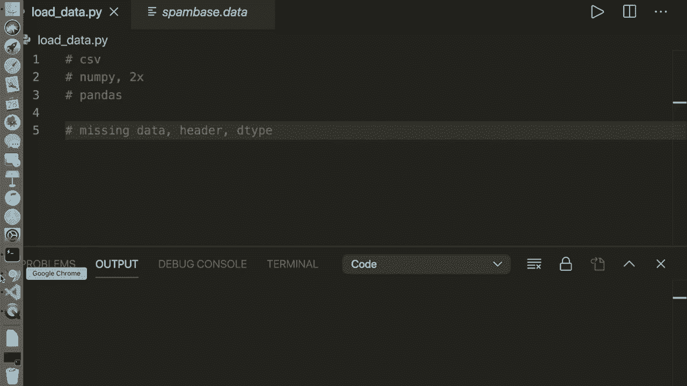
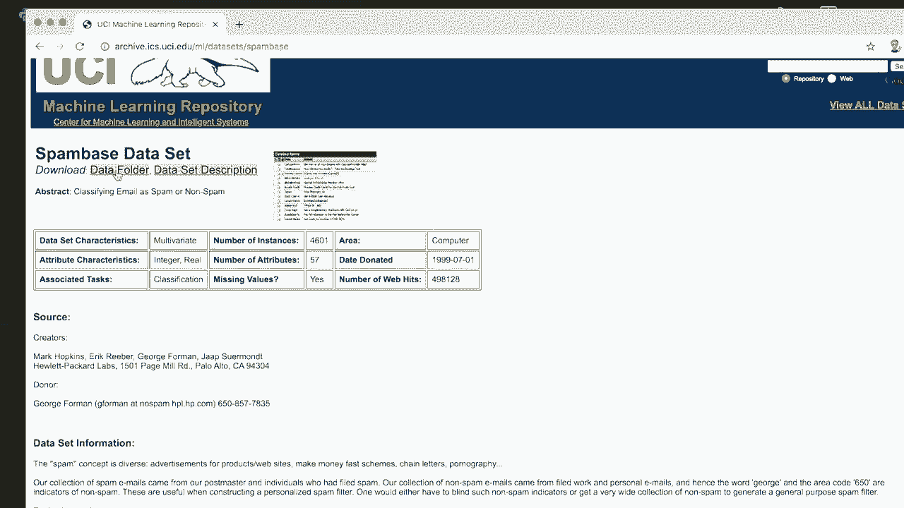
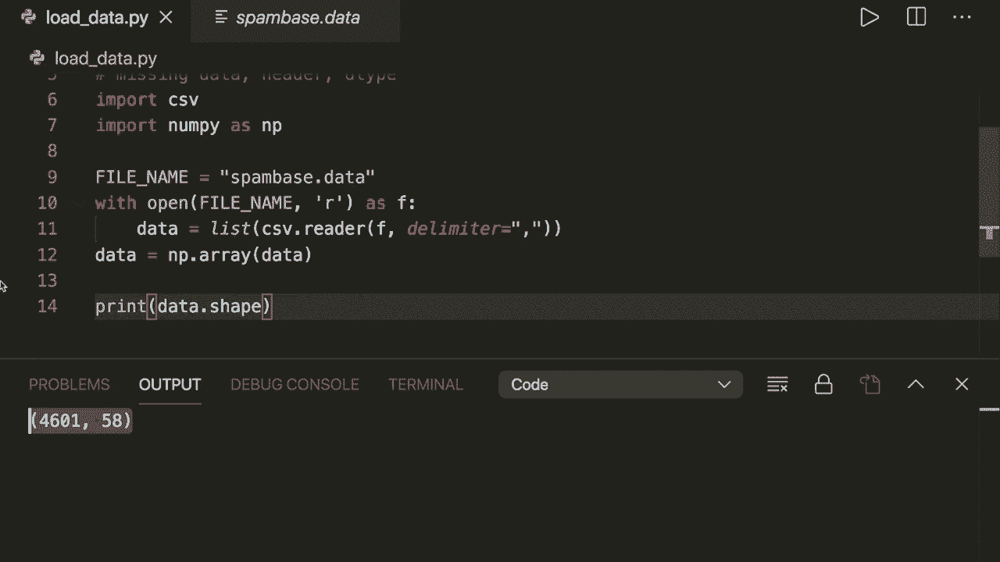
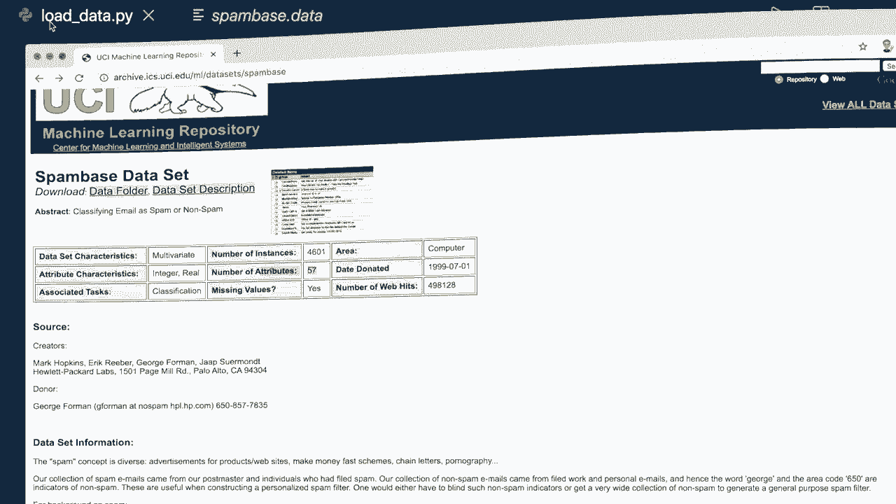
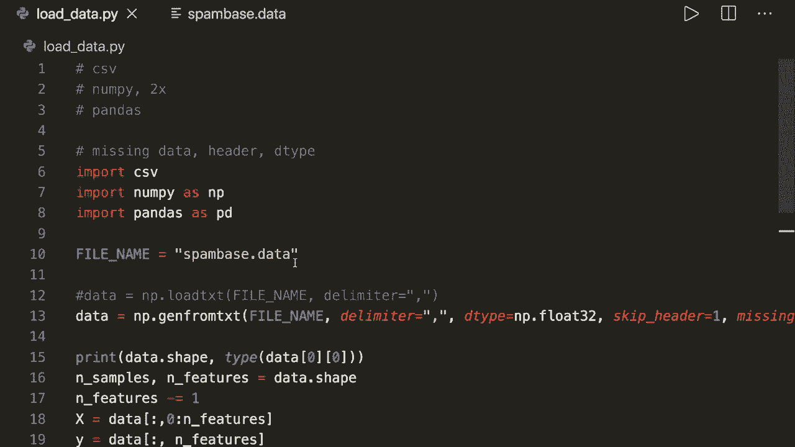

# 用 Python 和 Numpy 实现最热门的12个机器学习算法，彻底搞清楚它们的工作原理！＜实战教程系列＞ - P16：L16- 从 CSV 加载数据 

嗨，大家好，欢迎来到另一个机器学习教程。在我之前的所有机器学习示例中，我直接使用来自 S K learn 数据集模块的可用数据。很多人问我如果他们有自己的数据集，应该如何加载数据。因此今天，我想向你展示如何从文件中加载数据。我将展示四种不同的方法。

一个使用纯 Python，两个使用 Numpy，一个使用 Pandas 库。😊。我还将向你展示如何处理缺失数据以及如何获得正确的数据类型。所以请确保观看到最后。在这个教程中，我将使用基于垃圾邮件的数据集。所以如果我们搜索一下这个。

然后第一个条目引导我们到这一侧。这是一个获取机器学习数据集的热门网站。在这个基于垃圾邮件的数据集中，我们想将电子邮件分类为垃圾邮件或非垃圾邮件。因此，我们可以转到下载文件夹并加载 spambased.dot 数据。我已经做过了。所以我把这个放在这里。这是 Csv 格式的，即逗号分隔值。

通常这里的后缀是 .Csv，但这里是 .data，这也没问题。所以让我们开始，看看如何加载这个。

所以首先，让我们使用纯 Python 和 CSV 模块加载这个文件，因此我们可以导入 CSV。这在 Python 中已经内置了。然后让我们指定我们的文件名等于。所以让我们再看一下。这被称为 spam basedase data。所以我们称它为 spam based.dot 数据。现在我们说以读取模式打开我们的文件名 S F。

然后我们说我们的数据等于。然后我们可以使用 Csv 模块并调用 reader。在这里，我们必须提供我们的 F 和分隔符。因此，分隔所有数据的值。在这种情况下，它是一个逗号。这将给我们一个迭代器。然后我们可以使用列表方法将其转换为列表。

现在我们将数据转换为列表。所以让我们把它转换为 Numpy 数组。让我们导入 Numpy 的 S 和 P。然后在这里，我们说我们的数据等于从数据创建的 nuy 数组。然后，例如，我们可以打印 data.dot.shape。让我们运行这个。然后我们看到它成功了。

如果我们看看这个网站。然后我们可以看到样本数量是 4601，特征数量是 57。因此这里我们有 4601 和 58。这是因为我们的。

数据当前同时包含特征和类别标签。因此在这种情况下，类别标签是最后一列。所以我们想做的下一件事是将我们的列表分成特征和类别标签。为此，让我们获取形状。所以我们说样本数量和特征数量等于 data.dot.shape。

然后我们使用列表切片。我们想做的第一件事是将其减少一个。因此假设特征数量减去1，因为我们只有57。然后我们使用列表切片。因此我们说x等于数据，然后我们说冒号。因此我们想要所有行，对于列，我们希望从第0列开始，一直到特征数量。

并且最后一列被排除了。因此这将仅包含特征，y是数据。同样，我们想要所有行，但只有最后一列。现在我们已经拆分了这个。现在，例如，如果我们打印x.dot.shape和y.dot.shape。如果我们运行这个，我们会看到它成功了。现在我们有了正确的格式。例如。

现在我们可以把它放进去，或者把它给我们的分类器用于fit方法并开始训练。这是我想展示的第一种方法。然而，我不推荐这种方法，因为它通常较慢，并且需要的代码比其他方法更多。我现在要给你展示的其他方法。但你仍然应该知道如何手动加载文件。

所以我们现在忘记这一点。并且我们来删除这个。现在让我给你展示如何在Nmpy中做到这一点。我们在Numpy中只需一行代码即可实现。因此我们可以说数据等于Numpy。然后我们使用一个叫做load T X T的方法，这也需要文件名和分隔符等于逗号。这就是我们所需要的一切。

所以现在如果我们运行这个。然后我们看到它也成功了。这要简单得多，并且更快。这是我们可以使用Nmpy的第一种方法。然而，还有一种更好的方法，我推荐这种。因此数据等于nuumpy，第二种方法叫做Cheen from T X T。这也需要文件名和分隔符等于逗号。

现在如果你运行这个，那么我们也看到它成功了。因此这是我在nuumpy中首选的方法。它基本上与这个一样，但为参数提供了更多选项。例如，在这里，我们可以处理缺失数据，这我想在一秒钟内给你展示。因此，是的，这是使用numpy的函数。现在作为最后一件事。

我想向你展示如何用pandaas做到这一点。如果你已经熟悉pandaas，你也可以这样使用。这里有一个函数叫做read CSV。因此我们说数据框，因为在pandas中我们通常处理或称之为数据框。然后我们说PDd.dot.read_ CSV，再次给出我们的文件名，我们也可以给它分隔符等于逗号。

然后我们把它作为数据框。接下来我们可以把它转换为numpy。因此我们可以说数据等于data frame to nuy to Num pi。然后我们可以做与这里相同的事情。例如，我们可以将其拆分为x和y。现在，如果我们运行这个。我们会看到它也成功了，但这里我们少了一行。

这是因为在这里我们必须小心，因为 pandas 尝试读取一个标题，而在这种情况下我们没有标题。所以我们必须指定 header 等于 none。然后如果我们加载这个，就会发现它是正确的。因此，这就是我们如何使用 pandas。两者都可以。所以如果你只想使用 numpy，我会推荐使用这个。如果你熟悉 pandas，那么我会使用这个，因为它提供了更多选项。

而且这样也稍微快一些。所以，是的。这就是你如何加载这个。现在让我们谈谈数据类型、标题和缺失数据。一件好习惯是，如果你知道的话，提前指定数据类型。所以。例如，在这里我们可以给出参数，data type 等于，例如，nu load 32，下面。

我们也可以对 pandas 函数做同样的事情。所以现在如果我们运行这个，我们会看到这个词 2。例如，我们也可以打印数据类型。那么，我们看到。哦，这里我们看到它只有一个 Nmpy 数组。让我们打印一下数据类型。我们说 0，0。然后我们应该看到，它是一个 Ny float 32，最好总是指定这个，如果你知道的话。

如果你知道数据类型，就把它放在这里，因为否则函数必须自己推断数据类型。这通常会花费更多时间。而且可能也会出错。是的，一些算法，一些分类器期望这是 float。我认为大多数都期望这是 float。因此这就是我在这里推荐的做法。

如果你不把它放在这里，想稍后转换，顺便说一下。你仍然可以通过说 data 等于 nuy S array 来做到这一点。然后你放入数据。然后作为数据类型，data type 等于，然后这里你的 float 32。是的，这就是你可以用数据类型做的事情。现在让我们谈谈标题。

在这种情况下，我们没有标题。但假设在我们的文件中，我们有一个标题，其中包含特征描述，例如特征 1、特征 2，等等。所以在加载过程中，我们当然不希望这个。我们可以先运行这个，看看会发生什么。然后我们会收到一个错误，因为我们的函数无法识别第一行。

在这里我们可以简单地跳过这个。因此对于 text 方法中的 ch，我们需要指定 skip header。然后是我们想要跳过的行数。在这种情况下是 1。对于 pandas 函数也是一样。但是这里我们必须小心，因为参数叫做 skip rows 等于 1。现在如果我们运行这个，那么这又成功了。我们。

再次，得到了正确的形状，并且跳过了标题。如果你这里有标题的话，这就是你应该做的。最后，我想谈谈缺失值。很多时候，例如，可能会有缺失值。比如这里，我们只是有一个逗号然后没有条目。所以如果你运行这个，我们来打印一下。

例如，让我们打印X，然后在第一行打印特征0到5。这里也是一样。所以现在如果你运行这个。我们看到我们有N A N。这代表不是数字。这些函数可以自己判断出来。所以如果它是空的，或者我认为如果有一个破折号或N A N。

那么它们可以自动看到这不是一个数字。但有时你这里也有一个字符串，这没有意义。现在，如果我尝试运行这个，那么这应该会产生一个错误，因为它无法判断这里的字符串。因为你说这些应该都是浮点数。所以你可以在这里指定额外的缺失值。

通过说missing.Values.等于，然后在这里放入一个列表。在这里我们可以放入hello。对于pandas函数，参数是N A values。然后你必须使用一个列表。因此，我建议在需要参数时查阅文档。你不需要记住这些。因此这里我们说hello，然后它知道应该忽略这些。

所以现在如果你运行这个，之前的方法又成功了，它用不是数字填充了这些“hello”。你也可以指定应该用什么来替代。因此这里我们可以使用参数填充值等于。你可能想把这个设置为0。但在这个例子中，建议我们可以看到，我会把这个设置为9，9，9，9，作为浮点数。

对于pandas函数，加载后我们可以调用data frame，然后设置data frame fill N A。不是数字填充为9999。0。现在，如果我们运行这个。我们看到这里用9，9，9，9替换了不是数字。这里我必须说，当然，data frame等于这个新data frame。现在，如果我再次运行这个。

然后我们看到对于pans方法它也有效。这就是我们如何处理缺失的数字。通常你想把这个设置为0，然后你应该就可以开始了。因为许多初学者看到的错误是因为缺失的数字。然后你的算法崩溃，因为它不知道如何处理这个。

所以一定要确保处理缺失的数字。然后我建议指定数据类型。现在你还应该知道如何处理标题。嗯，这就是你应该知道的两个首选方法：Thempy Chen的文本方法和pandas的Re CS SV方法。所以，是的，这就是你需要的全部。希望你喜欢这个教程。如果你喜欢这个。

请订阅频道，下次见，拜拜。
