# 用 Python 和 Numpy 实现最热门的12个机器学习算法，彻底搞清楚它们的工作原理！＜实战教程系列＞ - P2：L2- 神经网络 

嗨，大家好。欢迎来到一个新的教程。这是一个名为“从零开始学习机器学习”的新系列的第一期视频。在这个系列中，我们将仅使用内置的 Python 模块和 Numpy 实现流行的机器学习算法。所以今天，我们将从关键的最近邻算法开始，简称 K-N 算法。😊 K-N 的概念非常简单。一个样本通过其最近邻的投票来进行分类。

所以我们来考虑一个包含两个类别和一个二维特征向量的例子。

所以让我们看看这个图。这里我们有两个类别，蓝色类别和橙色类别，我们有两个维度的特征向量。所以在这个轴上是 x1，在这个轴上是 x2。我们这里有一些训练样本。然后对于每个我们想要分类的新样本。

我们计算这个样本到每个训练样本的距离。然后我们查看最近的邻居。在这个例子中，我们查看三个最近的邻居。就是这些。然后我们根据最常见的类别标签来选择或预测标签。

所以我们有两个蓝色的类别和一个橙色的类别。所以这将是一个蓝色类别。这就是 K-N 的整个概念。我们还需要知道的是，为了计算距离，我们使用了欧几里得距离。

在二维示例中，两个点的欧几里得距离定义为平方根，然后我们对每个特征向量组件计算平方差。所以我们有 x2 减去 x1 的平方加上 y2 减去 y1 的平方。所以这是二维情况下的欧几里得距离，而在更一般的情况下，公式是。

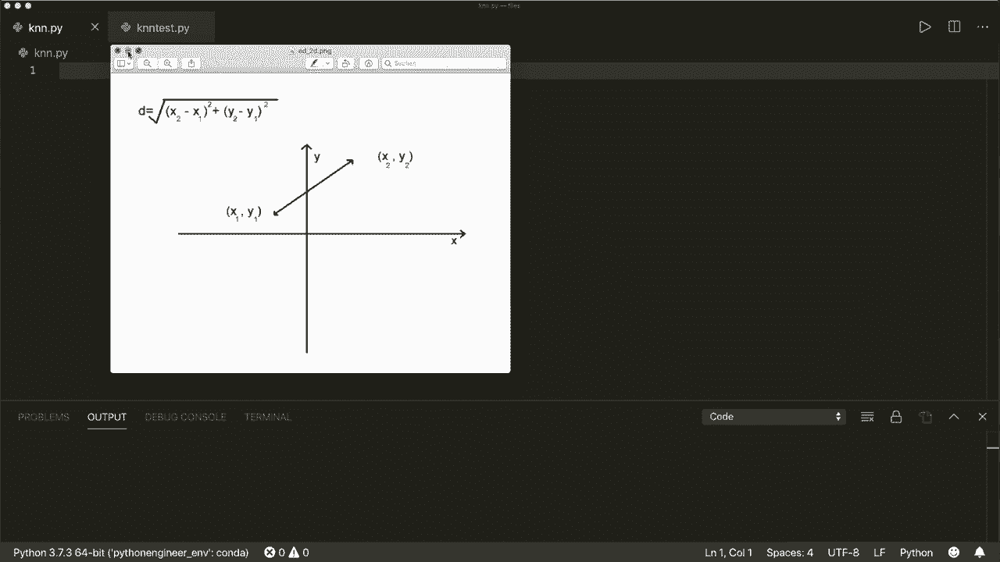

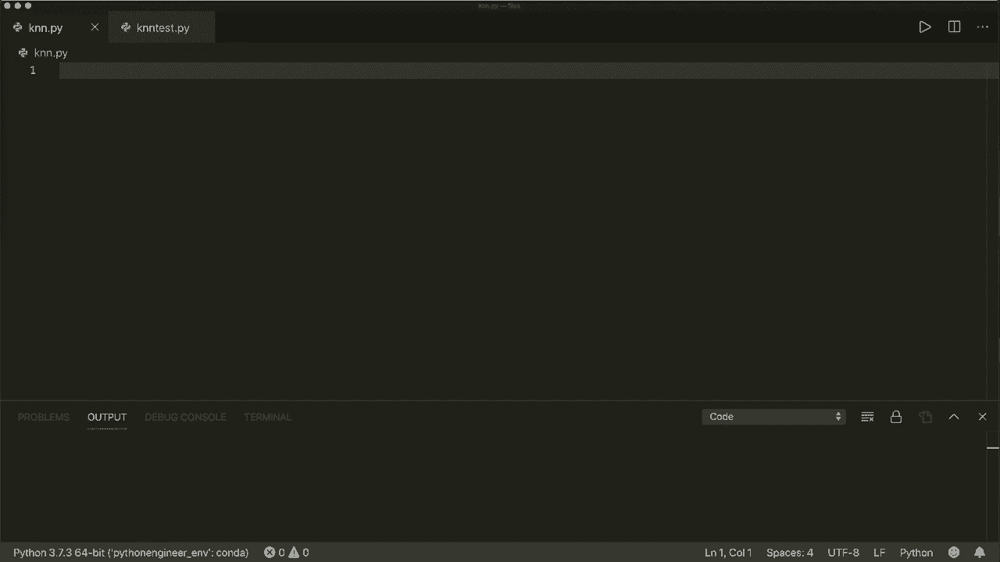

定义为。这个，所以它是从 I 等于 0 到 n 的总和的平方根，其中 n 是维度的数量。然后我们对每个组件进行求和，对于每个组件，我们计算平方距离或平方差。所以这是欧几里得距离，这就是我们在实现 K-N 时需要知道的一切。

所以让我们开始。首先，我们定义一个名为 K-N 的类。

当然，这有一个初始化方法。所以我们会得到一个 K。这是我们想要考虑的最近邻的数量。并且这还会有一个默认值。所以默认是 3。在初始化中。哦，抱歉。我们定义初始化。所以在初始化中，我们只是想存储 K。所以我们说 self.dot K 等于 k。

然后我们想在这里实现的就是遵循其他机器学习库的约定。例如，心理学习库。因此我们有一个。嗯。拟合方法。这将拟合训练样本和一些训练标签。通常这将涉及到训练步骤。所以我们想要实现这个。

然后我们还想实现一个预测方法。抱歉，这里也有self。以及预测方法。因此，我们想要预测新样本。这是我们想要实现的方法。在继续之前，首先让我们看看我们的数据的样子。这X和Y是什么？

我写了一些测试脚本。在这里我使用了著名的鸢尾花数据集。你可能听说过这个。所以我可以从心理学习模块中获取这个数据。然后我将生成一些训练样本和一些测试样本，以及相关的训练标签和测试标签。

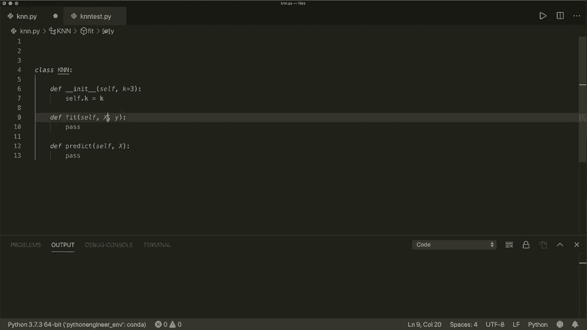

首先让我们看看这些训练样本的样子。我们想打印一下它的形状。这是一个形状为120 x 4的n维数组。所以120是样本的数量，而4是每个样本的特征数量。例如，让我们打印第一个样本。它包含四个特征。

所以这就是我们的训练样本的样子。现在让我们看看我们的训练标签。这是一个一维行向量，大小也是120。因此，对于每个训练样本，我们都有对应的标签。如果我们打印出来，我们会看到这是一个只有一行的一维向量。

现在我们看到的标签有0、1和2。这是一个三分类问题。我们也来绘制一下。嗯。比如说，我这里绘制的是前两个特征，以便我们有一个二维的情况。这就是我们的数据的样子。我们有三个类别，红色、绿色和蓝色。

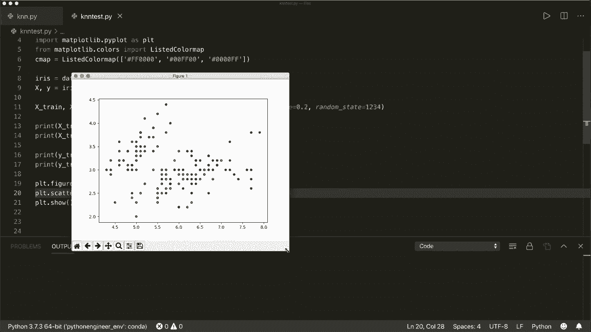

是的。这就是我们的数据的样子。现在我们可以通过实现这一点继续。所以在我们的拟合方法中。在K和N算法中，这并不涉及训练步骤。因此，我们在这里所做的就是简单地存储我们的训练样本，然后我们可以稍后使用它们。所以我们可以说，存储它们。因此我们可以说self。

然后我们将X train设为X，而self Y train设为y。这就是我们的拟合方法的全部。现在，对于我们的预测方法，这将获取多个样本。因此，我们可以看到，因为我们使用了大写的X。这样可以有多个样本，因此我们可以写一个小的辅助方法。我们想对每个样本执行这个。

我们想说我们想要获取预测的标签。等于，然后。我们使用。或者我们写一个帮助方法，称之为下划线预测。这个方法只会处理一个样本。所以在这里我们使用列表推导。然后我们想做的是调用这个 self。预测。使用一个样本 X。然后我们想对我们所有的样本进行这个操作。在我们的测试样本中。 

所以对于大写的 x 中的小 x。然后这将是一个列表。让我们把它转换为一个 nuy 数组，然后。这是我们的预测方法。当然，我们需要导入 Nmpy。所以我们说导入 Ny S 和 P。现在，我们的下划线预测方法看起来如何？再来看看。

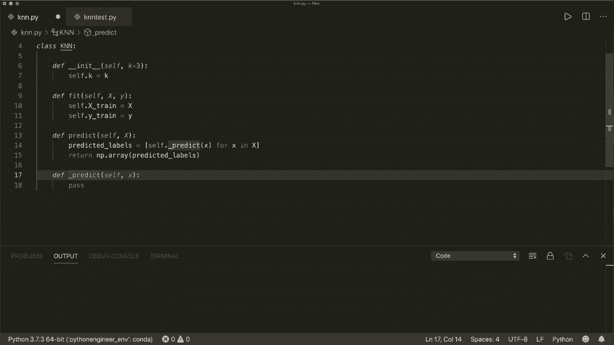

在这里的图中。所以我们要做的是。我们想计算所有的距离。然后查看最近邻居和最近邻居的标签。然后我们进行投票，选择最常见的类标签。让我们在这里写一些注释。首先，我们想计算距离。

然后，我们想要获取最近的邻居，所以获取 Ca。最近的样本，并且。我们也想要获取标签。然后我们进行投票。因此，我们想要得到最多的。来自类标签。所以。让我们这样做。让我们说，距离等于。正如我所说。我们在这里使用欧几里得距离。让我们定义一下。

我们希望将其定义为一个全局函数。因此，你可能想把它写在一个单独的文件中，或者在某个工具类中调用它。因此在这里我将简单地在同一个文件中做。所以我说。要。Kiyian。这两个特征向量的距离。我们说 x1 和 x2。现在再来看看公式。这是平方根。然后是每个平方距离的总和。所以我们得到平方根。

所以我们可以说。

Nampai 的 dot S，Q，R T。

然后我们有了总和。所以我们可以使用 numpy 的 dot sum。这样就可以计算每个的总和。

特征向量组件。在这里我们有平方差。所以我们可以说 x1 减去 x2 的平方。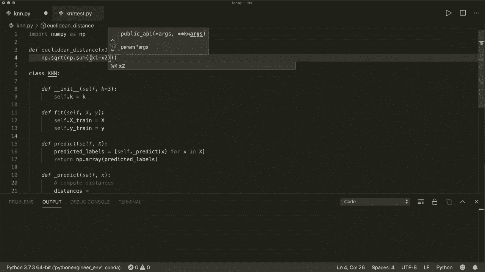

所以这就是我们需要的全部。我们当然想返回这个。

现在在我们的预测方法中。我们要做的是。我们想计算这个新样本与所有训练样本的距离。因此，我们在这里也使用列表推导，并将这个新的测试样本与我们计算的欧几里得距离结合起来。因此，然后对每个训练样本进行计算。所以我们说小 x train。

然后我们想为此计算。在 capital 中，或在 self.dot。X train。所以现在我们有了所有的距离。现在我们想获取最近的样本和标签。所以我们在这里做的是排序我们的距离。我们可以这样做。所以让我们称之为 decay。Indices。然后这里我们使用 nuumpy.dot。Ark sort。所以这将排序距离。

将返回排序的索引。所以这里我们调用。Distances。这将是一个数组。我们只想要 K 个最接近的样本。所以让我们在这里使用切片。并从开始处开始。所以 0。或者我们可以省略这个。这仅适用于 self.dot K。所以这将是 K 最近样本的索引。现在让我们获取标签。所以我们得到。

K。最近。标签等于。在这里我们可以。我们也使用列表推导式。然后我们获取每个训练标签的标签。用这个索引。所以索引 I。然后对于 I 在 K indcs 中。所以现在我们有了最近邻的标签。然后我们使用投票机制，得到最常见的类别标签。

所以让我们称之为最常见的等于。为此，我们使用另一个 Python 模块。所以我们使用 counter 模块。所以我们说从 collections 导入。Counter。然后。我们ii。

到达那里。或者我们获得最近标签的计数器。

然后这是一个叫做最常见的的方法。我们只想要第一个或最常见的项目。嗯。现在让我们看看这是什么样子，所以。如果我注释掉这个，让我们写一个短示例，collections 或 counter 模块将会做什么。

假设我们有一个列表 A，它等于一些值。所以 1，1，1，2，2。然后有一些错误。标签，就好像也从 collections 导入了。Counter。现在我们得到最常见的元素。所以我们创建这个列表的计数器，然后取出一个最常见的元素。

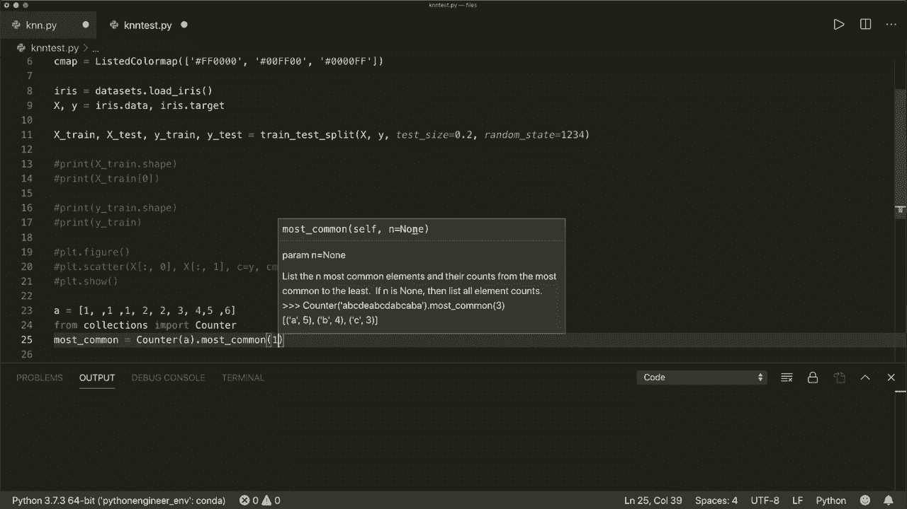

所以。让我们打印这个。

所以。我必须。先关闭这个。所以让我们再次运行这个。嗯。所以这将是一个列表。然后我们有一个最常见项目的元组。所以，例如，如果我们在这种情况下。我们只想要一个，最常见的项目。这个是一个元组。这里的第一个项目是最常见的项目。所以这是 1。第二个项目是。

这个元素在我们的列表中出现的次数。所以它出现了三次 1。例如，如果你使用 2。那么它也会放入第二个最常见的项目。在这种情况下，是 2。我们有两个 2。所以我们只想要一个最常见的。所以正如我所说，这是一个列表。为了获得第一个项目，我们使用索引 0。

现在我们有了元组，接下来要再次获取实际的项目，我们使用第一个索引。然后我们有 1。所以这里我们也要做同样的事情，我们想返回这个。所以让我们返回索引 0 的最常见的索引 0。这就是我们 K 和 N 算法的实现。让我们试一下这个，所以。让我们。

在我们的测试示例中，我们已经有了测试文件。我们已经有了训练和测试样本。所以让我们使用我们的。K和N类。所以我们可以说从K和N导入。K和N。然后创建一个分类器。所以C，F等于。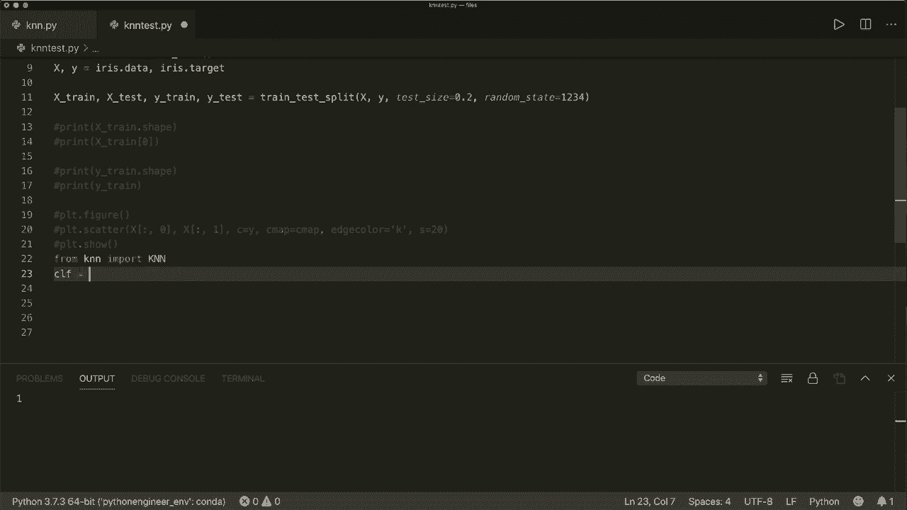

K和N。所以，让我们使用。

K等于3。然后我们想先调用fit方法。所以我们想拟合我们的X训练。和。为什么训练。然后我们得到预测。这是。通过调用CF.dot.predict来实现。然后我们想预测。我们的。测试样本。所以x test。现在让我们计算准确率。所以准确率。这是由我们有多少预测。被正确分类来定义的。

所以这是。这里我们使用总和。嗯。

总和。在这里，我们写。预测等于，等于。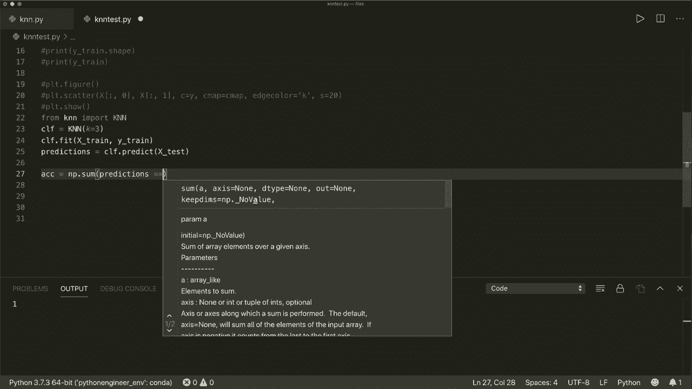

为什么测试。所以每个预测，就是。正确的。或者和正确标签相同，它。Es1。然后我们将其除以测试样本的数量。所以我们将其除以Lng，y。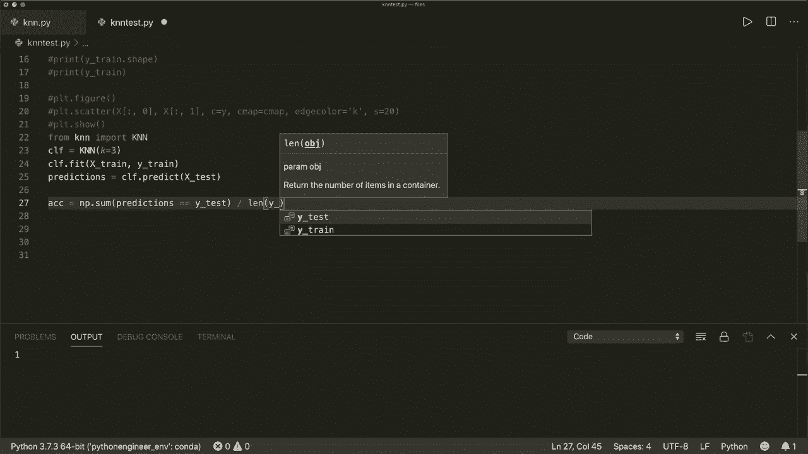

测试。让我们打印我们的准确率。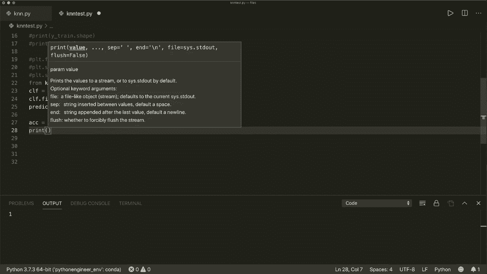

看看这个是否有效。所以，在这种情况下，它是1。0。所以我们所有的预测都是。正确的。所以我们使用另一个。邻居数量。所以K等于5。通常你会想在这里使用一个奇数。所以让我们运行这个。哦，抱歉。在这种情况下，它是096，所以。没有三个邻居那么好，但也非常不错。嗯。

我们看到这在工作。这是我们整个K和M的实现。嗯。我希望你喜欢这个教程，下个教程见，拜拜。😊。
