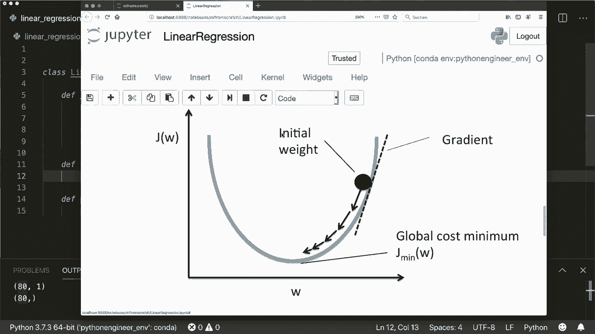

# 用 Python 和 Numpy 实现最热门的12个机器学习算法，彻底搞清楚它们的工作原理！＜实战教程系列＞ - P3：L3- 线性回归 - ShowMeAI - BV1wS4y1f7z1

大家好，欢迎来到新的教程。这是机器学习系列教程的第二个视频。在这个系列中，我们将仅使用内置和Python模块以及Numpy实现流行的机器学习算法。今天，我们将实现线性回归算法。所以让我们首先谈谈线性回归的概念。在回归中。

我们想要预测连续值，而在分类中，我们想要预测一个离散值，比如类标签0或1。因此，如果我们看看这个示例图，我们有我们的数据，蓝点。我们想用一个线性函数来逼近这些数据。

这就是为什么它叫做线性回归。我们使用线性函数来预测值。😊。所以我们可以将逼近定义为y帽等于w乘以x加B。这是直线方程，其中W或我们的权重是斜率，B是偏差或仅是2D情况下沿Y轴的平移。因此，这是逼近。现在我们需要得出这个W和B。

我们如何找到这个呢？为此，我们定义一个成本函数。在线性回归中，这就是均方误差。这是实际值与逼近值之间的差异。因此，我们需要训练样本来获取这个实际值。然后我们平方这个差异，对所有样本求和，然后除以样本数量。

通过这种方式，我们得到了平均误差。这是成本函数，所以这是误差。当然，我们希望误差尽可能小。因此，我们必须找到这个函数的最小值。那么我们如何找到最小值呢？为此，我们需要计算导数或梯度。

因此，我们计算我们的成本函数关于W和B的梯度。这是梯度的公式。请自行检查，我也会在描述中放一些链接以供进一步阅读，但我现在不打算详细讲解。现在有了这个梯度。

我们使用一种叫做梯度下降的技术。这是一种迭代方法，用于达到最小值。因此，如果我们在这里有我们的目标或成本函数，我们就从某个地方开始。我们初始化权重和偏差，然后我们想朝着最陡的下降方向前进。而最陡的下降也是梯度。因此，我们想沿着梯度的负方向前进。我们会迭代这个过程，直到最终达到最小值。每次迭代时，我们都有更新规则来计算新的权重和新的偏差。

所以新的W是旧的W减去alpha乘以导数。😊。所以减去是因为我们想进入负方向。然后这个alpha是所谓的学习率。这是我们模型的一个重要参数。因此，学习率定义了我们每次迭代步长中前进的距离。

例如，如果我们使用较小的学习率，那么可能需要更长的时间。但它最终可以达到最小值。如果我们达到，或者如果我们使用较大的学习率。那么可能会更快，但也可能会像这样四处跳动，永远找不到最小值。因此，这是一个重要的参数，我们必须指定。请记住这一点。

现在我们知道了更新规则，我在这里再次写下了导数的公式。然后稍微简化了一下。请你自己检查一下。这些是更新规则和导数的公式。这就是我们需要知道的一切。现在我们可以开始了。现在让我们定义一个名为线性回归的类。

当然，这里面会有一个方法。或者双下划线分数在其中。然后它有self，并且获取学习率。我将给这个一个默认值。所以通常这是一个非常小的值。因此我将其设为`0001`。然后我将给它一个迭代次数。所以我们在梯度下降法中使用多少次迭代。

我还会给这个一个默认值。我会说这是`1000`。然后我会简单地将它们存储在这里。因此我会说self L R等于L R和self。Itders等于它的。然后稍后，我们必须得出权重。但是在这里一开始，我会简单地说self weights等于none，self dot bias等于none。

然后我们必须定义两个函数，并且我们将在这里遵循其他机器学习库的惯例。因此我们将定义一个fit方法，该方法接收训练样本及其标签。这将涉及训练步骤和梯度下降。然后我们将定义一个predict方法。因此，当它获取新的测试样本时。

然后它可以近似这个值并返回该值。这就是我们需要实现的函数。在我们继续之前，让我们快速看看数据X和Y。这看起来如何。为此，我写了一个小示例脚本，并使用了psychic learn模块生成了一些示例数据。

我会将数据分成训练样本和测试样本，以及训练标签和测试标签。因此首先，让我们看看这些数据的样子。

所以这里是图表。这就是我们的数据看起来的样子。现在我们想在这里找到一个函数来近似这个值。

让我们看看我们 x 和 y 的形状。所以让我们运行这个。我不想再看到这个图了。嗯。如果我们看到我们的 x 是一个大小为 80×1 的 N D 数组。这是因为我在这里输入，我想要 100 个样本。每个样本一个特征。然后我会拆分这个。所以我们的训练样本只有 80 个样本。

这是一个大小为 80×1 的 N D 数组，而我们的训练标签只是一个大小为 80 的 1 D 向量。所以对于每个训练样本，我们有一个值。这就是我们的数据的样子。现在让我们继续。所以让我们实现 fit 方法。正如我所说。我们需要在这里实现梯度下降法。

梯度下降总是需要从某处开始。所以我们需要一些初始化。

所以。让我们来做。让我们初始化我们的参数。对于这一部分。让我们得到样本的数量和特征的数量。我们可以通过说这是 x.dot.shape 来获取。然后我们简单地将所有权重初始化为 0。所以我们可以说 self.weights 等于 nuy0s。大小和特征。对于每个分量。

我们输入 a0 和 self.du.bias 等于 0。这只是一个值。所以你也可以在这里使用随机值，但 0 就很好。所以我们在这里使用 0。然后我们使用梯度下降。这是一个迭代过程。所以我们使用一个循环。所以对于 I，哦，实际上，我们不需要这个。所以对于下划线在范围内，然后 self.dot 和它的。

现在，我们需要的是什么。我们首先必须进行近似。或者让我们再看一下公式。

所以，我们的公式。新的权重是旧的权重减去学习率乘以导数。关于 W 的导数是 1 over n。然后我们有总和，和总和为两个 X I 的乘积。然后，这个近似值和实际值之间的差异。所以让我们先。首先。

计算这个近似值。所以我们有这个公式。近似值是。权重乘以我们的 x 加上偏置。

所以让我们这样做。假设我们叫它 y。预测等于。然后我们可以使用 N 点点。然后 x 和 self 点权重。加上 Bs，这将把 x 与权重相乘。现在我们有了近似值，可以计算关于 W 的导数。这是。让我们再看看这个公式。

1 over n。然后。总和。然后在总和内部，我们有 x 乘以这个的乘积。所以，我们说。

1 over。样本。我们已经得到了样本的数量。然后乘以。然后我们有了总乘积。所以这没别的，也就是点积。所以 N P 点点。但现在我们得小心。所以我们在这里做了什么。嗯。在这里，我们将每个权重分量与特征向量分量相乘并求和。

我们对所有样本进行这个操作，然后为每个样本得到一个值。在这里，我们希望为每个特征向量组件得到一个值。所以我们将每个样本与预测值相乘并求和。所以。然后我们对每个特征向量组件这样做，并为每个组件得到一个值。

所以这就是相反的方向。沿着另一个轴。因此，我们必须在这里使用x的转置，x dot T。这是转置X的点积。然后我们有预测的y减去实际的y。所以请自己检查nuy dot函数。因此，这就是W的和偏差的导数也是1。或者再次。

让我们看看这个公式。所以这就是相同的。只是这里没有x。所以这是1/n，然后就是求和。

这个差异。顺便说一下，我。我把两个省略掉了。所以这只是一个可以忽略的缩放因子。所以这里1/n，然后是差异的和。

所以再一次，样本的倒数。然后我们可以说nuy dot sum和预测的y减去实际的y的和。所以这些是我们的导数。现在我们更新我们的权重。所以我们说self weights减去等于self dot学习率乘以这个导数。并且self的偏差等于self。减去等于self dot学习率乘以导数。还有。是的。

所以这是梯度下降。现在我们需要预测方法。所以，再一次，我们近似。

我们用这个公式近似值，所以。

我们已经有了这个。所以这是。x和权重的点积，加上偏差。然后。我们简单地返回这个。所以这是我们需要的整个实现，我忘记导入Ny了。当然。所以我说，假设，导入Ny S和P，以便我们可以使用它。现在，让我们测试一下。所以。嗯。让我们导入这个类。所以假设，从。线性回归。导入线性回归。

然后创建一些回归等于。线性回归。然后我们说回归器dot fit。我们想要拟合训练样本和训练标签。然后我们可以说我们可以得到预测值等于。回归器。点预测。现在我们想预测。测试。嗯。样本。现在。

为了计算或查看我们的模型表现。现在我们不能使用准确性度量。但在这里我们使用均方误差。所以如我所说。这是我们的成本函数，均方误差告诉我们有多大。

实际值与近似值之间的差异。所以让我们定义均方误差。假设M，E，这将得到。

实际值和预测值。这就是。这里的numpy，我们可以使用Numpy均值。然后，简单地，差值。平方。因此，为什么真实值。是我的预测值的平方。然后我们想返回这个。让我们看看。假设。MSE值等于ME。Off。W。测试。和预测值，让我们打印这个。所以现在如果我们运行这个。嗯。看看，它没有运行。

偏差未定义。那么我们说我们。我们在这里遗漏了什么，点偏差。让我们再次运行这个。所以。L，27。哦，对不起。我复制了这个并忘记了这一年。所以下一次尝试。现在。我们看到我们的。性能，因此均方误差为783。这相当高。所以我们在这里使用另一个学习率。假设LR等于。t0，1。然后让我们运行这个。

现在我们看到我们的误差更小了。让我们实际绘制这个。所以。首先绘制。用原始学习率，看看我们的。图看起来如何。现在。我们的图看起来像这样。所以是。

几乎像正确的斜率，但不完全。现在让我们使用另一个学习率。所以让我们使用这个学习率。并运行这个。

现在我们的图看起来像这样。实际上这看起来相当不错。所以这是一个相当不错的。用线性函数对这个数据的良好拟合。所以我们看到我们的实现是有效的。希望你喜欢这个教程，下次见。😊

嗨，大家好。欢迎来到新的机器学习基础教程。今天。我们将仅使用构建的Python模块和Numpy来实现逻辑回归。如果你还没有观看我关于线性回归的前一个视频。我强烈建议你先观看，因为我在那里对一些概念进行了更详细的解释。

但我会在这个视频中再次涵盖所有重要概念。所以让我们谈谈逻辑回归的概念。😊所以。如你所记得，在线性回归中。我们用线性函数W乘以x加B来建模我们的数据。这将输出连续值。而在逻辑回归中，我们不想要连续值，而是想要概率。

为了对这种概率建模，我们将sigmoid函数应用于我们的线性模型。sigmoid函数是1除以1加上负x的指数函数。所以这是sigmoid函数，Min和x。在我们的案例中，就是我们的线性模型。所以。这将输出0到1之间的概率。所以如果我们绘制sigmoid函数。

你可以看到这是在0和1之间。所以通过这个函数。我们可以对我们的数据建模概率。现在，通过这个。近似输出，我们必须得出参数W。因此我们的权重和偏差。我们怎么做到这一点。所以再次，我在之前的视频中已经解释过这个。

所以我们应用一种叫做梯度下降的方法。首先，我们需要一个成本函数。在这里，我们不再使用均方误差，而是使用一个叫做交叉熵的函数。这就是公式。我不会详细讨论这个，但我会在描述中放一些进一步阅读的材料。

使用这个公式。我们想要优化我们的参数W和B。因此，我们使用梯度下降。这意味着我们从某个点开始，然后迭代地更新我们的参数。因此，我们必须计算导数。然后沿着这个导数的方向前进，直到最终达到最小值。所以，我们还需要定义一个所谓的学习率。

所以学习率决定了我们在每一步中向这个方向走多远。这是一个重要的参数。它不应该太高，否则可能会跳来跳去，永远找不到最小值，但也不应该太低。抱歉。现在，利用这个梯度下降。我们有我们的更新规则。因此，我们的新权重是旧权重减去。

因为我们想要朝负方向走，减去我们的学习率乘以导数。偏置也是一样。这里是我们所需的导数公式。这些公式实际上和线性回归中的导数是一样的，所以你可以自己检查背后的数学。我也会在描述中放一些链接。

这就是我们现在需要的全部，接下来我们可以开始实现我们的。
