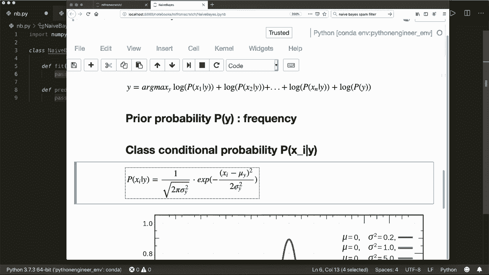

# 用 Python 和 Numpy 实现最热门的12个机器学习算法，彻底搞清楚它们的工作原理！＜实战教程系列＞ - P6：L6- 朴素贝叶斯 - ShowMeAI - BV1wS4y1f7z1

大家好。欢迎来到一个新的从零开始的机器学习教程。今天，我们将仅使用构建和Python模块及Numpy实现朴素贝叶斯分类器。😊 朴素贝叶斯分类器是基于贝叶斯定理的，该定理表明，如果我们有两个事件A和B，那么事件A的概率，给定B已经发生。

等于事件B的概率，给定事件A发生的概率，乘以事件A的概率除以事件B的概率。如果我们将其应用于我们的案例，那么我们的公式是类Y的概率，给定特征向量X，等于给定Y的X的概率乘以P(y)，再除以P(x)。

而x是我们的特征向量，它由多个特征组成。现在之所以称为朴素是因为我们假设所有特征都是相互独立的。这意味着，例如，如果你想预测一个人出去跑步的概率，给定太阳在照耀，以及给定这个人健康的特征。

然后这两个特征可能是独立的，但都对这个人出去的概率有贡献。因此在现实生活中，很多特征并不是相互独立的，但这个假设在很多问题上效果良好。根据这个假设，我们可以将这个概率分割。并使用链式法则。所以我们为每个特征计算概率。

给定y，并乘以每一个。然后我们将其乘以P(y)并除以P(x)。顺便提一下，P(y|x)被称为后验概率，P(x|y)被称为类条件概率，P(y)被称为y的先验概率，而P(x)被称为x的先验概率。

现在我们想要进行分类。给定这个后验概率，我们希望选择概率最高的类。所以我们选择y，即y的弧最大值。在这个后验概率中。现在我们可以应用我们的公式。因为我们只对Y感兴趣，所以不需要这个P(x)，所以可以将其划去。

然后我们的公式是这样，为什么是弧最大值。然后我们乘以每个类的条件概率，再乘以先验概率。然后我们用一个小技巧。因为所有这些值都是在0到1之间的概率。所以如果我们乘以很多这些值，那么我们会得到非常小的数字。

我们可能会遇到溢出问题。因此，为了防止这个，我们应用锁定功能。我们对每一个概率应用锁定。通过锁定或对数的规则，我们可以将乘法符号转换为加法符号。所以现在我们有了一个加法。现在我们有了我们需要的这个公式。

现在我们需要提出这个。AP 概率，所以先验概率就是频率。我们可以在一瞬间看到这一点。然后这个类别条件概率，即 P（x | y）。在这里，我们用高斯分布来建模。所以我们可以看到这个公式。所以这是 1 除以，然后是 2π的平方根乘以 y 的方差。

乘以指数函数的负 x 减去均值的平方除以 2 乘以方差。在这里，我们看到不同均值和方差的高斯函数的图。这个概率总是在 0 和 1 之间，是的，使用这些公式。这是我们开始所需的一切。所以现在我们可以。

开始并实现它。首先，当然，我们导入 Ny S N P。然后我们创建一个名为 naive 的类。但它不需要一个 init 方法，因此我们可以首先实现 fit 方法。我们希望拟合训练数据和训练标签。然后我们还想实现一个预测方法。

在这里我们预测测试标签或测试样本。现在让我们开始。所以我们从 fit 方法开始。我们可以在这里做什么。

所以我们需要先验，我们可以在这个 fit 方法中计算它们。我们需要类别条件。所以在这里我们需要每个类别的均值和方差。因此我们也可以计算这些。

所以让我们这样做。首先获取样本数量和特征数量。顺便说一下，我们的输入 X 是一个 nuy N D 数组，其中第一维是样本数量，第二维或行数是样本数量，列数是特征数量。所以我们可以解包这个并说这是 x.shape。我们的 y 是一个 1D 行向量，大小也为。

样本数量。这是我们的输入。现在让我们获取唯一类别。假设 self.classes 等于 nuy.unique(y)。这将找到数组的唯一元素。如果我们有两个类别，0 和 1。那么这将是一个数组，里面仅包含 1、0 和 1 y，以及 1。假设类别的数量等于。🤢，这个 self.classes 的长度。现在。

让我们初始化或。初始化均值、方差和先验。假设 self.mean 等于。我们想先用零初始化。它的大小为类别数量和特征数量的元组。所以它也。对于每个。类别。它有。每个特征所需的均值数量。

我们想要将这个或给它一个 float 类型，即 nuy.float64。我们想对方差做同样的事情。假设 self.do。玩儿。等于这个。然后我们希望 self.priers 等于 N.zeros。在这里，对于每个类别，我们希望有一个先验。所以这只是一个大小为类别数量的 1D 向量，数据类型为 N.float64。

现在让我们计算它们。因此对于self dot classes中的每个类别，我们。现在。我们只想要将这个类别作为标签的样本。因此我们将其称为X，C等于X。然后在哪里。C等于等于。Y。现在我们可以为每个类别计算均值并填充我们的self do mean。因此我们想填充。这一行和所有列。我们说，这是x。X，C。

dot和nuly有一个或一个N D。数组必须内置均值函数。因此我们可以沿着轴0计算均值。因此请自己检查均值。函数。我们想对var做同样的事情。因此self var在这一行的每一列。是X C dot var。因此Numpy也有一个var方法。然后我们计算先验，因此self。Priers。这个类别。等于。现在。

我们已经掌握了哪些信息。如果我们有训练样本和训练标签。我们可以说这个类别发生的先验概率等于该类别在训练样本中的频率。因此，我们说。我们得到X，C。形状为0，因此只有。这将获得带有此标签的样本数。然后我们将其除以总样本数。因此。

我们必须将其转换为浮点数，因为我们不希望这里是整数。因此我们说浮点数样本数。所以这是频率。这个类别C出现的频率。现在这就是我们fit方法的全部。现在让我们实现predict方法。因此为了这个。我们创建一个小的辅助方法。我们将其称为_预测self。

这只会获取一个样本。因此在这里我们可以有多个样本。因此我们说为什么预测等于，然后我们使用列表推导。调用这个_预测方法。仅用于一个样本。然后我们对测试样本中的每个样本执行此操作。然后，我们返回它们。现在我们必须实现我们的_预测方法。因此在这里。

我们现在需要的是我们需要。

应用此函数。因此。我们必须计算后验概率。并计算。每个类别条件和先验，然后选择具有最高概率的类别。

现在让我们创建一个名为posteriors的空列表。等于一个空列表。接下来我们遍历每个类别。假设对于索引和C在。枚举。Self dot classes。因此这里我们也得到了索引和类别标签，使用这个枚举函数。现在我们可以说。首先，我们得到pia。那么pia等于，我们已经计算出的p。因此这是。

self dot Priers的先验。在当前索引中。

现在，正如我所说，最后我们应用锁定函数。因此我们在这里应用它。因此我们说NP P dot lock。

然后创建后验。所以，后验等于。让我们称之为。类。条件。等于。然后我们应用高斯函数。所以对于这个。让我们创建这个辅助函数，称之为概率密度函数。使用self。然后它获取。类索引。然后它获取x。这里我们应用这个公式。

所以我们需要均值和方差。然后。嗯。应用这个函数。所以，首先。让我们得到均值等于。我们已经有均值了。所以我们可以说self。

该类别索引的均值以及方差等于self。Vre的该类别索引。然后我们创建一个分子，等于nuumpy点x。所以。负的指数函数。然后我们有x减去均值。的平方。除以。然后，两倍的方差。接着，我们有。分母，次分母等于。

在这里我们有N点。S。Co是Ts的平方根。两倍的。然后我们有π。我们也可以从Nami和Peter π中获得。乘以theva，然后我们返回。分子。除以。你知道我Na。所以这是我们的概率密度函数。然后我们可以说我们的类条件是。嗯。Self。点。我们索引的概率密度函数。

然后x。然后。嗯。我们想要。我们想要有logo的边缘。所以我们说N点锁。然后。

我们将它们全部相加。

所以，我们可以使用。Nampy点一些这个。嗯。然后我们说我们的后验。Tior等于。Pya，加上。类条件。我们的类条件。然后我们将它们附加到我们的后验。所以posteriors点附加后验。

现在我们使用或应用这个的arc max，并选择概率最高的类别。所以Ny也有一个arc max函数。所以这非常简单，所以我们现在可以说返回self点。

类。关闭，索引现在是。这。最高概率的。后验。所以我们可以说。N点Arc max。这张海报。现在，我们完成了。这就是整个实现。然后。现在我们可以运行它。所以我已经有一个小的测试脚本，我使用p Psych库加载数据集，并为每个样本创建一个包含1000个样本和10个特征的数据集。我们有两个类别。然后我们将数据分为训练样本和测试样本及其标签。

然后我们创建我们的朴素贝叶斯分类器，我从这里的文件中导入。然后我拟合训练数据和训练标签。然后我为测试样本获取预测。接着我会计算准确度。所以让我们运行这个，看看是否可以，这是否有效。所以，是的，这有效。

我们的分类准确率为0。96。所以相当不错。所以是的，就这些。我希望你喜欢这个教程，下次见，再见。
