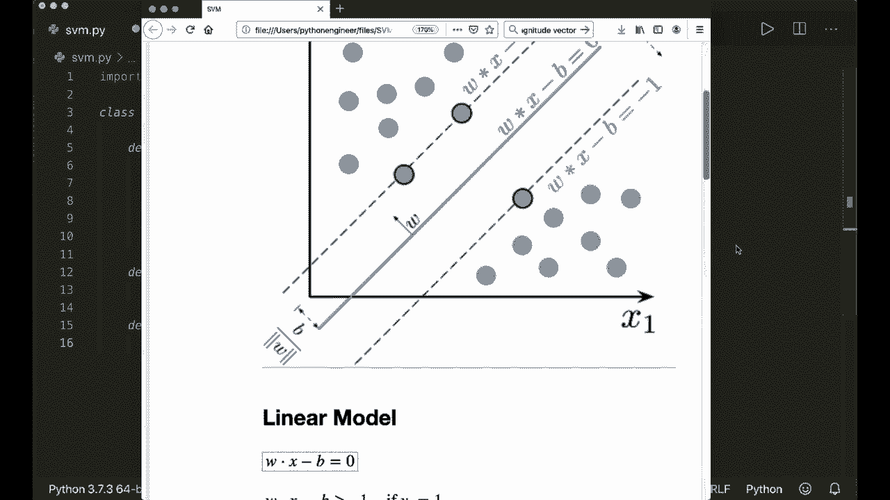
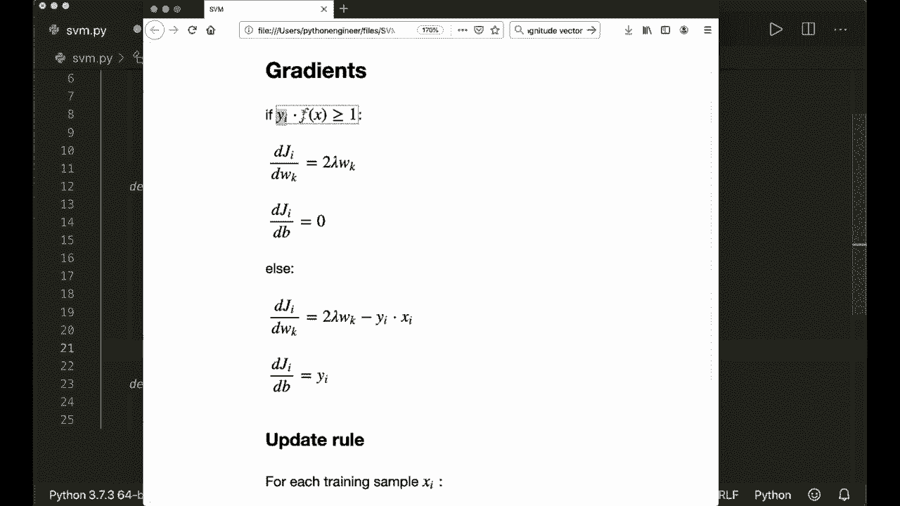
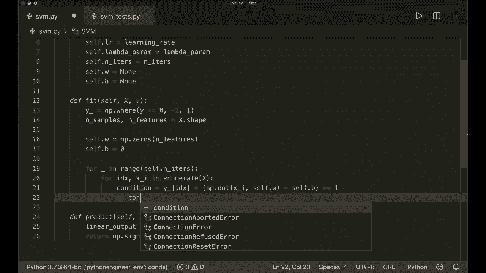
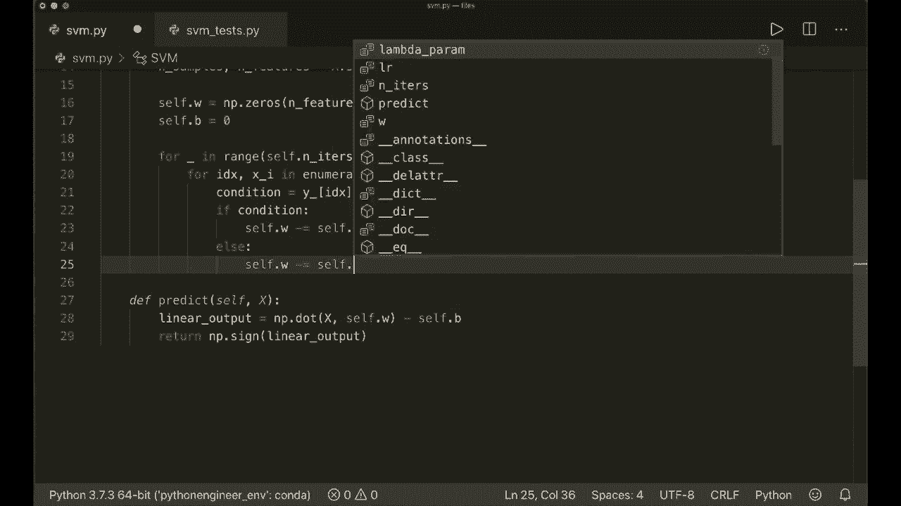
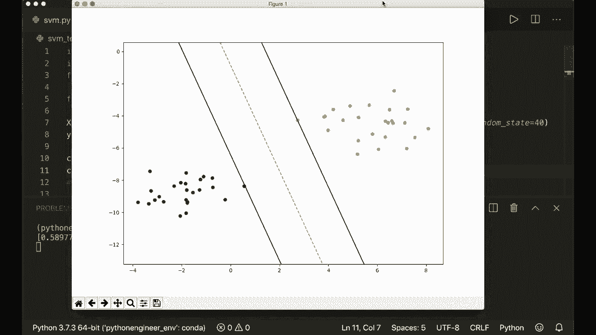

# 用 Python 和 Numpy 实现最热门的12个机器学习算法，彻底搞清楚它们的工作原理！＜实战教程系列＞ - P8：L8- 支持向量机 - ShowMeAI - BV1wS4y1f7z1

大家好，欢迎来到全新的机器学习入门教程。今天，我们将仅使用内置的 Python 模块和 Numpy 来实现 SVM 算法。😊 SVM 或支持向量机是一个非常流行的算法。它的核心思想是使用线性模型，寻找最佳分隔我们数据的线性决策边界，亦即超平面。

在这里，最佳超平面的选择是代表两个类别之间最大分隔或最大间隔的那个。因此，我们选择超平面，使其到每侧最近数据点的距离最大化。

如果我们看看这个图像，那么我们希望找到一个超平面，而这个超平面必须满足这个方程 W 乘以 x 减去 B 等于 0。我们希望找到超平面，使得到两个类别的距离最大化。因此我们在这里使用类别 +1，而在这里使用 -1。所以，这个间隔应该被最大化。首先，让我们看看背后的数学。

所以这比我之前的教程稍微复杂一些。但我保证一旦你理解了，最终的实现相对简单。因此，我们使用线性模型，W 乘以 x 减去 B，应该等于 0。然后我们的函数也应该满足 W 乘以 x 减去 B 应该大于等于 1。

对于我们的类别加一。因此，这里所有的样本必须位于这个方程或这条线的左侧。而类别 -1 的所有样本必须位于这个方程的右侧。所以如果我们用数学表示，那么我们应该满足 W 乘以 x 减去 B 必须大于等于 1 对于类别 1，或者对于类别 -1，必须小于等于 -1。所以如果你将这些放入一个方程中。

然后我们将我们的线性函数与类别标签相乘。这应该大于等于 1。这是我们希望满足的条件。现在我们想要得出 W 和 B，也就是我们的权重和偏置。为此，我们使用成本函数，然后应用梯度下降。

如果你对梯度下降还不熟悉，请观看我之前的某个教程。例如，在关于线性回归的教程中，我对此做了更详细的解释。那么现在，让我们继续。我们在这里使用一个成本函数。在这种情况下，我们使用铰链损失。

这被定义为 0 和 1 减去的最大值。而这里是我们的条件。Y I 乘以我们的线性模型。那么这意味着，如果我们绘制铰链损失，这里蓝线就是铰链损失。如果 Y 乘以 F 大于等于 1，那么这是 0。所以如果它们具有相同的符号，那么结果就是 0。

如果它们被正确分类并且大于1，那么我们的损失为0。这意味着如果我们再看看这个图像，如果。对于绿色的玻璃，如果它在这一侧。那么，它是0。对于蓝色类别，如果它在这一侧。那么也是0。否则，我们将得到一个线性函数。

所以，我们距离决策边界线越远，损失就越高。这是我们成本函数的一部分。另一部分是。正如我之前所说，我们希望在这里最大化间隔。所以在这两个类别之间，间隔被定义为2除以w的大小。因此，这取决于我们的权重。

依赖于我们的权重向量。因此我们希望最大化这个，因此。我们希望最小化大小。所以我们将这个或添加到我们的。成本函数中。因此，我们还添加这一项。W的大小的平方乘以一个lambda参数。然后这里是我们的铰链损失。所以lambda参数试图在这两个项之间找到一个折衷。

所以基本上这说明了哪个更重要。所以我们当然希望有正确的分类。我们希望位于线的正确一侧。但我们也希望线的间隔是。最大化的。嗯。所以，如果我们看看这两种情况，如果我们在正确的一侧。

如果Y I乘以F在x上，F的值大于或等于1。那么我们仅仅有这一项，因为铰链损失为0。否则，我们的成本函数就是这一项。现在我们希望最小化这个。因此，我们想要获得成本函数的导数或梯度。在第一种情况下。

如果我们大于或等于1。我们的导数仅为2倍lambda乘以W。因此，我们这里只看W的一个分量。因此，我们去掉大小。对B的导数为0。所以请自行确认。我不会解释导数和细节。在另一种情况下。

如果Y I乘以F在x上不大于或等于1。那么我们对W的导数是这里的方程。对我们的偏差的导数仅为Y I。因此，请再次自行确认。当我们有了梯度，我们可以使用更新规则。

所以新的权重是旧的权重减去，因为我们使用梯度下降。所以我们朝负方向前进，减去学习率或步长乘以导数。这是我们的更新规则。现在，我希望你能理解这个概念及其背后的数学。现在我们可以开始实现它了。这现在很简单。所以，首先。

我们当然导入Ny S和P！

然后我们创建我们的类S，我们将获得一个init方法。在这里我将放入一个学习率，默认值为0001。它将获得一个lambda参数，默认值也将得到。我会说这是001。所以这通常也是一个小值。然后它将获得我们优化的迭代次数。

这将获得默认值1000。所以我将简单地存储它们。我会说self dot L R等于学习率。Self do。Lambda Para等于Lambda Para。请注意，我不能在这里使用Lambda，因为Lada是Python中Lada函数的关键字。所以。是的，self do。然后它等于并且它的。然后我会说self dot W等于none，self dot B等于none。

所以我必须稍后想出它们。然后我们定义我们的两个函数。像往常一样。一个是预测函数，我们拟合训练样本和训练标签。对不起，这是fit方法。另一个是预测方法。我们预测测试样本的标签。现在让我们开始预测方法。

因为这非常简短，所以。

我们想要，如我所说，如果我们查看数学，我们应用这个线性模型。然后我们查看这个的符号。如果是正数，我们就说它是类1。如果是负数，我们就说它是类-1。所以我们说线性。

输出等于Ny dot。Dot，所以点积。X和self dot W的结果减去self dot B。然后我们选择大小。因此我们可以简单地说，返回Nampy dot的这个线性输出的符号。所以这是整个预测实现。现在让我们继续fit方法，所以。首先，如我所说，我们在这里使用类+1和-1。

所以我们想确保我们的y只有-1和+1。所以通常它有0和1。让我们转换一下。所以我们说y underscore等于。在这里我们可以使用nuy dot where，这将获得一个条件。所以我们说y。如果小于或等于0，我们就放-1，否则放+1。所以。

这将把所有的零或更小的数字转换为-1，其他数字转换为+1。现在。让我们获取样本数和特征数。这简单地是X dot Shape。因为我们的输入向量X是nuy和DRA。行数是样本数，列数是特征数。然后我们想要初始化我们的W和B。我们一开始简单地放入零。

所以我们说self。Tt W等于Ny的大小和特征的零。对于每个特征组件，我们将a0放入我们的权重组件中。然后我们说self dot B等于0。现在我们可以开始我们的梯度下降。所以我们说，for underscore。因为我们不需要在范围self dot中，它迭代。

所以我们想要进行的迭代次数。然后，我们迭代我们的训练样本。所以我说4索引和X，我在枚举X中。这将给我当前的索引和当前的样本。现在。

我现在想做的是让我们再看一下数学。所以我想计算权重或我们的成本函数关于W和关于偏差的导数。这里我首先，但首先，我会查看这个条件是否满足，所以我会说。条件是Y I乘以我们的线性函数。所以我说条件等于。

为什么当前索引使用下划线。乘以，然后是线性函数，所以。Nampai.dot。当前样本和我们的self.dot.W减去self.dot.B。嗯。这应该大于或等于1。所以如果满足这个条件并且条件是真的，否则就是假。所以现在我说如果。

条件，所以如果这是真的。那么，我们的导数看起来像这样。关于B的导数就是0。所以我们只需要这个，所以。我说。嗯。所以是两倍lambda乘以W。然后在我们的更新中，我们去。所以我们说新的方式是旧的权重减去学习率乘以这个。所以我将其写在一步中。

所以我说self.dot.W减去self.dot.learning rate乘以。现在在这里。

我们有两倍self.dot.Lambda参数乘以self.dot.W。所以这是第一次更新。或者如果我们的条件满足，我们只需要这个更新。否则，我们说self.dots.W减去self乘以L R学习率乘以。让我们再看看这个方程。所以是。

两倍lambda乘以w减去Y，I乘以X，I，所以。

两倍。我们的lambda乘以。W减去nuy.dot。所以我想乘以我们的向量，X，I和Y I，所以当前索引的y下划线。这是我们对W的更新，我们的self.dot.B是减去self乘以学习率乘以导数，而导数只有。

或者只是Y I，所以只有。

为什么索引使用下划线。现在我们完成了。这就是整个实现。现在让我们测试一下。所以我写了一个小测试脚本，它会导入这个SVM类，然后生成一些测试样本。它将生成两个玻璃。然后我会创建我的SVM分类器并拟合数据。

然后我写了一个小函数来可视化这个，所以你可以在GitHub上找到代码，顺便说一下。请自己查看一下，如果我们运行这个。所以我们说Python as we am underscore Te P。

现在，这应该计算权重和偏差，并且还应该绘制决策。

有趣的是这里的黄线和两边的两条线。我们看到它在工作。 所以，是的。这就是关于 S VM 的全部内容。我希望你喜欢这个。如果你喜欢，请订阅我的频道，下次见，拜。
