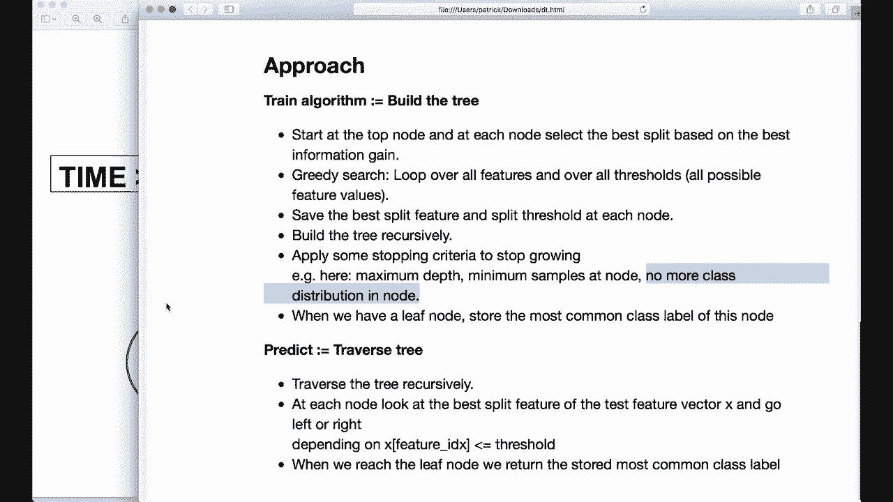

# 用 Python 和 Numpy 实现最热门的12个机器学习算法，彻底搞清楚它们的工作原理！＜实战教程系列＞ - P9：L9- 决策树第 1 部分 

大家好，欢迎来到新的机器学习教程。今天，我们将仅使用内置的Python模块和Numpy实现一个决策树。决策树是一个非常简单但强大的概念。其核心思想是构建一棵树来分割数据，以实现类别之间的最佳分离。

决策树也是非常流行的随机森林模型的基础，我们将在下一个教程中实现。因此，我希望你们能跟着我。😊，和往常一样，我们首先从理论开始。所以让我们看一个例子，以理解决策树背后的概念和数学原理。假设我们想预测一个人是走路还是乘公交车去上班。

我们有10个观察值或10个样本，具有两个不同的特征。所以我们有一个特征，即是否在下雨，然后我们有另一个特征，他们有多长时间？

然后我们得出预测或类别标签，是或否。

现在我们想构建一个将数据分割的树。所以我们把所有样本放在根节点，然后我们提出一个问题，我们问是否在下雨，如果答案是“是”。然后我们向右移动，把所有答案为“是”的样本放进去。所以这三个放在右节点，如果答案是否。

然后我们向左移动，把所有其他样本放入左节点。

这里在右侧，我们可以立即说答案是否，他们不走路。所以我们把。

或返回类别标签0。这里在左侧，我们可以进一步分割数据并扩展我们的树。所以我们问下一个问题。那就是他们是否有超过10分钟，如果答案是“是”，我们就向右移动，把所有的。

样本如果有超过10分钟的时间就放在右节点，所有其他样本放在左节点，然后在这里我们可以说答案是“是”或类别标签是1，而这里的类别标签是0。

我们也可以在这里停止生长并返回最常见的类别标签。所以我们可以说，他们更有可能走路。但我们也可以进一步分割数据，但我们不想让数据过度生长，因为我们不想过拟合数据。但我们也希望有一个好的预测。

所以这是决策树工作的概念，现在我们唯一需要找出的就是在什么节点上应用哪个问题，为什么我们一开始问雨而不是天气，为什么我们问时间是否大于10，为什么不问是否大于5或大于20。

所以这就是所谓的最佳。

划分特征和我们想要找出的最佳划分值或划分阈值。

所以，概念是。在每个节点，我们想找到最佳的划分值和最佳的划分阈值并存储它们。这是我们的训练阶段，后来当我们想预测一个新的测试样本时，我们从顶部开始，遍历我们的树，应用开始的问题或特征，然后向左或向右移动，直到到达叶子节点，叶子节点是底部的节点。然后我们应用基于测试样本存储的最常见标签。

所以这是这个概念。那么我们如何找到最佳划分呢？为此，我们需要一些数学。我们计算熵，熵也是不确定性的衡量标准。公式是负号，然后我们有p(x)乘以p(x)的对数的总和，而p(x)是发生次数除以样本总数。在我们的例子中，我们有110个样本，其中五次答案是0，五次答案是。

1。然后我们得出，熵是-5除以10乘以5除以10的对数减去。然后我们看下一个标签，所以再次，五个标签。因此是-5除以10乘以5除以10。如果你计算这个，那么结果是1。所以这是最糟糕的情况，在第一个节点我们无法预测是1还是0。

因为我们有相等数量的两者。

这里的样本或两类。所以一个是最糟糕的情况，这里的熵为0。这是最好的情况，我们非常确定我们有类0。

现在我们计算熵，然后对数据进行分割，并计算子节点的熵。接着我们计算通过这次分割获得的信息量，这个度量实际上称为信息增益。它是通过父节点的熵减去所有子节点熵的加权平均值来计算的。因此在我们的示例中，我们有根节点和10个观察值。

然后在左侧，我们有7个观察值，其中2个为零，5个为1。在右侧，我们有3个零。因此我们的熵是父节点的熵减去7/10乘以左侧的熵加上3/10乘以右侧的熵。

这是信息增益。

现在我们进行贪婪搜索，因此我们检查所有可能的特征和所有可能的特征值或阈值。对于降雨，我们检查它是“是”还是“否”，意味着1或0，对于时间特征，我们检查5、10、15、20、25和30，因此我们进行贪婪搜索。

然后，我们存储或选择并存储最佳特征和最佳阈值。所以这是。

概念，让我们更详细地看看这种方法。因此首先，我们有训练阶段，在此阶段我们想要构建我们的树。我们从顶节点开始，在每个节点，我们根据最佳信息增益选择最佳分割。

我们进行贪婪搜索，因此我们遍历所有特征和所有阈值。然后我们在每个节点保存最佳分割特征和分割阈值，并递归地构建树。

我们还必须应用一些停止准则来停止生长。在我们的示例中，我们将使用最大深度。

例如，我们说如果深度是3且为5，那么我们将停止。

我们在节点使用最小样本数。因此，例如，我们可以说如果一个节点中的样本少于五个，那么我们就不再进一步分割。

如果在一个节点中没有更多的类别分布，就像这里那样。我们就无法再进行分裂，因为这里只有类别 0 的标签。所以这些是我们需要的停止标准。当我们有一个叶节点时，我们会存储该节点中最常见的类别标签。所以这里我们存储 0、1 和 0。

这是我们的训练阶段，随后在测试新样本时，我们遍历树，并且也是递归进行。因此我们实现一个调用自身的函数。在每个节点，我们查看测试特征向量的最佳分裂特征，然后根据情况向左或向右走。

这个特征的值是否小于或等于我们存储的阈值？

当我们到达叶节点或底部时，我们返回存储的最常见类别标签。这就是这个概念。

决策 3。现在我想在这里停止这个视频，我们将在下一部分或第二部分继续实现。所以到时见。
