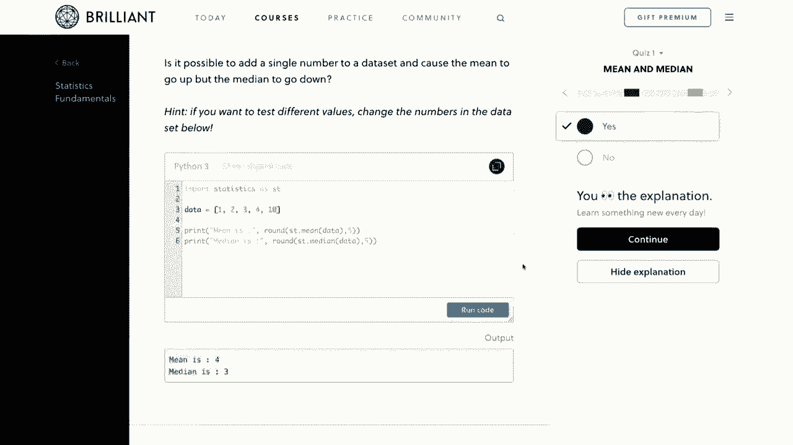

# 用Pandas进行数据处理与分析！真实数据&实时讲解，学完就能上手做数据分析了！＜实战教程系列＞ - P5：5）更新 - 修改Dataframe内的行列数据 - ShowMeAI - BV1M64y187bz

嗨，大家好。你们好吗？在这个视频中，我们将学习如何更改数据框中的现有行和列。在上一个视频中，我们学习了如何筛选特定信息，我们可以在这里使用那些技术来修改我们的数据。

所以我们将学习如何更新行和列的数据。接下来在下一个视频中，我们还将学习如何从数据框中添加和删除行和列。现在，我想提到的是，我们确实有这个系列视频的赞助商，那就是**Brilliant Org**。因此，我非常感谢**Brilliant**赞助这个系列。

如果大家能通过下面描述部分的链接查看他们并支持赞助商，那就太好了。我会稍后详细讲述他们的服务。所以说完这些，让我们开始吧。好吧，让我们看看如何更新我们行和列中的数据。在最近的几个视频中，我们已经看到如何筛选特定数据。

但现在让我们看看这些相同的概念，并用它们来对我们的数据进行更改。所以我们先看看更新列，然后再更新一些行。我目前在这里打开了我的片段文件😊，这是我们在之前的视频中看到的，以便在查看如何在更大的数据集（即堆栈溢出调查数据）上执行此操作之前，了解它在较小数据集上的表现。现在，在修改列之前，让我们先看看这些列，使用我们在之前的视频中看到的列属性。

所以让我在底部添加一个新单元。我们可以通过说`Df.columns`来查看列，我们可以看到这里只有三列。所以我们的列名是“first”，“last”和“email”。所以假设我们想要将列更新得更具体一些。

假设我想把这个改为“first name”而不是“first”。所以我们可以用几种方法来实现这一点。首先，如果我们想重命名所有列，我们可以简单地使用我刚才用过的列属性进行赋值。为了做到这一点，我可以在这里使用赋值，并传入一个列表。

所以我可以传入一个我想要的所有不同列的列表。我将其称为“first name”，“last name”，并将“email”保持不变。所以如果我运行这个，现在再看看这些列，现在我们可以看到这些列名已经改变。如果我实际查看这里的数据框，它们在数据框中也显示为已更改。

现在，我几乎从不使用这个，因为这是在传递不同名称给所有列时使用的，我通常只需要更改少数不同列的名称。现在，更常见的一件事情是需要更改数据框中每列的特定内容。

比如说，也许你的列都是大写的，你想把它们改成小写，反之亦然，或者也许你的列名中有空格，你想用下划线替换列名中的空格。在这种情况下，我们可以使用列表推导式。比如说，假设我想把所有的列名变成大写。那么为此，我可以使用列表推导式。

我可以直接说Df的列等于，然后我们就说像x.upper()，对于Df的列中的每个x。所以如果我在做完这个更改后打印出数据框，那么我们可以看到现在所有的列名都已转换为大写。另一个你可能想做的事情是去掉空格，用下划线替换。

特别是如果你喜欢使用点表示法来访问列名，那在列名中有空格时就不起作用，因为这不符合语法。所以如果你想用下划线替换空格，可以做类似的操作，直接说Df的列等于Df的列进行替换。

我们在这个列序列上使用STR方法。然后我们可以使用来自该序列类的replace方法。所以我可以直接传入一个空格，说明我们想要替换，把所有这些空格替换为下划线。现在这不会对我们的具体数据框做出任何更改，因为我们所有的列名中已经有下划线。如果我反转这一点，使用下划线和空格，那么我们可以看到我们将所有的下划线替换为空格，这可能不是你想要的，我更希望用下划线代替空格。

所以如果我们这样做，那就是如何替换所有这些。但让我先把这些列设置回它们之前的样子，我喜欢小写字母。所以我将把它们改回小写。到目前为止我们看到的所有内容都适用于我们的每一列。

但如果我们只想更改某些列呢？在这种情况下，我们可以使用重命名方法，并传入一个我们想要更改的列的字典。所以如果我想把名字和姓氏恢复到之前的样子，我可以说Df进行重命名。

现在我们可以传入列，并传入我们想要的字典。键将是旧值。所以我将把名字恢复为first。值将是该列名的新值。所以我们将名字映射为first，然后将姓氏映射为last。我只需要将其作为值放入，现在如果我运行这个。

这可能看起来像是成功了，但如果我查看我的数据框，那么这些更改实际上并没有生效。这是另一种方法，如果我们确实想让更改生效，我们必须说in place等于true，因为它只会让我们看到如果成功的话会是什么样子。

但实际上它不会改变。所以说in place等于true将使该更改生效。因此，现在如果我再次运行这个，那么我们可以看到那些列名被设置回原来的样子。好吧，这就是更新我们列的快速查看。现在让我们看看如何更新我们行中的数据。

我们将在视频的大部分时间里学习如何更新我们行中的数据，因为这里还有更多我们可以做的事情。所以首先，让我们看看如何更新一个单一的值。现在，在之前的视频中，我们看到如何使用lo和i Lo查找值，我们也将以此作为设置值的起点。

所以让我们抓取John Doe的这一行，它是行号2。让我们抓取这一行并将姓氏改为Smith。为了抓取这一行，我们可以简单地用索引标签2来抓取，所以我们可以说Df do lo of2。如果我运行这个，那么我们可以看到我们得到了这一行，名字是John，姓氏是Doe。

如果你想使用像我们在上一个视频中看到的条件来抓取那一行，那也是完全可能的。你可以这样做。现在，我们可以说，😊，Saaiid，你知道的。如果我们想作为一个条件，可以给我第一名为John且姓氏为Doe的行。那么现在，为了更新这些信息，我们可以有几种方法来做到这一点。

我们可以通过传入一个列表来传入所有的新值。因此，我可以说这一行我想设置为，并传入所有的新值。我会说我想保持John不变，我想让他的姓氏等于Smith，然后我们也来改变一下他的电子邮件。

所以John Smith的电子邮件是email co。所以如果我运行这个，然后我们查看我们的数据框，我们可以看到，现在最后一行有了新的姓氏和新的电子邮件地址。那么如果我们有很多列，但只想改变几个值会怎么样？想象一下，我们的调查数据有85个不同的列，所以如果我们想改变一行的单个列，而必须传入这个庞大的列表，那会很麻烦。

有85个不同的值。知道仅仅为了改变那几个值需要传入整个列表真的很糟糕。所以在这种情况下，我们可以仅使用Lo指定确切的列。同样，我们在学习如何使用lo过滤数据时见过这个。所以如果我只想改变姓氏和电子邮件，那么首先。

让我们抓取那些特定的值。我可以说Df do Lo，然后我可以传入2作为行。如果你记得，我们还可以将一个列表作为我们想要的列的第二个值传入。所以我会说，我想要姓氏和电子邮件。所以如果我运行这个，那么我们可以看到，我们只得到了姓氏和电子邮件。

现在我们也可以用上面使用的相同方法来更改这个。但我们不需要传入那些保持不变的值。所以我不需要再传入那个John的值，因为我们不再更改它。我们就把它改回Doe，以确保这有效。So John。Doe在email do com。

所以现在如果我运行这个，它应该完成赋值。现在如果我查看我们的数据框。我们可以看到那些已经被恢复。所以现在我们有John Doe和John Doe在email dot com。好吧，最后，让我们看看如何更改一个单一值。你可能能够猜到这怎么做。但我们可以做的就是传入一行中的一个列，并只更改那个值。

我们不需要传入一个列表。所以只需更改那个值。我会把这一行复制到这里。但现在我不想要这些列的列表。我们就改一下姓氏吧。所以这不再是一个列表了。现在我只是说我想要最后一列的行。我们就把它设置为Smith。哎，我得把那个放进字符串里。

如果我运行这个。那么我们查看我们的数据框。我们可以看到它只更改了那一个值。现在Pandas确实有另一个索引器叫at。这是专门用于更改或查找单一值的。老实说，我大多数时间都使用dot lo，但如果你需要的话，选项是存在的。我认为这是出于性能考虑。所以如果我想把这个改回来。

由于这只是一个单一值。那么我可以选择使用dot at，而不是dot lo。所以我在这里做同样的赋值。并且我会把它改回dough。但这次我会说dot at。我们就把它设置回去。如果我查看theta frame，那么我们可以看到这也有效。

我必须诚实地说，我得查看文档。我不太确定为什么我们在只需要获取或设置单一值时会使用dot at，而不是dot lo。也许是出于性能原因。但我个人发现即使对于单一值，我也常常使用lo和i Lo。我实际上在Pandas文档中查过，但上面只是说它存在。

这和dot Lo很相似。它并没有提供任何实际的理由说明为什么我们会使用它。但我想让你知道它是可用的，因为它显然是有原因的，并且还没有被弃用。好吧，现在让我给你展示一个非常常见的错误。那就是人们试图在不使用这些索引器的情况下更改一个值，而没有使用dot Lo或dot at。

让我给你展示一下这个错误或警告会是什么样子。假设我们有一个大的数据框，我们想找到这个John Doeper并将他的姓氏更改为Smith。我们可以使用过滤器来获取那个特定的行。所以我会下来到底部，在这里创建一个过滤器。

我会说数据框的邮箱列。等于等于 john.doe@email.com。这是我们要找的过滤条件。所以如果我把这个过滤条件应用到我的数据框中。就像这样直接传递到括号里。那么我们在上一个视频中看到，哎呀。这是过滤器，而不是 filter，因为 filter 是 Python 的内置关键字。

所以如果我把那个过滤变量直接传递到括号中。再次重申。我们在上一个视频中看到过。如果我运行这个，那么我们可以看到这对于查找这些值是有效的。所以实际上返回了一个只有一行的数据框。所以我们可以通过访问返回的数据框中的姓列来获取那个姓。

所以如果我运行这个，那么这也有效，我们可以看到我们得到了那个值。最后，你可能会认为为了将这个姓改为史密斯，我们可以直接上来这样说，好的。我们得到了那个值。现在我想把它设置为史密斯。所以如果我运行这个。

然后你可以看到这里弹出了一个大警告，如果我们看看这个警告。它说我们得到了这个带有复制警告的设置，所以我们得到了一个警告。但实际上，它并没有对我们的数据框进行更改。让我们看看我们的数据框。好的，我们尝试把那个姓改成史密斯，我知道我们在这些姓之间反复讨论过。

但那确实是这样。然后我们试着把它改成史密斯，但那并没有成功。所以当我们以这种方式进行赋值时，它并没有进行更改。现在，这里之所以不成功有点复杂。本质上是因为我们这样做的方式需要在后台进行多个操作，这会决定 pandas 返回我们的数据框的视图还是副本。所以当我们的值没有被设置时，是因为它被设置在一个临时对象上，而这个对象在之后立即被丢弃。

pandas 在解释这个特定警告方面做得更好，他们在警告本身中有一个小链接，直接指向文档。所以如果你想了解更多关于这个的内容，你可以点击那个警告或访问这个链接，它会详细解释。

但这个故事的核心是，当你设置值时，只需使用 dot loc 或我们已经看到的 dot indexers，你就不会遇到任何问题。因此我们可以在顶部重新运行相同的操作，实际上让我复制一下，这样如果有人想在我完成后查看这个笔记本，我会把它放在那里，如果人们想看到这个确切的错误，那么我会把那个单元留下来。所以我们可以重新运行这个确切的操作，但不直接使用这些括号，我可以说 df.loc。

然后我想将这些过滤器应用到我的行上，并且我还想抓取。姓氏列。所以如果我这样运行，然后查看我们的数据框。我们可以看到那个更改确实生效了。所以我们能够应用那个过滤器，然后在数据框中将姓氏设置为 Smith。如果你遇到这样的警告。

所以一定不要忽视它们，因为你知道，在这种情况下。它甚至没有设置我们认为我们要设置的值。所以你真的需要对这种情况小心。好的。这就是我们如何更新单行数据。那么我们如何更新多行数据呢？

嗯，我们有几种不同的方法可以做到这一点。因此，对于我们的第一个示例。我们假设我们想要更改所有的电子邮件地址，使它们都是小写的。这可能是你想要做的事情，以便使电子邮件地址更容易搜索。因此，为此，我们可以直接将那一列分配为它自己的小写值。所以首先。

让我抓取那些小写值，做到这一点，我们可以直接说 D F。然后我们可以访问。😊，那个电子邮件列。接着这将返回一个序列。然后我们可以在这个序列上使用这个 dot STr 类，并在那个字符串类上使用 lower 方法。所以如果我运行这个，那么我们可以看到返回的是所有这些电子邮件的小写版本。

如果我查看原始数据框中的内容。那么这些内容有混合的大小写。而现在这些都是小写的。现在，这只是返回这些电子邮件的小写值。它并没有实际进行更改。现在，为了进行更改。我们可以简单地将那一列分配为这个值。因此，我可以在这里说 Df email 等于 Df email dot string dot lowercase。

如果我运行这个，然后查看我们的数据框。现在那些更改确实生效了，我们的所有电子邮件现在都是小写的。这是我们一次性更改多行的一个方法。也许。我们想做一些更高级的事情。因此，我们可以通过几种方法来做到这一点，我们将逐一讨论所有四种流行的方法。

很多人对这四种方法感到困惑，所以我们逐一讨论每一种，并试着详细解释它们。人们会感到困惑确实是有原因的，因为它们在功能上非常相似。我将要讨论的四种方法是 apply、map、apply map 和 replace，让我正确拼写一下 replace。所以首先，让我们看一下 apply。apply 用于对我们的值调用一个函数，它可以在数据框或系列对象上工作，对于这两种不同的对象，其行为可能会与你预期的有所不同。

所以首先，让我们看看 apply 是如何在一个系列中工作的。所以当我们在一个系列上使用它时，它可以将一个函数应用于我们系列中的每个值。例如，假设我想查看我们所有电子邮件地址的长度。也许我们有一个网站，我们想确保没有电子邮件地址过长或类似的东西。

所以我可以通过做一些类似的事情，将 LN 长度函数应用到我们系列中的每个值。我可以说 Df 并访问那个电子邮件列，然后我可以说点 apply L。所以我们将应用这个 L 函数。当我运行它时，我们可以看到它在这里做的事情是，它在说，好的，第一行电子邮件地址的 L 值是 23。

所以我从未实际计算过我的电子邮件地址中的字符数，但它告诉我是 23。然后这个说是 17。然后它说这个也是 17。所以这是一个快速的方法，我们可以使用 apply 获取一些关于我们数据的信息。我们也可以用它来更新值。因此在这个例子中。

我只是想创建一个简单的函数来返回我们的电子邮件的大写版本，但这个函数可以复杂得多。所以让我在这里写一个简单的函数，做我想要做的事情。所以我会说，我们就叫这个函数更新电子邮件，它将接受一个电子邮件值，然后我只会返回那个电子邮件的大写版本。

所以电子邮件 dot upper，让我运行这个。现在再次，这只是一个超级基础的例子，如果我真的想将电子邮件地址转换为大写，那么我只需做我们之前将其转换为小写时所做的相同事情，但我只是把这作为一个例子。

所以当我们应用函数时，通常是为了进行一些比我们在这里所做的更高级的更新，但让我们将这个函数应用到我们的电子邮件列。为了做到这一点，我们可以说 Df 并访问那个电子邮件列 dot apply，然后我们可以传入那个更新电子邮件的函数。

我们刚刚写的函数现在我们不想执行这个函数。所以你不想在这里放括号。你只想传入函数而不带括号，这样我们传入的是函数本身，而不是其执行版本。

所以让我运行这个单元，我们可以看到现在我们得到了一个电子邮件地址大写的系列。现在如果这实际上并没有改变我们的值或像之前那样改变我们的行。那么为了做到这一点，我们可以将其分配给我们的列。所以我可以把我们在这里写的内容，然后我可以将那个系列设置为应用了那个函数的系列。所以如果我运行它，然后我们查看我们的数据框。

然后我们可以看到，现在我们的电子邮件地址都是大写的。现在再次，这只是一个相当简单的函数。我们所做的就是返回这个电子邮件 dot upper。现在，对于像这样的简单函数，你可能会看到人们使用 lambda 函数。如果你对 Lambda 函数不熟悉，基本上。

它们是匿名函数，可以有特定名称或没有特定名称，我们可以用来做这样的事情。那么在这个例子中它会是这样的。所以假设我想把这些转换回小写。所以我可以做的是，我将抓住这个。现在我要在这里传入一个 lambda 函数进行 dot apply，而不是传入我们写的那个其他函数。

所以我会说 Lambda。如果你不熟悉 lambda 函数。那么语法在这里可能会有点奇怪。但基本上我们这里有一个无名函数，然后我们想要返回的内容。所以我想返回 X dot lower 的那个传入的参数。如果我运行它，然后再查看我们的数据框。

然后现在我们可以看到我们的电子邮件的小写版本。所以如果你更喜欢写常规函数，那么你可以这样做。但如果你习惯写 lambda 函数，而你的函数不太复杂。那么你总是可以像我们在这里做的那样来做。现在我们正在处理字符串。

但是你也可以将其用于数字，我们可以运行任何我们想要的计算。好的，这就是 apply 在系列对象上的工作方式。所以现在让我们看看 apply 在数据上的工作。到目前为止，我们只使用这个与系列。每当我们像这样访问一列时。它返回一个系列。再次，当我们在系列上运行 apply 时。

它对该系列中的所有值运行了一个函数。现在，当我们在数据框上运行 apply 时。它对该数据框的每一行或列运行一个函数。让我们看看这是什么样子的，它应该更有意义。所以让我抓住上面我们运行 L 函数的例子。

让我复制这个并粘贴到这里。然后我们将看看在数据框中这是什么样子的。所以再次，这给我们的每个值在那个电子邮件系列中的长度。所以你可能会认为你可以对整个数据框运行这个相同的 apply 方法，它会给我们数据框中每个值的长度。但实际上并不是这样。所以让我们看看这会给我们什么。

所以， instead of 访问特定的列。我们就说 Df dot apply。并传入那个 L 函数。如果我运行这个，那么我们会得到一个你可能意想不到的响应。所以这里发生的事情是，它并没有将长度函数应用于数据框中的每个值。它实际上是将长度函数应用于数据框中的每个系列。

特别是列。所以基本上这告诉我们，名字列的长度是三。所以如果我们在上面查看，我们可以看到名字有三个值。告诉我们姓氏有三个值，电子邮件也有三个值。所以这只是每列中的行数。如果我们手动检查其中一个的长度，我们也可以得到相同的结果。

所以如果我说 Ly 并访问这些列之一，然后运行这个。我们可以看到，这给我们带来了三。所以这基本上是 apply 在数据框上所做的事情，但它是针对每一列的。如果你更改轴的话，也可以将其应用于行。因此，我们可以在这里更改轴并说不。

我想在行上做这个，哎，我放错了，应该放行。我运行这个时又犯了一个错误，实际上不需要放行，行是默认的。我本来想放列。所以如果我放列的话，我们现在也可以看到结果是三。但现在它的计算方式是这样的。

所以它说，好的，行 0 有三个值，但它说，好的。这些值是 Cory Schffer，然后是电子邮件，它没有向下计算。所以基本上，我们希望使用在整个数据框上使用 apply 时，对序列对象有意义的函数。例如，假设我们想从每一列中抓取最小值。那么。

序列对象有一个最小值方法。所以我们可以将其传入 apply，以查看每个序列的最小值。现在，在我们的示例数据框中，我们有所有字符串值。所以如果我们从字符串序列中抓取最小值，它只会返回按字母顺序排列的第一个。

那么我们来看一下这会是什么样子。我们可以到这里，并说 Df.dot.apply。现在让我传入那个序列最小值方法。所以我可以说 Pd 是我们导入的熊猫，Pd.dot.series.do.min。运行这个后，我们可以看到，好的，它说在第一个类别中按字母顺序排列的第一个是 Cory，姓氏中排在首位的是 do。所以这就是。

这是 D，这两个是 E，这很合理。然后我的电子邮件在这两个电子邮件之前。现在，可能用一系列数字数据来看看会更好，因为对于数字数据，这些东西显然更有意义。所以如果我们在数字数据上使用序列的最小值。

然后这显然会给出每个数字的最小值，我们也可以使用 lambda 函数。但你只需记住，lambda 将在序列对象上工作。所以如果我到这里，可以说 Df.dot.apply。现在让我们传入一个 lambda。现在，这里的 X。这个 X 将是一个序列，而不是一个值。那么，序列有哪些方法呢？

嗯，序列有一个最小值方法。所以让我们返回最小值并运行它。我们可以看到这给出了与上面这个相同的响应。现在，就像我说的，这算是一个人为的例子，因为我们可以通过使用数据框的最小值方法得到相同的结果。但我只是想指出这实际上是怎么工作的。

当数据框包含数值数据时，这更加有用。例如，我们可以使用 nupy 对所有系列对象应用平方根或任何类型的数值分析。好的，在系列上运行 apply 将一个函数应用于系列中的每个值。在数据框上运行 apply，就像我们在这里做的那样。

它对数据框中的每个系列应用一个函数。但你可能会想，是否有办法将函数应用于数据框中的每个单独元素。这就是 apply map 的用途，apply map 仅适用于数据框，系列对象没有 apply map 方法。让我给你展示一下这有什么不同。

让我们使用那个内置的长度函数，并将其传入 apply map。我将说 Df.dot.apply map。现在让我们传入那个内置的长度函数。如果我运行这个，那么我们可以看到这将长度函数应用于我们数据框中的每个单独值。因此，名字有这些字符。我的名字是 Cory。所以 C O R E Y。

那是五个字符。然后是 Jane 和 John。那是四个字符。我们之前看过电子邮件的长度是 231717。这就是它在这里的作用。它对数据框中的每个元素应用那个函数。所以这可能是你们一些人预期的 apply 方法在数据框上的工作方式。

但我们改用 apply map。现在我知道这可能有点令人困惑，但希望在看到这些差异后，何时使用哪个会更有意义。因此，例如，由于我们在这个示例中有一个充满字符串的完整数据框，如果我想让它们都变为小写，那么我可以这样做，我可以说 Df.do.apply map，然后我只需传入字符串的 do lower 方法。

所以如果我运行这个，那么我们可以看到现在数据框中的所有值都是小写。如果你的数据框中有数值数据，那么你会在这里遇到错误，因为你无法对数字运行字符串方法，所以你需要传入一个处理得当的更复杂的函数。现在我们已经了解了 apply 和 apply map，希望这些对你更有意义。

现在让我们来看看映射方法。映射方法仅适用于系列。因此，映射用于将每个值和系列替换为另一个值。例如，假设我们想替换几个名字。我可以说 Df 并访问那个名字列，它也是一个系列，然后我可以在此上使用映射方法。

现在我将传入我们想要替换的值的字典。假设我想将 Cory 替换为 Chris，而将 Jane 替换为 Mary。如果我运行这个，那么我们可以看到它返回了一个系列，其中这些名字被替换掉了。

所以科里是这里的第一个值。现在是克里斯，简现在是玛丽。现在我想指出的一点是，我们所替换的值被转换为N N值，而不是数字值。现在这可能是我们想要的，也可能不是。我会在查看一些真实的Stack Overflow示例时展示这个。

在这个例子中，我们可能不想去掉这些其他名字。所以你可能在想，好吧，如果我想保留约翰，但只是替换这些其他名字怎么办？如果是这样的话，那么我们可以使用替换方法，而不是使用映射。

我将把这个复制粘贴到这里，而不是使用映射，我可以使用替换。如果我运行这个，那么我们现在可以看到结果基本上是完全相同的，除了现在我们没有将约翰替换为N A N值。再说一遍，我们在这里所做的所有操作并没有实际改变数据框。

如果我们想将其设置为实际的列，那么我们需要做一些这样的事情。我们可以说Df的第一列等于数据框的替换版本。所以如果我运行这个，然后查看我们的整个数据框，那么现在我们可以看到这些值被替换了。好的。

现在我们已经看了很多更新行和列中信息的不同方法。接下来，让我们转到更大的数据集，看看如何在实际案例中应用我们在这里学到的东西。让我看看我的Stack Overflow调查数据。因此，我们在这里打开了我们的Stack Overflow调查笔记本。

在这个系列中我们一直在使用的。而且，如果你想下载这些笔记本或Stack Overflow数据以便跟随，那么所有这些链接都在下面的描述部分。好的，那么我们来将我们在这里学到的一些内容应用到这些数据上。在上一个视频中，我们讨论了过滤。我们查看了过滤超过某个金额的薪资。

工资的列名在这里某处。这是这个。Con comp。现在，我假设这是“转换补偿”的缩写，并且它是转换为美元的。所以假设我们想把这个列重命名为更清晰的名称。那么，我将把这个列重命名为salary USD，而不是converted comp。

如果我们还记得视频早些时候的内容，我们可以使用重命名方法。所以如果我下移到这里，我可以说Df.dot rename，然后我们只需传入我们想要重命名的列。所以我会在这里传入一个字典，但这只会有一个值。所以我们想要更改converted comp。

我们想将其设置为，我称之为`salary USD`。所以如果我运行这个。让我去看看这是否看起来不错。好的，这看起来不错。那已经改变了。现在在你确保它进行了你想要的更改之后，并且这不是一个错误。然后我们可以通过将`in place`设置为`true`来实际应用到我们的数据框中。

这就是为什么在`in place`等于`true`时实际上是个好主意，因为有时你知道，当你在使用pandas时，我们总是在做不同类型的重命名和过滤，有时我们会做错事。因此，检查并确保你所做的更改是你想要的总是更好，然后再将更改应用到数据框中，以便真正巩固这些更改。现在让我们看看我们是否可以访问`salary USD`列。如果我查看它。

然后我们可以看到这个数据框中确实有一个`salary USD`列，所以那个更改是有效的。那么我们还可以做些什么来查看我们已经学到的内容呢？这里有一个例子。在这一系列中我们已经查看过这个hobbyist列几次。

这是一个人们在调查中回答的列，询问他们是否在空闲时间将编码作为爱好。让我们快速看看这一列。我们在这里可以看到一些是、是、否的值。让我实际在这里打印出来。因此，我将访问那个hobbyist列。

我们可以看到这里有一堆是和否的值。所以假设我们想要转换这些值，将所有的是响应映射为一个真正的布尔值，而否映射为假。那我们该怎么做呢？一种方法是使用我们刚学到的map方法。我们可以这样说。😊，D F hobbyist dot map。

然后在这里传入一个我们想要进行替换的字典。因此，对于是的值，我将其转换为布尔值`true`。对于否的值，我将其转换为布尔值`false`。所以如果我运行这个，然后如果我们比较一下。我们在这里得到的结果和我们在这里得到的结果。

我们可以看到所有的“是”都映射为`true`，所有的“否”都映射为`false`。现在，我不认为实际上有一个`in place`参数用于map。因此，我们可以做的是将那个序列设置为映射后的版本。现在。

如果我运行这个并查看我们的数据框，现在我们可以看到整列现在是布尔值，而不是是、否的值。现在，记住，当我们使用map时，任何不在我们字典中的内容。所以任何不属于是或否的回答都会被转换为`NaN`值。我认为在这项调查中还有其他列包含是。

没有和不确定的回答或者类似的东西。所以如果我们只想替换“是”或“否”的值，而保留其他值不变。那么我们可以使用替换方法。不过在这个例子中，使用映射也是可以的，因为我知道这一列只有“是”和“否”。好的，这是对我们在这个视频中所学内容的快速回顾。

我不打算再详细讲解一次，因为这个视频已经有点长了。但我确实想给你展示一些如何更新值的例子，以及这些如何应用于像这样的实际数据，比如这个调查。所以在我们结束之前，我想提到我们为这个视频找到了一个赞助商，而这个赞助商就是brilliant.org。

在这个系列中，我们一直在学习pandas以及如何在Python中分析数据，而Brilliant将是补充你在这里所学的内容的绝佳方式，他们提供一些出色的动手课程，有一些出色的课程和教训，深入探讨如何正确思考和分析数据的基础知识。

我真的推荐查看他们的统计课程，教你如何分析图表并确定数据的显著性。我也推荐他们的机器学习课程，它将数据分析提升到一个新水平，讲述了允许机器做出决策的技术，当变量过多时人类无法考虑。因此，为了支持我的频道并了解更多关于Brilliant的信息，你可以访问brilliant.org/cs进行注册。

此外，前200位访问该链接的人将获得年费高级订阅的20%折扣。你可以在下面的描述部分找到该链接。再次强调，访问brilliant.org/cs。好的，我想这就是本次pandas视频的全部内容。我希望你能对如何更新行和列中的信息有一个好的了解。

我们一开始比较简单，只是在特定位置进行更改，然后在学习apply map和apply时变得更高级。现在，我知道这些对某些人来说可能会有点困惑。但希望你能理解它们的工作原理。现在，最初。

我本来还打算在这个视频中展示如何添加和删除行和列。但这个视频有点长了。所以我会把这个内容留到下一个视频。在下一个视频中，我们将学习如何从数据框中添加和删除行和列。这应该会是一个更短的视频。不过，如果有人对我们在这个视频中讨论的内容有任何问题。

如果你有任何问题，请随时在下方评论区提问，我会尽力回答。并且如果你喜欢这些教程并想要支持它们，最简单的方法就是给视频点赞并表示支持。将这些视频分享给任何你认为会觉得有用的人，也是非常有帮助的。

如果😊，你可以通过Patreon进行支持，相关页面的链接在下方的描述部分。请确保订阅以获取未来的视频。感谢大家的观看。
