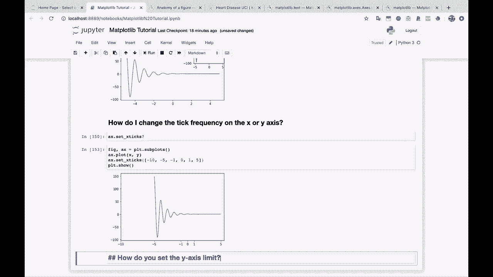
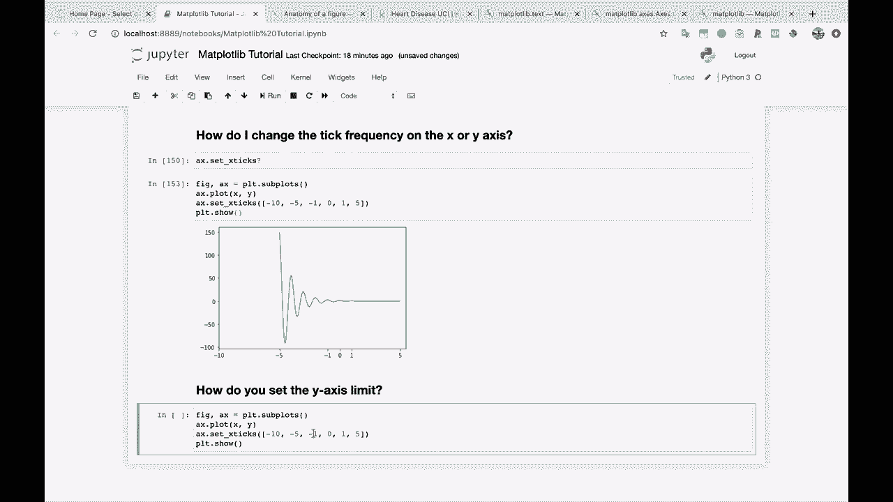
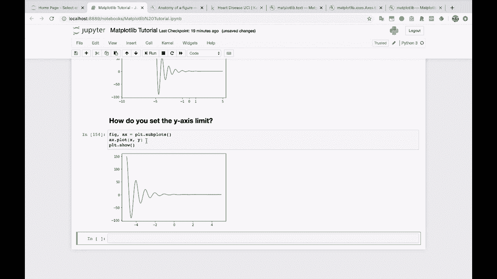
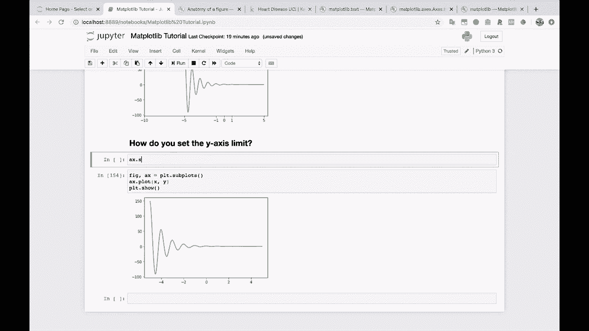
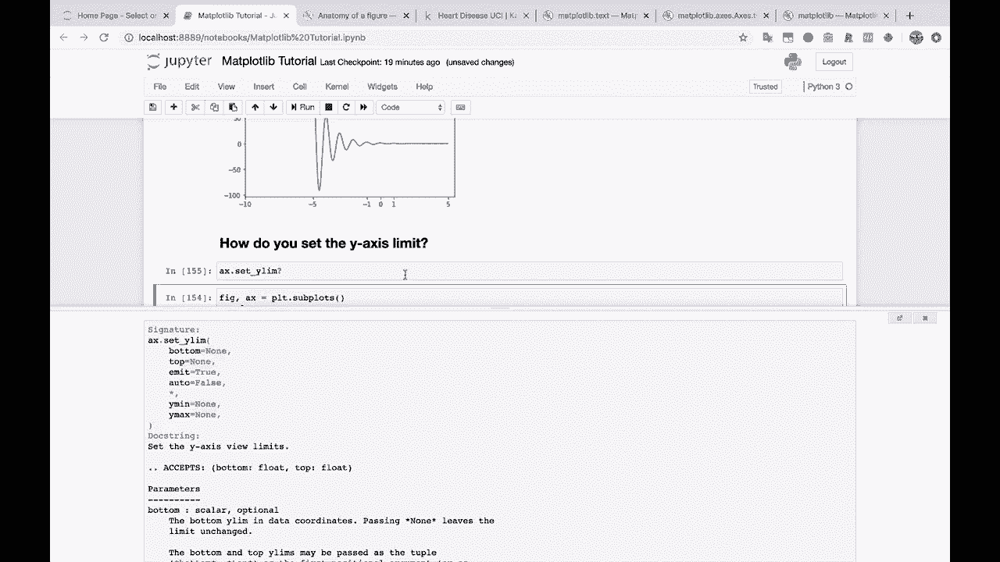
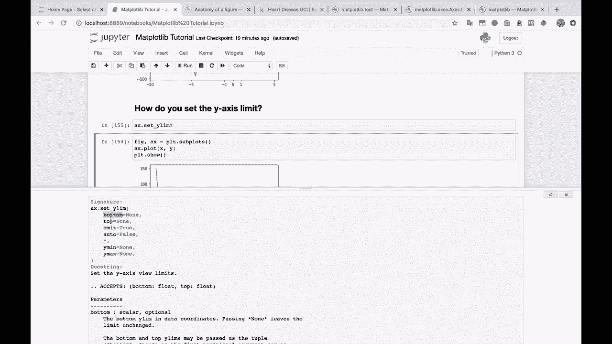
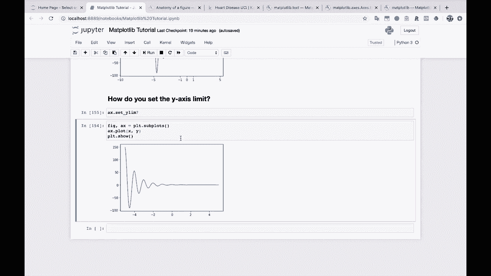
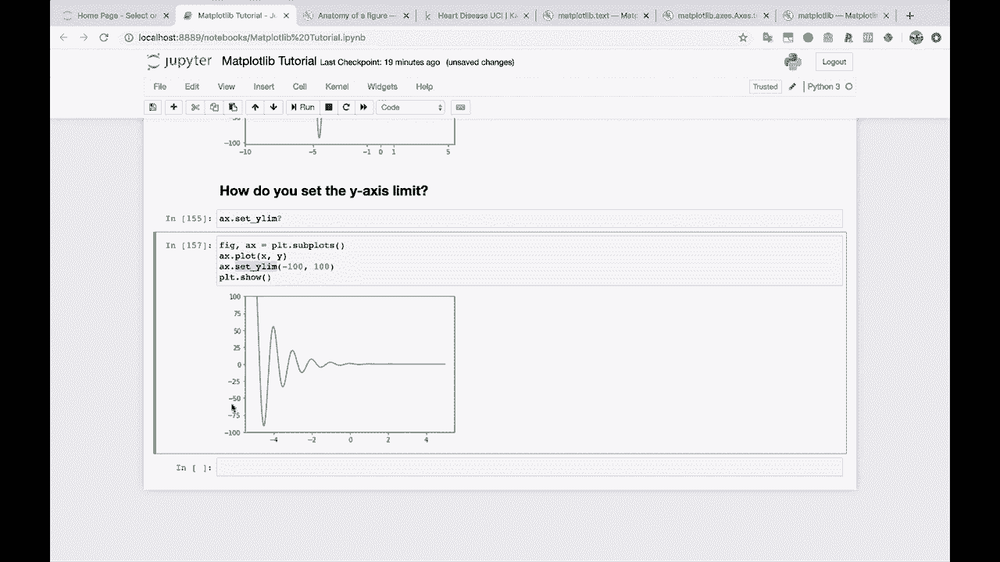

# 绘图必备 Matplotlib，P16：16）设置 y 轴上下界 

要做到这一点。好吧，下一个是我常用的一个。那么如何设置 y 轴限制，每当你有一个普通图表时。

像这样。

Mat Ploot Live 只是尝试确定你想要什么样的 y 轴，有时有效，有时无效。

我们可以这样做。如果你执行 A X dot set，然后我们就尝试设置 Y Li。就这样。

所以为什么 La，你可以传入底部，可以传入顶部，这里还有一些其他选项。但我通常喜欢的用法是。

你只需说。A X dot set Y Li，然后传入最小值和最大值。所以也许我们想看看从 0 到 150。就这样。这张图从 0 到 150 是这样的。或者也许我们想看看，从负 100 到 100。看看它是这样的。所以你可以使用这个 set y lamb。 

收缩或扩展你的 Y 轴。
