# 绘图必备 Matplotlib，Python 数据可视化工具包！150 分钟超详细教程，从此轻松驾驭图表！＜实战教程系列＞ - P5：5）Matplotlib 图形的组成部分 

运行这个。现在，我将在这里创建一个新的 Markdown 单元，添加一个新的一级标题，我将标注为第一部分。Matplotlib 的组成部分。为了开始，我想在这里明确一点，这样我们可以准确看到我们在绘制的内容。所以我将说 x，让我们创建一些数据来绘制。因此我将说 x 等于。

我将在这里创建一个列表：-3，-2，-1，0，1，2，3。我们也可以用 Python 的 range 函数来做到这一点，这完全没问题。并且我将导入 Numpy，作为 np，因为 Matplotlib 通常期望一个 numpy 数组，如果你之前没有太多使用 numpy，那么你会知道。

你可以基本上把它想象成一个列表或一个矩阵。因此，你可以有一个一维数组，这只是一个列表，或者你可以有一个二维数组，更像是一个有行和列的矩阵，你还可以有三维数组等等。

我将创建 x 等于 np.array，从 -3 到 3。现在，让我们为 y 创建 x 的平方。因此，我们只是在这里做一个简单的 x 和 y 的平方。查看 x，我们有我们的数组，从 -3 到 3。如果查看 y，我们只是将每个数字平方。因此，9，4，1，0，1，4，9，等等。

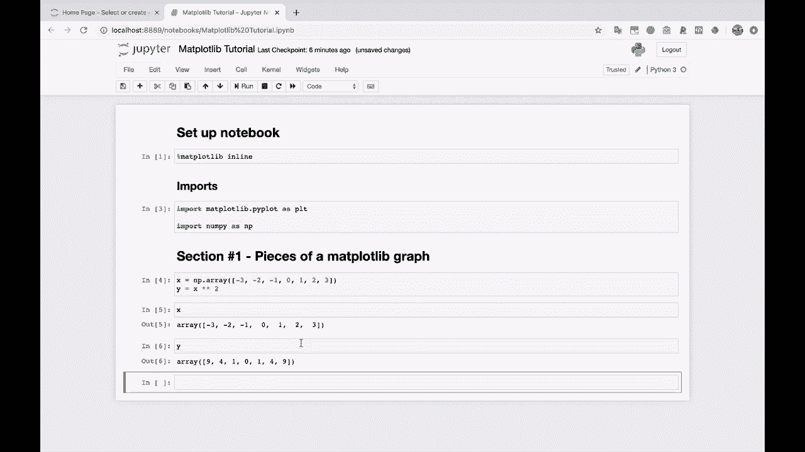

要在 Matplotlib 中创建一个图，这是我推荐的基本公式。你在刚开始时总是使用这个，虽然还有其他方法，但我们现在不谈那些。我们只是给你一个可以用于绘图的公式。

我建议你现在总是这样做。因此，首先你要说 fig 和 x 等于 PLT。subplots。然后你将在这里写下所有的绘图代码。所以在这里写下你的绘图代码。你知道，点点点，这就是你实际想要绘制的内容。

最后，执行 PLT.show。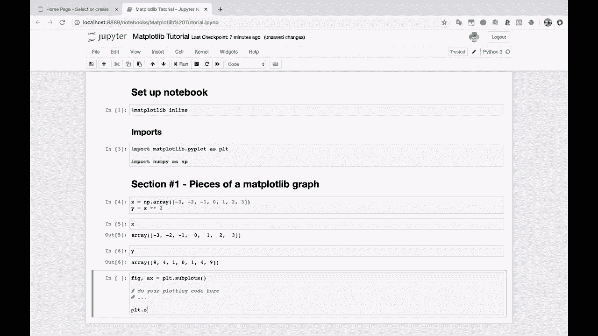

这是公式。这是你的绘图公式。因此，我在这里创建一个小的三级标题，标注为你的绘图公式。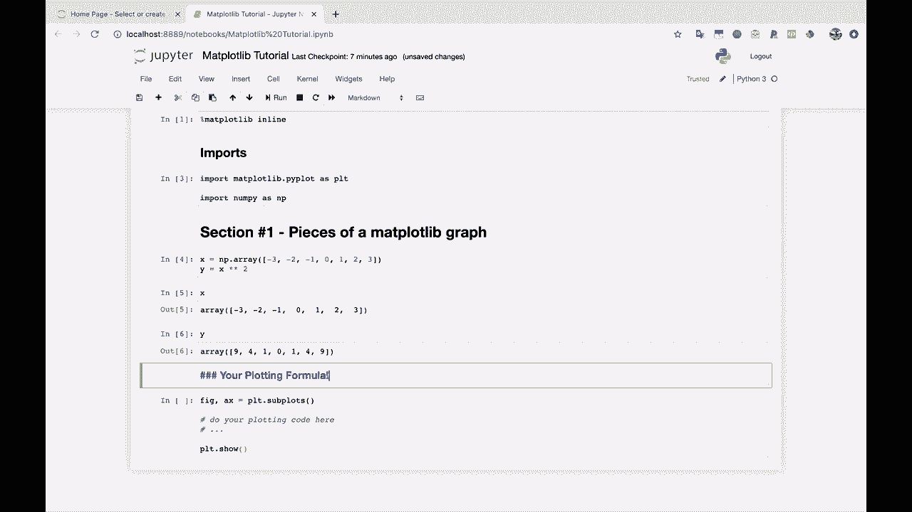

好吧。所以我们要做的是我们将说 fig x，这代表图形，而 aes，不是 ais，而是 aes。这有点令人困惑，我们稍后会讨论。fig x 等于 PLT.subplots。我们将做 PLT。how，现在我们要绘制的代码是 x.plot，x 和 y。

好的，来吧。我们的第一个mapte plot Lib图表。美丽吧，真的。实际上有点颠簸，实际上有点丑。但只需这些小代码，我们就能生成图表。这很酷。从这里开始，我们将逐层添加复杂性。😊。

但这是绘图和mapplotlib的基础。你总是要实例化你的图形和轴。除非你要保存文件，而不是在这里显示它，否则你总是要以Ptl.show结束。然后在中间，这就是你要进行所有绘图的地方。你可以有。

你知道，你可以在这里绘制一条线，或者你可以绘制100条线进行各种疯狂的格式化。所以这是告诉你这些术语实际上意味着什么的好地方。为此，我们将去便捷的Matt plot Lib。

图形的部分。图形的解剖结构。让我们看看。来吧。这正是我想要查看的。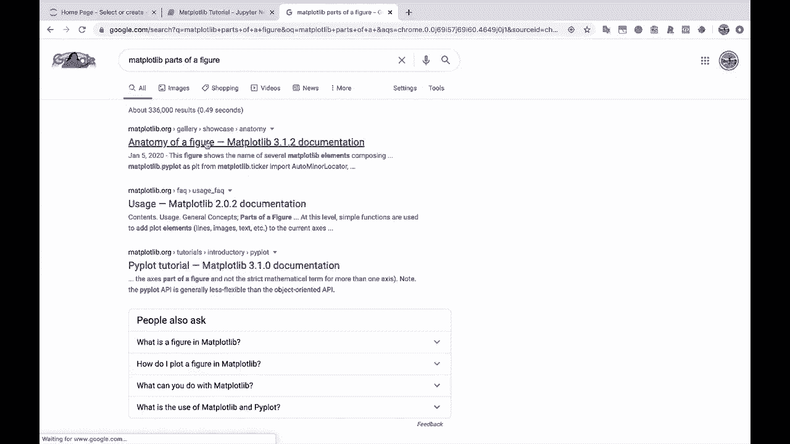

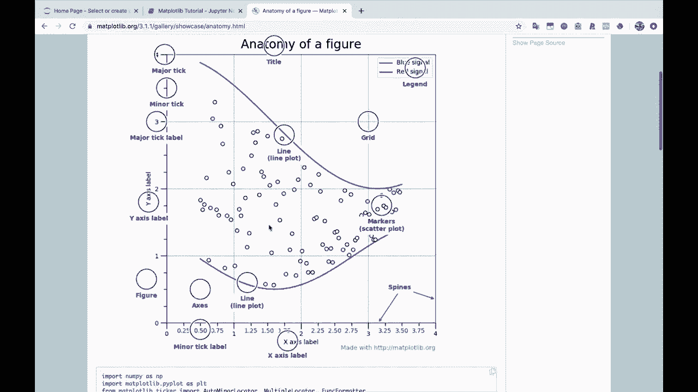

所以这就是matte plot lib图表或map plotlib图形。如果你理解这是什么，这将帮助你进行绘图。让我们谈谈这里的主要部分。图形，图形。所以你知道，这个圆圈指向看起来像空白的地方。这是因为图形，maplalib图形就是整个图表。

所以你的图表多复杂都无所谓。无论这里有多少条不同的线和不同的点，你甚至可以在这里有很多不同的小图表。整体称为图形。现在，在图形旁边，你会注意到aes。A X，E，aes。这就是我们可能认为的图表本身。

所以图形是你将放置所有图表的地方。然后a Cs将成为图本身，带有x轴和y轴，以及一些线和点和所有这些东西。

为了让这个更清楚一点。我们再过来看看。我现在要给你展示一个单一图形的样子。一个带有两个轴的单一图形。所以subpls。在这种情况下，我将做一行两个列的轴。我稍后会解释这一点。

好吧。所以，现在我们有一个单一的图形。图形就像这里的这个图像。你看我怎么点击并拖动这个图像。这个就像一个你可以在这里下载的单一图像文件。整个就是你的图形。现在，你的轴，A X，E，S。这将是这个图表。所以这个图表就是一个轴。

这里的图是另一个坐标轴。因此我们有两个坐标轴。这就是我在这里创建的。我创建了一个，这是我想要的坐标轴的行数。还有两个，这是我想要的坐标轴的列数。然后我对每一个坐标轴进行了绘图。这就是上面的原因。

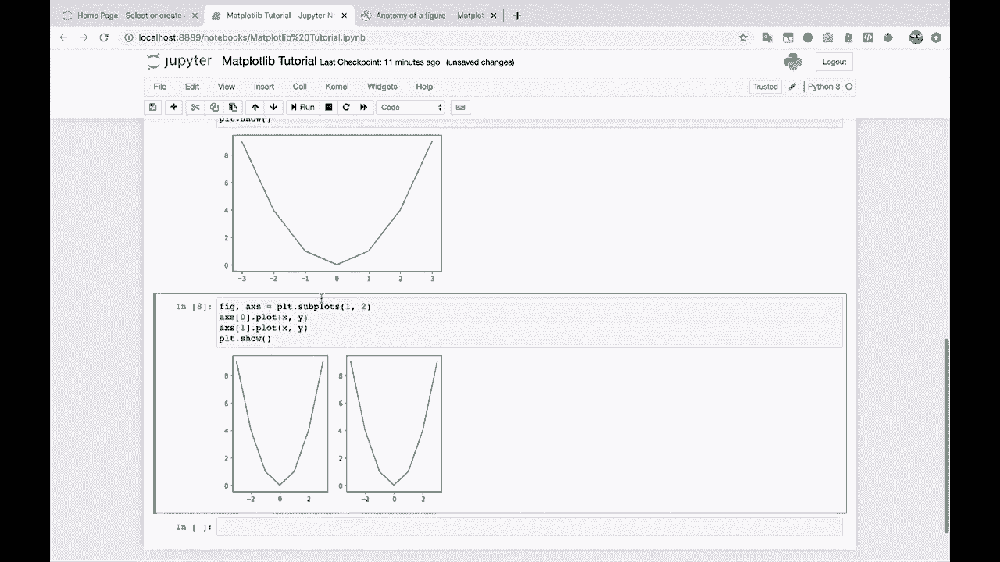

我们有一个坐标轴。我们在这个单一的坐标轴上绘制了X和Y。因此，x与y，负3，负2，负1。这就是你的x，然后是0。

到0，1，4，9等等。这就是你的y。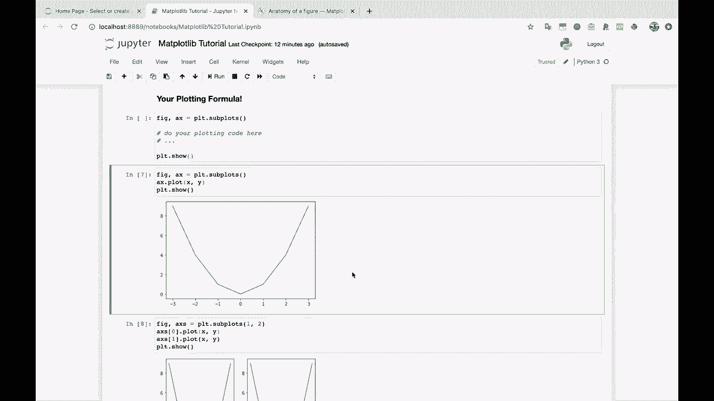

所以下面，我们仍然有一个单一的图形，但现在有两个坐标轴。好的。现在，在每个坐标轴中，这是非常令人困惑的。它们可能可以在命名上做得更好。

你有你的x轴和y轴。这可能是我们通常认为的一个轴。然后对于每个坐标轴，你可以有一个坐标轴标签，有坐标刻度标记，坐标轴上有网格线。然后上面的y轴也是如此。然后你有实际的绘图，所以你可以有一个线图。

你可以为散点图设置标记。在我们的例子中，在这里。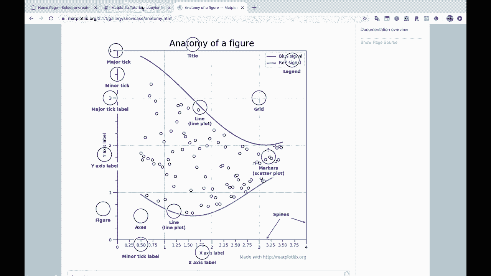

我们有X ses1，它有自己的X轴和Y轴。也许为了更清楚，让我们在第二个上绘制x的三次方。所以x的三次方现在将在这个坐标轴上。因此你会看到每个都有自己的x轴，x轴和自己的y轴。每个都有自己的线，自己的线对象在这里。这一切都被封装在一个单一的图形中。好的。

所以我希望这对你有所帮助。我们首先创建图形，然后创建坐标轴，接着在坐标轴上绘图，最后，无论何时完成所有的绘图，我们展示它，展示图表。好的，希望这对你来说有点清楚，至少我认为人们诚实地使用Matplotlib多年而从未查看过这里的图形，看看所有不同的部分。

所以请记住，这个图表，整个图形被称为一个图，在每个图中，你可以有多个坐标轴，这就是你实际进行绘图的地方。

每个坐标轴都有一个x轴和一个y轴，然后这就是你进行线图和散点图的地方，等等。为了真正强调这一点。

所以，我要在这里复制这个，而不是制作一个一行两列的子图。我将制作一个两行两列的子图。让我们先绘制这个。在我们对坐标轴本身进行任何绘图之前，先展示一下。所以我要在这里创建一个注释，创建一个图，包含四个坐标轴。嗯，2。

让我们看看。两行两列的图表。在每个。行。

好了，我们来了。你会看到我们有一个单独的图形。所以如果我想拖动这个，你知道的。你会发现这看起来就像一个单独的图像。我们有四个不同的坐标轴。我们有一个两行两列的坐标轴网格。每一个坐标轴都有它自己的 x 轴和 y 轴。我们可以在这些坐标轴上绘制任何我们想要的东西。

在这种情况下返回的坐标轴，由于我们有一个两行两列的网格，实际上也是一个二维数组，用于绘图。所以为了绘图。我会在这里使用二维索引，向你展示我们该如何做。

可以在这些图形上绘制东西。所以我在零行、零列上绘制东西。所以这个，然后第一行和第一列，这个在这里。我们也可以在。0，1 和 1，0 上绘制东西。顺便说一下，我做的所有这些。让我们。也许做一个 x 的四次方。你觉得像是。

像是 x 的对数或者类似的东西。让我们，试试这个。好的，我们。我们必须在对数中除以 0。

让我们来做。让我们做一个指数函数。也许可以这样。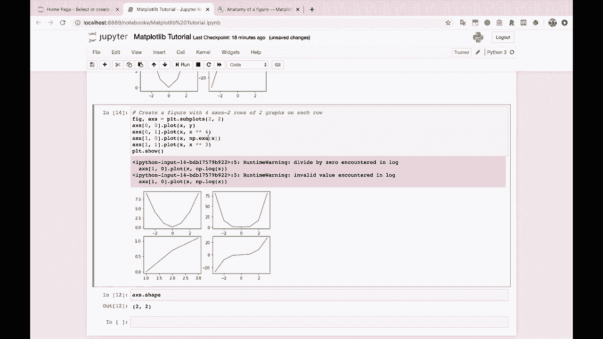

所以你看，我们现在有四个不同的图形。在四个不同的坐标轴上。它们都在一个单独的图形内。所以。所有东西都在一个单独的。图形内。好吧。我真的想强调这一点，因为你在 Matplotlib 中做的其他一切。将依赖于你理解这些坐标轴对象以及你在这些坐标轴对象上绘图的事实。

如果你想绘制。某些，你知道的，两个图像并排。好吧。你现在明白这些是在一个单一图形上的两个不同坐标轴。如果你想在相同的坐标轴上绘制两个不同的图形，嗯，现在，你知道。即使我们还没有这样做，你可能会在想，好的。

我知道我会使用相同的坐标轴来进行绘图。这其实是我们马上要进行的内容。所以在我们继续之前。我想在这里给你展示最后一件事。那就是。你可能会注意到这些图形相当不平滑，对吧，你在想，哦。

嗯，这看起来不是一个很美的抛物线。它有点不平滑，所有图形都会这么丑吗？答案是，不。答案是这些图形之所以不平滑，是因为我们给 Matplotlib 绘图的只是这些点。所以，为了让这一点变得非常清晰。

我将介绍一些我们尚未查看的东西。这就是散点图。这就是散点图。因此，使用散点图，你现在可以真正看到，因为我们只定义了x和y点。记住，我们只定义了x和y点x。和y总共4,7个数据点。因此我们在负值中有3个。我们有0，然后在正值中有3个。

所以这就是为什么我们有这么少的数据点。然后当你用一条线连接这些点时。

好吧，那么你最终得到的是一种看起来有点碎的图。因此，为了展示这一点。让我们看看需要什么来创建一条平滑的线，而要创建一条平滑的线。我将使用nuy。

nuy方法或者对象，这里是一个范围。如果你从未使用过范围，你可以用我最喜欢的Python技巧之一，这里是问号来获取文档。

所以N P点a范围，这里是操作，这里是文档字符串。你给它一个开始，你给它一个停止，然后你给它一个步长，然后它返回。

在给定区间内均匀分布的值。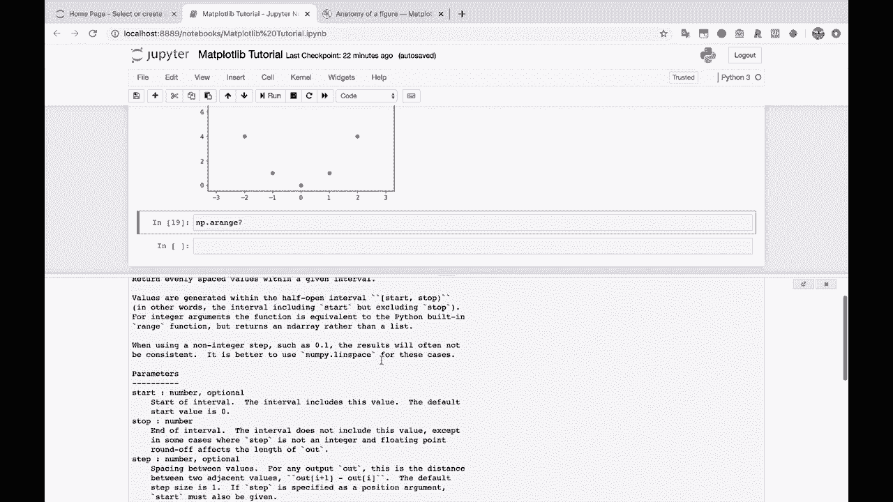

所以开始数字，停止数字，以及数值之间的间隔。因此，比如说。创建一个从负5到5的范围。并让它们之间的间隔为0.01。如果我运行这个。你会看到，哇，很多值。这真是很多值。这是多少值呢？

好吧，那是1000个值。完美。因此让我们把这个作为我们的X。现在让我们做和之前一样的事情。Y等于x平方。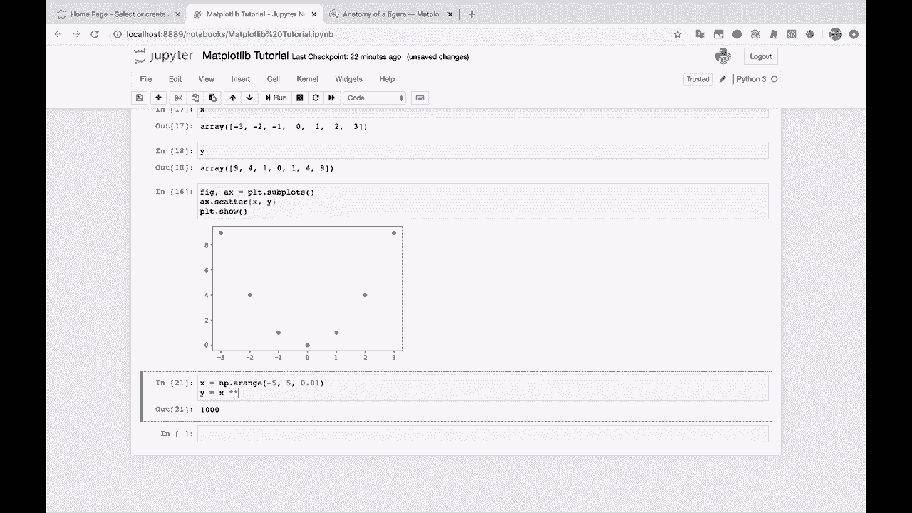

现在。如果我们绘制。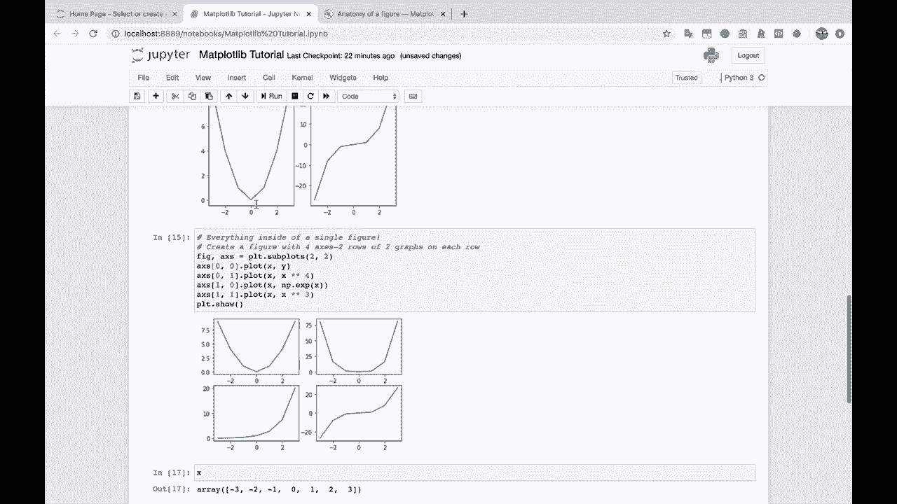

x与y，就像我们之前做的那样。现在，你看，我们有一张非常平滑的图。那是为什么呢？好吧。那是因为。

这是因为，如果我们绘制。

散点图，再次是x与Y。你看，每一个都是一个点。因此，我们现在有1000个数据点在这里定义这张图，而不是可怜的7个。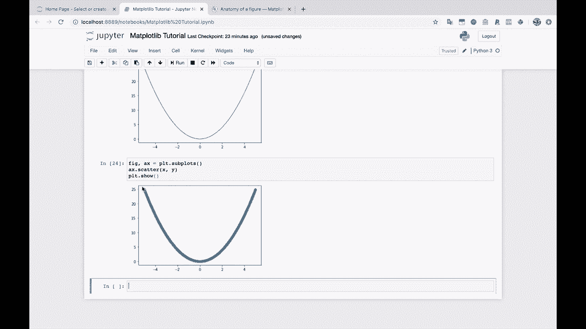

这可能是让人困惑的事情，尤其是当人们第一次开始使用Matplotlib时。你知道的，他们会想，嘿，为什么我的图看起来是这样的。好吧，那是因为这个。那是因为你传递了多少点。你传递给matplotlib要求它绘制的点。因此在这个例子中。我们只传递了7个点。在这个例子中，我们传递了1000个点。

我们得到这张非常美丽的图。其实，我来给你展示一下。😊。

让我给你展示一下。让我们创建一个原因。让我们创建一个 Y 阻尼。阻尼振荡，我拼写为 oscillation。我认为那是 ocill。Leicn。你总是忘记你的拼写和这样的事情。阻尼振荡。所以我只是因为这很有趣而这样做，而且它很美丽。所以我将快速向你展示一个好看的。😊，美丽的图形是怎样的。

所以我们做 E 的负 x 次方乘以 N 点 pi，随便吧。你不必了解这些。顺便说一句，这只是为了好玩。所以我们增加我们的 y。现在让我们做 fig Ax 等于 Pl T 点子图。让我们做 AX 点 Plate。X 对 Y，阻尼振荡。PL D 点 show。看看这个，难道不是很美吗，难道不是很好吗。

我们这里有 1000 个数据点，帮助展示这个图形。这就是为什么它看起来如此美丽和平滑。😊。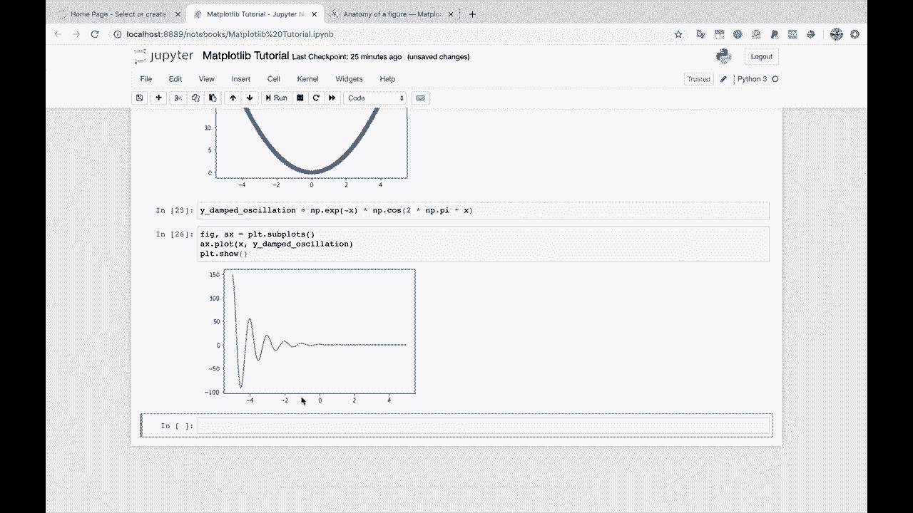

好吧。介绍够了。我希望你对 map plot Lib 图形的组成部分有了更好的了解。我将把这个复制到章节标题下。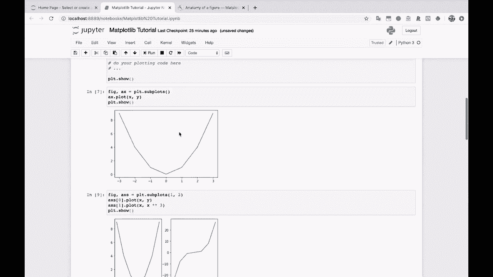

就作为一个小参考，让我们保存我们的 Jupiter 笔记本，然后继续。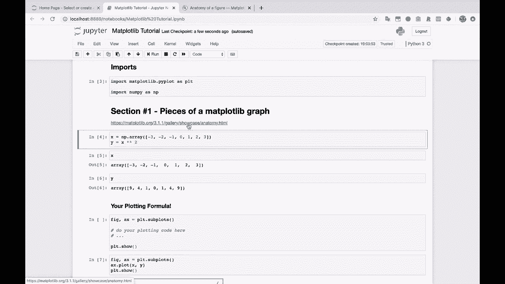
