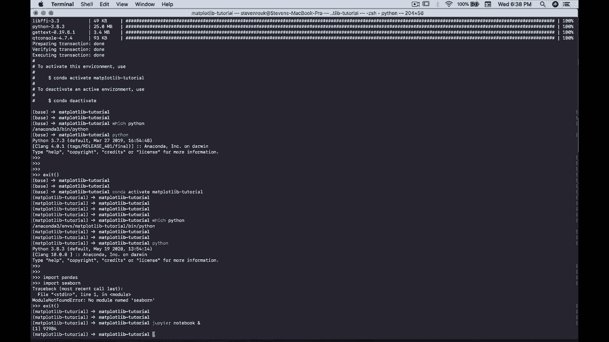

# 绘图必备 Matplotlib，Python 数据可视化工具包！150分钟超详细教程，从此轻松驾驭图表！＜实战教程系列＞ - P4：4）启动 Jupyter notebook 并设置我们的 notebook 

现在我将要做的是，我在我的 Maplot Lib 教程文件夹中。我要运行 Jupyter notebook，然后，我们将继续进行其余的 Maplotlib 教程。

在我们的 Jupyter notebook 中。那么让我们关闭这个其他的 Chrome 窗口吧。

这是我们的 Jupyter notebook 界面。我将打开一个新的 Python 3 笔记本。我们在这里命名为 Maplot Lib 教程。这样就可以开始了。我们要做的第一件事是创建一个 markdown 单元，通过输入字母 M。然后我将进入这里，创建一个标题 1，并说，设置笔记本。😊

在笔记本中，当我使用 Maplot Lib 进行数据可视化时，我喜欢做的第一件事就是这样。百分号，mapplot Lib。内联。所以。我们在这里不需要花太多时间，但本质上，你可以用不同的方式在 Maplotlib 中运行数据可视化。

在 Jupyter notebooks 中，Maplotlib 的内联将是你最受欢迎、最常用的选择之一。我会把它设置为笔记本中的第一个单元，然后基本上忘掉它。让我们更深入地探讨一些实际的数据可视化，因为关于 Mapplot Lib，你会很快发现，有这么多强大的功能，可能会让人感到不知所措，并且有这么多选项，也会让人感到非常困惑。

我将尝试为你提供一些我们可以做的最简单的内容。然后我们会逐步增加复杂性，但我确实希望你限制一开始要考虑的内容。因此，让我们开始吧。导入 Matplotlib。我们将使用的主要绘图子模块是 Pyplot。

Matplotlib 还有各种其他子模块，你可以通过按下 tab 键查看所有这些不同的子模块。这里有很多东西。但无论如何，我们使用 Pyplot，并将其导入为 PLT。这将是你几乎总是导入 Matplotlib 的方式。

那么让我们继续吧。
