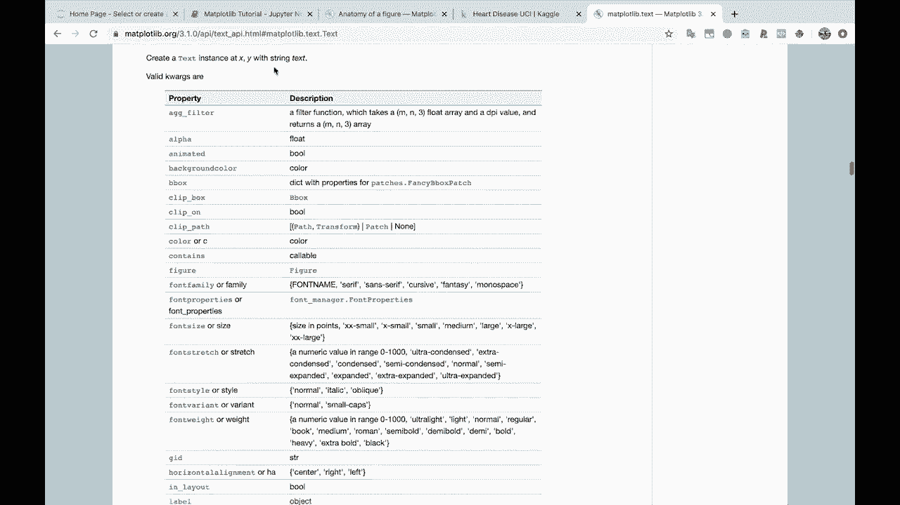
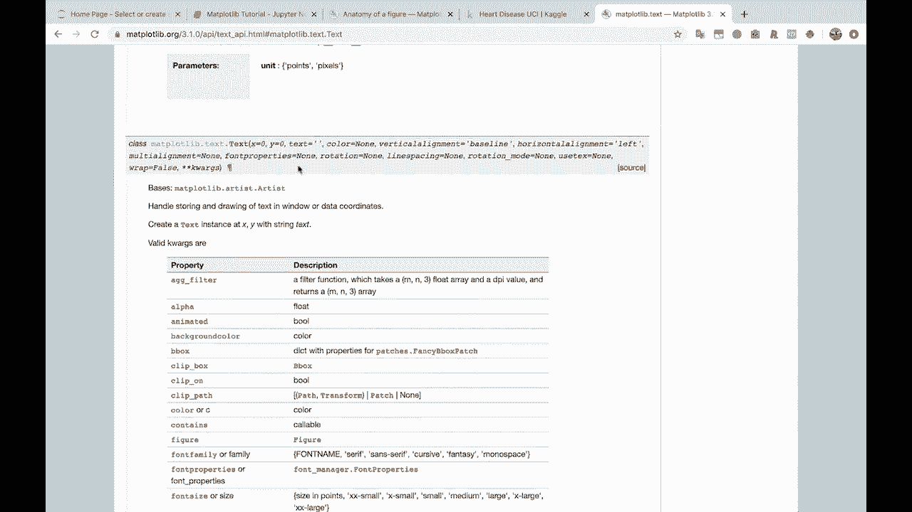
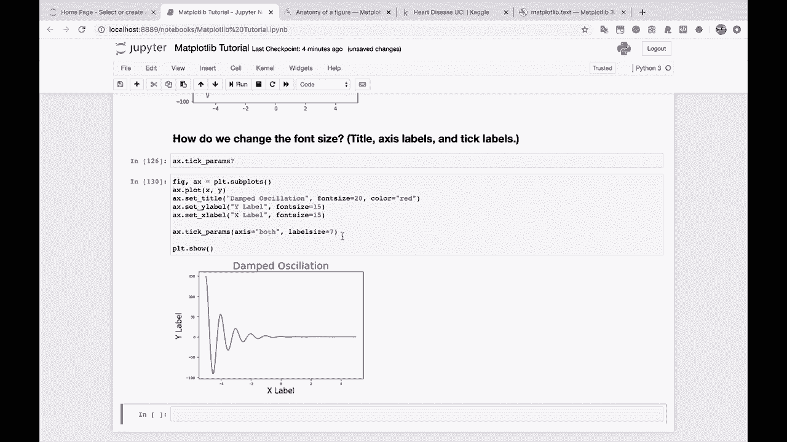
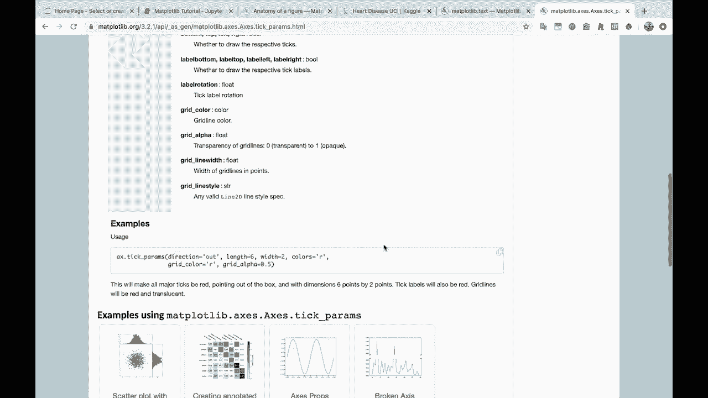
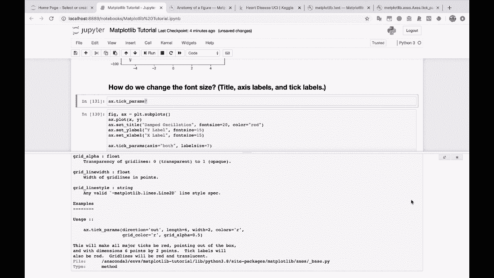
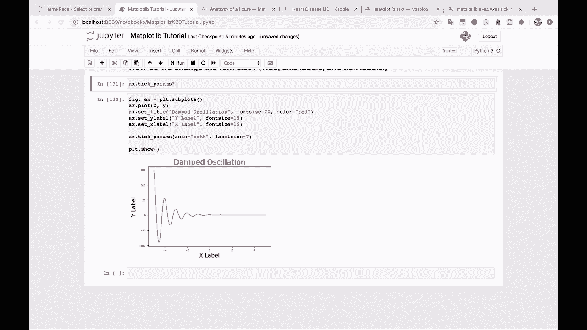
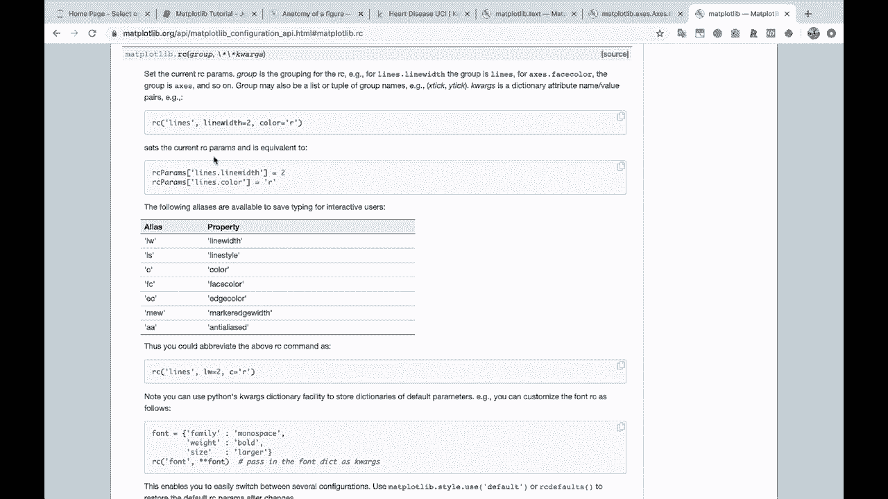
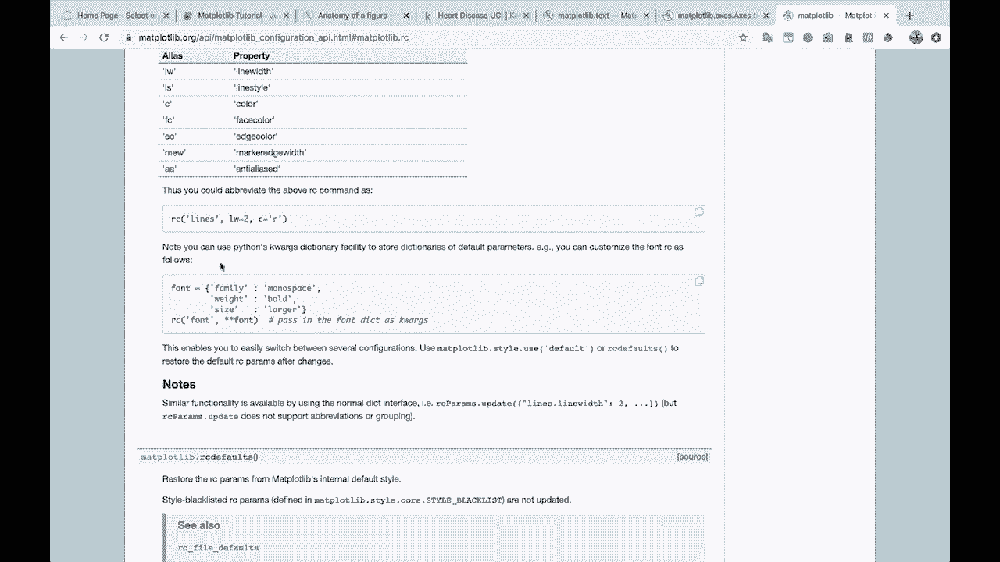
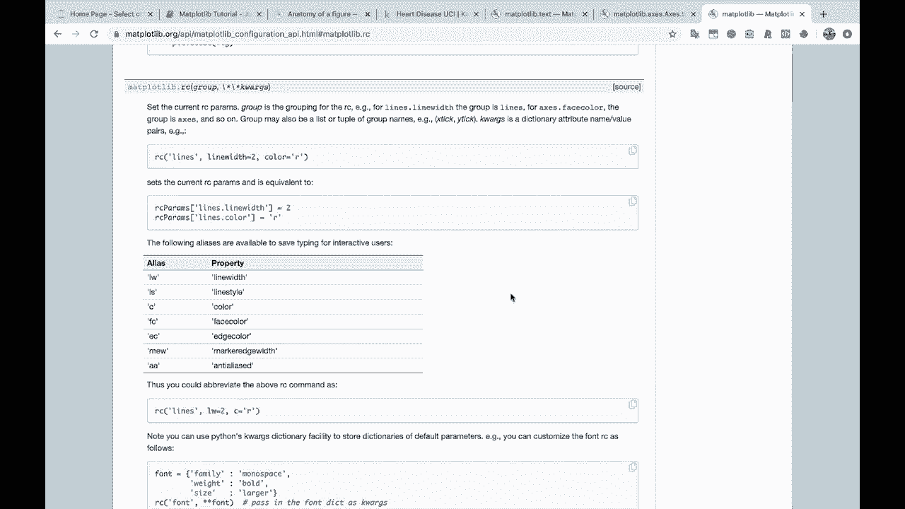

# 绘图必备Matplotlib，P13：13）更改标题、轴标签和刻度标签的字体大小 

好的。那我们下一题。如何改变字体大小。标题、轴标签和刻度标签。

好的，让我们看看这个。所以我们得到了正常的。

公式就在这里。我将移除图形大小。好的，我们要绘制。所以首先，让我们设置标题和访问标签。我会做 A X dot 设置标题。记住。我们可以说，阻尼。振荡。我们可以做 A X dot 设置。Y 标签。我们可以称之为，现在就叫它 Y 标签。

Y 标签和 A x dot 设置 X 标签。我们就称之为 X 标签。

好的，我们这样做，你会看到 Mapllib 前进并放置了标题 X 标签，Y 标签。但是它们是默认字体，这里有很多不同的方式。你可以在这里直接传入一些字体参数。所以如果我们设 font size 等于 20，比如说。然后就这样。

现在我们的标题更大了。我们也可以传入。字体大小。让我们设为 15。对于这些标签。这样，你可以看到我们的 X 和 Y 标签现在不同了。然后对于我们的 tick 标签，这将稍有不同。通常你可以遵循这个 tick 标签的公式。

我们要做一些不同的事情。那就是使用 A X。我会在这里出来。A X dot。如果你开始输入 T，然后按 Tab，这个 tick 参数 Ramms 在这里。所以我开始输入 tick。

Tick 参数。让我们看一下这个。所以 tick 参数改变了刻度的外观、刻度标签和网格线，你告诉它要应用到哪个轴。所以。

在这种情况下，我们可以说 A X dot tick。Pms。让我们说轴等于两个。让我们把它应用到两个轴。在这种情况下，它实际上将是标签大小。我们可以设定 s 为 10。只是为了给你展示它的工作，先设为 30。好的，这样大得太过了，设为 7。所以现在它们比较小了。

我只想提醒你，文档将是你最好的朋友。所以以文本为例，以下是你可以传入的不同内容。我们传入字体大小用于标题和 X 及 Y 标签。我们也可以传入颜色，快让我快速展示一下。

我们可以传入 color 等于红色或其他颜色。

然后如果我们简单地谷歌一下，知道，Mapl Lib tick。Pamms。这将带你到这个文档页面。

也许你可以找到更多的信息。你可以找到一些例子。你可以在这里看到这个示例的用法。这个文档将对你非常有帮助，还有你可以找到的文档。

在 Jupyter 笔记本中，只需使用问号，大多数，甚至可以说所有，实际上。这些内容的在线文档都可以在这里找到。这个用法给了你一个很好的例子。所以记住，如果你有问题，咨询文档，因为这里有很多不同的做法。

我将把这个作为参考提供给你。

现在我们不打算深入探讨，因为这可能是另一个完整的对话。

但是。

这是你的，RC 参数 Ram 的概念。基本上，这就是说，你知道，这将设置你的。这将为不同对象设置各种参数。

在 mappllib 中为你的整个图形或整个 Jupyter 笔记本会话。你可以将这些参数默认值存储在外部文件中并加载它们。这样你就不必每次都这样做。因此，你不必不断地指定你想要什么字体和什么大小等等。

所以，举个例子，这里有一个字体字典，包含我们想要的各种参数。我们希望字体家族是等宽字体。我们希望字体是粗体。大小要更大，这样有点搞笑。然后你基本上会说，我想将这些参数应用于所有字体对象。这就是你该怎么做。

所以，如果你有兴趣了解更多关于如何设置这些默认值以及如何创建自己的 mappllib 参数文件的信息。

那么一定要进一步研究一下。我们今天不打算讨论这个，但我会在这里提供这个链接以供进一步研究。顺便提一下，你可以在视频资源之外找到所有这些链接。

