# 绘图必备Matplotlib，P15：15）更改 x 轴上的刻度频率 

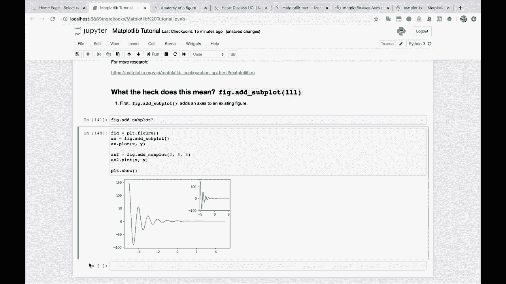

另一个常见问题是。这一项，我该如何更改刻度频率，刻度频率。在 X 或 Y 轴上。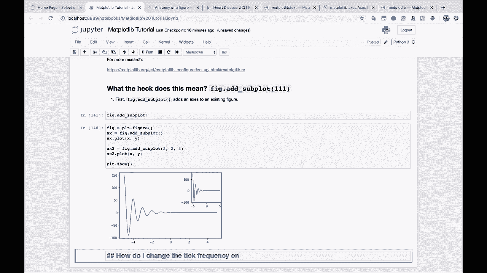

好的，让我们回到我们正常的做法，子图。子图将绘制 A X 点图 X 和 Y，然后我们将使用 PL T dot show。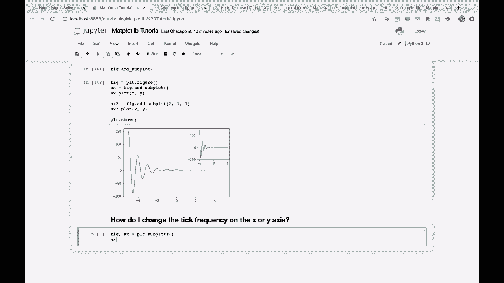

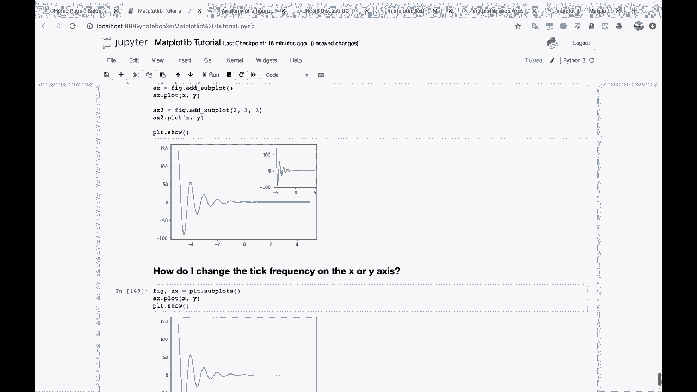

所以你会看到当前的 X 刻度基本上只是 Maplotlibb 认为应该去的地方。有时候这样会有效，有时候我们想要改变它。所以如果我们上到这里去 AX dot。我会按 Tab，看看我们得到了什么，然后我开始输入 set。

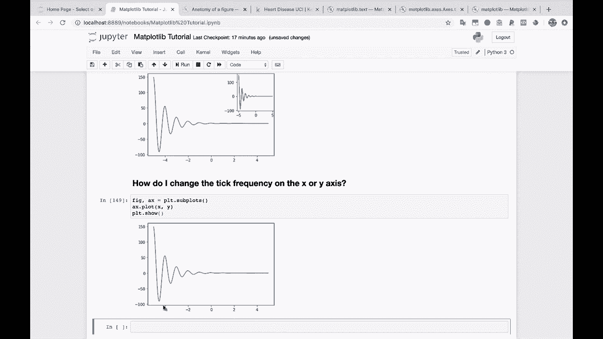

你可以看到我们可以设置的所有内容，向下滚动，你会看到设置 X 刻度。这是我们想要的。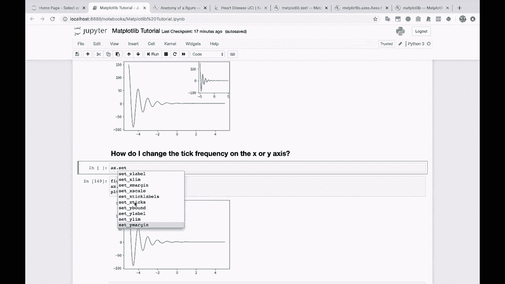

如果你想的话，我们可以查看文档。所以我们基本上只是传入刻度。然后我们只需传入一个 X 轴的刻度位置列表。让我们试试，假设。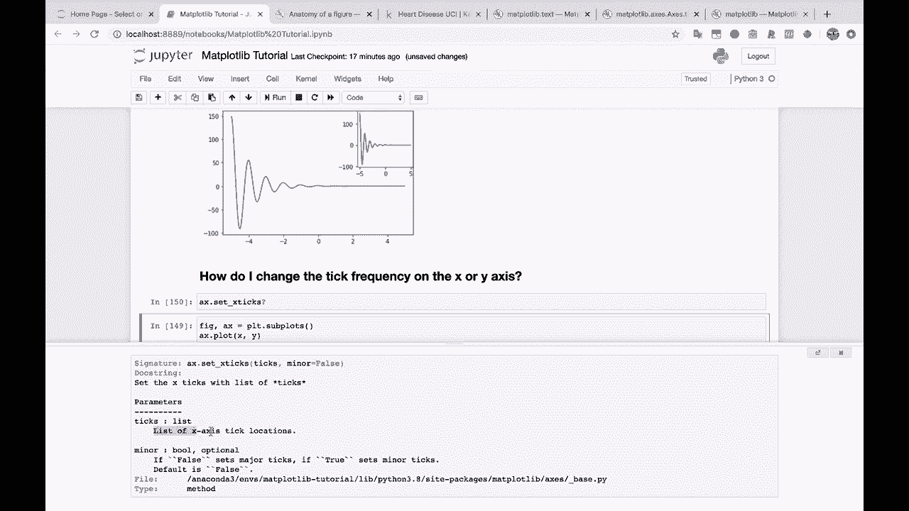

假设我们想要。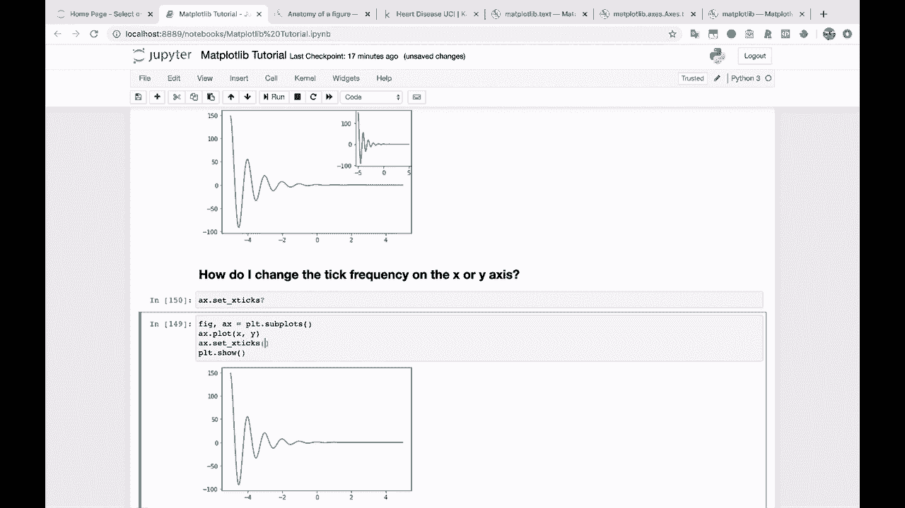

取负值位置。假设我们将这个从偶数改为。假设负 5，负 3，负 1。我们还会加上 0，然后是 1，3，5。让我们看看会发生什么。就这样。我们已经将 X 刻度从偶数改为奇数，包括 0。如果我们想的话，可以省略一些刻度标签，你知道的，去掉 3。

就这样，也许这就是你出于某种原因想要呈现的方式。你甚至可以做一些，比如说，加上负 10 出于某种原因。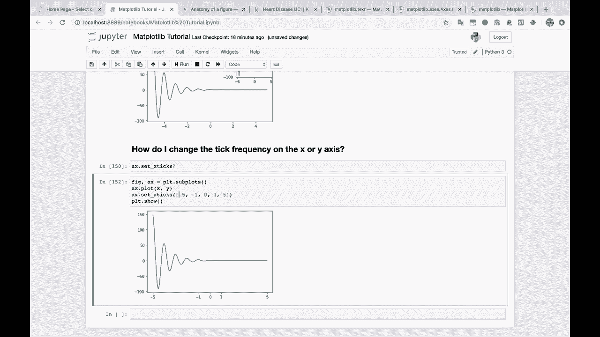

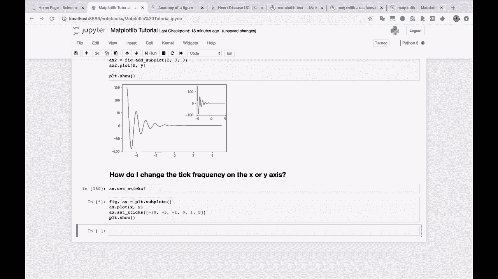

然后，你知道，便是如此。因此，你现在扩展了图表的左侧，并在那添加了一个 X 刻度标签。这就是如此简单。如果你想的话，你可以用这个做各种不同的模式和东西。但这就是你。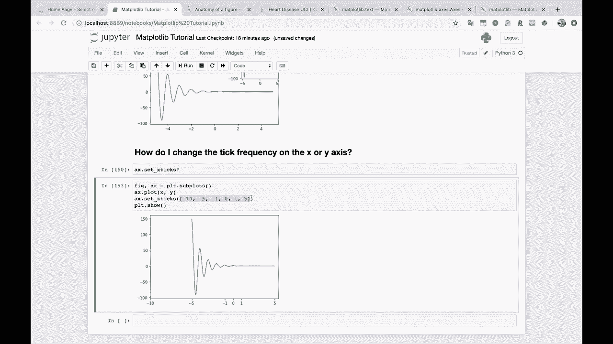
