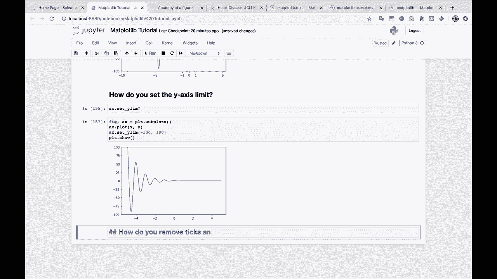
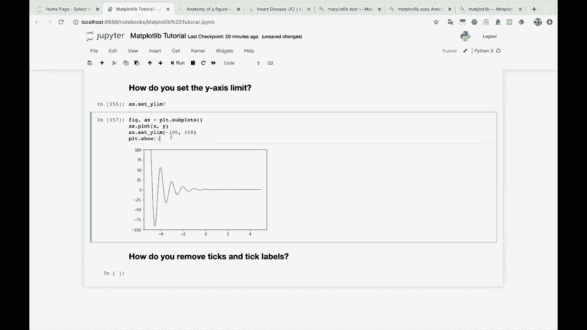
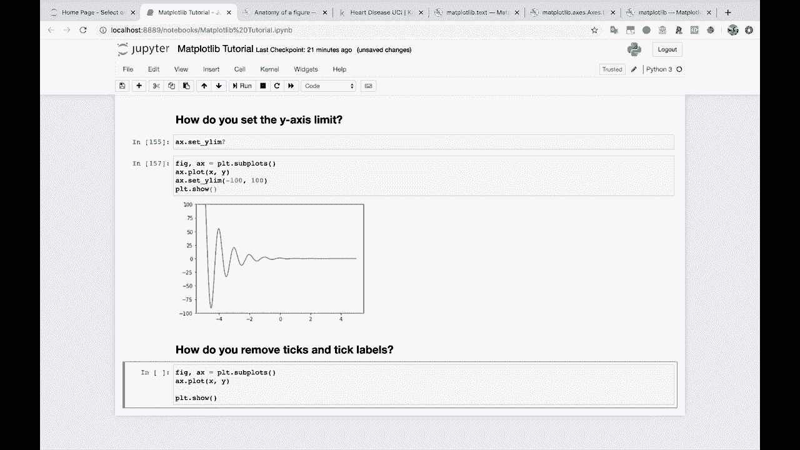
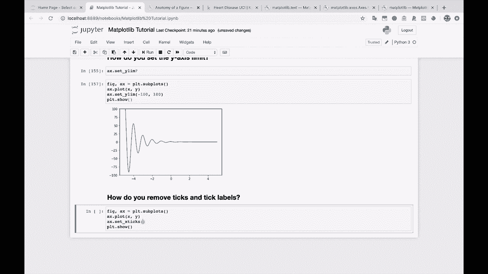
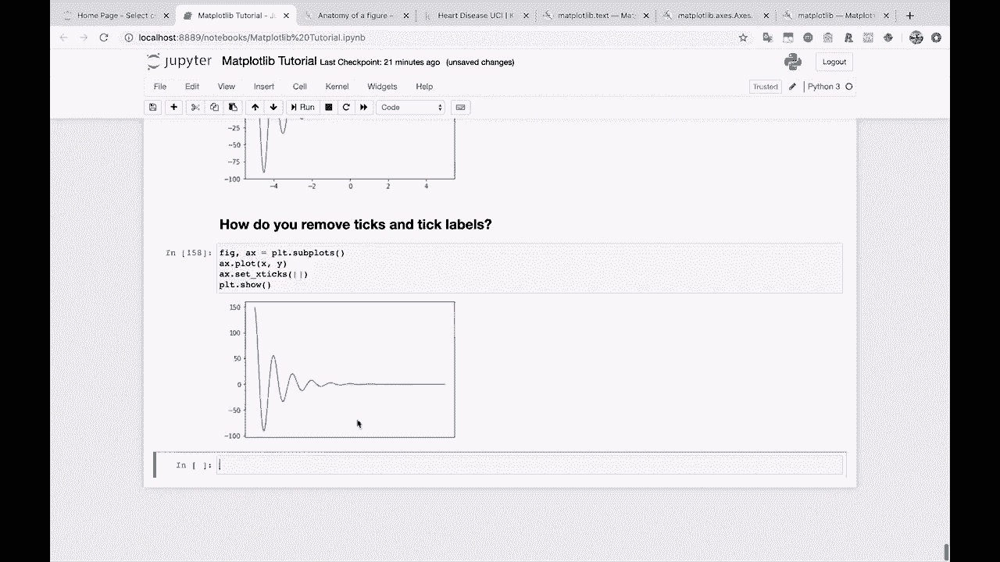

# 绘图必备Matplotlib，P17：17）去除刻度和刻度标签 

好吧，接下来的两个，我觉得挺酷的，因为它们是一种通过去除不想要的东西来清理图表的好方法。所以我有时也会用这些。那么，我们怎么去除刻度和刻度标签呢？😊

那我们来绘制这个图表。

在这种情况下，我们将回到设置 X 刻度的方法，并设置 Y 刻度，设置 X 刻度。

我们只是传递一个空列表。所以，基本上我们在说，你知道的。嘿，我们不想应用任何 X 刻度标签。Y 也可以这样做。

我们可以让这个图表完全没有上下文，老实说，这并不是很有帮助。但它看起来确实干净漂亮，不是吗？

嗯，你知道，如果你出于任何原因想这样做，那就来吧。
