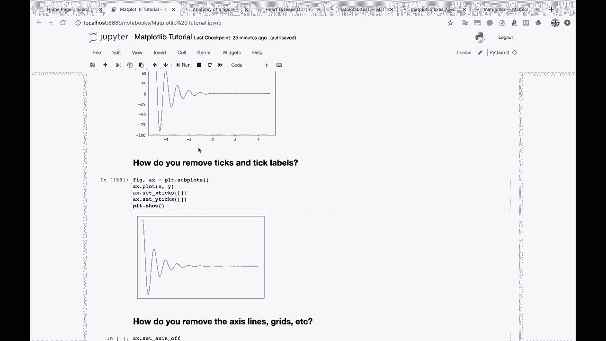

# 绘图必备Matplotlib，P19：19）旋转轴刻度标签文本 

好的，下一个问题继续进行。这是一个非常常见的问题。

如何旋转轴文本？这并不是我们真正需要用到的，因为我们的轴文本看起来很好，但很多时候。

你可能有非常长的标签，它们都相互重叠，导致你无法看清任何内容，因此你会想，嗯，我需要旋转这些标签，这样我才能看到它们。

所以我会给你展示如何旋转你的 X 轴刻度标签。我们将回到我们的朋友 tick parameters 方法。所以 A X dot plot，X，Y。PL T dot show。

好的，让我们旋转这些 X 轴标签。我们将回到 Ax 的 tick parameters。如果你查看文档，或者你记得，你可以记得我们可以传入想要操作的轴，然后我们可以传入任何可以应用于这些标签的参数。

所以我要传入参数 rotation 等于，让我们试试 45。

好了，现在它们已经很好地旋转了。如果这些标签非常长，它们就不会相互重叠。
