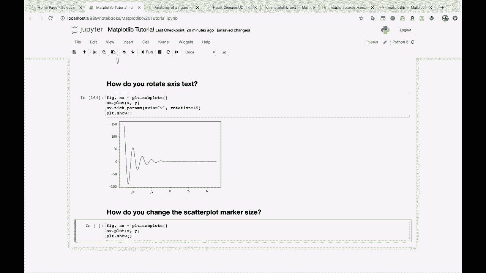
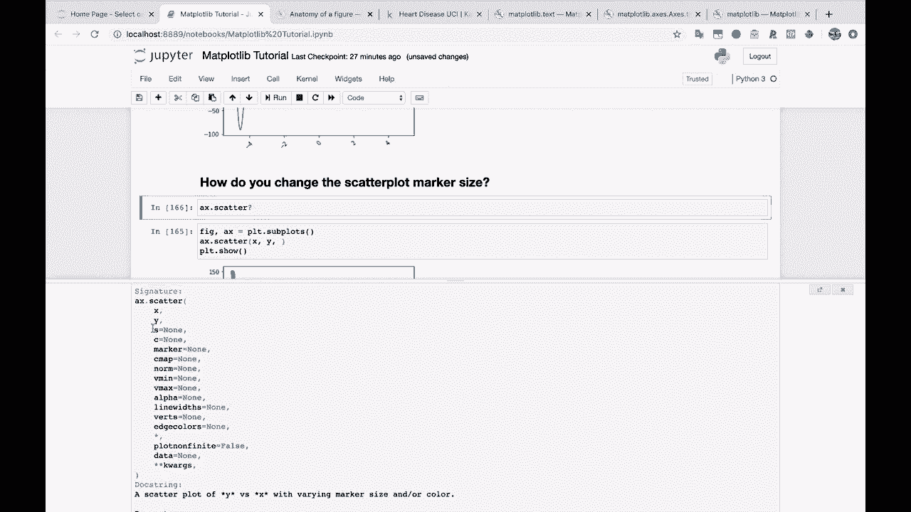
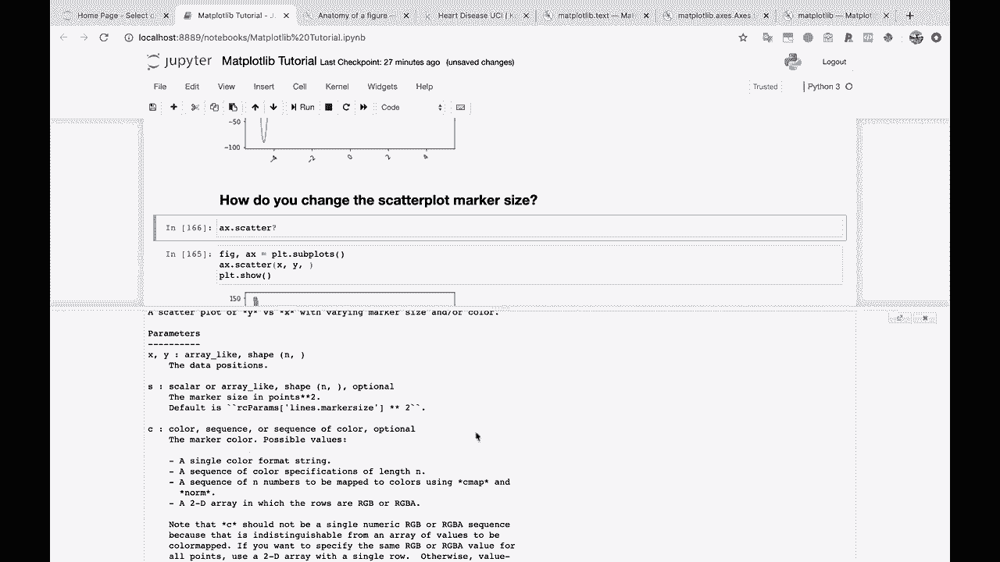

# 绘图必备Matplotlib，P20：20）更改散点图标记大小 

好吧，我们越来越接近结尾了。不过还有几个问题要处理。所以让我们继续进行散点图标记大小。或者让我们把这个变成一个问题。你如何改变散点图。

标记大小。所以让我们看看我们的图表。在这种情况下，我们需要将其更改为。

散点图。看看这个。所以记住我们在这里绘制了大约 1000 个点。这就是你为什么看到这么多不同的点。

所以，关于大小。好吧，我们就看看 A X dot Sc。这是一个很好的习惯，顺便说一下。只需查看文档。检查一下参数。这会对你有很大帮助，真的很大帮助。好的，我们将关注这个 S 参数。😊

如果你查看下面的参数，S 是点的标记大小（平方）。好的，酷。让我们来 tink。看看会发生什么。你还可以传递一个数组，这样你就可以为每个传递一个形状。

每个点都有一个大小。但我们先通过传递 S 来开始。让我们试试 10。10 会怎样？10 让它变小。所以如果我们降低到 5。甚至降低到 1。看看这个。然后我们得到了这些非常小的小点。所以我们可以这样改变大小。如果我们想让大小随 X 变化呢？这里的 X 轴。随着我们的点有更大的 x 值。

也许它们会变大。我们试试看。

嘿，看看这个。所以它们一开始真的很小。实际上，我想我们这里有一个 0 的点，这可能是为什么这是不合法的值，导致平方根遇到问题。所以，嗯。我们可以试着给这个加一个非常小的值，比如 0.1。好了。这解决了。

所以你可以看到我们的大小一开始非常小，然后随着进展变得更大。所以这可以让你实现某种酷炫的效果。我不知道它们是否对你想要绘制的内容有用，但至少看起来挺酷。你知道，我们来做一下。让我们甚至做一下 X。😊，加上 1，我们乘以 10 或其他数字。

所以我们得到一个更大的效果。好了，或者我们可以传递 y，例如。看起来因为我们不能有负的大小。现在。我们只显示正 Y 的点。所以也许我们让这个 y 的绝对值。看起来很奇特。或者我们可以做。这个下降到大约负 100。所以我们可以做 y。

加上。百和5。好了。这有点大。所以，你知道。我们现在只是在尝试。这并不一定。好吧。所以你看，你有了你的大小选项。顺便说一下，这将是你在许多不同图表中进行操作的方式。而且，实际上，Python中还有一些其他的绘图库。

所以这就是我想展示给你的原因，你可以在这里传递一个数组作为大小。而且你也可以，颜色也可以做同样的事情。
