# 绘图必备Matplotlib，P22：22）使用对数轴绘图 

是的。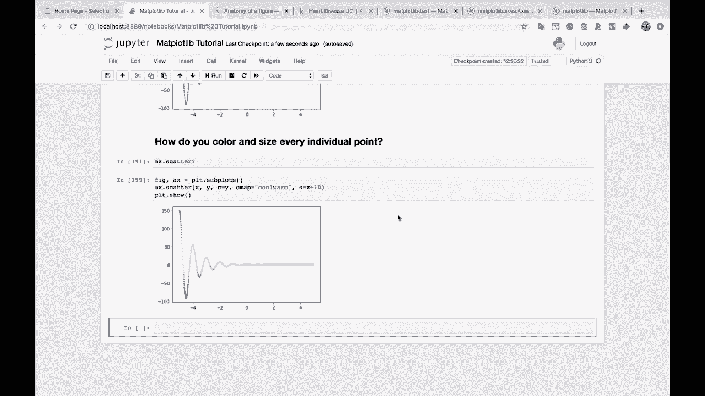

好吧，这是一个在某些数据科学问题中很有用的例子，这就是。你如何使用对数轴绘制？

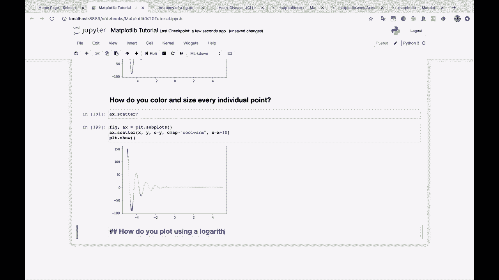

所以，基本上，有时你可能会有一些值快速增长到非常大的数。这些值是指数增长的。你可能会有一个直方图，其中所有数据都聚集在一侧。所以这是几种不同的使用案例，你可能会对使用对数轴感兴趣。

所以我将把我这边的一些代码复制过来，所以。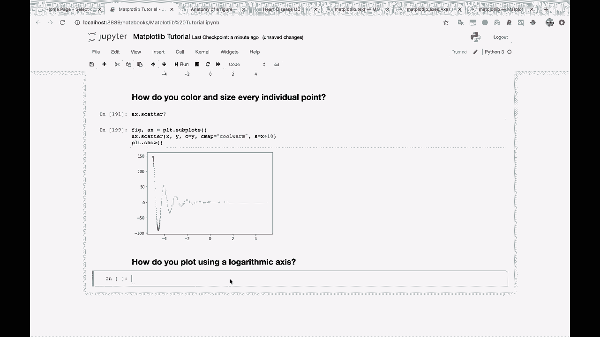

我们的 X 指数将从 1 到 10，步长为 0.1。而我们的 y 值。所以我们将进行指数函数。所以 E 的 X 乘以 30。所以 E 的 X 乘以 30。现在，如果你绘制这个，你会看到一个像这样的图表。现在，这并不是特别有帮助，对吧，我们在这里。

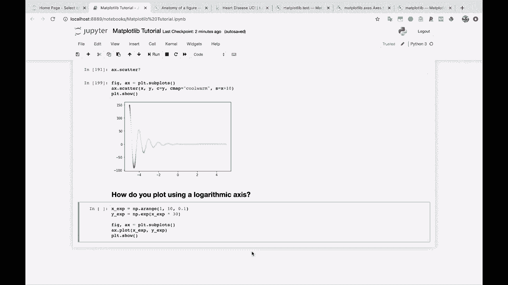

它看起来非常接近 0，然后突然就飞速上升。但是你会看到我们这里的轴的刻度，我们的 y 轴实际上是什么，大约是 10 的 129 次方。所以这是一个巨大的数字。😊。事实是我们的 y 值在增长，它们在图表右侧增长得非常大，以至于这些值几乎无法在图上显示。

所以这并不是特别有帮助。那么我们怎么可能改变 Y 轴呢？让它成为对数轴。这是一个经典的例子，当你的某些值在与其他值有极大差异的范围时，你可能想使用对数轴。

所以在这种情况下，我们来到这里，我们的轴是 A X 点。在这个案例中，我们将使用这个 Y 轴刻度。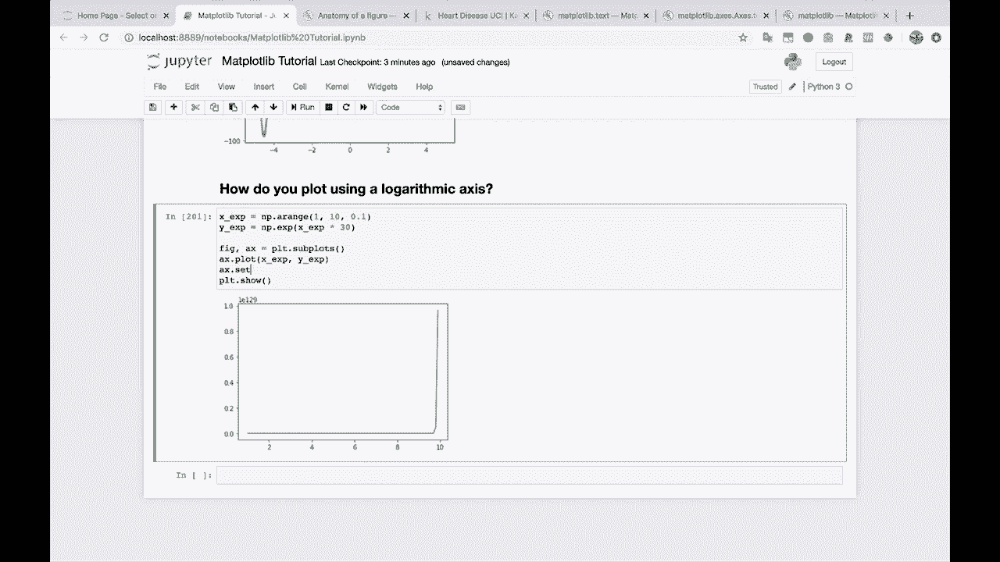

我们只需传入 log。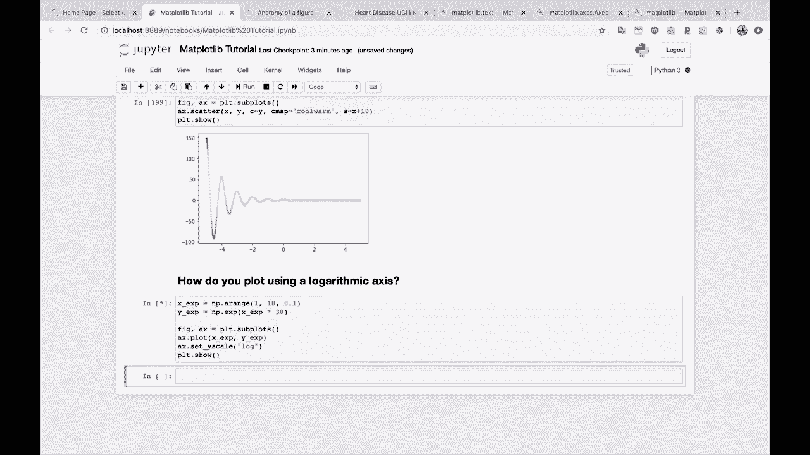

而且有一条美丽的直线，显示了 x 和 y 的对数之间的线性关系。所以对于这样的图表来说，这是一个不错的选择，让我把这个复制到这里，以便你可以参考。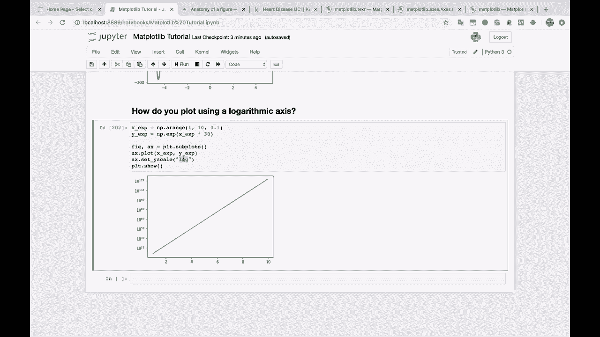

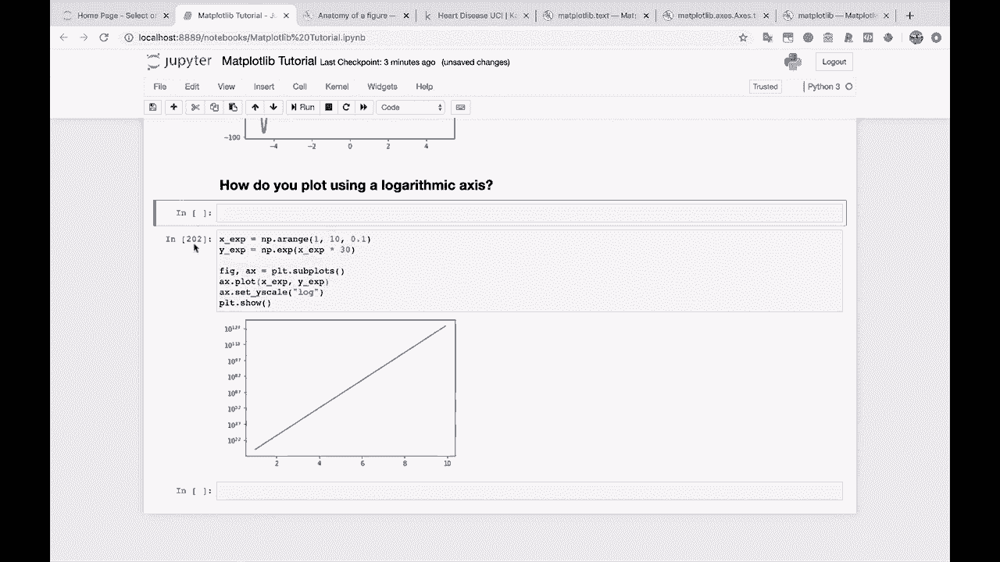

对于这样的图表来说，这是一个不错的选择，正如我之前所说的。这对于你有很多值聚集在一侧的直方图也很有帮助。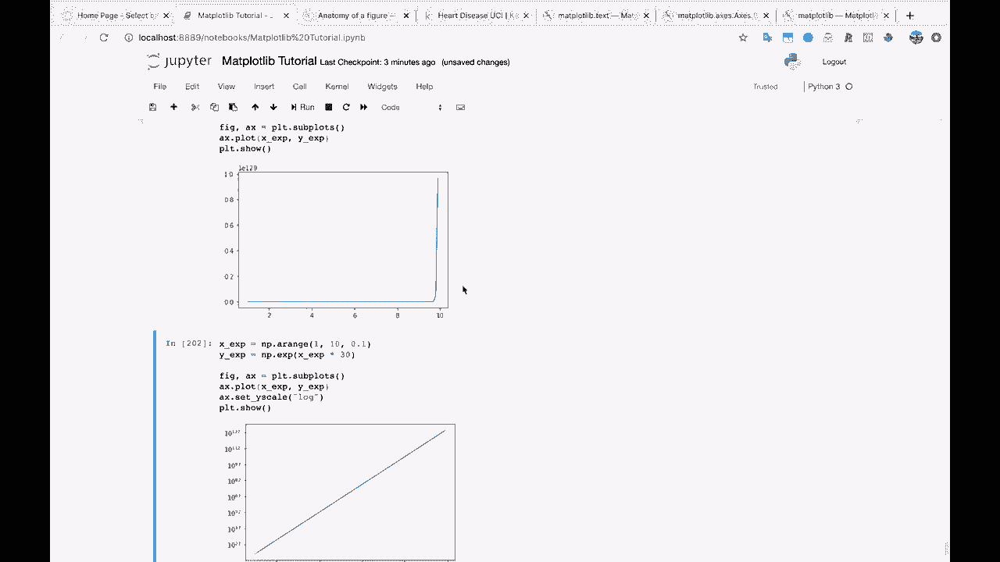

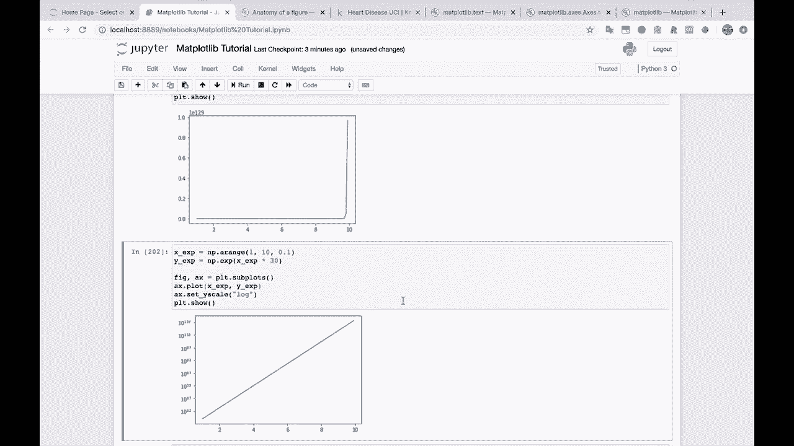

所以，这是在数据科学中经常遇到的一种情况，因为你在查看不同类型的数据。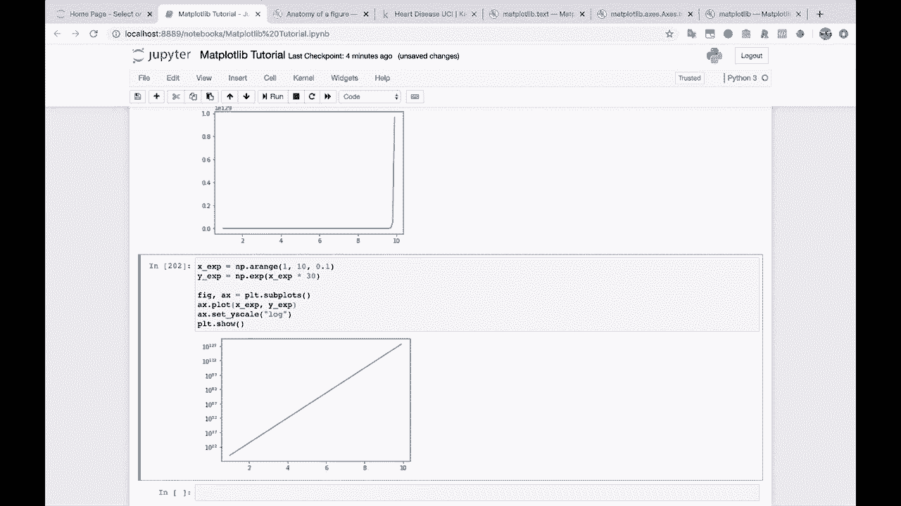
