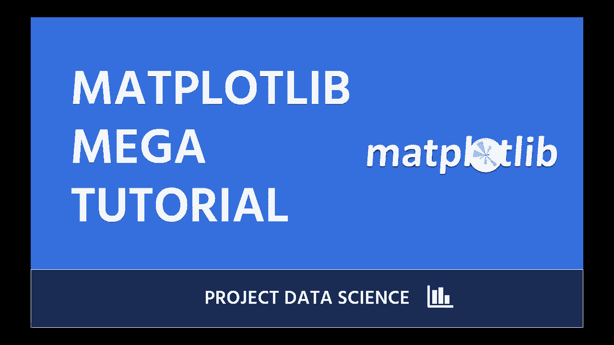

# 绘图必备Matplotlib，P27：27）进一步学习，总结，致谢 

就这样，我们结束了。这是一场马拉松式的教程，信息量很大。如果你的大脑觉得无法承受所有内容，不要感到难过。我将给你留一点作业，章节编号。我们是不是到了第6节？这点重要吗？那我们就去看第6节吧。

现在我们到了第7节。实际上，第7节。这里有一些作业给你。如果你想继续学习mappl Lib，首先，获取自己的数据集来玩玩。哦，我们得把这个改成markdown单元。把它改成markdown单元。或者，实际上，咱们就用这个正在进行的吧。

所以，当你对自己正在做的事情感兴趣时，你会学得更好，因此获取你感兴趣的数据集，并尝试绘制一些图。这将是你学习的一个绝佳方式。我在这里想说，关于这一点的小补充是：用你的数据，尝试回顾我们做过的所有事情，这将有助于巩固你心中的许多知识。

接下来我建议你阅读一些map plot Live文档，我将指出这里两个特定的地方。第一个是map plot Lib教程，那些真的很好，可以帮助巩固我们刚刚学习的许多内容。

接下来是示例。查看一些示例以及生成这些示例的代码。最后，我推荐的事情是阅读关于P，LT风格的内容，或者说学习使用Mapplot Lib的状态基础风格。这是一种我们没有深入探讨的使用Mapplot Lib的方式。

我不一定推荐你使用这种风格。大多数时候，我认为我们一直以来的做法是我推荐的方式，但其他人会使用这个，你会看到使用这个的代码示例，所以至少了解一下这是什么是好的。就这样。

我想非常感谢你完成这个教程。我希望你学到了很多东西，并且能够将其应用到自己的数据科学工作中。如果你需要额外的数据科学教程，务必查看其他项目数据科学视频和课程，并留下评论。

让我们知道你想学习什么，我们会帮助你学习。好了，就是这样。祝数据科学家们学习愉快，我们下次见，再见。😊。

