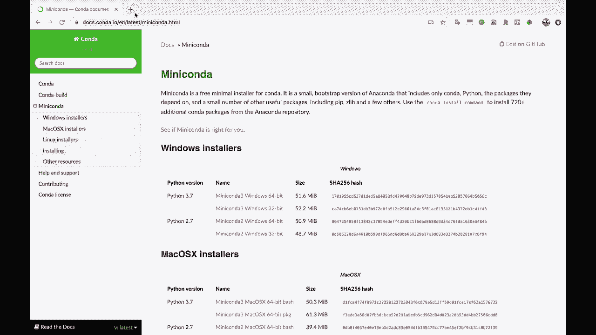
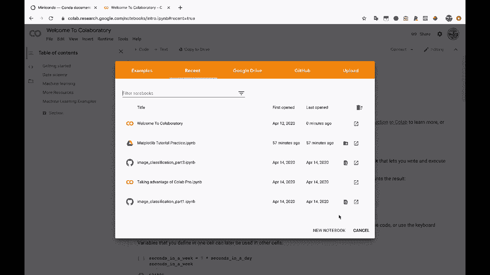
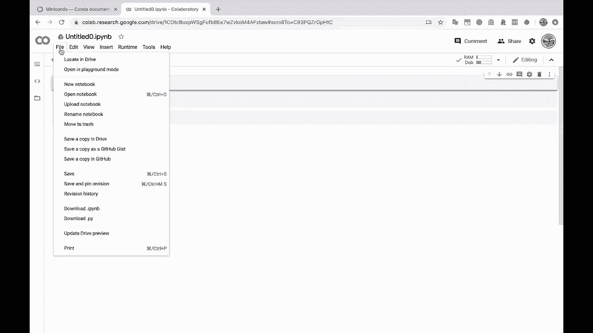
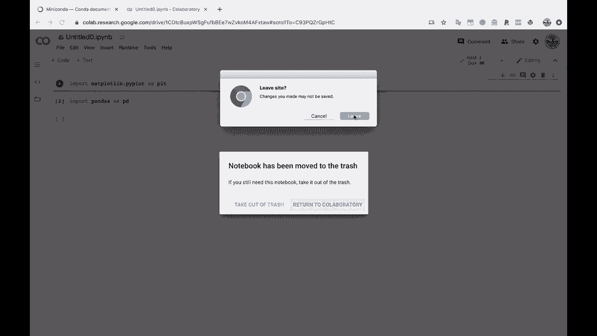
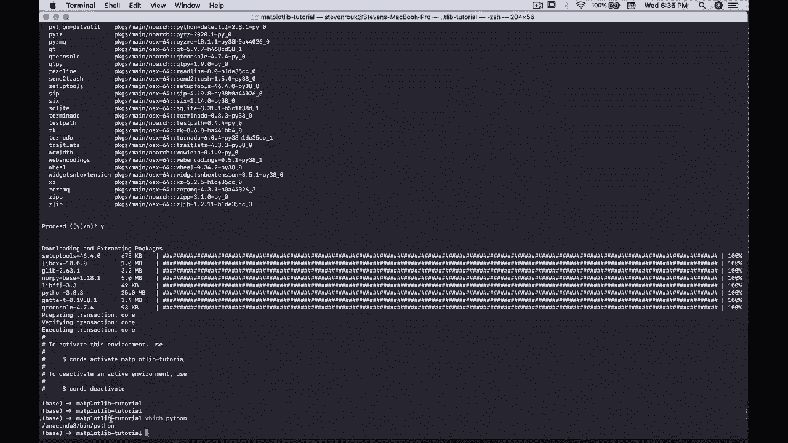
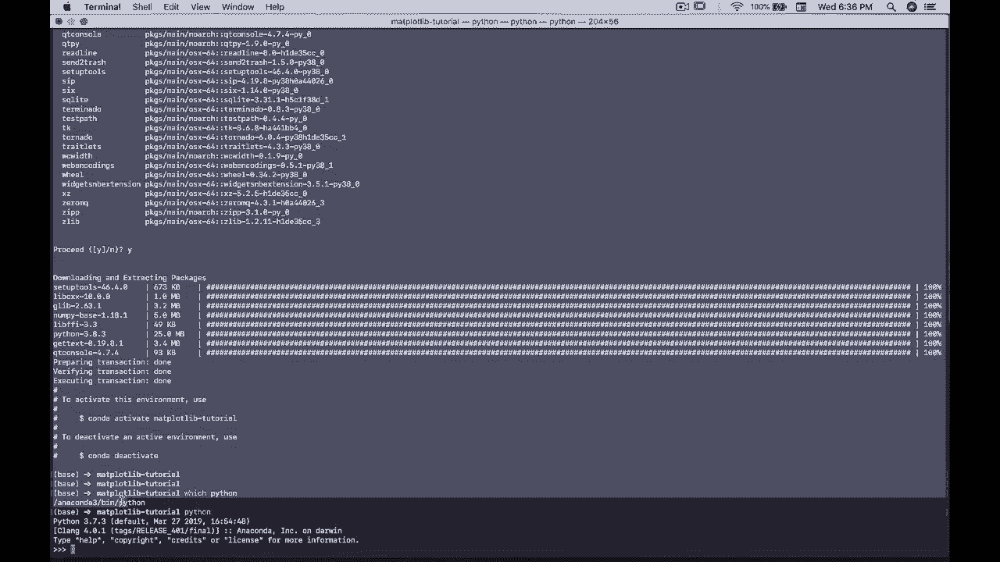
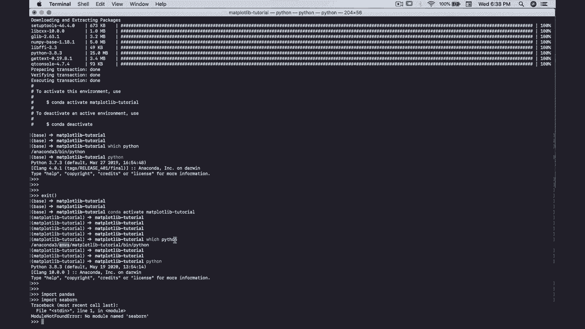

# 绘图必备Matplotlib，P3：3）使用 conda 虚拟环境（或 Google Colab）设置我们的 Python 环境 

现在我们进入需要设置Python环境的部分。我们需要Python。我们需要matplotlib。在这种情况下，我们需要pandas来读取数据。我们还需要Jupyter用于我们的Jupyter笔记本。所以有两种不同的选项。第一，我将使用Conda创建一个虚拟环境。

这里有个命令，如果你也想走这条路。我建议如果你还没有安装miniconda或Anaconda，去miniconda页面。Conda是一个用于Python的虚拟环境管理器和安装程序。因此我们将使用Conda来管理我们的虚拟环境，如果你不知道什么是虚拟环境，随意做一点研究。

但本质上，这只是一种最佳实践，将我们的Python编码环境打包到一个目录中，这样我们就不会搞乱我们的电脑等等。而且当我们尝试安装东西时，我们也不会有冲突的包。

所以如果你想走这条路，安装mini Conda，我们将把所需的一切安装到一个文件夹中，知道吧，这里只需花上一秒。如果你的机器上没有Python，而你又不想经历这个安装过程。

我确实推荐，如果你对数据科学或数据分析感兴趣，知道吧。 在你的电脑上安装Python是非常有帮助的，这样你就可以实际运行一些Python代码和其他内容。

但是。你也可以去Google Colab，Colab。 所以Colab。这基本上是由Google在云端通过你的浏览器运行的Jupyter笔记本。所以使用这些。你不需要安装任何东西。你可以直接来Colab。你可以创建新的笔记本。

这将为你创建一个笔记本，并且会安装你所需的一切。所以它会有matplotlib。它会有pandas，等等。因此，如果你想轻松开始，你可以直接去Colab，使用云端的笔记本。所以这很酷。我会把这个移动到回收站，我将在我的电脑上使用Jupyter笔记本。

😊。

离开这个网站。好的，我们有这个miniconda。那么我们来这里创建Conda。我将创建一个新的虚拟环境。我将把它命名为Matplotlib教程。😊。

因此，这个破折号和标志是我们创建的虚拟环境的名称，即 Conda 虚拟环境。现在我将安装 Python 包，Jupiter，Mat plot。让我们全屏显示。Mat plot，Lib，pandas，numpy。我想这应该就足够了。如果我们点击这里运行，这会转动一会儿。

它会查看我们尝试安装的所有这些包，弄清楚我们是否可以安装它们。然后我们会按下字母 Y。因此，这将告诉我们 Conda 需要安装的所有内容，以便在这个虚拟环境中安装四个不同的包。所以我输入一个 Y 表示是，按回车。这将下载并提取这些包。

我们将给它一点时间完成。完美。因此，我们刚创建了一个名为 Matplotlib tutorial 的 Conda 虚拟环境。所有安装都顺利完成。因此，查看你正在使用哪个虚拟环境，或者说你正在使用哪个版本的 Python，如果你在 Linux 或 Mac O 的终端中。

这个命令在 Windows 上会有点不同。我相信在 CMD 中它叫做 where，PowerShell 中的命令可能会有所不同，比如 where do EX E 或类似的命令。但你可以输入 which Python。😊，这将显示如果我现在运行 Python。

所以我运行 Python。这是当我运行 Python 时调用的可执行文件。所以 Anaconda 3。bin，Python。

你会注意到这是 Python 3。7。3 等等。我可以通过 Anaconda 访问所有安装在基础 Python 中的包。现在，如果我退出。然后输入 conda activate。Mat plot Lib tutorial，就像上面说的那样以激活环境。

你会注意到左侧会显示变化，表明我们现在在不同的环境中。你的终端可能没有那样的功能。没关系，我使用的是终端 Z，S H Zish，它为我做了一些花哨的事情。但如果你的没有这样，那也没关系。现在我输入 which Python。你会注意到我们指向了不同的位置。

所以 Anaconda 3 的 mapplotlib 教程在 Python 中。这表明我们现在处于封装好的虚拟环境中，并且我们只访问明确表示想要安装的包，以及标准的 Python 包。

所以我在这里输入 Python，你会注意到我们实际上在这里运行的是不同版本的 Python，3.8.3，因为 Conda 每次创建新的虚拟环境时，都会拉取最新的 Python 版本，即最新的稳定版本。因此我们实际上是在运行更新版本的 Python。如果我导入 pandas。

我们安装了那个，这样pandas就可以正常导入，但我们没有安装Cborn，这是另一个数据可视化库。所以Cborn在我的基础安装中是已安装的，但在我的虚拟环境中没有安装，因为我们使用的是完全独立的Python安装。我们在这里使用的是完全独立的包。

好的。
