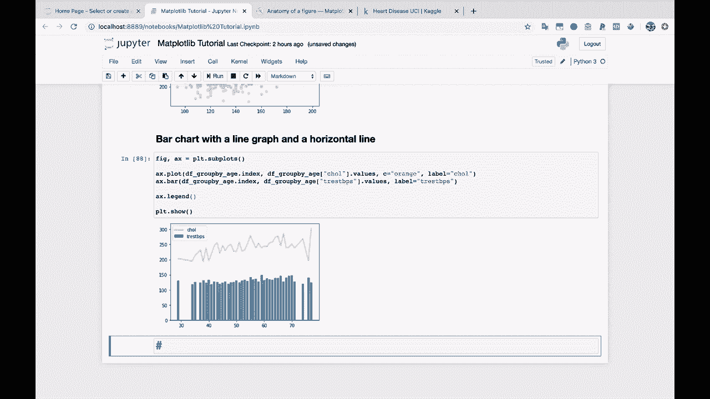
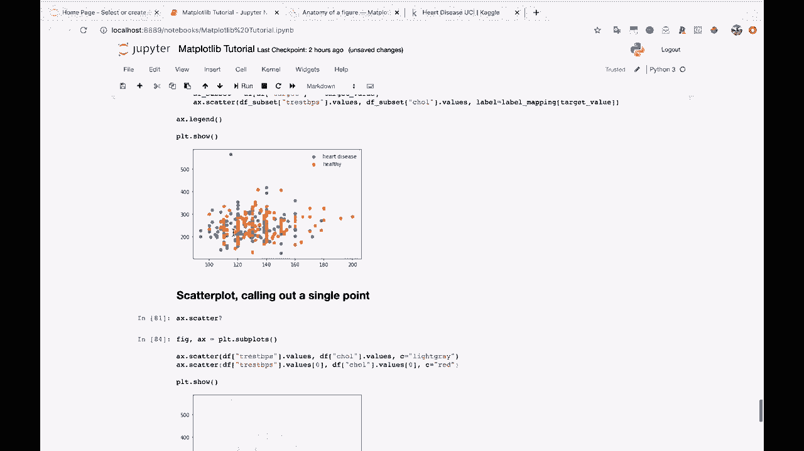
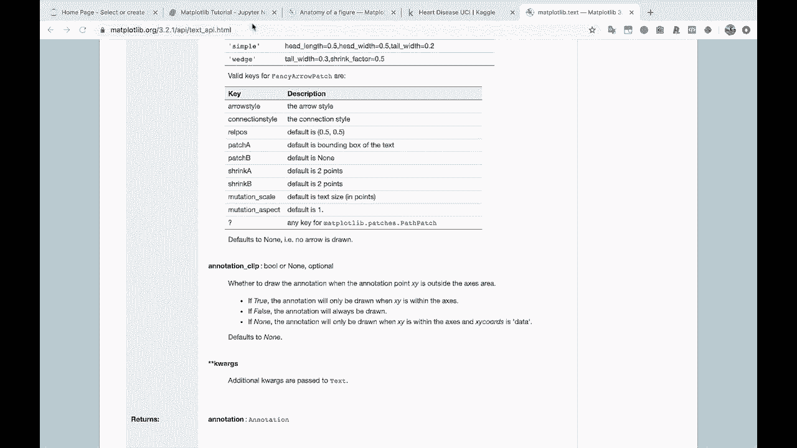
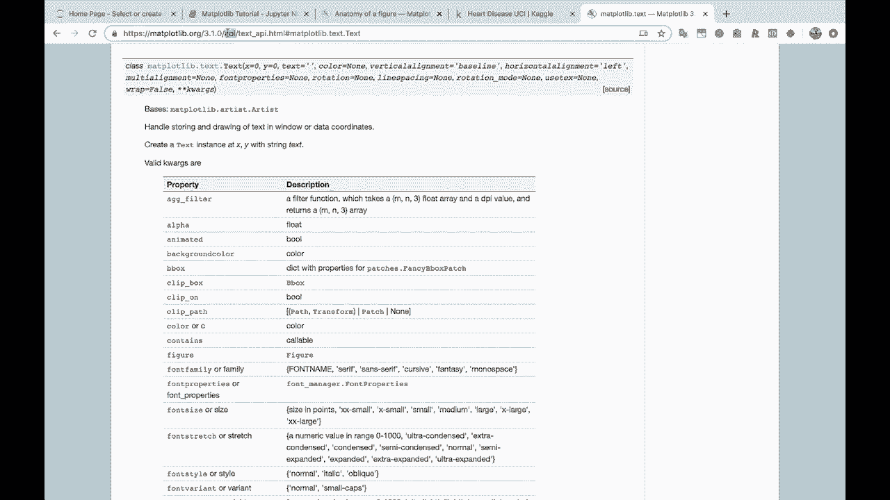
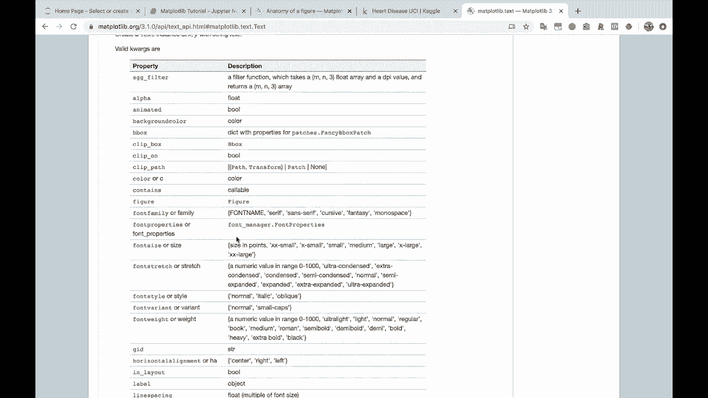
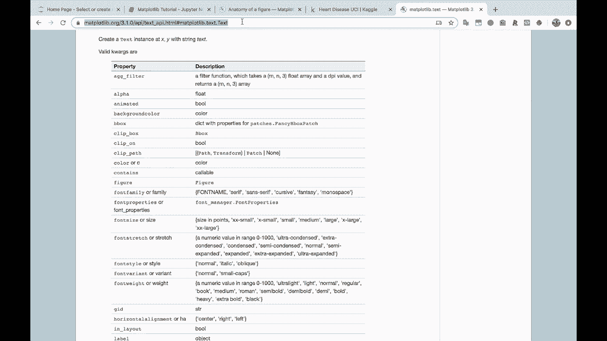
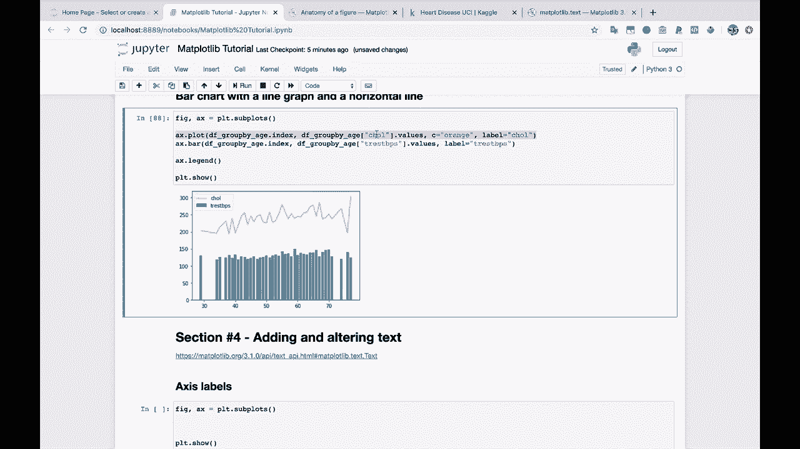
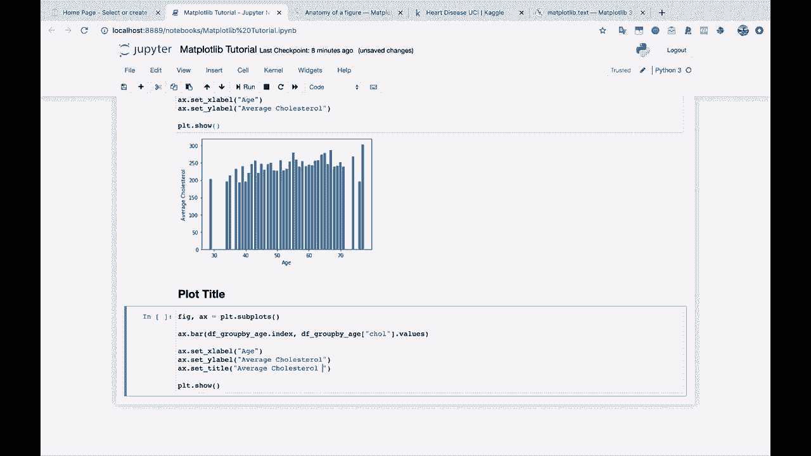
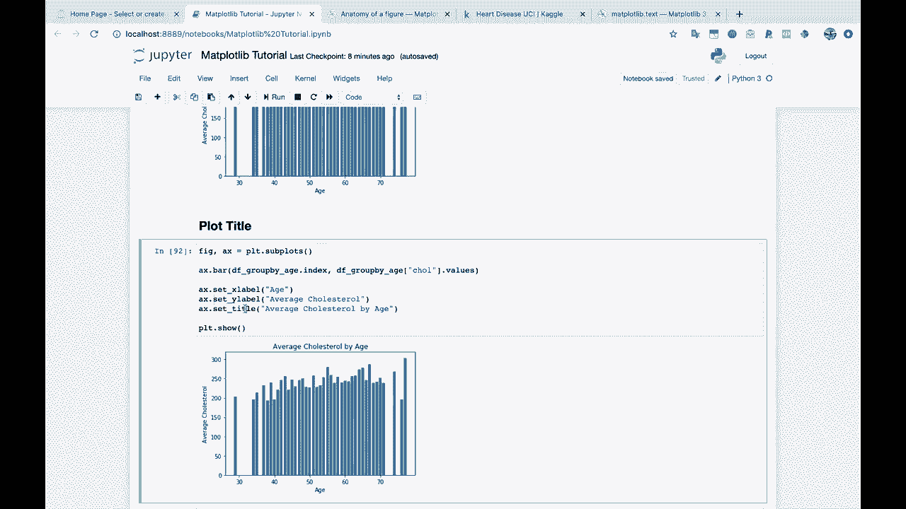

# 绘图必备Matplotlib，P8：8）添加和更改文本 

现在我们继续进入下一个部分。所以这个下一个部分。

你会注意到我们还没有添加任何标题。我们还没有添加任何标签。我们没有处理任何文本。除了我们的图例外，我们只是进行了图形绘制，图例会自动放置。那么现在我们进入下一个部分，我想，第四部分，对吧？我们在第四部分，对，第四部分，继续前进。

第四部分，添加和更改文本。好的。

所以添加和更改文本，这是绘图中非常重要的一部分，因为你想给人们提供关于他们所看到内容的信息。你知道的，你想标记你的 X 轴，比如 50 是什么，这个数字到底代表什么。你想标记你的 Y 轴，知道我们在看什么，然后你想给图表一些标题，一些有用的标题，以便人们能够理解数据的上下文以及你试图传达的内容。

在我们进行文本之前，我想给你展示一个非常有用的matplotlib。

资源的做法是 Maplotlibb。ATex。

我在这里。😔，让我们来看看这个。

我想给你展示一件特别的事情。其实，我会直接复制这个网址。

在页面下方，我们开始吧。Class mapplotlib do text dot text，所以。

我给你展示这个的原因是因为这个地图绘图库的 API，以及文档。

这对于查看使用文本对象时可以使用的所有不同属性非常有用。

所以我们的标题是文本，我们的标签是文本，等等。

这是你可以更改的文本的一些内容。所以你会注意到你可以更改字体系列，因此你可以更改字体的类型。你可以更改字体大小。我们要使用的其中一个是可以更改文本的旋转。所以你有所有这些不同的选择。

操作文本的选项。因此，这是一个非常有用的链接。我会确保你有这个。当你需要对文本做一些特别的事情时，可以来这里参考。所以我实际上，嗯，我会把这个粘贴到。 

这是Jupiter Notebook。好的，首先，让我们看一下坐标轴标签。这是带有“I”的轴，而不是像这样带有“E”的“Cs”。

让我们获得一些图表，以便在这里使用这个文本部分。所以。

让我们看看，我们想做的事情是查看这个胆固醇的条形图。好吧，我们要查看一个按年龄划分的胆固醇条形图。所以我将在这里复制这个图。

让我们将其更改为“年龄与胆固醇的条形图”。我会去掉颜色和标签。

首先，我们的观众对X轴和Y轴应该代表什么毫无头绪。因此，我们的做法是，我会先在对象上展示给你看。所以AX。我会点一下，按一下Tab。让我们看看所有不同的方法。所以是set。

所以，当我输入set set underscore X时，你会开始看到可以设置的所有不同内容。因此，你可以设置边界、限制。我们将设置X标签。所以我们将在这里设置X标签。那么我们的X是什么？嗯，那就是年龄。所以让我们把这个复制到上面。你看。

你现在可以看到“年龄”这个词在下面作为我们的X轴标签。如果我们想对Y轴做同样的事情，嗯，我们只需将其更改为设置Y标签。那么这将是平均胆固醇。我们的Y轴标签就是这样。那么如果我们想给这个图表一个方便的标题呢？

所以我会继续把这个复制下来。让我们在这里创建一个新的部分标题。

Pot。Tido。

你要做的方式是，先回到Ax，看看是否有设置标题。就在这里。看看这个。我已经知道了，但你不知道，所以对我们其中一个人来说，这仍然是一个惊喜。AX点设置标题。让我们看看。 

假设我们要查看不同年龄的平均胆固醇水平。

而且你看。现在平均胆固醇按年龄显示为标题。我们正在这个AX对象上做这个。所以这是这个坐标轴的标题，这个坐标轴的标题。稍后这会派上用场。

所以。这是你在添加和修改文本时真正想要了解的两件主要事项。我们将在常见问题部分进一步讨论文本，但现在就先保留访问标签和图表标题，因为这些将是你将要使用的主要内容。

