# 绘图必备Matplotlib，P9：9）在Matplotlib中使用子图 

好的，让我们进入最后一个部分，然后再回答常见问题。正如我所说，我们将在常见问题中相当多地回到文本。所以我们将看看如何更改这些刻度，旋转X轴和Y轴标签，以及更改字体大小等等，但在进入一些细节之前，我们先做一个基础功能的部分。

所以第5节使用。！

`subplots`。！

我之前已经在Jupyter Notebook中向你展示过这个，但我想明确一下，并花更多的时间在这上面。你知道我们通常如何使用`plt.subplot`。然后我们做`plt.s`。！

这创建了一个单一的坐标轴，我们可以在上面绘制东西。如果我们传入一个数字，比如行数、列数，那么我们在这里就会得到多个图形。让我们再过一遍。我们来看看一个2乘2的！

一个2乘2的图。而且记住，这通常会把这个改为`axs`，如果它有多个坐标轴。如果我们查看`axs`。！

这是一个二维的numpy数组。注意这里我们有一个包含两个Matplotlib坐标轴的列表，这两个坐标轴都被包裹在外部列表中。我们可以查看点的形状！

你会看到我们有两个乘以两个，这与我们请求的相匹配，也与我们得到的图形相符。那么在每一个图上绘制时，你要做的就是用`axs`，然后你可以指定这个`axs`对象中的坐标或索引，想在何处绘制。所以我们在第一行、第0行和第1列绘制一些东西。

让我们试试这个。也许我们想在这里绘图，先看看我们的年龄分组。所以也许我们会把所有这些都作为年龄来看。让我们回到看看我们的胆固醇值。你看，这里我们现在在第一行、第二列有一个折线图。

我们按年龄划分的平均胆固醇。现在，如果我们想在第一个图中查看，也许我们想查看第0行、第0列。点。也许想看看平均静息血压的条形图。对吧？我们来做一个条形图。所以现在你会看到我们在那个第一个图中有一个条形图。

这也是常见问题中会出现的内容。但我会继续把图形做得更大。所以请记住，图形就是整个图像，对吗？所以现在我们尝试在同一张图像中绘制四个不同的图，而之前我们只绘制了一个。

所以这就是为什么看起来比较小的原因。那么我们来改变图的大小吧。让我们来改变图的大小。也许我们会这样做。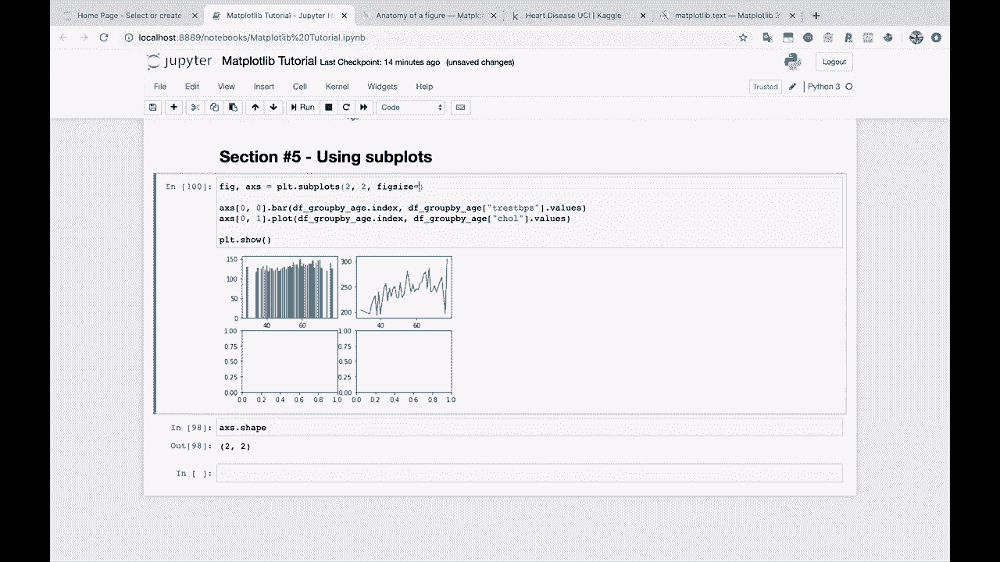

我们只需传入10乘以10。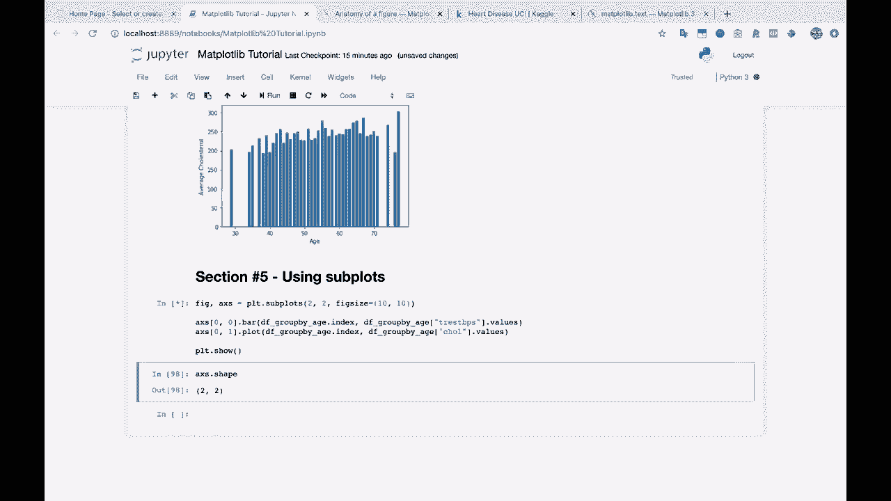

看看这会有什么效果。或者，也许，我们试试12乘以8。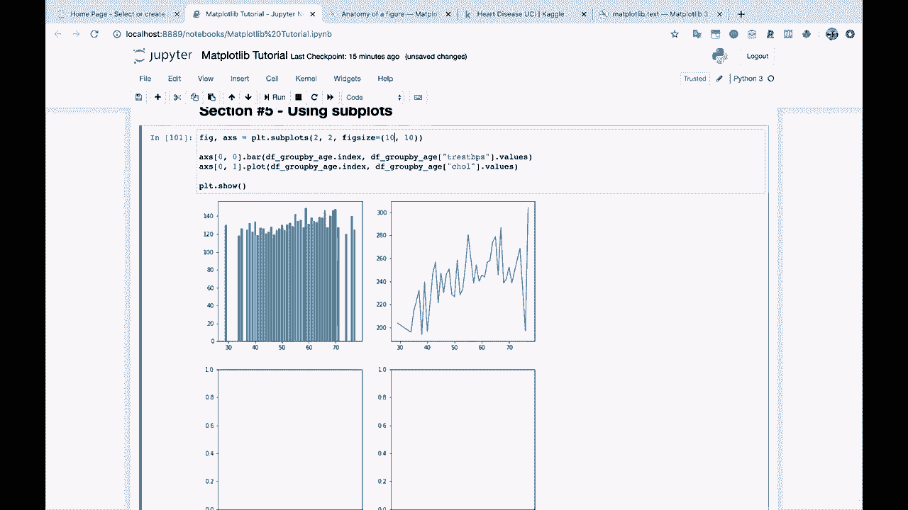

好的。看起来更成比例了。所以现在你会注意到这个图形，这仍然只是一个单一的图像，但这个单一的图像现在变大了。我们有更多的空间来绘制每个坐标轴。好的，让我们来做两个这样的图。我们需要在第二行中绘制一些内容。

第一列和第二行、第二列中的某个内容。那么也许我们来看看我们的分组。我们有哪些列。

我们来看看这个。我们的第三个图。也许我们再看看这个。对于我们的第四个图，我们有thalac和老峰值。那是什么呢。

所以这个，Talac，或者你怎么发音的，表示达到的最大心率。而老峰值是运动相对于静息所引起的ST段抑制。我不是完全确定这是什么意思，但如果你学医，可能会知道这意味着什么，或者如果你在医疗保健领域工作。

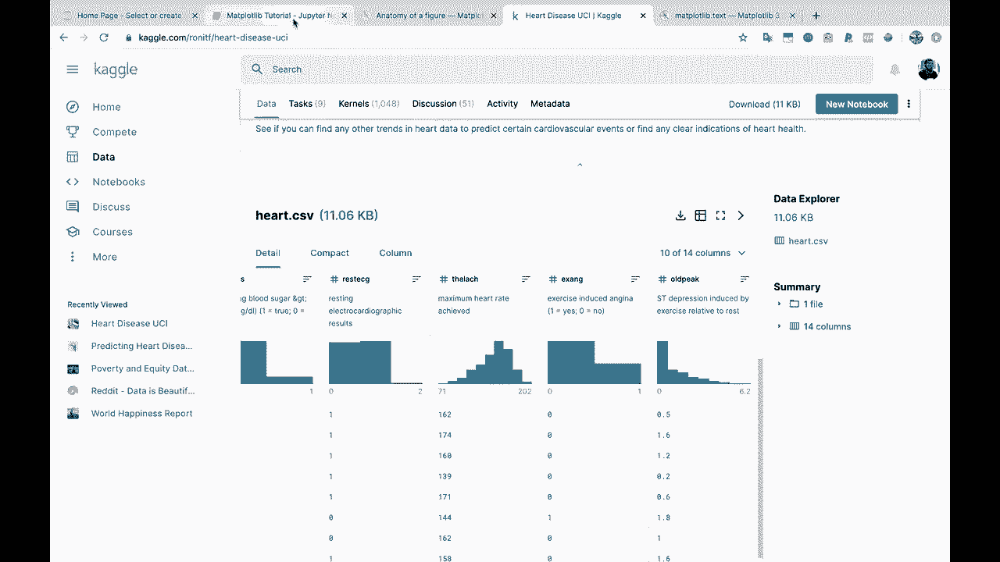

所以我们把这个第三个图做成一个散点图。也许我们会把最后一个，再做一个条形图。那么我们试试这个。

好的，你看，我们首先绘制了一个条形图，我们可以做任何我们想做的事情。

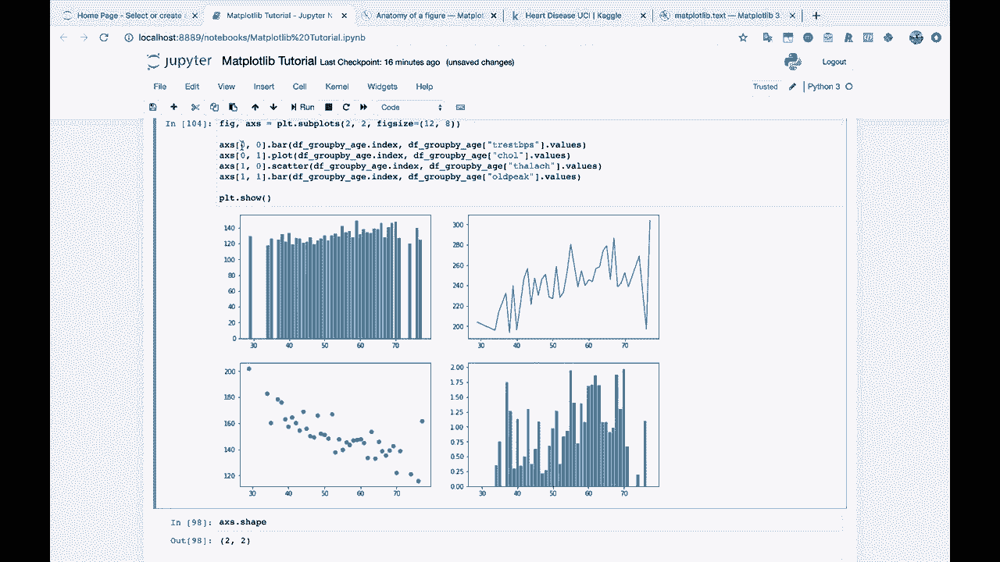

使用这个坐标轴，就像我们对待单个坐标轴一样，所以我们可以设置标签。我们可以设置标题，我们可以做所有这些事情。

第二个图是一个折线图。

我们有一个散点图，然后用另一个条形图结束它。所以让我们花点时间。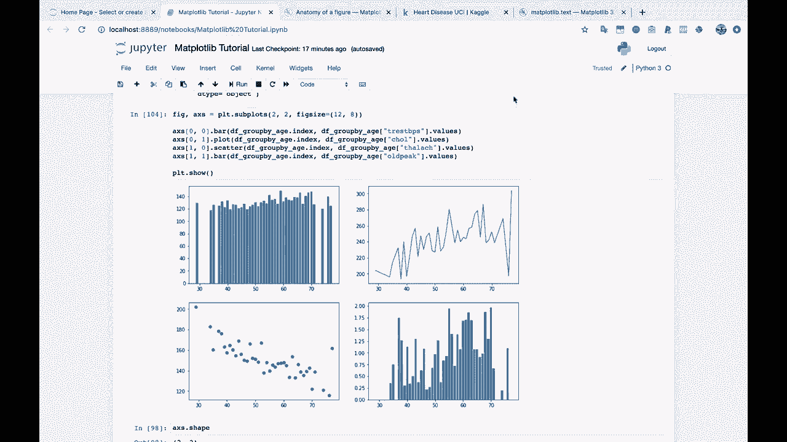

只是想告诉你，你确实可以设置X标签、Y标签和标题。就像正常一样，使用这个坐标对象。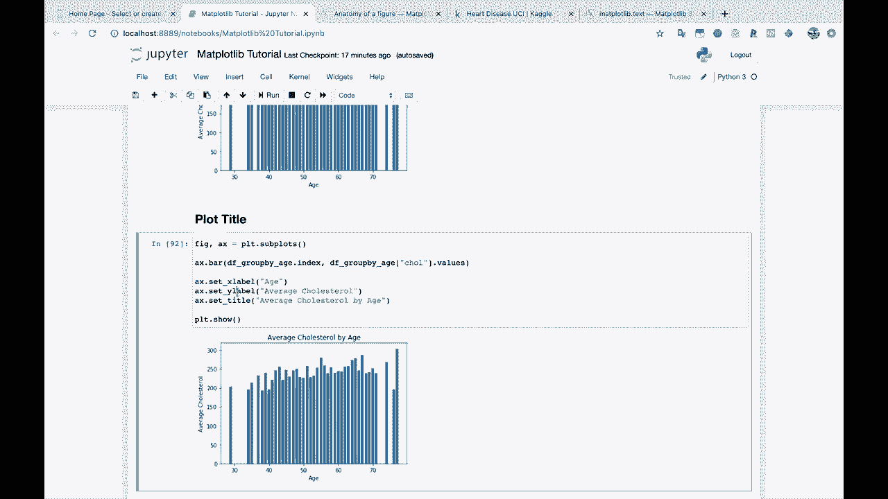

让我们看看第一个图表。然后我们再看第二个图表。然后是第三个图表。这里是第四个图表。好的，我们或许不需要对所有这些都进行设置，但。

所以与AX不同，我只是将其更改为这个Numpy数组中的坐标轴位置。

X轴标签，这将是年龄。Y轴标签，这将是平均。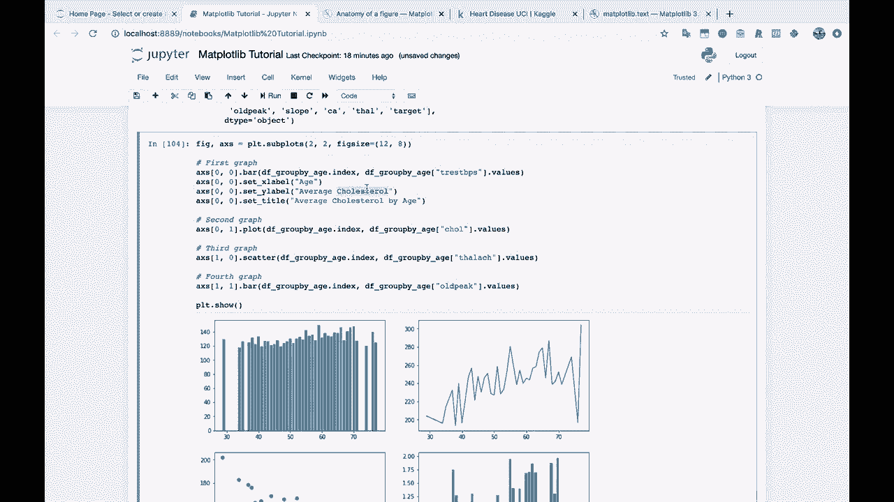

这是什么？是你的休息。血压，对吧，所以平均。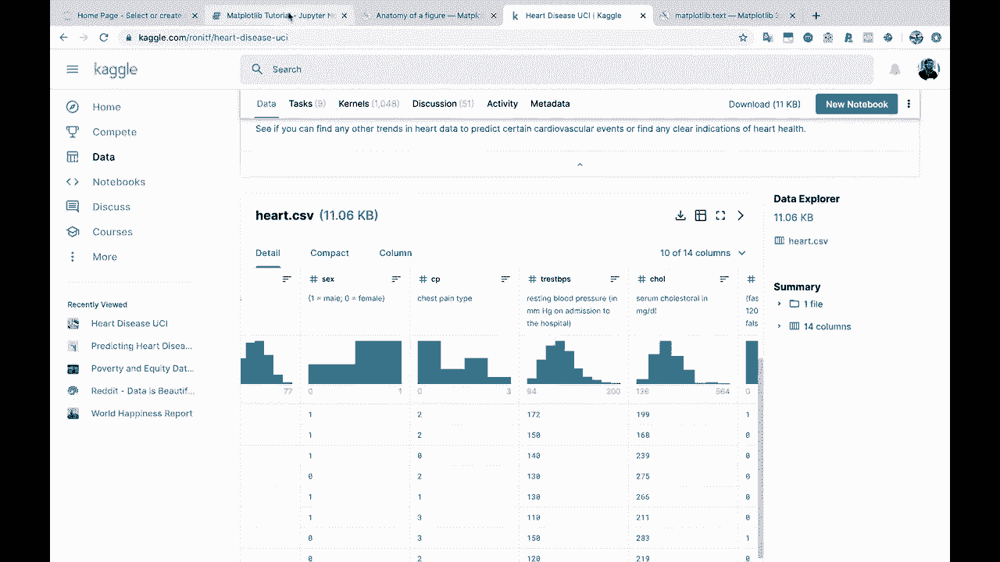

休息。血压。

如果我们想在这里设置一个标题，可以说是平均。休息血压。

按年龄来看看这个，看看效果如何。

好的，我们的图表变得有点紧凑。你知道，想让图表看起来完全符合你的期望确实需要一些时间，具体取决于你想做什么。但请注意，我们有X轴标签、Y轴标签，还有这个图表的标题。我们只是使用了同一个坐标轴对象。 

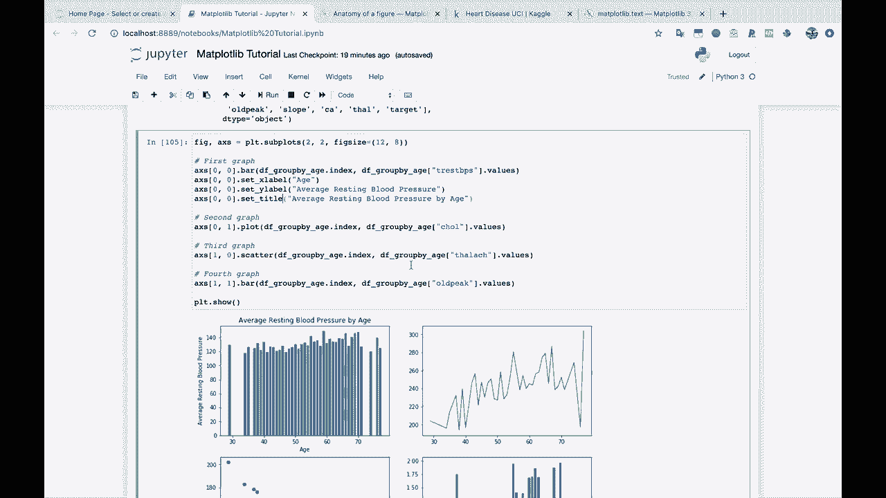

现在假设你花时间为所有这些图表添加了适当的标签。我将逐个检查，确保这是索引到正确的坐标轴对象。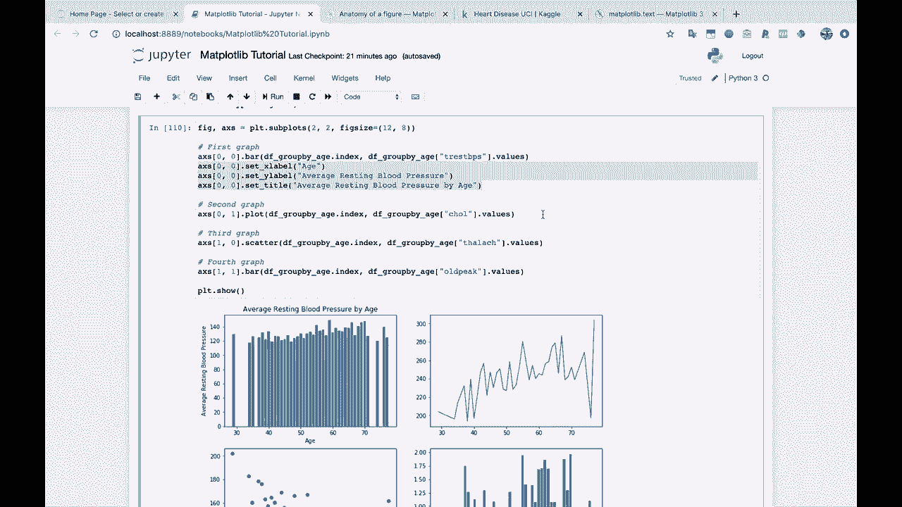

假设我们现在就把这些都保持不变，但假设你花时间逐一检查。

你知道，也许我会改变胆固醇。

让我们看看，这个是什么。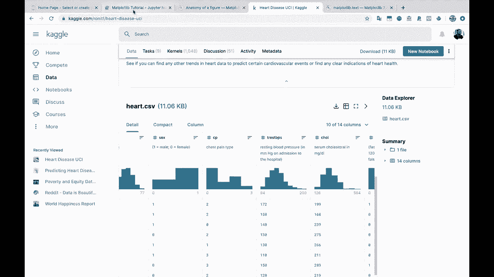

这个是心率的平均值。最大心率。记住，这是所有数据的平均值，因为我们是按年龄分组并求平均的。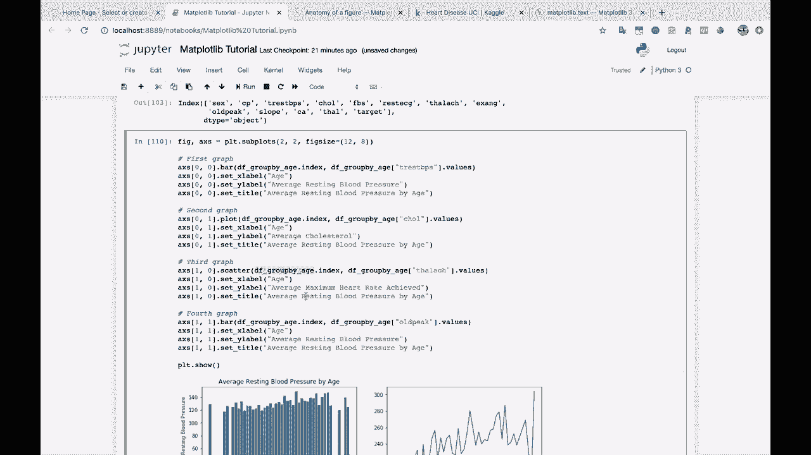

旧的峰值。这是运动引起的ST段抑制。所以我们就称为平均旧峰值。

好吧，假设你花时间绘制了所有这些。就像我刚才说的。

年龄。这里的年龄 X 轴标签和标题 A 太近，它们重叠了。这看起来不好，你无法阅读，而且你不知道那是什么。所以我们需要想办法修复这个。

所以有办法上下移动文本和图形。但还有一个非常方便的功能。

`PLT` 的紧凑布局功能。这并不是，它不是一个灵丹妙药，你知道的。它并不总是能完全按照你的要求工作。

但是如果你在 `PLT.show` 之前调用这个紧凑布局，那么 Matplotlib 会尽力确保元素不重叠。因此你会看到这里的 X 轴标签和下面图形的标题现在不重叠了，所有内容看起来都不错。

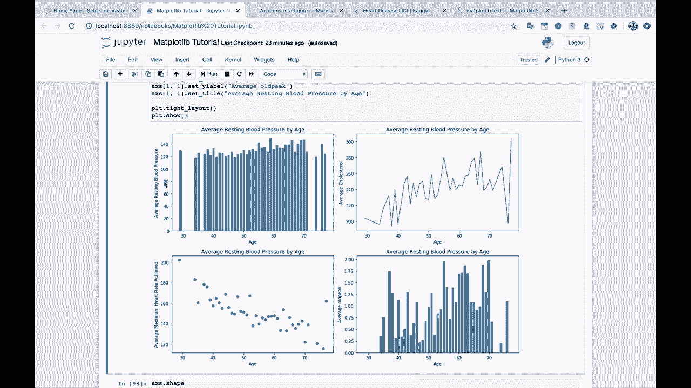

好吧，我想这就是第 5 节关于子图的内容。实际上就是这么简单。你可以创建任意数量的子图，然后在每个子图的每个轴上绘制任何你想要的图形。

最后，你调用 `PLt.showhow`，如果元素重叠，尝试 `Plt.tight_layout`。试试这个，看看是否有效，如果不行，你可能需要手动调整元素的位置。但希望这个对你有帮助。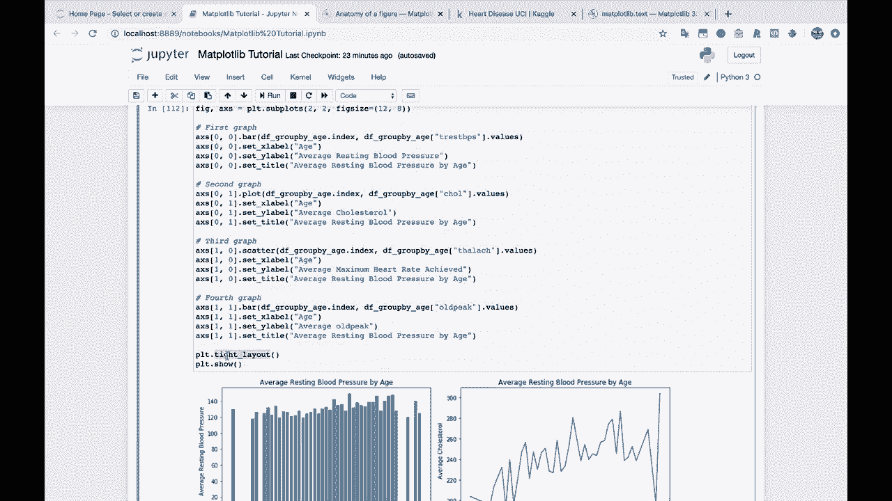

