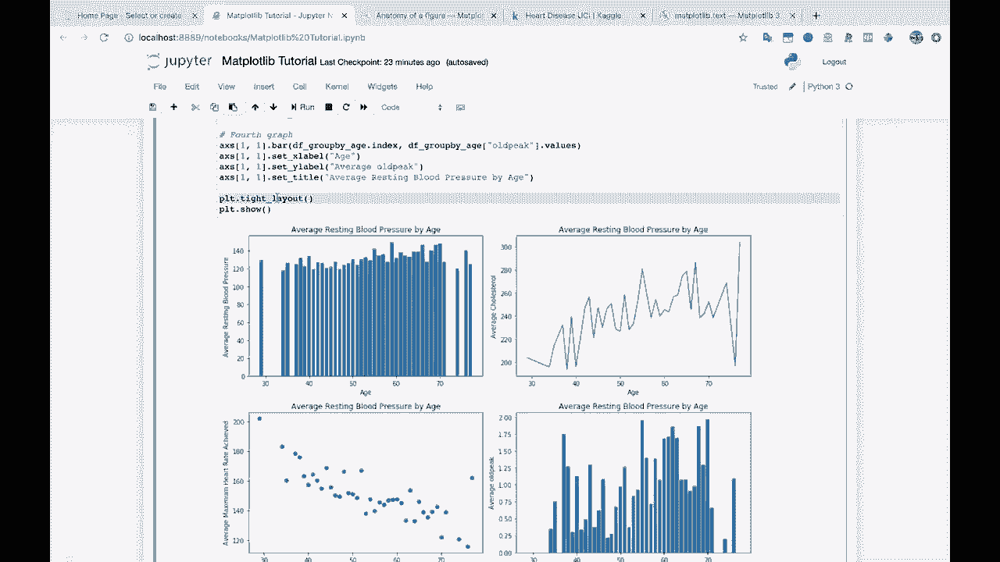
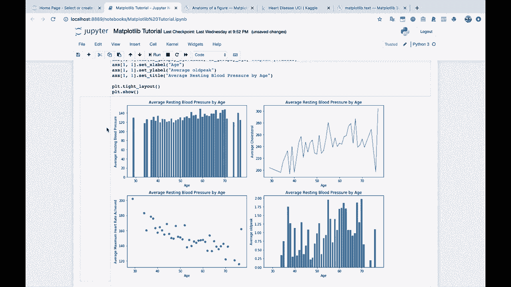
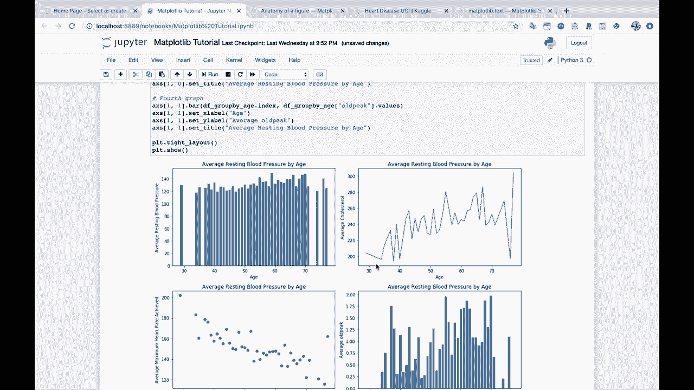
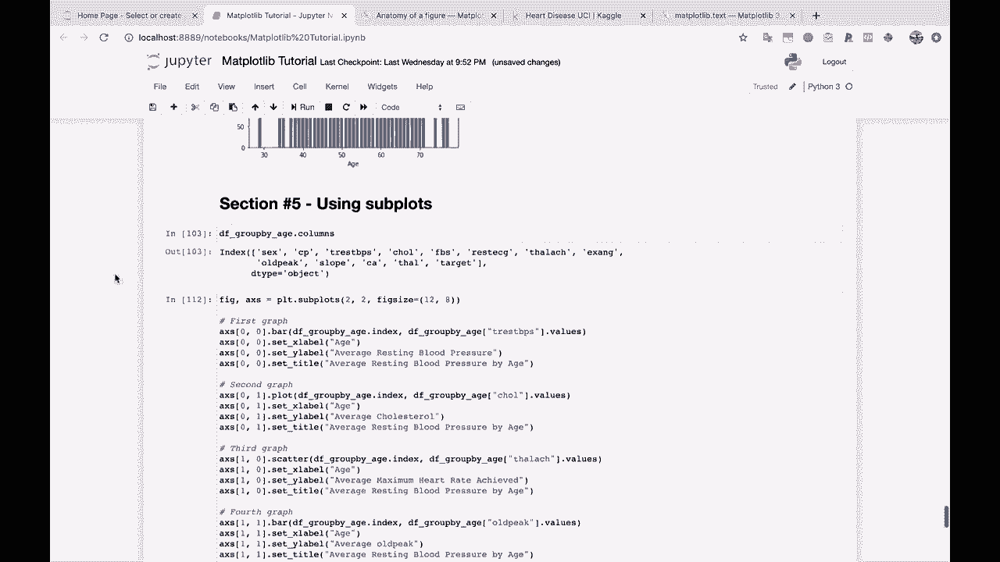
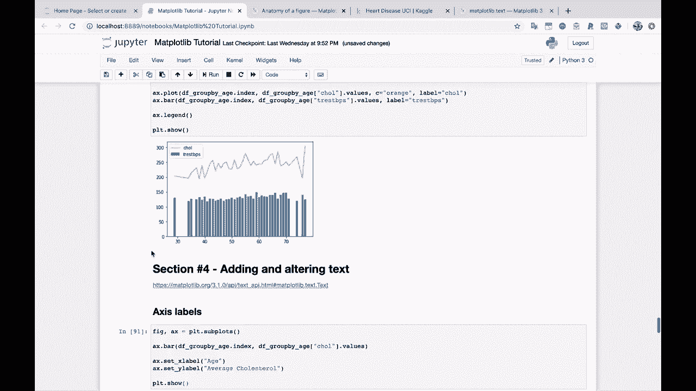
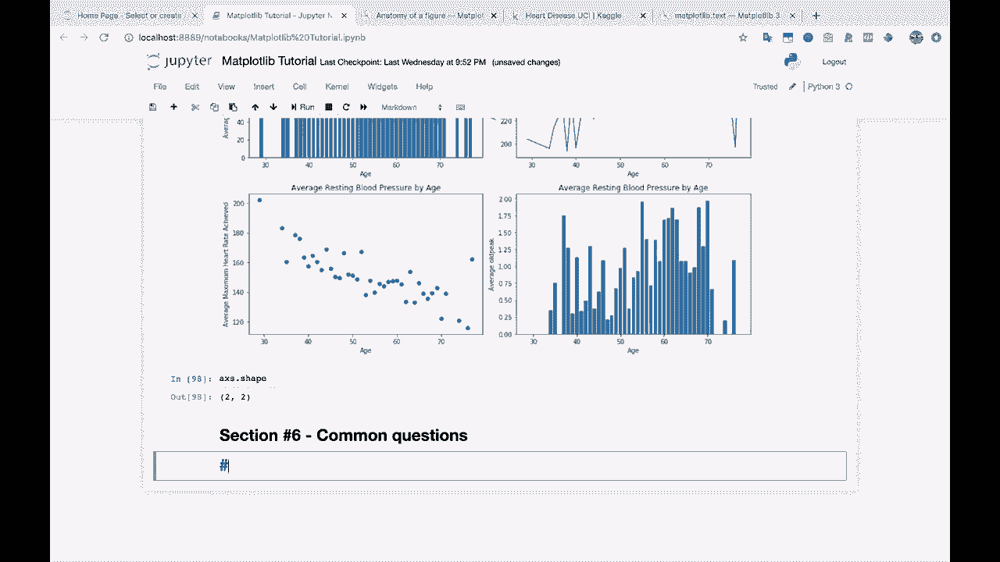

# 绘图必备Matplotlib，Python数据可视化工具包！150分钟超详细教程，从此轻松驾驭图表！＜实战教程系列＞ - P10：10）Matplotlib中的常见问题 - ShowMeAI - BV14g411F7f9

好的，现在我们要进入最后一个部分。这是一个相对较长的部分，因为我们要讨论第六部分。第六部分，之所以这样，是因为当我们谈论常见的map plot lib问题时，有很多这样的情况，因为我们已经带你了解了基础知识。

现在你已经拥有了进行数据处理和基本绘图所需的所有信息。一些基本的折线图，你知道的柱状图、散点图等。此外，还可以设置标题、X轴和Y轴标签，以及进行多个图的绘制。你掌握了这些知识，但是。

通常，当人们进行绘图时，他们想要实现一些特定的目标。而且有很多不同的特定可视化方式和常见的可视化修改方法，通常人们都想做这些，你可能也想做。所以这个常见问题部分将介绍你可能想要在绘图中实现的许多常见功能，首先从。

