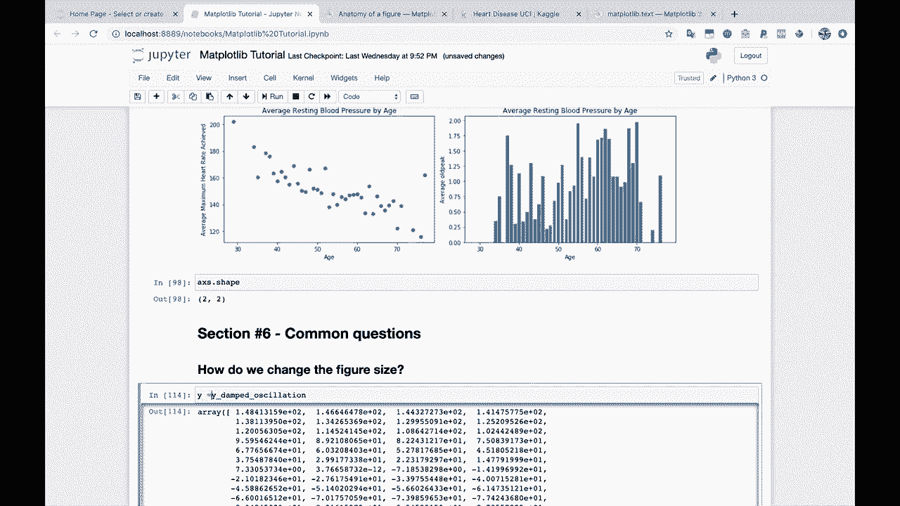
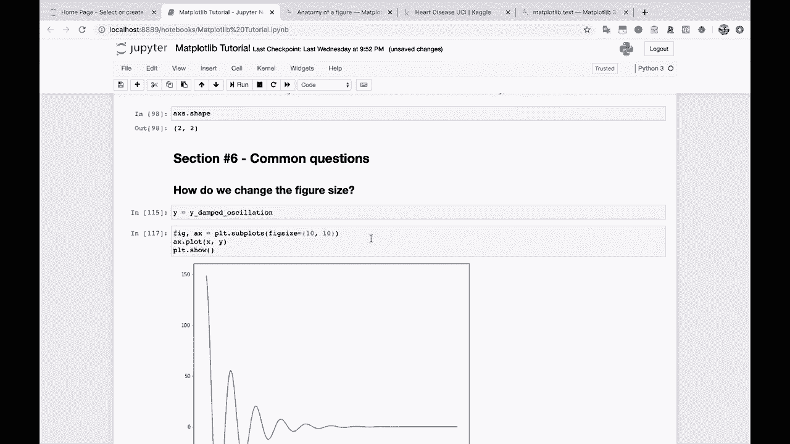
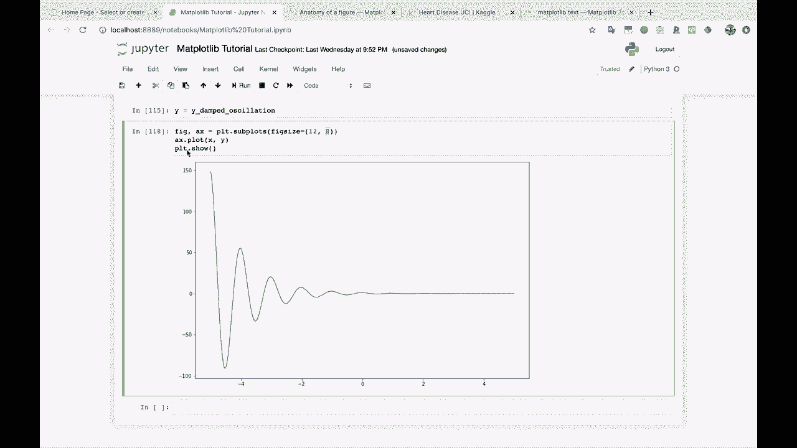
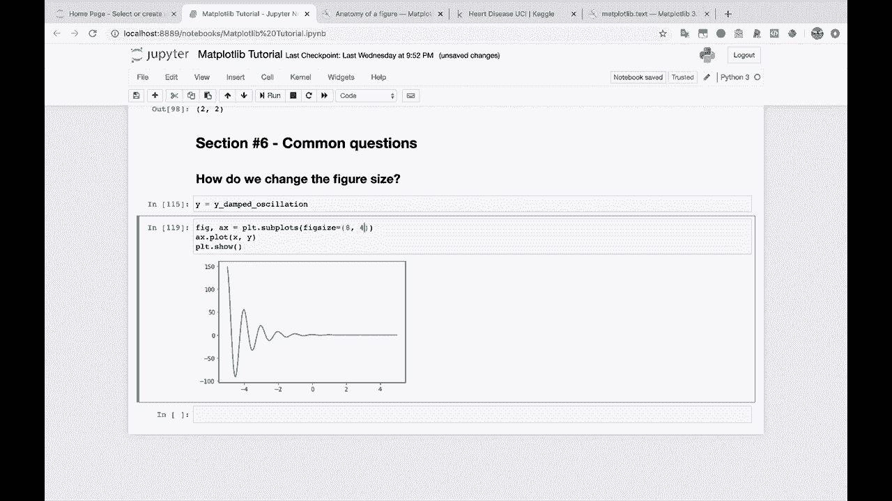

# 绘图必备Matplotlib，Python数据可视化工具包！150分钟超详细教程，从此轻松驾驭图表！＜实战教程系列＞ - P11：11）改变图形大小 

我们如何改变图形大小。

我们如何改变图形大小？这是一个问题。而且，我们会回到我们的正常X数据。

这是我们的原因。阻尼振荡数据在这里只是为了保持一致性。实际上，我将设置y等于y阻尼振荡，以便我们可以在这里为所有这些不同的图进行X和y的绘图。

这就是我们之前做的事情。让我们从正常的模板开始。PL T.dot subpls A X.dot plot X和Y，然后我们会做PL T.dot show运行这个。好的。那么我们如何改变这个图的大小。

嗯，我们可以在这里做到这一点，每当我们创建图形和坐标轴时。我们只需传入fig size。fig size。就像是你在指定一种水果的大小，但其实不是。这是这里图形的大小。然后你可以传入你想要的任何值。那么我们传入10，10。

看吧，我们得到了一个漂亮的大方形图。如果我们传入，比如说，12和8。你会看到第一个数字控制宽度。图像的宽度。然后第二个数字控制图像的高度。这就是你改变图形大小的方法。让我们这样做。

让我们把这个稍微缩小一点。我们去6和4。

我们实际上非常接近原始图像的大小。那么我们试试8和6。好的。
