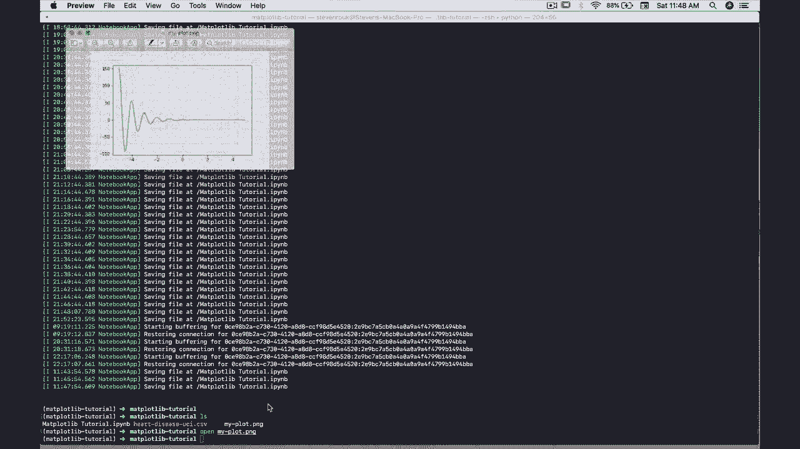
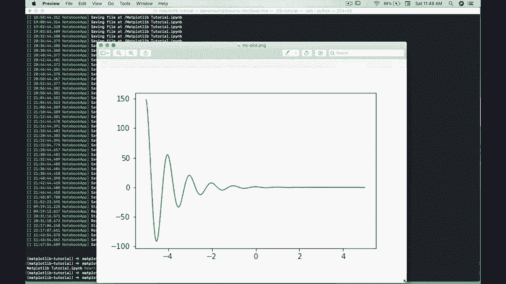

# 绘图必备Matplotlib，Python数据可视化工具包！150分钟超详细教程，从此轻松驾驭图表！＜实战教程系列＞ - P12：12）将图像保存到文件 - ShowMeAI - BV14g411F7f9

继续我们的下一个问题。我们如何将图像保存到文件中？

我们如何将图像保存到文件中呢？你可以在 Jupyter Notes 中右键单击这里，然后选择“另存为图像”，如果只是偶尔做一次，这是一种非常简单的方法。但是，如果你想使用 Matplotlib 将其保存到文件中。我们再来画一个基本图。

我将移除图形大小。所以，不是要在最后调用 plt.show，而是让我们使用 plt。我要点击 Tab 键，看看这里所有的选项。我将开始输入 save fig。好了。那我们实际上来看看文档。使用我们方便的问号。

Jupyter Notes 中的问号语法。所以我们可以保存图形，然后它只需要作为和关键字参数。因此，你知道，参数，关键字参数。基本上我们可以传入任何内容。好的，这是调用签名。所以文件名，我们可以传入 DPI，如果我们想的话。我们可以传入方向等各种不同的内容。

但我们主要想看的内容是文件名。所以，如果格式未设置，则输出格式从文件名的扩展名推断出来。所以在这种情况下，假设我们想将其保存为 PG，我们可以说 my_plot.PG，它将保存为 PNG，因为 Matplotlib 看到扩展名并知道将文件保存为 PNG 文件。让我们继续运行这个，你会看到它实际上也会弹出来。

但让我们回到终端。

让我们做一个小的 LS。看，这就是我的 plot.png，让我们打开我的 plot.png。

这里就是那个图像。看看。然后如果我们，把它放大，你可以看到它确实会变得有点模糊。这就是 DPI 参数可以派上用场的地方。但我们已经将图像保存到文件中了。就这样。

我将快速保存这个笔记本，确保在进行过程中保存，以免丢失你的工作。
