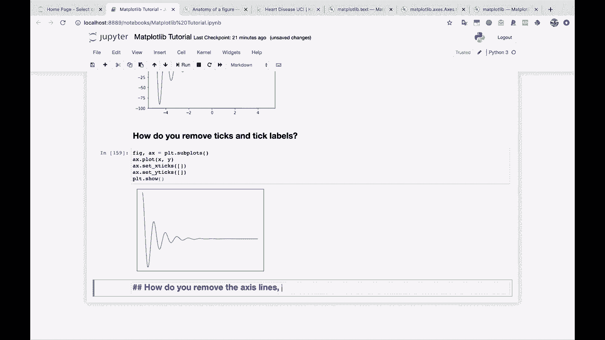
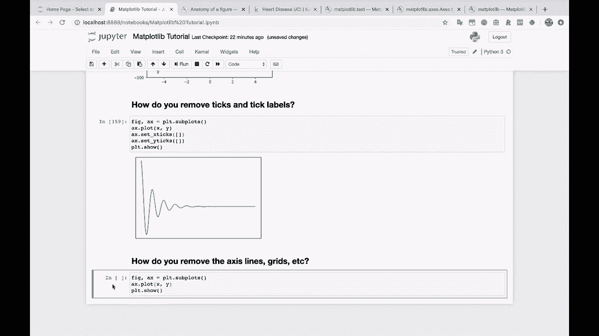
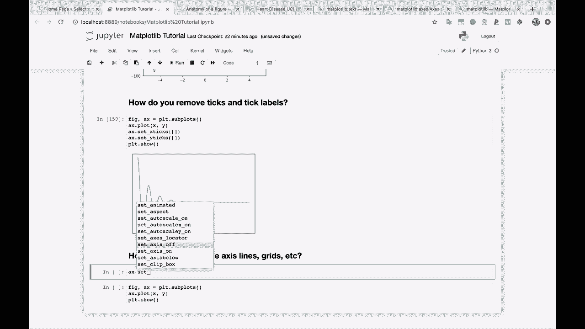
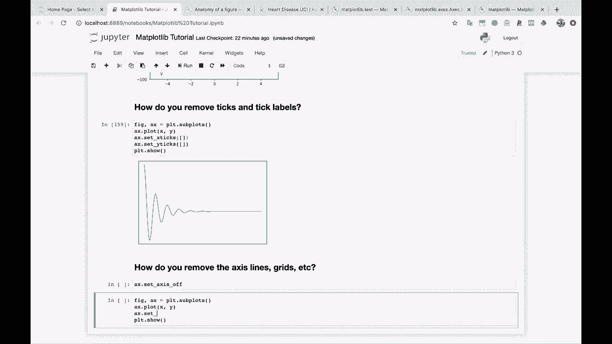
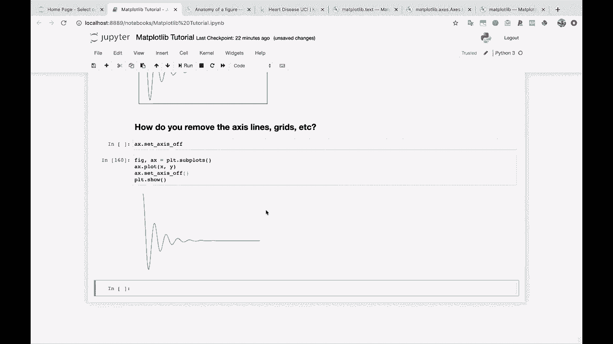
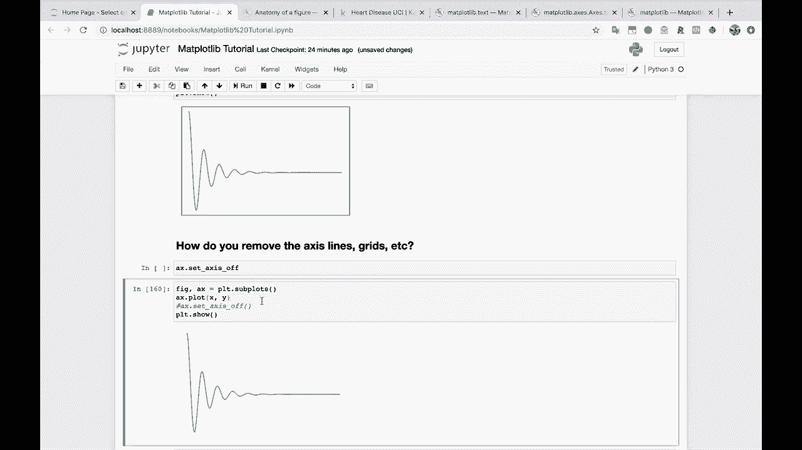
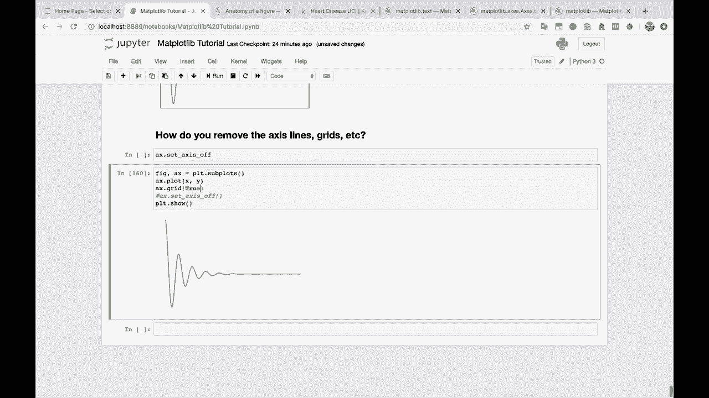
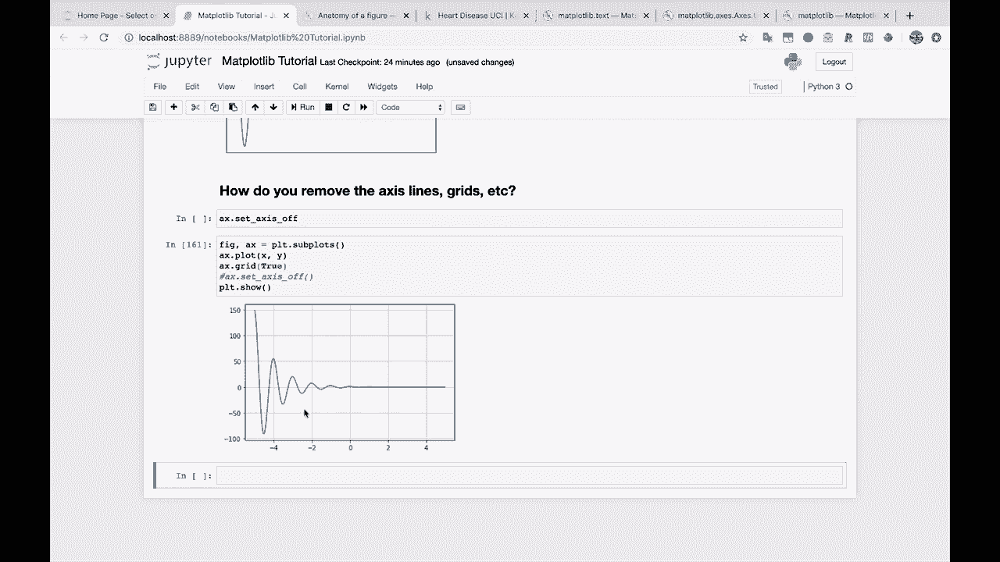
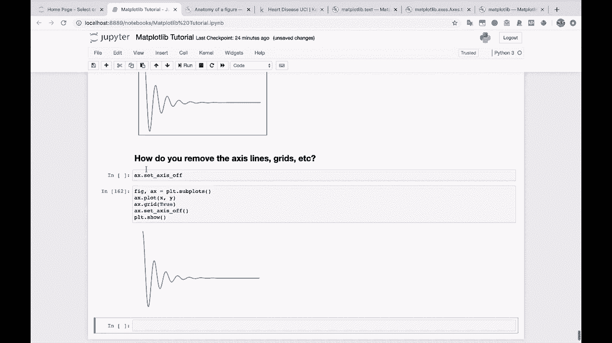

# 绘图必备Matplotlib，Python数据可视化工具包！150分钟超详细教程，从此轻松驾驭图表！＜实战教程系列＞ - P18：18）怎么关掉轴 

看，关于这个。你如何移除轴线、网格等。

假设我们想要移除这些边缘的线条。那么，先展示一下我们正常的图形。删除。然后如果你进到AX去设置。

然后设置轴，设置轴，设置轴为关闭状态。我们来试一下，看看会发生什么，设置。

关闭轴。看，周围没有轴线。

顺便说一下，我们这里没有任何网格线，但如果有的话，这也会影响网格线。所以我们实际上快速展示一下，如果我们对AX调用网格并传入true。

我们在刻度标记处得到了这个漂亮的网格。现在如果我们设置轴为关闭。这不仅关闭了图形周围的对齐，还关闭了那些网格标记。

