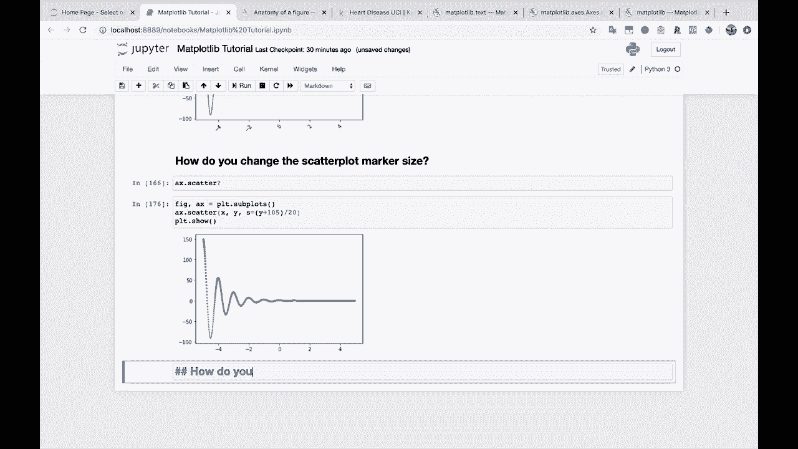
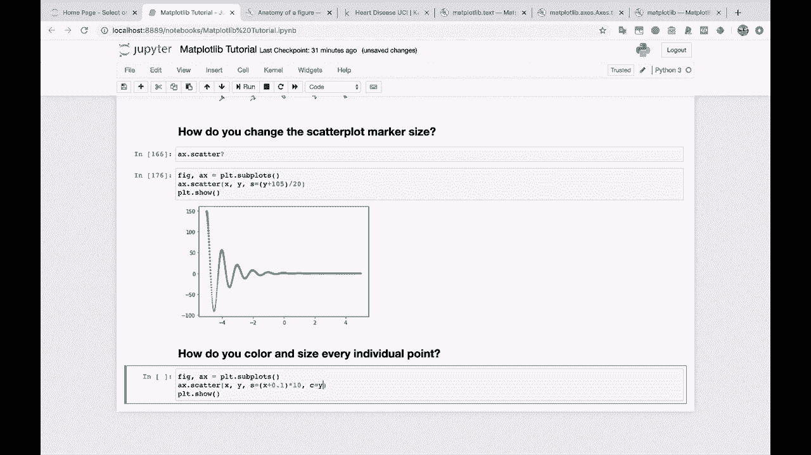
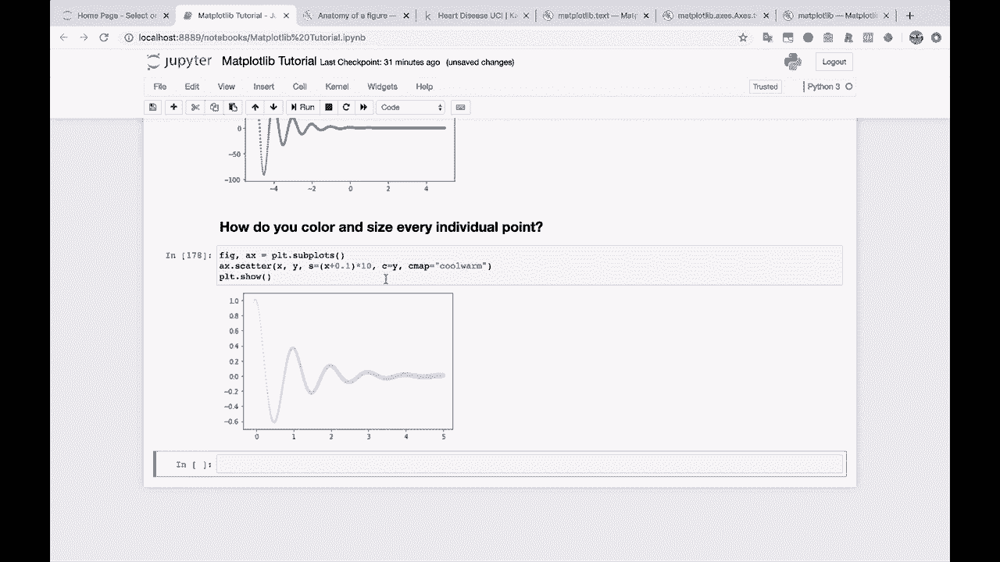
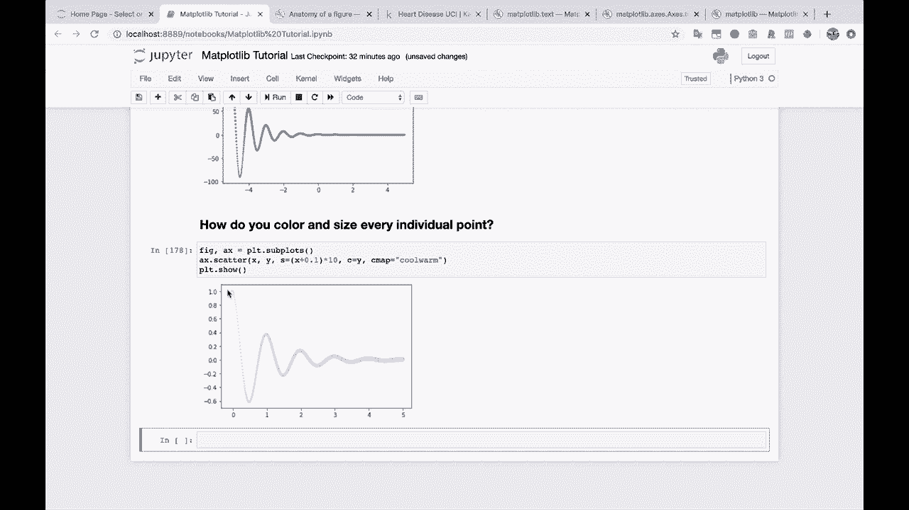
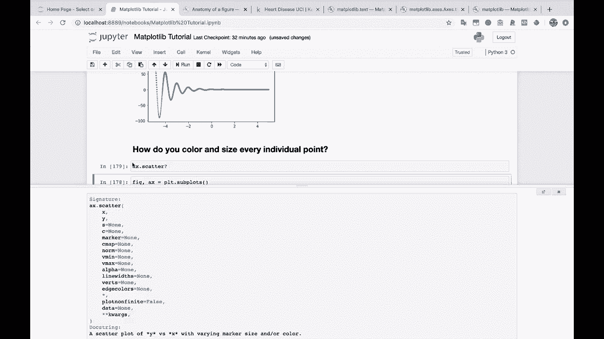
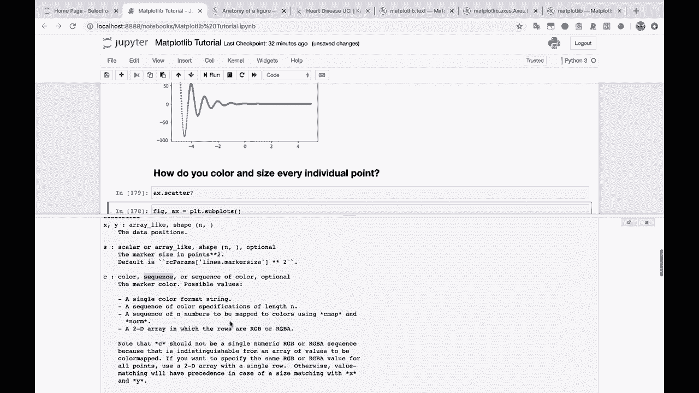
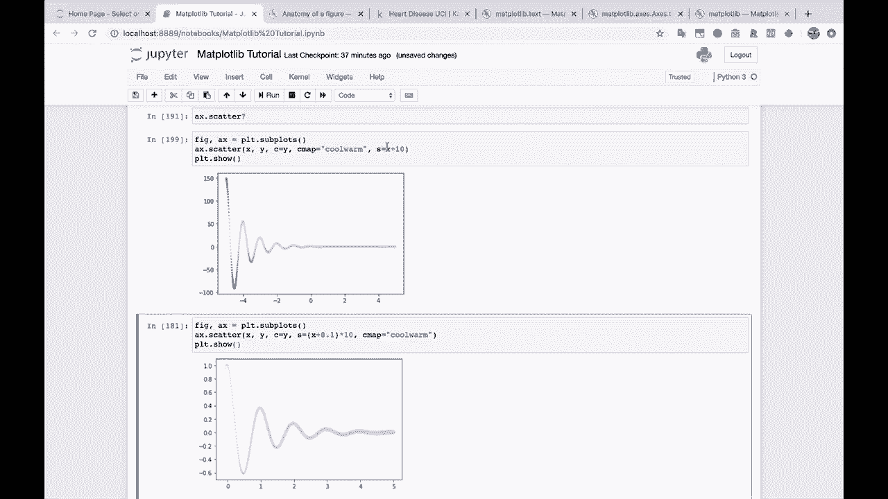
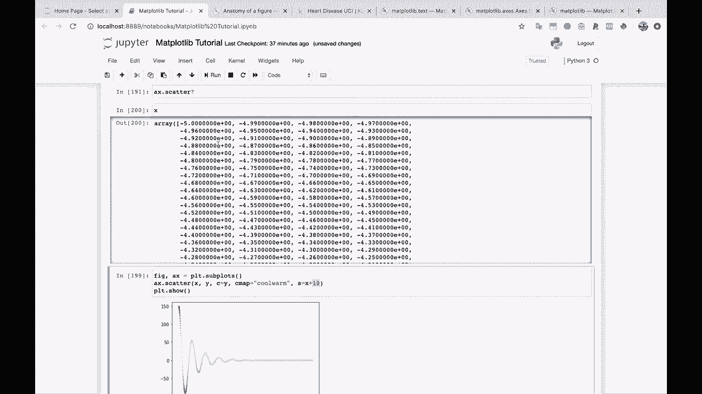

# 绘图必备Matplotlib，Python数据可视化工具包！150分钟超详细教程，从此轻松驾驭图表！＜实战教程系列＞ - P21：21）更改散点图的大小和颜色 

让我们实际上快速展示一下。这将是我们下一个问题。如何为每个点着色和调整大小。

好吧，你只需传入数组。你在这里只需传入数组。所以让我们取这个。我们将它放回这里。让我们得到我们的X。你知道的，我们将做X加上0.01或0.1，以避免遇到的整个错误。然后我们将其乘以10。然后我们也有这个C参数。得到了C参数。那么让我们试着传入这个。

我们试着把Y传入这个参数。

你会看到这里发生了一些有趣的事情。让我传入一个C映射值。这是一个颜色映射。这是让map plot Lib知道的一种方式。嘿，我想使用一个特定的颜色组。所以我们有一些冷、暖色调。

实际上这并没有做我预期的事情。我原本期望这些值会随着Y的变化而变化。我们来看一下A x点的散点图。

所以你可以传入size，可以传入C。C是一个颜色、一个序列或一个颜色序列。

好吧，看起来通过这些x值我能够修复它。如果你看看这里的x。我们降到负5。

如果我们把10加到x上，以确保所有的size都是正数，那么它看起来就像我们预期的那样工作。好吧，搞定了。所以这是每个点的着色，同时也根据每个点的大小进行处理。这可能对这个特定的图表没有太大帮助。但是假设你有，你知道的。

在散点图上有100个不同的点。你想根据一个属性为它们着色，并根据另一个属性调整它们的大小。这就是你会如何做的。正如我们刚刚学到的，确保你的所有大小都是正数，因为你不能有负的大小。

