# 绘图必备Matplotlib，Python数据可视化工具包！150分钟超详细教程，从此轻松驾驭图表！＜实战教程系列＞ - P7：7）在同一轴上绘制多个图形 

现在让我们创建一个新部分。我们称之为第 3 部分，第 3 部分。所以在这一部分，我们将看看在同一坐标轴上绘制多个图形。因此同一坐标轴。所以记得。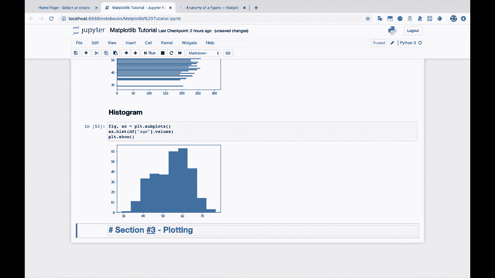

图 A X 等于 PL T 点子图，然后 PL T 点显示。这将给我们一个图形。所以一幅图像，你知道，还有一个坐标轴。所以 A X E S 在那里。所以我们将绘制的一个地方。对于这个，我们将查看同一坐标轴上的多个图形。

所以我们不会像这样查看多个坐标轴。我们将在同一坐标轴上绘制。好的。

好的，让我们试试。首先是一个简单的图形。让我们回到之前使用的简单数学方程。所以我们将进行 Ax 点图。现在让我们看看我们的 x。我们的 x 仍然在那里。我们的 y 也还在。让我们看看这里的 x 和 Y。这是什么？这是一个抛物线。很好。现在，如果我们想在这里绘制另一个图形，我们来做 A X 点图。

让我们回到我们的阻尼。让我们看看为什么是阻尼振荡，记住。看吧。我们的抛物线在这里变得非常扁平。你可以看到，因为我们的 y 轴突然变得非常大。那么，如果这里不是一个抛物线，而是 x 的立方呢？😊让我们试试。好的，那看起来稍微好一点，但不管怎样。

现在你可以看到我们在同一坐标轴上有两个图形，y 等于 x 的立方，然后我们有我们的阻尼振荡图。Matplotlib 自动为我们绘制了这两种不同颜色的图形。现在，每当你开始在同一坐标轴上绘制东西时，你通常会想添加标签。

这很简单。你只需在图形中添加标签参数。所以我们可以说，你知道，对于这个，也许就是 x 的立方。而这个的标签是阻尼振荡。所以我们添加了标签，但如果我们运行这个，其他的没有发生。这就是我们方便的 Ax 图例方法派上用场的地方。

所以这是你可能会一直使用的东西。每次你给图形添加标签时。然后你想在图形中显示这些标签。只需添加这个 A X 图例。我们运行这个，matplotlib 会自动在这里为我们放置一个图例，带有颜色。😊

而且。这也会设置图形的样式。所以，如果这是一个散点图，这些将是小点而不是线。我们看到这里的蓝色图形是 x 的立方，而我们的橙色图形是阻尼振荡。所以这是如何使用同一坐标轴对象的简单概述。要多次调用绘图方法，你要用不同的数据多次调用它。

这会将你的数据绘制在相同的坐标轴上。现在，让我们回到心脏病数据。假设我们想要一个散点图。我们想回到绘制一个数值变量与另一个数值变量的散点图，以寻找关系。但我们还想着色。

按标签，我们想根据标签着色。那我们为什么想这样做呢？好吧。假设我们想看看关系。让我们回去。让我们回到我们的数据框。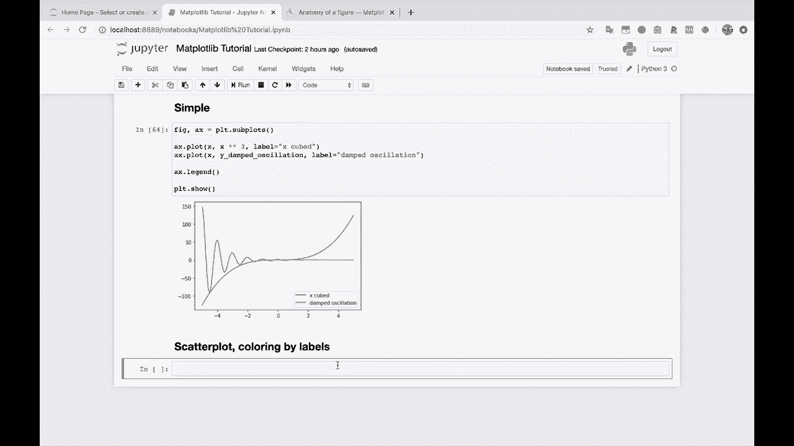

假设我们想看看静息血压和胆固醇之间的关系。如果我们回到我们的`cagggle`数据，这里，回到我们的`Cale`数据。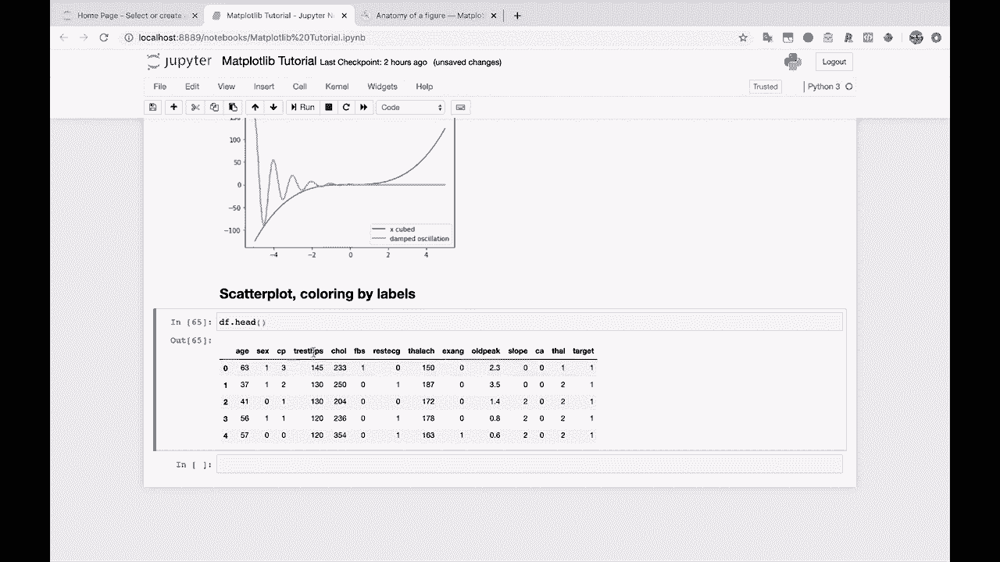

`T rest， B P`，这是静息血压。所以这是静息血压。然后是胆固醇。这是血清胆固醇，单位是每分升多少毫克。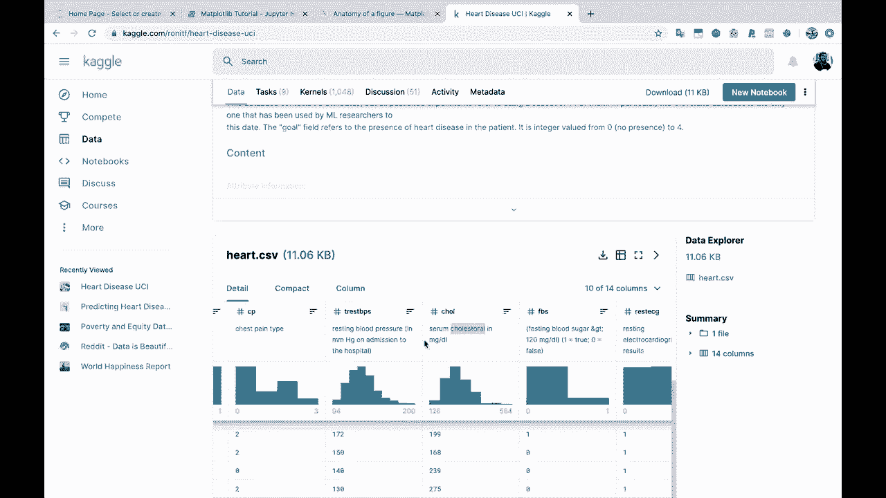

所以假设我们想看看静息血压与胆固醇之间的关系。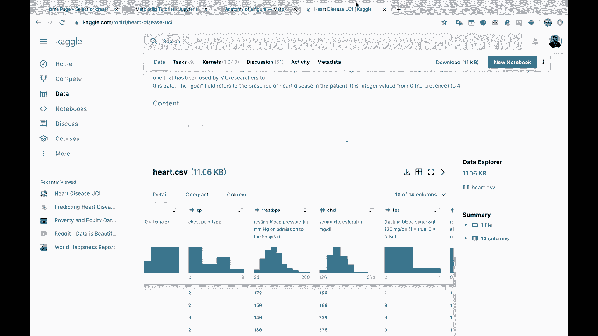

我们想看看在有心脏病和没有心脏病的人之间，这种关系是否有任何不同。因此我们想根据是否有心脏病来着色。让我们看看我们在这里的意思，以及我们可能怎么做。

所以我们将从基本公式开始。我们在这里有子图，正在创建图形。最后创建坐标轴，调用 `plt.show` 来显示该图。现在如果我们只想做一个普通的散点图。如果我们只是想做一个普通的散点图，我们可能会说，你知道的。`df.T.rest BPS.values`。

我们想要将其绘制与胆固醇的值。

这是我们的图。我们在X轴上有静息血压。我们在Y轴上有胆固醇。但是我们想要为此着色。我们想根据这个人是否有心脏病来着色。所以看看我们原始的数据。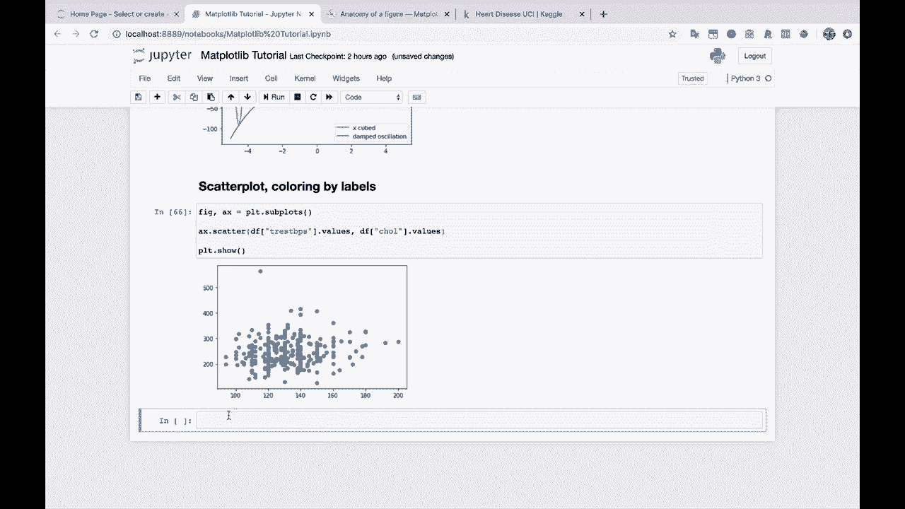

你可以看到目标。所以目标是1，让我们回到数据中验证一下。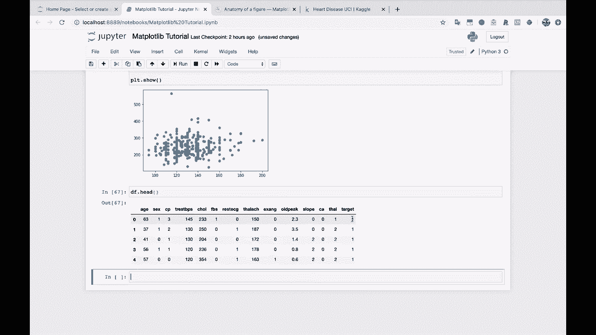

一个目标。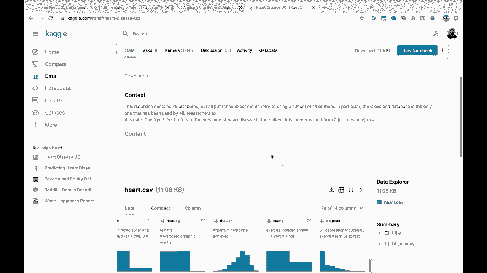

嘀嘀嘀，让我们看看。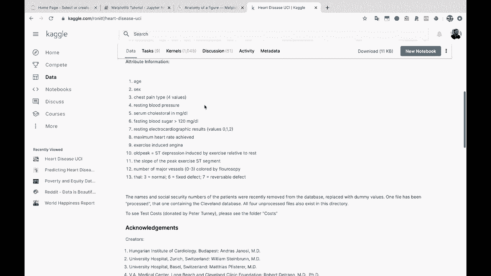

好吧，实验与克利夫兰数据库。值1、2、3、4都表示心脏病，值0表示没有心脏病，我想在我们的数据中。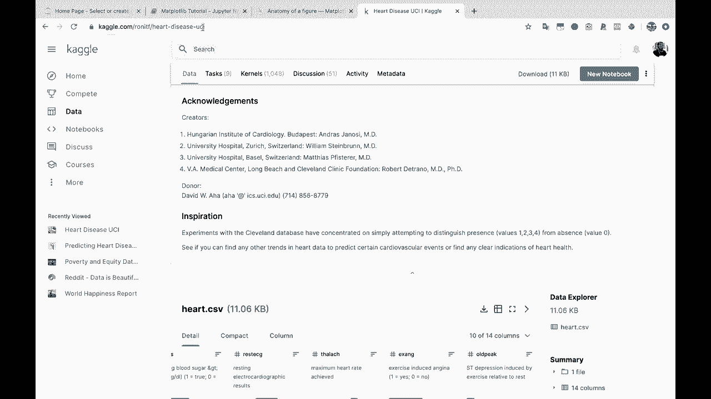

我们只有。

哦，抱歉，值。计数。是的，我们在这里的数据只有1和0。所以1表示心脏病的存在。0表示心脏病的缺失。所以我们想要着色。根据这一列，我们想为每个点着色，看它是否有心脏病。

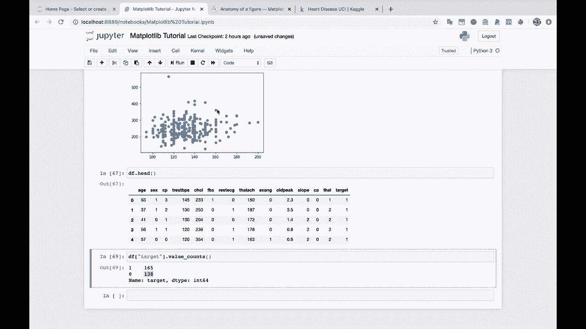

所以使用这个，我们可以用同样的原则在同一坐标轴上绘制多个图形。因此在这种情况下。

假设，让我们看看。我们的目标。假设我们只想获取等于0的行。所以我们将其设为零，这创建了一个布尔掩码。因此，基本上你知道这行是否等于0，它会显示为false或true。我们将这个布尔掩码传回到我们的数据框中，以便索引到这些行。

然后我们可以称之为，我们可以称之为我们的DF子集或类似的东西。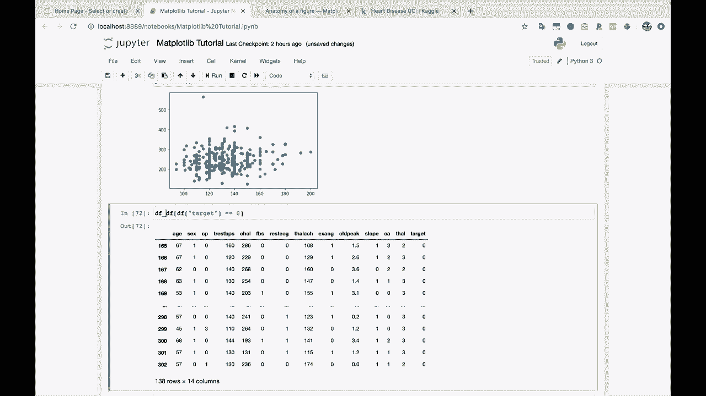

所以，让我们。

让我们试着逐步进行上面的内容。DF子集。等于这个。现在。与其传入整个DF，不如我们只传入这个子集。所以这些只会是没有心脏病的人的行。

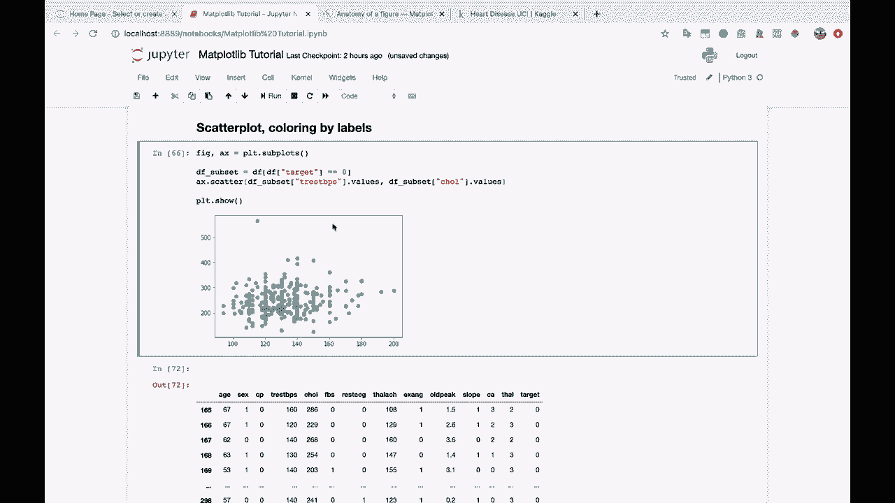

所以假设先绘制没有心脏病的个体的数据。先做这个散点图。这样可以。你看到散点图变得相当不错。因此我们现在只绘制了大约一半的点。

我们只绘制了大约一半的数据点。

所以让我们复制整个内容。让我们复制整个内容并向下移动。现在也许我们设置DF子集等于有心脏病的人的数据。然后。我们可以再绘制。第二。第二，绘制个体有心脏病的数据。

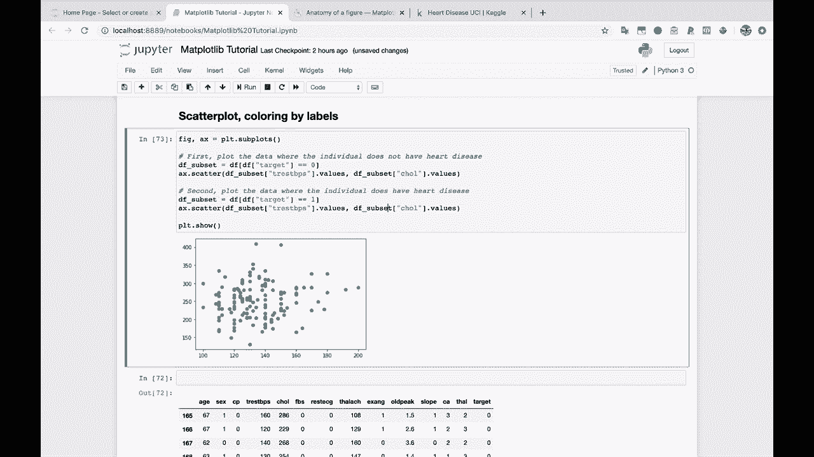

看那条matplot Lib。已经根据是否有心脏病将这些点着上不同的颜色。现在我们要做的就像之前一样。我们添加一个标签。假设标签等于。我们叫这个也许是健康的。

这个标签将显示，心脏病。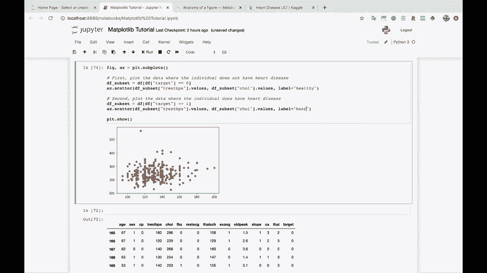

记住我们需要在这里添加我们方便的AX do图例。就这样。因此，基本上我们在同一坐标轴上绘制了两个不同的散点图。第一个。这些是健康患者的X值，这些是Y值。第二个，这些是有心脏病患者的X值，这些是Y值。

matpllib自动为我们上色，我们添加一个标签，并且添加一个图例。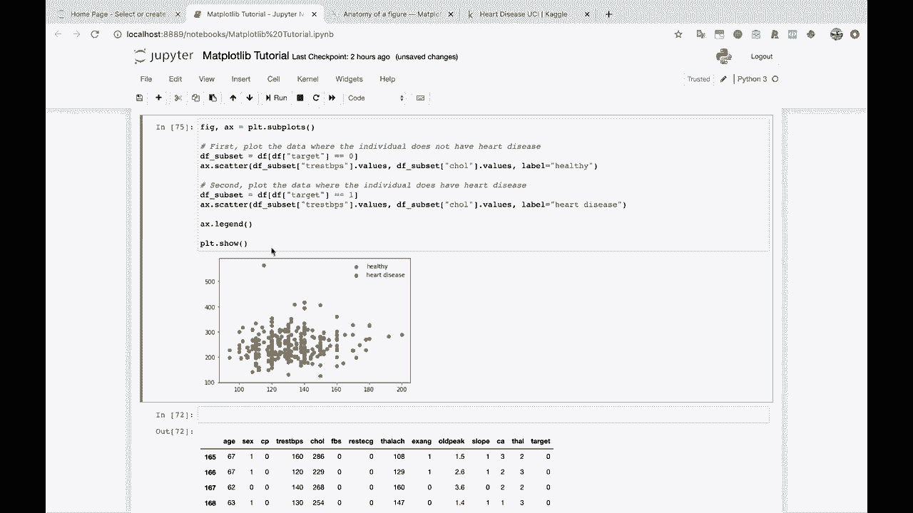

就这样。我们现在有一个通过标签上色的散点图。这很酷。😊现在，假设我们这里有很多值。我们想为很多不同的值做同样的上色散点图。那么。这是很多冗余代码。而且因为我们明确列出了，显而易见。

嘿，你知道，先绘制这个，然后再绘制第二个。但我们还有另一种方式可以做到这一点。我想快速给你展示。所以我要把这个复制到第二个单元。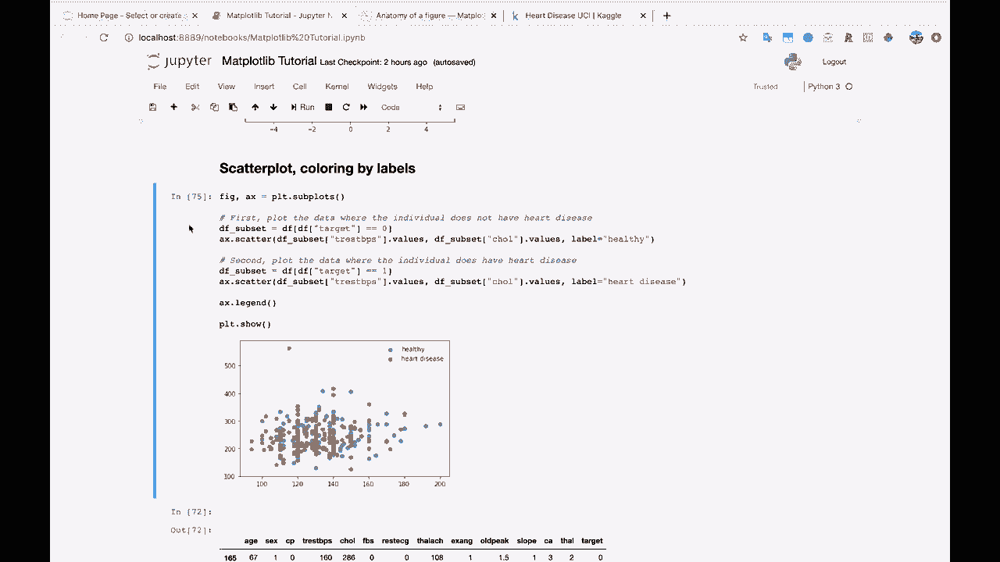

所以在这种情况下，我们将循环遍历不同的值。基本上，这段代码中唯一变化的内容除了我们设置的标签外，就是我们根据这里的目标值来过滤数据的方式。所以如果我们再次查看DF目标。

DF目标，如果我们想要获取这个系列中的唯一值，那么我们只需点唯一值。

这向我们展示了我们只有两个唯一值，0和1，然后我们可以遍历这些值。

那看起来怎么样呢？我们可以说4，目标值，在DF目标的唯一值中。所以我们将循环，DF目标，来了。点唯一值。我们将循环遍历每个目标值，0和1。让我们继续缩进这一部分。现在，不再明确地将其设置为0。

我们将这个值设为我们正在迭代的目标值。然后我会删除这个注释。

而且趁此机会，我现在要删除这个标签。我们可以删除这里的第二个图表。所以让我们，或者也许我实际上会传入。传入标签等于目标，目标值，然后我们将保留图例。

就这样。所以我们刚刚做了完全相同的图表。你会看到现在映射绘图的lib因为这个DF目标的唯一值。

它切换了我们绘制的顺序，这意味着颜色被翻转了。所以，你知道，健康现在是橙色，而心脏病现在是1，仅仅因为这些值在DF目标中的输出顺序。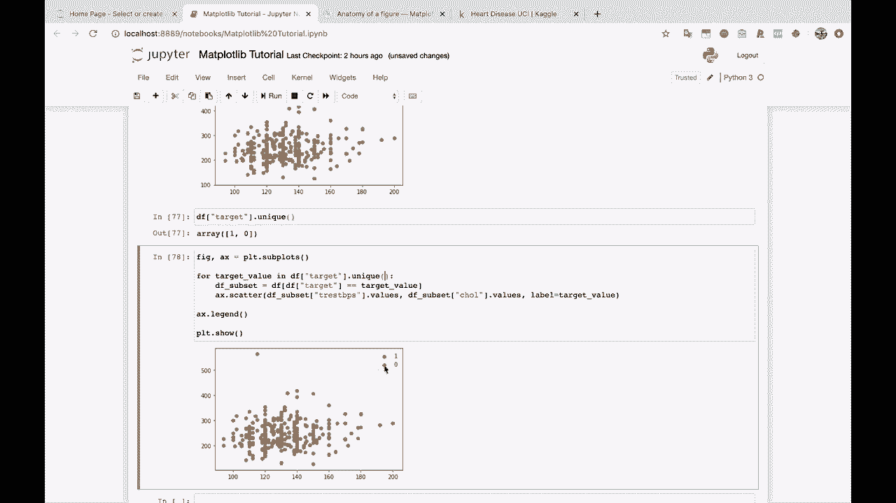

而我们的标签现在仅仅是这个目标值。如果我们想在这里有一个更具描述性的标签，这就是你可以开始做类似的事情的地方。所以也许我们有一个字典，可能我们有一个叫做标签映射的字典，或者类似的东西。我们想要映射一个标签值或目标值为0，健康。

我们想要映射目标值为1，Qiu，心脏病。而现在，我们的标签不再等于目标值，而是让我们的标签等于标签映射。

目标值。所以我运行这个单元，以便获取我们的字典。现在如果我再次运行这个，你会看到我们传入了我们的标签，这是从这个字典中映射过来的。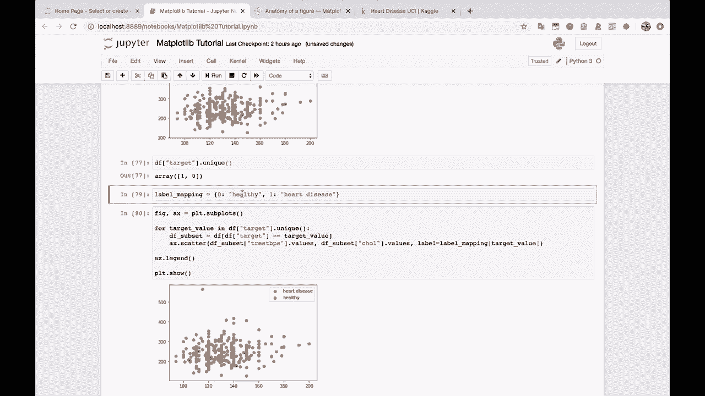

这是一种可以在许多不同情况下使用的技巧。我们可以在这里有一个颜色映射字典，也许。如果标签是 0，我们希望它是蓝色。如果标签是 1，我们希望它是红色或其他什么。因此，你可以使用这样的字典进行各种不同类型的映射技巧。

但这是一个示例，说明如果你想的话，如何将两个明确的调用合并为一个。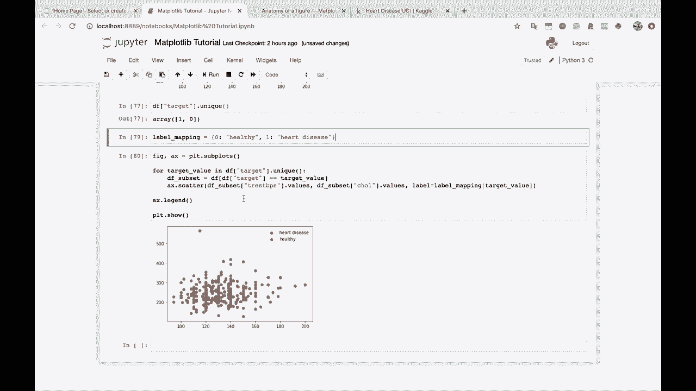

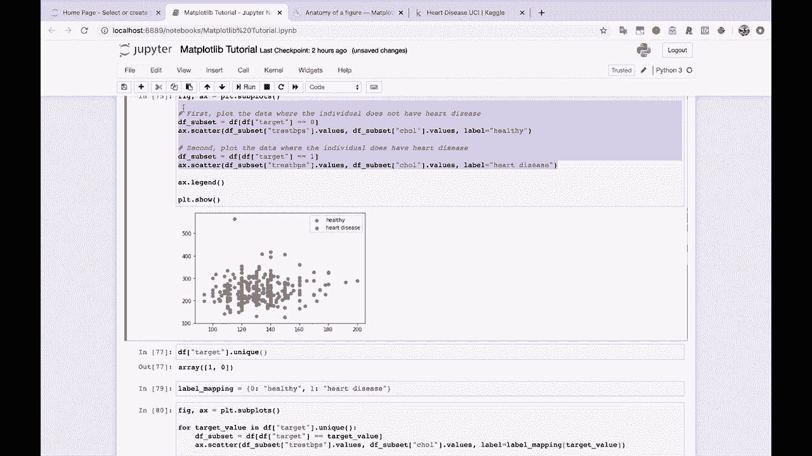

循环调用遍历所有唯一值。现在，当我们在这个散点图上时，假设我们有一个特定的点想要突出显示在这个散点图的某个地方。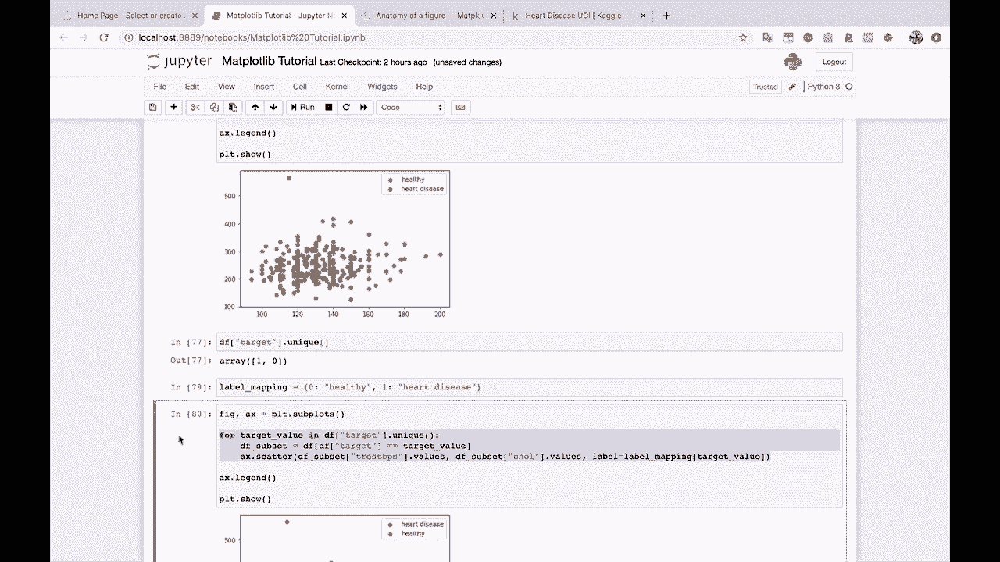

这可能是你出于各种原因想要做的事情。也许你想在柱状图中突出一个单一的条，或者在散点图中突出一个单一的点。这是一个非常常见的需求。因此，让我们讨论一下如何在这个散点图中做到这一点。我要说的是：散点图，突出一个单一的点。在这种情况下。

我们将突出显示的方式是使用颜色。所以如果我们做 A X。

点散布问号。让我们看看我们有什么选项。因此，除了传入 X 和 Y，正如我们一直在做的，我们还有一个 S 参数，A C 参数。我们这里有一堆其他参数。嗯。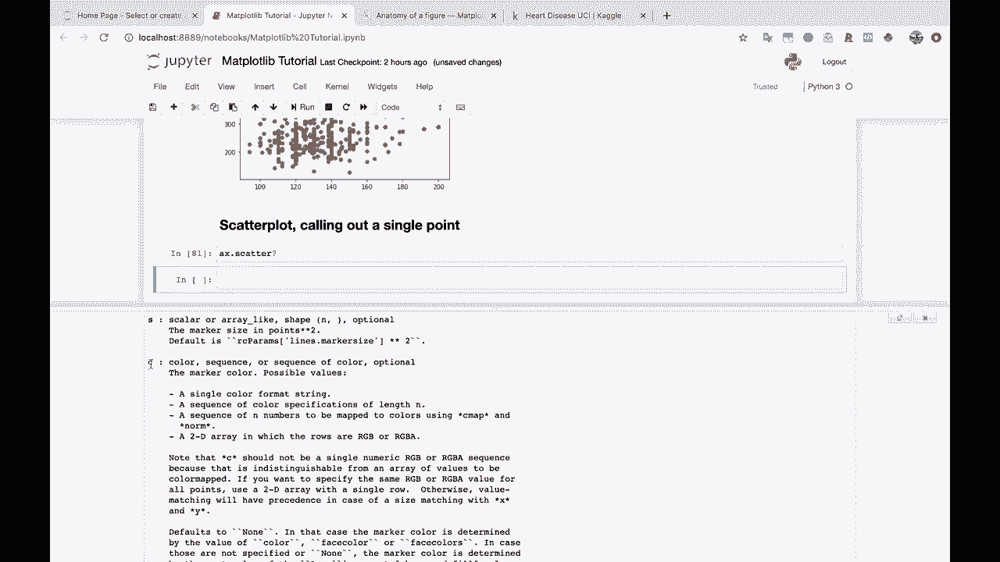

所以 S 将代表大小。这里的标记大小和 C 将代表标记颜色。我们将在稍后利用这个标记颜色。现在让我们从正常开始。

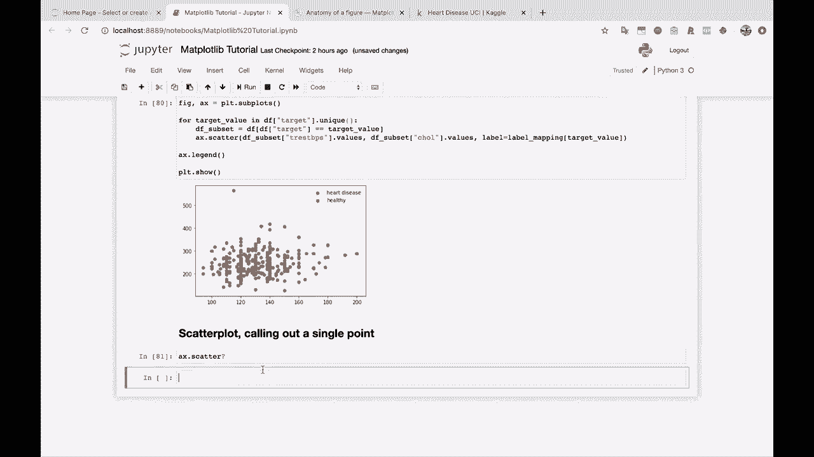

从我们的正常开始。

这里的模板，Plt.splots。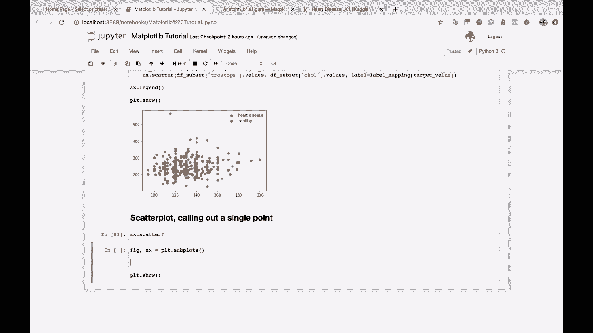

让我们做 A X 点散布。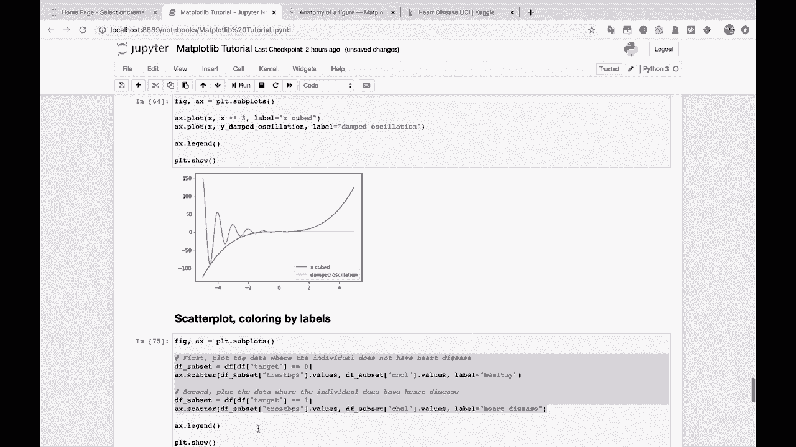

嘟嘟。

让我们来做一个点散布。我们将做所有的点。所以让我们做 D F。T S，B，PS。DF 胆固醇。让我们看看这个。

好的，现在假设我们想突出一个单一的值。首先，让我们把所有其他值设为浅灰色。所以我将使用 C 参数。C 等于浅色。G i。所以 c 等于像灰色。现在我们将所有这些点变成灰色。现在我们想要突出一个点，可能我们想要突出的点就是这个数据中的第一个患者。

所以我们可以做的是。我们可以有一个散点图。实际上。我只是将整行复制下来。我们只针对零索引的人绘制一个散点图。所以只取我们的数据中的第一个点。现在让我们将颜色改为红色。你看，现在我们将所有点绘制为浅灰色。

然后我们只需取第一个点。我们只取那个第一个点，即零索引。我们将那个特定的点用红色绘制出来。这是一个很好的方法。你可以用柱状图做到这一点。你可以用其他类型的图表做到这一点。这是一个很好的方法来突出图表中的特定点，你只需，知道。

只需在其上绘制另一个散点图。用不同的颜色来做。随便选择你想要的颜色。好的，我们本节的最后一个例子将是。我们来做一个。我们来做一个柱状图。还有一个。折线图。也许还有一个。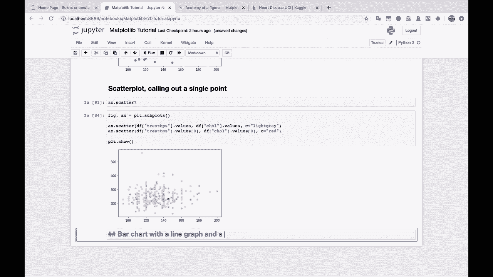

画一条水平线。所以我们将从同一模板开始，PLT.dot subplots。然后在这里显示 PLT。我们想绘制什么数据，好吧，也许我想绘制。让我们看看。也许我想绘制一个折线图，回到我们的按年龄分组。我们的按年龄分组。所以让我们在 X 轴上绘制年龄，也许。绘制胆固醇水平。

沿着 Y 轴。这是一个很好的折线图，显示了你的年龄和每个年龄组的平均胆固醇。所以现在，也许我想添加一个柱状图。

在这个坐标轴上，我想显示 TR Bps，静息血压。

现在让我们做 AX.dot bar。再次重申。我们在这里使用的是同一个 AX 对象。所以我们使用同一个对象，调用不同的方法来在同一个图表上绘制不同的图，使用相同的坐标轴。因此，我们也将使用年龄作为 X 轴。现在让我们进行 T rest B。

P 作为我们的值。你看，我们现在有这个柱状图。它代表一个值，胆固醇则代表另一个值。所以这里并没有明确指出。所以我们可以改变这些不同图表的颜色。所以也许我会传入一个 C 等于。让我们试试橙色。我们还会。

我们可以保持。这个颜色，保持不变。让我们传入一个标签，看看会有什么效果。所以这将是。胆固醇。这个标签将是 T rest。Bps。并记住，我们需要调用 AX.dot legend 以便显示图例。所以你看，这就是我之前提到的。图表将以不同的形状显示，以指示你在这里查看的内容。

这是一张柱状图。它告诉我们这是静息血压。而橙色线是这条线图，这是我们在这里查看的胆固醇。好的，这看起来不错。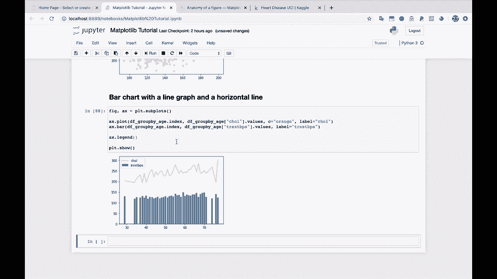
