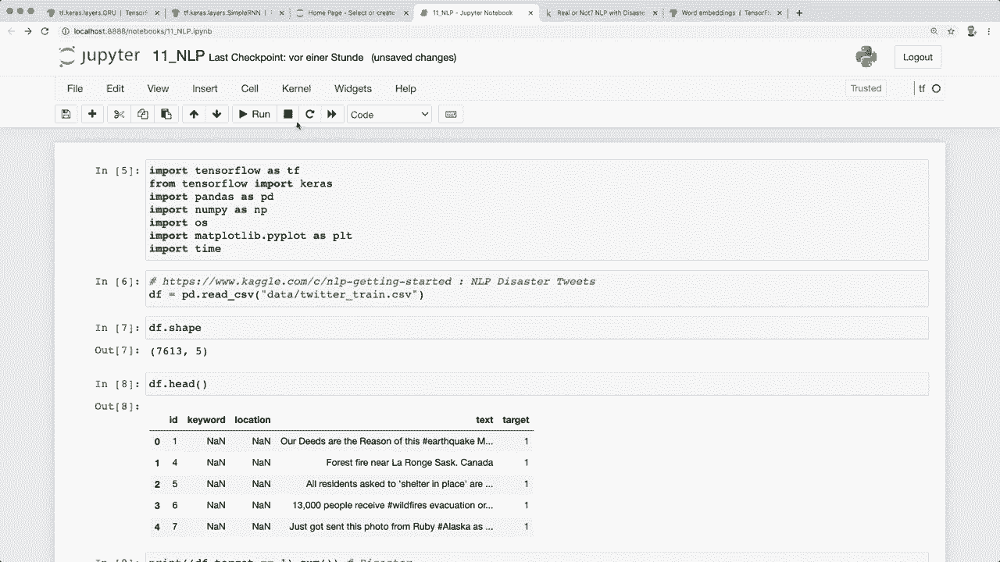

# 面向初学者的 TensorFlow 教程，P10：L11- 文本分类 

🎼，大家好，欢迎来到另一个 Tensorflow 教程。在这个视频中，我们将学习如何使用 R 和 N 进行文本分类。上次我给你们快速概述了一下，并展示了我们如何将输入视为一个序列，然后创建 R 和 N 模型。现在我们将把它应用到一个非常有趣的任务上。

这是来自真实世界数据的文本分类。我们分析 Twitter 的 tweets，并想预测文本是否与灾难事件有关。在这里，我在一个 Jupyter Notebook 中，已经导入了我们需要的内容。我们要使用的数据集在 Kaggle 上可以找到。

我当然把链接放在描述中。这叫做灾难 tweets。我们想预测哪些 tweets 是关于真实灾难的，哪些不是。😊而且有两个文件可用，训练和测试 CSV，但测试 CSV 不包括标签。这是用于提交的，如果你想参与这个比赛的话。

所以我只下载了这个训练数据 CSV，然后已经放入我的文件夹中。接着我们使用 pandas 加载数据，可以调用 pandas 的 read_csv，然后文件名。现在如果我们查看数据的形状，我们看到有 7630 个样本和五列。

现在我们来看前五行。在这里我们看到了一些额外的信息，比如 ID、关键词和位置，这些我们现在不需要。然后是文本，这就是实际的 tweet。目标标签是零表示没有灾难，1 表示这是一个灾难 tweet。

所以我们也来分析一下这两类各有多少。我们有这样多关于实际灾难的 tweets，还有这样多不是关于灾难的 tweets。我想这里大致是平衡的，我觉得这没问题。好的，现在我们可以继续，想在稍后使用 R 和 N 之前先对这些文本进行一些预处理。

所以我想做的第一件事是稍微清理一下数据。我想去除 URL，因为它没有提供任何信息。我还想去掉标点符号。为此，我已经实现了这些辅助函数。这一个使用了正则表达式。如果你想了解更多，我在我的频道上也有一个完整的指南可以查看。

好的，现在我们来定义这两个函数。在这里，例如，这些都是我们想要去除的标点符号字符。现在如果我们查看这个例子，它找到了一条带有 URL 的 tweet。如果我们去掉这个，它就只有这种格式。所以现在有了这两个函数。

对于我们的数据框或 Pandas 数据框，我们可以调用这个 map 函数，只针对文本列。因此我们说 data frame.dot text.dot map，然后是这两个函数。接着，我们将其赋值给文本列。这意味着我们移除了所有的 URL 和标点符号。

这是我想做的第一个预处理步骤。我还想去除停用词。为此，我们将使用著名的 NLTK 库。这是一个非常流行的用于自然语言处理的 Python 库。您可能还需要执行 NLTK.dot download。顺便说一下，您可以通过 Pip 简单安装它。在这里，我想获取所有停用词并将其移除。

根据定义，停用词通常是一些常用词，例如 D、A、N，搜索引擎被编程为忽略它们。因此，我们想要忽略这些停用词。我们从 NLTK 获取所有的停用词，然后通过一个小助手函数将其移除。让我们在这里打印出停用词。

在这里，您可以看到所有不同的停用词。然后我们再次使用这个函数调用 map 函数，作用于文本列。这将移除所有停用词。现在让我们看看一些示例文本。这就是文本列。现在我们想要准备这些文本，以便可以用于 RNN。

所以我们不能像这样使用所有字符串。因此，我们必须将其转换为模型理解的表示。为此，第一步是计算所有不同的单词。在这里，我们要利用一个非常不错的对象，即计数器对象。

它在 Python 的 collections 模块中可用，然后我们计算所有唯一的单词。因此，我们遍历文本列，然后说对每个文本进行操作。基本上，对于文本列中的每一行，我们说遍历每一行，然后对每一行进行分割。这样我们就得到了一个包含所有不同单词的数组。

然后我们遍历所有的单词并将其放入我们的计数器中。每当这个单词出现时，我们就将计数器增加一。因此，如果我们这样做，然后返回计数器并将这个函数应用于数据框的文本列，我们就得到了计数器及其长度。这就是唯一单词的数量。

我们发现这些推文中几乎有 18000 个不同的单词。那么我们也来看看计数器本身。基本上，它看起来像一个字典，这里的键是不同的单词，值是每个单词的计数。这就是计数器的样子，计数器对象还有一个很好的特性。

我们可以调用这个最常见的函数。这里我们可以看看五个最常见的单词。因此我们看到“like”这个词是最常见的，出现了345次。😊 然后再一次。让我们将计数器的长度分配给一个变量，并称之为 nu unique words。我们稍后会需要这个。现在我想将数据集拆分为训练集和验证集。

因此，我定义一个整数。这应该是我们想要用作训练的全部数据的80%。然后其余的部分。因此，20%用于验证。接着我们可以对数据框进行切片。然后前80%的样本用于训练，其余部分用于验证。现在我们得到了这个。同时，我们现在仍然拥有整个数据框。

现在我们想要拆分文本和标签，我们可以简单地通过访问不同的列来做到这一点。所以我们说 train data frame.dot text dots to nuy，同样适用于 data frame.dot target。因此我们说这些是我们的训练句子和训练标签。然后再次，我们对验证集做同样的事情。如果我们查看训练句子形状和验证句子形状。

然后我们可以清楚地看到训练集中有更多的数据。接下来我们要做的是应用分词器。通过分词，我们将文本语料库向量化，将每个文本转化为整数序列。所以你很快就会看到一个示例，使这一点更加清晰。

但现在我们要从 Tensorflowcars.dot preprocessing.dot text 导入这个分词器。然后我们创建一个分词器对象。为此，我们需要提供唯一单词的数量。这就是为什么我们之前要计算这个。然后我们必须调用 tokenizer.dot fit 在文本和训练句子上。因此这里只使用训练数据。当我们完成这个步骤时。

我们可以得到这个单词索引。所以这里每个单词都有一个唯一的索引。假设 word index 等于 tokenizer.dot word index，然后看看这个单词索引。然后我们看到这些单词的每个都有一个唯一的索引。这就是这个分词器的作用。然后我们可以将这些文本转换为序列，因此我们可以调用 tokenizer.dot texts to sequences，然后给出句子。

所以不要对此感到困惑。我们有句子。然后。这是原始文本。然后我们得到一个序列。因此它的大小相同。但现在它有这些唯一的索引。所以我们为训练集和验证集做这个。例如，我比较训练句子的五个样本和相应的序列。

所以让我们打印一下。这就是它的样子。所以现在可能会更清楚一些。句子是正常文本。然后在应用了分词之后。我们得到这个序列。因此我们现在这个数组的长度与文本相同。但现在我们为每个单词都有一个索引。所以现在我们有了这个。

现在我们想做一件事，因为现在序列可以有不同的长度。这就是你在这里看到的。但我们希望每个序列都有相同的长度。为此，我们应用填充。因此，我们再次导入，从tensorflow导入填充序列进行预处理，然后我们必须指定一个最大长度。因此在这种情况下，我们说是20，但你可以在这里玩更多或其他的，或者也许一个推文可能甚至超过20个不同的单词。

所以你可以稍微增加一下，但这也可能使你的训练时间更长。因此现在当我们指定这个时，我们可以调用这个函数填充序列，并用训练序列和我们指定的最大长度调用它。在这里我们说填充和截断等于后填充。这意味着它只使用零。因此我们对训练和验证序列执行此操作。

然后如果我们查看这里的形状，我们会看到它们在第二维度上都有形状20，因为这是最大长度。现在如果我们打印一个填充序列，我们看到这里使用了零填充。因此现在再一次。让我们打印一个训练句子样本，一个训练序列样本和一个填充序列样本，以便你看到区别。

然后再次看到，对于这个句子，我们有序列中的所有单词。我们有这些索引，然后对于填充序列，我们使用0填充。因此现在我们可以检查一下，如果这是正确的。如果我们能反转这个。因此，我们创建一个字典，将这个单词索引中的键和值翻转。

如果我们看一下，这是这个单词索引的键。我们有单词，值为这个索引。现在我们想将其存储在另一个字典中，并反向操作。因此现在我们说，键是索引，值是单词。这就是我们的反向字典。

所以让我们看看这个。然后我们看到所有这些索引都是我们的键，所有这些单词都是值。现在我们可以定义这个解码函数，它获取一个序列。然后我们简单地😊，对序列中的每个索引调用get函数。这将返回相应的值。如果不可用。

然后它应该返回一个问号。但如果我们获得新的索引，则如此。但是如果我们保持在同一个训练数据集中，那么它应该为每个索引找到相应的单词。这就是解码函数。然后让我们试一下。因此，我们对一个训练序列样本调用解码函数。

所以这个，然后我打印原始序列和解码文本。在这里我们看到这个序列和这个解码序列，我认为我们说我们有三个人。Dight热量远。所以如果我们查看我已经打印在哪里。所以这里我打印了从10到15的样本。因此那是原始句子。

所以我们看到我们的解码是正确的。现在我们有了这个，我们可以进行模型的实际实现。上次我给你展示过，我们可以非常轻松地创建一个简单的R N模型、LSTM模型或GR U模型。在这种情况下，我们使用LSTM。所以为此我们首先创建一个顺序模型。

现在由于我们使用文本数据，我们也使用这个嵌入层。因此，单词嵌入为我们提供了一种有效的稠密表示方法，其中相似的单词具有相似的编码。如果你想了解更多，我可以推荐Tensorflow网站上的这个官方指南。在这里你会看到另一种表示可能是独热编码。

在这里我们简单地使用a0或a1。但是还有这个嵌入表示。通过这个嵌入层，我们获得了这个表示。因此，得到一个浮点值的稠密向量。目前我们仍然有这个填充序列，包含所有的单词索引。现在这个嵌入层将这些索引转换为固定大小的稠密向量。

所以这就是为什么我们首先需要这个标记化。现在我们可以使用这个嵌入层。这样可以得到唯一单词的数量。然后是你指定的大小，还有最大长度。就是我们所指定的。这是输入长度。现在在定义之后，我们可以应用我们的LSTM或R N层，就像上次一样，我们只需指定输出单元的数量。

在这里我也说了dropout等于10%。然后由于我们想进行分类，所以a0或1分类，我们使用只有一个输出的稠密层。然后我们还应用sigmoid函数。让我们这样做并打印模型摘要。所以我们看到在嵌入之后，我们得到了这个输出形状。因此，批次的数量。

然后20是最大长度，32只是我们在这里指定的输出大小。然后我们的LSTM具有这个输出形状，因为我们指定了64个输出单元。接着我们有我们的稠密层。现在由于我们使用二元分类，我们使用这个二元交叉熵损失，这里我们说from Loit等于false，因为我们在这里已经使用了激活函数，然后再次使用优化器并定义我们想要跟踪的指标，编译模型，然后我们简单地训练它，因此我们进行拟合，在这里我们想使用填充序列和对应的标签，然后是epochs，现在这也是新的。

我想我之前没有使用过这个，因此在这个fit方法中你可以使用验证数据参数，这是一对元组，在这里我们使用验证填充序列和验证标签。现在如果我们这样做，那么它在训练过程中会自动使用验证数据集进行微调。

因此，记住这一点是个好主意，如果你在这里指定验证数据，你可以自动进行此验证。那么现在让我们训练这个模型。好吧，训练完成了。正如你所看到的，训练数据的最终准确率为 98%。相当不错。但验证准确率只有 73%。这可能是过拟合的迹象。

所以这可能是你的一项作业，你可以进一步改进或稍微调整模型，以使其表现更好。但正如我们所看到的，我们对文本数据进行了正确的预处理，并建立了一个不错的 LSTM 模型，因此这里得到了很好的准确率。所以让我们进行一些预测。

因此，我们简单地在这里调用模型的预测。😊，在这种情况下是训练的填充序列。正如我所说，我们在最后使用了 sigmoid 函数。因此，我们仍然需要将其转换为标签 0 或 1。所以我们简单地说，如果我们的预测输出概率高于 0.5，那么就是 1，否则就是 0。现在让我们打印一些原始的训练句子。

以及相应的标签和预测结果。在这里，是的，我们看到五个被分类为灾难，另一个则不是灾难，在这种情况下，我们的所有修正都是正确的。因此我们可以说，例如，这里有三个人死亡，等等。所以这是一个灾难。而这里，水灾也是一个灾难。最后这里。

我们有一些可爱的，没有灾难的。所以是的，看起来不错。而且是的，我认为我们在本教程中学到了很多东西。现在你知道如何应用一些基本的自然语言处理技术，然后使用 LSTM 进行文本分类。希望你喜欢这个教程。如果你喜欢，请点击点赞按钮，并考虑订阅频道。

然后我希望在下一个视频中见到你，再见。😊。
