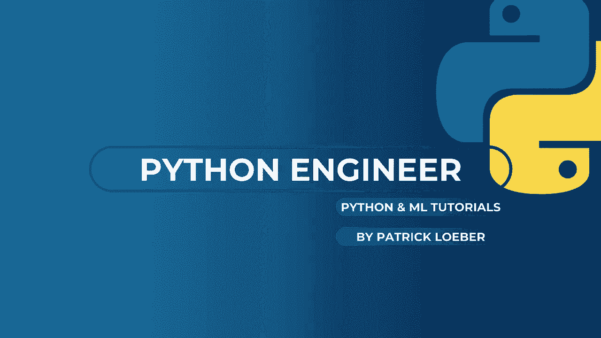
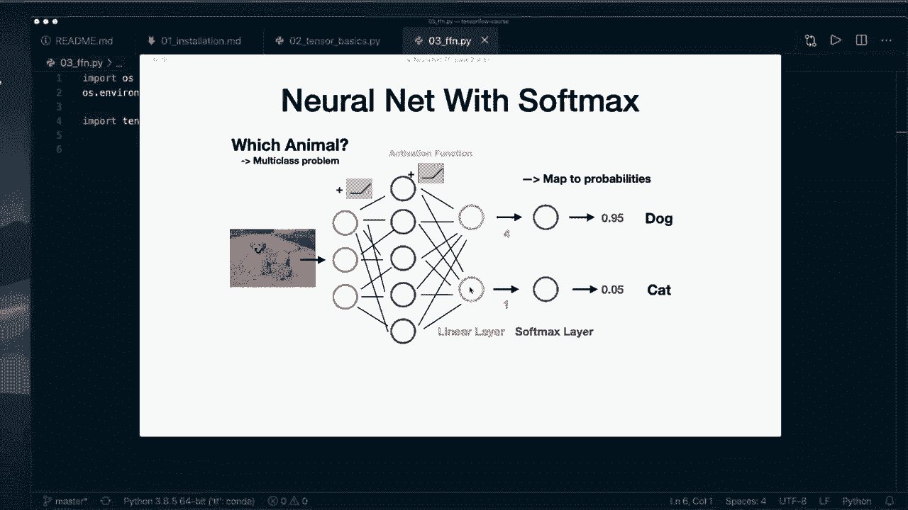
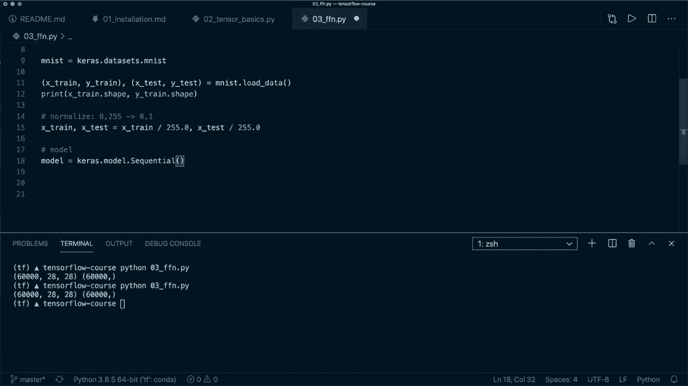
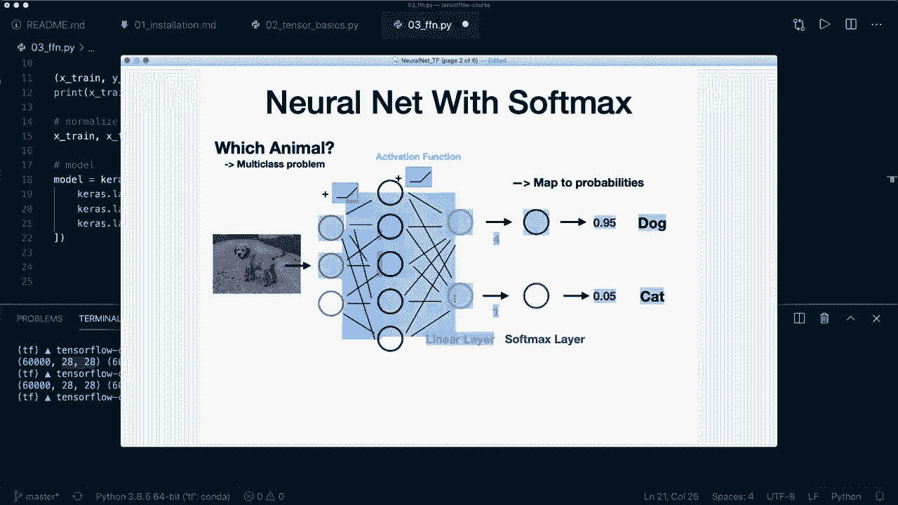
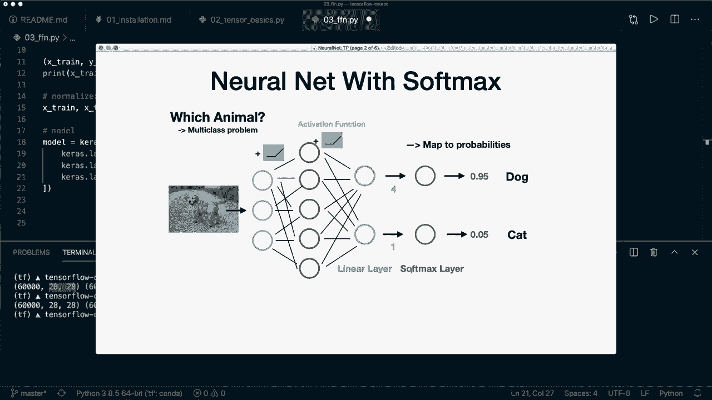
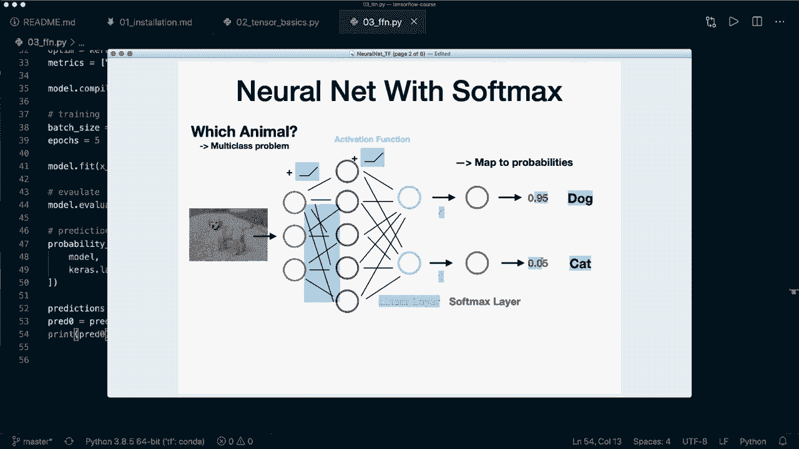

# 面向初学者的 TensorFlow 教程，P3：L3- 第一个神经网络(训练、评估和预测) 

🎼，嘿，大家，欢迎来到第三个 Tensorflow 教程。今天，我们将构建我们的第一个神经网络。我不会在这里解释理论，而是专注于实现，但我会在描述中提供一些链接，如果你想了解更多内容。我也会提供幻灯片以及我的 GitHub 项目中的代码。

我们实现的神经网络看起来是这样的。我们的神经网络有多个层，它接收一个输入图像，然后处理这个图像，最后产生每个类别的概率。😊，所以我们这里有一个多类分类问题。这意味着最后我们使用 soft max 层来获取概率。

这就是我们要编码的内容。我保证最终的代码看起来相对简单，因为 Tensorflow 为我们处理了很多事情。因此即使是初学者也应该能够构建这样的神经网络。Tensorflow 提供两种不同类型的 API，Kaas 顺序 API 和子类化 API。Kaas API 抽象了很多东西，使实现算法变得更加容易。

所以他们说这个适合初学者，而另一个适合专家。我认为这不是一个好的描述，因为我认为 Kaas 不仅适合初学者，也同样适合有经验的程序员。因此这是一个很棒的 API，你可以实现很多东西。

只有在你需要更多灵活性时，你才可以或应该切换到子类化 API。😊。

在这个初学者课程中，我们集中在 Kaa 顺序 API，但我会在后面的剧集中涵盖子类化 API。所以现在让我们使用顺序 API，跳转到代码。我已经导入了 Tenofflow，并像上一个剧集那样屏蔽了一些警告，所以你不用担心。

现在让我们开始使用 Kaas API 实现我们的网络。因此，我们也从 Tensorflow 导入 Kaas。由于 Tensorflow 2，已经包含这个内容。因此在此之前，它是一个单独的 API。但现在它已完全集成。所以我们还导入 nuy S N P，另外导入 matplot Li do pi plot S PLT，因为我想给你展示一个图。

现在我们先获取数据集。在这个教程中，我们使用的是 Mnis 数据集，这是一个著名的手写数字分类数据集。这个数据集包含在 Kas do 数据集中。接着我们通过声明 x train 和 Y train 获取训练和测试集，然后是逗号，再是另一个元组，然后是 x test 和 y test。这是 Mist.dot.load data。

我们必须在这里使用两个元组，因为这是load data返回的内容。然后，例如，让我们打印X train.shape。还让我们打印Y train.shape。现在让我们打开终端。我已经在安装了Tensorflow的虚拟环境中。所以让我们运行这个文件。这是这个文件。让我们看看形状。

我们看到我们的x训练有这个形状，因此我们有60000个训练图像。每个图像的大小为28×28，然后我们有60000个与数据对应的标签。顺便说一下，这现在是NumPy数组，因此这不是一个张量，但我们仍然可以将其用于我们的模型。所以我想做的第一件事是归一化数据，因为现在。

图像的值在0到20055之间。我们想要将其归一化，使值在0到1之间。因此我们说x训练和x测试等于，然后我们说x训练除以255作为浮点数。第二个是x测试除以255。这样我们可以在一行中处理这两个数据集。现在让我在这里复制粘贴一些代码。我想绘制数据。

所以我们只说PTI来绘制6个不同的图像。前六个数字。让我们运行这个，看看图的样子。好的，这就是图的样子。这里我们看到手写数字，非常简单。这就是我们要分类的内容。让我们去掉这个，构建我们的模型。让我们构建我们的模型。正如我所说的。

我们使用顺序API。所以我们设置model等于。这是ks.model.sequential。在这里我们传入一个包含所有不同层的列表。与这里类似，我们希望有不同的全连接层。

所以我们从ks.layers.flatten开始。这将我们的图像展平，以减少这一维度，从28×28变为1维。然后我们将使用我们的第一个真正的全连接层。所以我们说ks.layers.dense。这个稠密层是在Keras API中的全连接层。在这里我们必须指定输出，这是一个我们可以指定的隐藏大小。

所以我将使用128，但你可以在这里使用不同的值。😊。然后我们还说activation等于relu。所以我们将使用relu激活函数。如果你再看一下这个图，通常这些层后面都有激活函数。我有一个关于激活函数的完整教程在PyTorch初学者课程中。

但是相同的概念也适用于这里。所以我会在描述中放入链接，你可以查看。但基本上你应该知道的是，它引入了非线性，并改善了训练。它使我们的模型更好。因此，我们应该在每一层后使用激活函数。

然后我们就用一个在中间。然后使用我们的最终层。这又是一个稠密层。😊。

现在我们需要指定10个输出。所以我们希望有。我们确实有10个不同的类别。每个类别我们需要一个输出。在这个简单的例子中，我们只有两种不同的类别：狗和猫。这就是为什么我们只需要两个输出层。但在我们的例子中，我们有10个类别。所以这必须是10。这必须是10。

但你可以调整这个大小。正如我所说，我们想要得到概率。这就是为什么我们需要一个soft marks层。所以我们可以通过说ks dot layers dot soft marks来包含它。但实际上在文档中，他们说这不推荐。

但相反你应该。

在你的损失函数中稍后包含。因此我们暂时不考虑这一点。现在这就是我们模型所需的一切，我们的模型可以自动确定正确的输入大小。我们只需指定输出大小。但假设在创建后，我们想调用model dot summary并打印出来。目前这不起作用。

但是如果我们指定第一个输入大小。在这里我们可以说input shape等于28乘28。那么这样就有效。但你不必这样做。你也可以在后面将其适配到训练数据时让它自动计算，但那样你只能在编译模型后打印。

所以在这里包含这一点是一个好习惯。现在我们保存并再次运行，然后我们将打印模型摘要。在这里我忘了加一个S。所以它叫Kara dot model dot sequential。好的，这里是打印的摘要。所以它打印出所有不同的层。在这里我们看到第一个展平层。

这是形状784。所以这是28乘28。它将其减少到一维。这不是我们需要训练的实际层。所以它没有参数。我们有第一个输出形状为128的稠密层。然后是第二个输出10的稠密层。在这里，第一个只是none。

所以这是我们还不知道的样本数量。😊。然后我们也看到了总参数和可训练参数。所以，是的。现在我们已经有了模型。顺便说一下，我想你可以看到使用这个顺序API是多么简单。此外，还有第二种使用顺序API的方法，可以像这样设置你的模型。

然后在每一层分别进行。所以你可以调用 model dot at。然后使用这一层。然后你看到，比如说，model dot at。然后你使用这一层。😊。Model dot at 第二层，然后 model dot at。最后一层。所以这在做同样的事情。但这就是现在的优势，你可以在每个操作后打印模型摘要，弄清楚你的训练情况。

所以，嗯，请记住你也可以这样做。所以我们只会使用第一个。然后再次注释掉这个。所以现在我们有了我们的模型，接下来我们需要的是损失和优化器。在多类分类问题中，通常我们使用类别交叉熵。

所以我们说损失等于，然后我们说 ks dot losses。然后这里实际上叫做稀疏类别交叉熵。这是因为我们的 y 是一个整数类标签。所以是 0、1、2、3 或类似的。因此我们使用这个，有时标签也编码为 one hot。

所以对于类 0 是 1，然后对于其他类是 90s。所以在这种情况下，我们只是使用类别交叉熵，但在我们的案例中，我们使用这个。而且我们也说 from logics 等于 true。这是因为在最后，我们没有包含 soft marks。所以我们仍然有原始数字，原始 las。

所以我们必须使用这个，否则训练效果不会很好。然后我们需要创建一个优化器。所以我们说 Kas dot optimizers。然后这里，让我们使用 Adamom 优化器，这是一个非常流行的优化器。我们需要给它一个学习率。所以我们说这是 0.0001。这是你在开始时应该调整以获得好结果的最重要的超参数之一。

所以随意尝试一下。然后我们也定义了一些我们想要跟踪的指标。在这种情况下，这应该是一个列表。我们这里只想跟踪准确度指标。因此当我们有这个时，我们调用 model dot compile。这是我们在 Tensorflow 框架中所做的。然后我们说我们的损失等于损失。

我们的优化器等于优化器，指标等于指标。所以这将为训练配置模型，之后我们可以开始训练。所以让我们定义批量大小并将其设置为 64，设置我们训练的 epochs 数量。所以这里我只使用 5 个 epochs，然后我们可以简单地调用 model dot fit，我们想要拟合 x train 和 y train。

所以我们的训练数据，我们指定批量大小等于。批量大小。然后 epoch 等于 epoch。然后我们说 shuffle 等于 true。这是默认值。但我想强调的是，在训练期间你应该始终这样做。然后让我们将 ver 设置为 2。这只是用于日志记录，0 表示没有输出，1 表示进度条，2 表示正常日志记录。

所以这就是我们训练模型所需做的一切。再说一次，我们使用顺序 API 来构建模型。然后定义损失函数、优化器和可选的汇总指标。所以这里不一定需要使用它，但我们可以。然后开始训练，使用 `model.fit`。现在我们可以开始训练了。让我们运行这个。

现在我们看到它开始训练，并且在每个纪元之后，它打印出一些信息。因此，它打印出损失和准确率，因为我们指定了这些。我们看到，在五个纪元之后，我们已经得到了一个很低的损失。因此，它降低了，我们的准确率是 98%。所以我们的简单神经网络对于这个任务已经非常好了。现在，我们已经训练好了它。

接下来我们想要评估我们的模型。我们也可以非常简单地通过说 `model = model.evaluate` 来做到这一点，然后使用我们的测试数据。所以我们使用 `X_test` 和 `y_test`。在这里，我们可以使用批大小并将其设置为我们的批大小。我还设置了 `verbose = 2` 用于一些日志记录。这就是我们评估的方式。

批大小意味着它处理一些批次并在这些批次上进行计算。这可以加快训练和评估的速度，甚至改善训练。所以让我们再运行一次。现在我没有保存模型，所以我需要再次训练它，然后进行评估。让我们运行它。在以后的章节中。

我们学习了如何在训练后保存我们的模型。好的，训练完成了。再说一次，我们看到了五个不同的纪元，然后我们有一个用于评估的打印语句。我们看到，测试集的准确率稍微降低了，但仍然非常好。所以现在我们已经有了一个很好的训练模型来分类手写数字。

现在让我们看看如何用我们的模型进行一些预测。我们有几个不同的选项。再一次！

对于预测，我们需要软最大层来调用概率。所以我们没有！

将其放在这里作为最后一层，但它在训练过程中已自动包含在内。不过现在我们需要它。所以我们的第一个选择是创建一个新的模型。我们将其称为概率模型。这也是一个 `keras.models.Sequential` 模型。在这里，我想给你展示一件新事物，我们可以将整个模型传入其中。

我们可以使用我们原来的模型。现在它拥有这个模型的所有层。现在我们使用 `kra.layers.softmax` 层。既然我们有了这个，我们可以调用这个概率模型。所以我们说 `predictions = probability_model`，然后传入测试数据 `X_test`。

现在我们有这个。例如，我们可以通过说这是预测索引0来获取第一个预测。让我们在这里打印这个。所以打印预测0。这是概率。因此现在我们想选择概率最高的类别。我们可以通过调用arc max函数来实现这一点。因此我们说标签0等于nuy.dot arc max。

然后是这个预测pre 0，然后打印标签0。所以现在让我们保存这个。现在我再次运行训练和评估，然后为你打印这个。好吧，完成了。在这里它打印出预测0。所以对于。

每个类别都有一个概率。然后我们获取具有最高概率的标签或索引。在这种情况下，这是索引7。所以我认为是这个。9.49。这是最高的。因此，是的，这可以工作。这是实现它的第一种方法。第二种方法是分别使用我们的原始模型加上soft marks。因此我们可以说和我们在这里做的一样，预测等于。

然后我们调用原始模型并传入x测试。接着我们为自己应用soft marks。因此我们说预测等于Tens offlow.dot N N.dot soft maxs。在这里我们放入预测。现在我们得到了和这里相同的结果。让我们打印这个。😊，然后当我们运行这个并打印时。

那么我们应该看到完全相同的数字。哦，抱歉，我暂时停止了这个。因此我在这里忘记获取预测0，这样我们就可以看到这里是相同的。让我们清除这个并再运行一次。好吧，所以我们的训练完成了。在这里你可以看到它打印出完全相同的数字和相同的类别标签。

你可以这样做。然后作为第三种选择，而不是像这样调用模型和模型。你也可以调用model.dot predict。然后是数据。在这里你也可以指定批大小等于批大小。然后它会为每个批次计算。这也是你可以做的。再一次。

数字应该是相同的。现在我们不仅仅要得到一个预测。假设我们有两个或五个不同的预测。我们称之为0，5s。然后我们通过预测并使用从索引0到索引5的切片来得到这个结果。现在我们先为你打印pre0，5的形状。现在如果我们对这个调用arc max。

现在假设我们的标签0，5s等于，然后如果我们获取预测。如果我们调用nuy.dot arc max，并使用这5个预测。然后我们还必须指定x。在这种情况下，我们想沿着xs 1进行计算。现在我们应该得到五个不同的标签。打印标签50s。现在让我们清除这个，再运行一次，希望这能成功。

好吧，所以这就完成了。我们看到，再次通过这个模型预测，我们得到了相同的数字。然后这是我们的形状。所以是5乘10，即五个不同的样本和预测。对于每个预测，有10种不同的概率，如这里所示。如果我们沿X 1调用arcms。

然后我们得到了五个不同的标签。因此，第一次标签是这里的标签7。这些是接下来的预测。是的，这就是你如何进行预测。我认为这就是你需要知道的，以构建你的第一个神经网络。因此，再次强调，你构建你的顺序模型，然后设置损失和优化器，然后编译模型。

然后你调用模型拟合和模型评估。然后当你想进行预测时，可以调用模型预测。不过，别忘了如果你想要实际的概率，记得调用软标记。是的，我想目前就这些。我希望你喜欢这个教程。请点击喜欢按钮，并考虑订阅频道。

我希望在下一个视频中见到你。😊。
