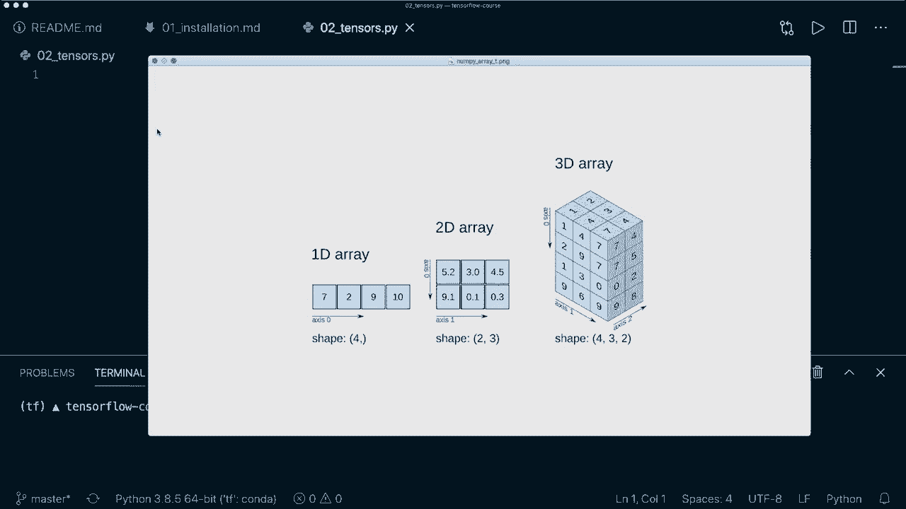

# 面向初学者的 TensorFlow 教程，理论知识、代码思路和应用案例，真正从零开始讲明白！＜快速入门系列＞ - P2：L2- 张量基础 - ShowMeAI - BV1TT4y1m7Xg

🎼，嘿，大家，欢迎来到 Tensorflow 初学者课程的第二个教程。今天，我们学习张量基础。张量是 Tensorflow 库中的核心对象。因此，所有操作都是基于张量，张量就像是 N 维数组。所以你可以表示 1D、2D 或 3D 数组，甚至更高维度的数组。😊。

但让我们把它写下来。我们表示 N 维数组，但张量的设计还使其具有 GPU 支持。所以我们有 GPU 支持。

张量的设计也使我们能够构建所谓的计算图，然后跟踪计算反向传播。例如，我们将两个张量相乘，然后构建所谓的计算图，接下来的操作是减法。这也是我们计算图中的一个操作。然后在后面。

我们可以用这个来计算梯度。

所以它用于构建计算图，并在后面计算反向传播。我在我的 Pytorch 初学者课程中已经有关于这个的教程。但相同的概念也适用。所以如果你对此感兴趣，看看视频吧。我会把链接放在描述中。而且关于 tensor 的另一个重要点是它们是不可变的。

这意味着我们不能更新张量的内容。我们只能创建一个新的。所以现在让我们开始创建一些张量。首先，我们当然想导入我们的库 S T F。😊，然后为了创建一个张量，我们使用 T F.dot.constant 函数。所以我们说 x 等于 T F.dot.constant。

然后我们可以给它一个值，例如，只有一个标量值。然后让我们打印我们的张量。让我们运行这个文件，看看它的样子。然后我们也得到了一个警告，但我们不需要在意，我们可以通过说 import O S 来消除这个警告，然后设置 O do environ。变量称为 TFCPP Min lock。Level。Equals，然后作为字符串，a2。所以现在。

如果我们再次运行，这个警告应该消失。是的。现在我们看到它只打印了张量。这是一个只有一个标量值的张量。我们还可以通过给定形状参数来指定形状。这是一个元组。在这种情况下，我们可以说它是 1x1。然后我们还可以，例如，给它一个数据类型。

现在我们可以说 T F dot float 32。所以现在如果我们再运行一次，我们应该能看到这里的区别。所以现在，是的，我们也看到形状是 1 乘 1。所以现在它不仅是一个标量值，而是一个矩阵，并且我们有一个不同的数据类型。这是只有一个值。当然，我们也可以在这里放入一个列表。所以我们可以说。

例如，1 和 2 和 3。现在我们有一个 1 D 张量。所以在这里我们看到形状是 3。在这种情况下，我们可以说这是所谓的等级 1 张量。当然，我们也可以放入一个列表的列表。所以让我们创建另一个列表。第一个是这个。现在让我们创建另一个列表。这次必须使用 4，5 和 6。在这种情况下。

这是一个等级 2 张量。所以现在让我们再次打印这个。让我们看看形状。😊。在这里我们看到我们的张量，形状是 2 乘 3。这意味着我们有两行三列。所以在这种情况下，我们手动创建了值，但还有一些方法可以用某些值填充我们的张量。

例如，我们可以说我们的张量是 T F dot ones。然后我们可以将其形状作为元组传递。所以让我们说三乘三。这是一个 3 乘 3 的张量，仅填充 1。所以在这里我们有它，我们看到这里的默认数据类型是 float 32。如果我们不指定任何类型。与 ones 类似，我们也可以使用 zeros。这将做同样的事情，只是将我们的张量填充为 0。

所以在这里我们看到我们的 0 号张量。然后还有一个方法叫做 Tf dot I，这个只接受一个单一的值。所以在这种情况下，我们放入一个三。所以这将创建单位矩阵，其中对角线矩阵或对角线填充为 1，其余填充为 0。这就是 I 函数。然后还有一些方法可以用随机值初始化我们的张量。

所以为此，我们可以，例如，使用 Tf dot random，然后从正态分布中抽取一些值。所以正态。然后在这里，我们再次需要形状。所以我们使用 3 乘 3。并且在这里我们可以指定均值。所以默认情况下，这个值是 0，标准差默认是 1。所以让我们打印我们的随机张量。这里我们可以看到随机值大约在 0 附近，我们也可以使用均匀分布而不是正态分布。

我们可以通过说 Tf do random dot uniform 从均匀分布中抽取值。然后我们再次需要形状。在这里我们可以指定最小值。所以让我们说这个等于 0，最大值等于 1。这意味着我们所有的值都在 0 和 1 之间，并且它们是均匀分布的。

所以在这里我们得到了我们的新随机张量。现在我们也可以使用 T F dot range 函数。这与正常的 Python range 函数类似。所以现在我们有值在 0 到 9 之间。哦，当然，我必须打印它。所以让我们清除这个并再运行一次。所以是的，这是我们的范围张量。现在让我们看看，默认情况下，这个数据类型是 in 32。

假设我们想要更改这个。我们想要转换我们的张量。我们可以通过说 X 等于 T F 的 cast 来做到这一点。然后再次指定我们要转换的张量，数据类型等于，让我们使用 T F 的 Float 32。然后打印我们的新张量。再次注意，我将其分配给新值，因为原始张量是不可变的。

让我们运行这个。然后我们看到我们得到相同的张量，但现在数据类型不同。这就是我们如何转换张量的。现在让我们讨论张量上的操作。这里重要的是所有操作都是逐元素的。因此让我们创建两个张量 x，等于 T F 的常量和一个列表 1，2，3。

让我们用一个新张量 Y 来做同样的事，它的值为 4，5，6。那么现在，比如说，我们可以通过说我们有一个新的张量 C 等于，然后使用 T F 的 x 和 y 来进行逐元素相加。如果我们现在打印我们的 C，那么让我们清除这个并运行它。哦，这里我有一个拼写错误，当然。所以再来一次。

让我们清除这个并运行它。然后我们看到新的张量是 5，7 和 9。这是因为我们在这里进行了 1 加 4 等于 5，2 加 5 等于 7 和 3 加 6 等于 9。所以所有操作都是逐元素执行的。这一点很重要。因此，除了使用这个函数，我们也可以直接使用 C 等于 x 加 y。

这做的是同样的事情。如果我们打印这个，我们应该能看到相同的结果。然后，除了加法，我们还可以通过调用 T F 的减法函数或简单地说 x 减去 y 来使用减法。再次，这做的是同样的事情。然后我们可以通过说 T F 的除法函数进行逐元素除法。或者我们可以使用这个运算符来除我们的张量。

然后我们可以通过调用 T F 的乘法函数或再次使用星号运算符进行逐元素相乘。接着，我们可以通过调用 T F 的点积函数，即 Tensor.Dot，然后是 x 和 y 来计算点积。在这里我们需要指定 x 等于一。因此，让我们清除这个并运行它。现在我当然要移除这个。那么，让我们再次运行它。

这会生成一个单一的值。我们在这里做的是计算这些值的乘积，然后加总所有值。所以 1 乘以 4 加上 2 乘以 5 加上 3 乘以 6。因此这是一个单一的值。然后我们可以使用双星号运算符进行逐元素的指数乘法。比如说 C 等于 x 的三次方。那么让我们运行这个。

在这里我们得到 1 乘以 1 乘以 1 等于 1，2 乘以 2 乘以 2 等于 8，以及 3 的三次方是 27。这就是逐元素的指数乘法。然后让我们进行矩阵乘法。为此，我们需要使用随机函数创建两个新张量。所以在这种情况下，让我们使用随机正态分布，并设置形状为 2x2，y 也使用相同的。

然后进行元素级矩阵乘法时，我们可以说C = T F.dot.matmul，然后X和y。让我们再次打印这个。然后在这里我们看到我们得到了矩阵乘法结果。在这种情况下，我们必须小心。所以在这里，形状必须匹配。因此，我们的第一个张量的列数必须与第二个向量的行数匹配。

所以这个维度，例如，如果我们在这里使用3，也必须匹配这个维度。所以在这里我们可以使用3x4，例如，唯一重要的是这两个数字匹配。所以现在让我们再次运行这个，看看它是否有效。所以是的，这里我们得到了结果，得到的形状是2x4。所以这两个数字基本上保持不变。

所以这是矩阵乘法，我们也可以用@符号重载它。所以我们可以说x @ y。这是做同样的事情。然后我们来谈谈切片。切片和索引。这与numpy数组或Python列表是相同的，因此我们可以以不同的方式访问它们。所以让我们创建一个常量张量，有两个维度。所以一个列表的列表，假设是1，2，3。

和4，还有另一个列表5，6，7，8。现在，比如说，我们想访问只有第一行。我们通过说x，然后索引0来获取这个。所以让我们清除这个并运行它。然后我们看到只得到1，2，3和4。然后我们也可以在这里使用冒号和逗号。所以这意味着在第一维中，我们想要所有内容。我们想要所有行。

但是只有第0列。所以让我们打印这个。我们看到得到的是1和5。我们也可以反过来做。所以我们可以说只有列。只有第0行和所有列。所以这基本上是一样的。如果我们在这里只使用0，那么我们应该得到1，2，3和4。所以是的，这里我们得到了结果。再一次。

这里我们可以指定开始和结束索引。所以默认情况下，它是从开始到结束的所有内容。但是当然，我们也可以指定开始。那么假设是1，假设是3。那么最后一个是不包括的。所以现在只使用索引1和索引2。所以我们应该只得到2和3。所以是的，这有效。

所以在这里我们只得到2和3。现在，如果我们在这里放入两个单独的值。然后我们访问一个特定元素。所以在这里，假设我们在第0行，我们想要第1列。所以这应该是值2。让我们打印这个。好吧，所以这里我们看到值2。所以这有效。所以这就是我们如何应用索引和切片。现在让我们谈谈张量的重塑。

所以再一次，让我们创建一个随机张量，假设使用T F.dot.random.uniform。我们使用正态分布，形状应该是2x3。所以让我们先打印我们的x。清除这个并运行它。然后我们看到我们的形状是2x3。所以让我们重塑我们的张量。我们可以说我们的新x应该是T F.dot.reshape。

然后原始张量再次是我们的x。而且在这种情况下，新形状是3乘2。我们来打印我们的x。然后这应该可以工作。哦，我忘了这里的X。所以再次，让我们运行这个。当然，我们只能使用匹配的形状，以便可以应用于这些原始形状。所以在这种情况下，它是有效的。

我们也可以，例如，仅使用一个形状和六个值。所以两次3等于6。这就是为什么6在这里也能工作。所以现在我们有一个形状为6的张量。所以只有一个1D数组。你也可以在这里使用-1。例如，如果我们说-1，然后是2，那么它会自动为你确定正确的形状。所以在这种情况下。

这应该再次是3乘2。所以在这里我们看到形状是3乘2。所以这有效。因此，是的。正如我所说，最开始张量有点像numpy数组。所以你可以将张量转换为numpy数组，反之亦然。那么我们来看一下如何转换为numpy数组。这非常简单。所以你只需说我们的X。

或者说，在这种情况下。是的，让我们使用X等于x，然后调用numpy函数。所以现在如果我们打印我们的x，那么它应该看起来一样。如果我们打印X的类型，那么我们应该看到这确实是一个numpy数组。所以让我们运行这个。所以是的。我们看到我们的x与张量具有相同的值，但现在我们看到它是一个numpy数组。

要将其转换回去，我们可以说x等于TF.dot.convert，然后下划线到张量，然后再次将numpy数组放入。现在如果我们再次打印这个的类型，那么我们应该看到这又是一个张量。所以是的，这有效。因此我们看到这是一个张量流的急切张量。你现在不必担心这个。

急切张量的意思是，它立即计算操作，而无需构建我最开始提到的计算图。😊，所以，是的，正如我所说，你现在不必担心这个，只需知道这就是一个张量。这不仅仅是因为我使用了这个转换为Tor函数。所以所有这些常量值。如果我使用TF.dot.random_normal或者TF.dot.constant，然后在这里加一个值。

所有这些都是E张量。因此在这里，我们再次看到这个的急切张量。所以是的。这些都是我想展示的所有函数。现在，还有几件事我想提到。所以在这里，我们可以用字符串，而不是使用数字，例如，获取一个字符串张量。我们来打印我们的新字符串张量。

让我们清理一下并运行这个。所以在这里我们看到我们得到了一个数据类型为字符串的张量。同样，在这里我们可以使用列表，生成一个一维字符串张量。所以，例如。我们可以使用另一个名字，还有另一个名字，Max和me。现在如果我们运行这个，那么我们看到我们有一个具有多个值的不同形状的字符串张量。

这也在工作。还有一件事我想提到。因此，正如我所说，我们使用了常量张量，它们是不可变的，但还有另一种类型的张量。这是一个 tensorflow 变量。因此，举例来说，让我们用常量函数使用 1、2 和 3。我们可以用 T F 点（大写 V）和变量做同样的事情。

现在如果我们打印这个。所以现在我们看到它看起来是一样的。 但我们也得到提示，这这是一个 tensorflow 变量，当你想修改其值时应该使用变量。因此，例如，tensorflow 变量用于存储模型参数，我们在训练期间更新这些参数。但你现在不需要担心这个，因为我们将使用更高级的 API。

这就是 Kas API。它为我们做所有这些事情。所以我们不需要担心使用变量然后更新权重。但你应该知道这存在。这与 tensorflow 常量不同。是的。我想这就是我想向你展示的关于张量的全部内容。

希望你喜欢这个教程。如果你喜欢，请点击喜欢按钮，并考虑订阅频道。希望在下一个视频中见到你。😊。
