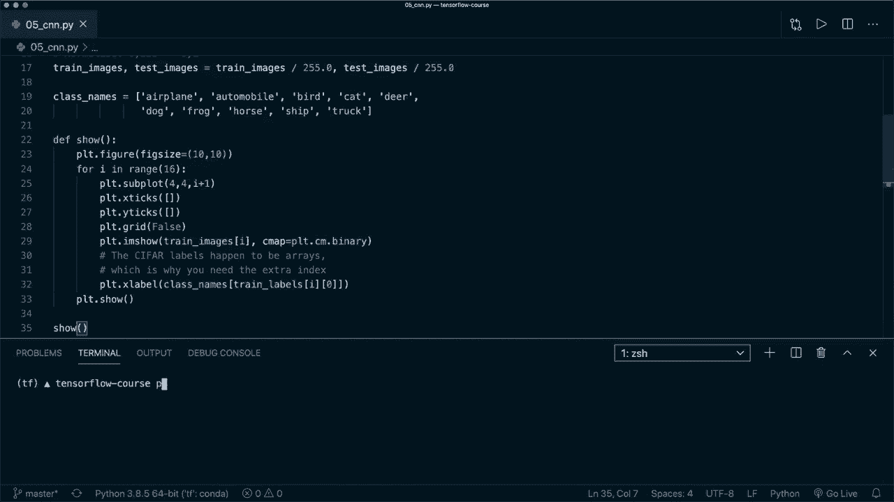
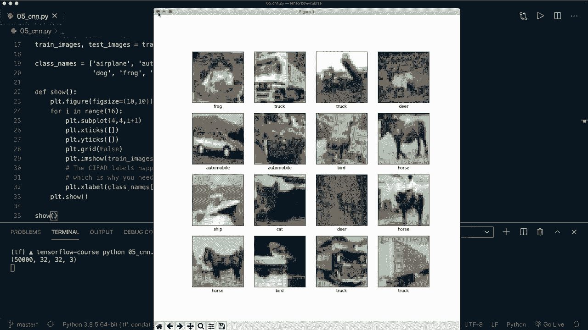
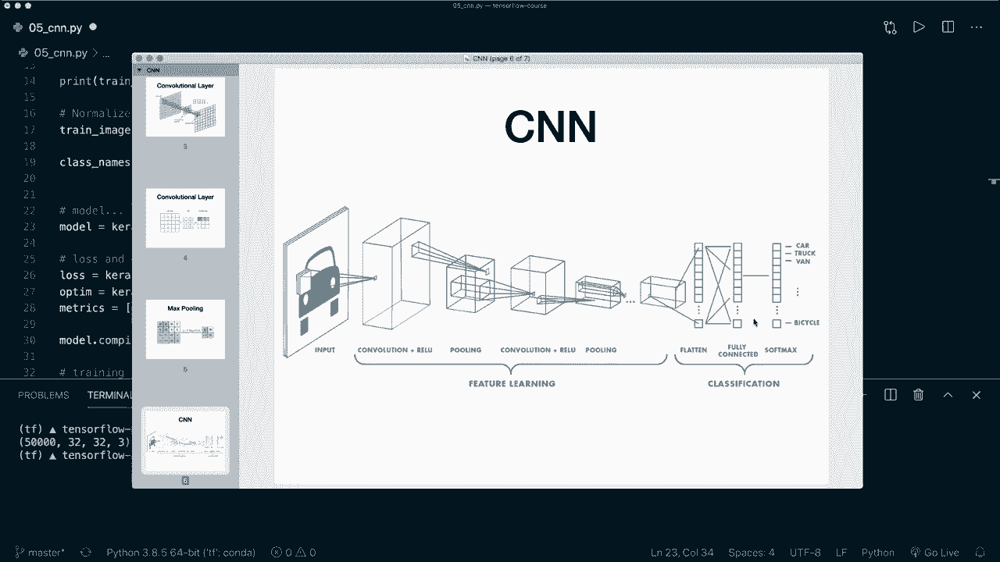
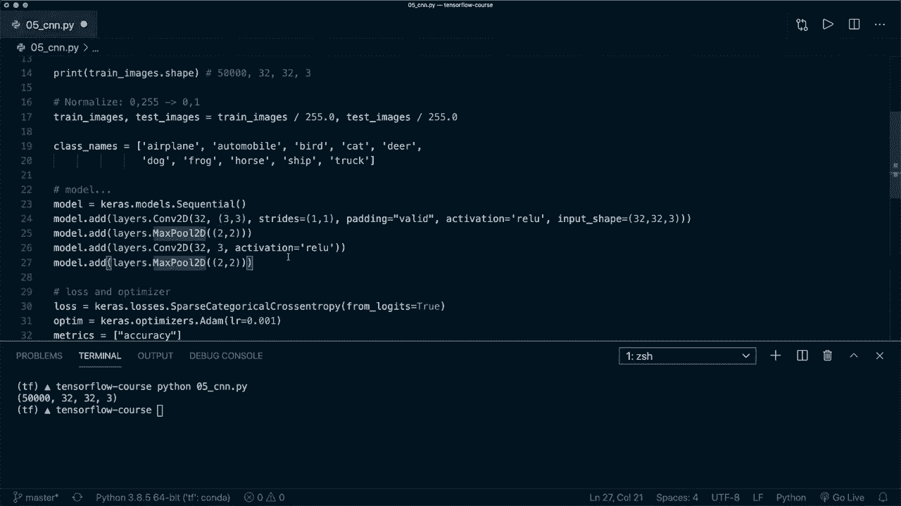
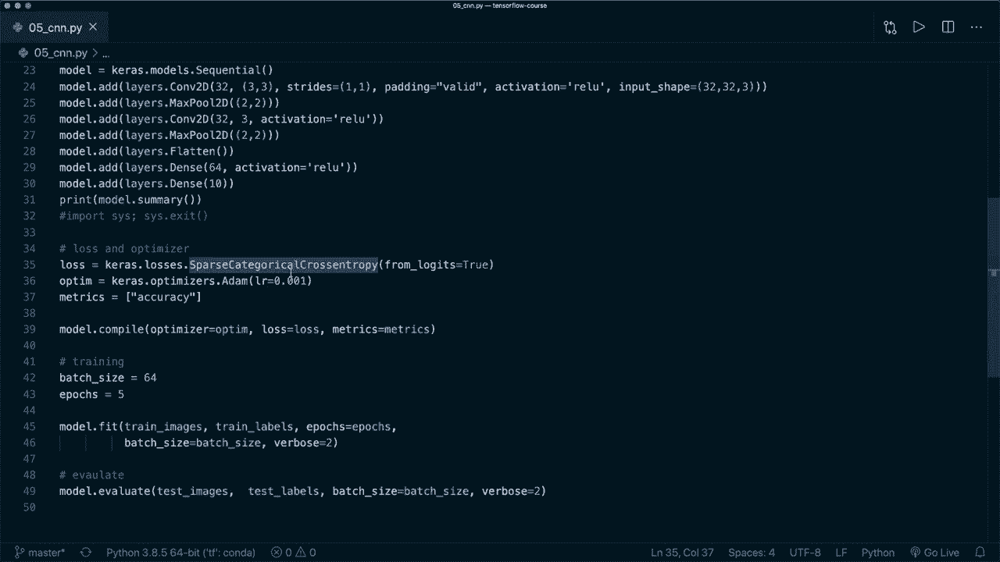

# 面向初学者的 TensorFlow 教程，理论知识、代码思路和应用案例，真正从零开始讲明白！＜快速入门系列＞ - P5：L5- 卷积神经网络(CNN) - ShowMeAI - BV1TT4y1m7Xg

🎼，大家好，欢迎来到另一个 Tensorflow 教程。今天，我们将实现我们的第一个卷积神经网络。所以卷积神经网络看起来类似于第三课中的前馈神经网络。主要区别在于我们使用卷积滤波器，而不仅仅是密集层。

这里是一个典型的卷积网络架构。我们有输入图像，然后应用不同的卷积层和激活函数，比如这里的 ReLU。我们还应用池化层来减少图像的大小。最后，我们进行分类。这意味着我们在最后使用一个全连接层。

也被称为密集层，为我们每个类别提供输出。所以我们的卷积层使用卷积滤波器，滤波器滑动在图像上，然后😊，计算一个新值并将其写入输出图像。我这里不再详细说明，但我会提供一些链接，如果你想了解更多理论。

这里是另一个卷积滤波器的图像。一开始我们将其放在鼠标位置，然后计算卷积并将输出写入这里，然后我们滑动到下一个位置。所以在绿色的位置进行相同操作，然后滑动到蓝色位置再做一次。这就是我们如何计算卷积。接着我们还应用最大池化。

这也是一个滤波器，例如，这里是一个 2x2 的滤波器，我们将其放在第一个位置并计算最大值，比如这里的 20，然后写入输出。接着我们滑动到下一个位置并进行相同操作，依此类推。

这将减少我们的图像大小。这些就是我们要应用的所有概念。这是我们将要实现的架构图像。所以我们有输入图像，然后应用卷积加上 ReLU 激活函数再加上池化。然后再重复一次。最后我们将图像展平，压缩成一维，并使用全连接的密集层和 Softmax 激活函数，然后进行分类。

所以最后这一步和我们在第三课中使用的完全相同。因此我建议你先观看这一课，如果你还没有的话。现在我们可以进入代码。在这个例子中，我们将使用 CIFAR-10 数据集。这个数据集包含 60000 张 32x32 的彩色图像。

这里看到的不同类别，比如飞机、汽车、鸟、猫等。这就是我们要分类的内容。那么现在我们来看看代码。好的，我这里已经写了一些代码。这和第三课中的代码类似。所以我们再次导入需要的东西，比如 Tensorflow、Keras 和层。然后我导入 matplotlib。

然后我们使用ci进行10个数据集，它集成在Kara数据集中，我们可以将其分成训练图像和测试图像。现在如果你打印形状，我们看到，例如，训练图像有50000个样本，每个图像的尺寸是32x32x3，因为它有三个颜色通道。

然后我们归一化数据。我们希望它在0到1的范围内。然后这里我有不同的类名。我写了一个帮助函数来展示一些示例图像。所以我们运行到这里。现在如果我说Python，然后这个文件的名称。我们就会看到一些示例图像，这些图像非常模糊，因为我们的维度非常小。

但没关系。现在让我们停止这个。现在我可以删除这个绘图代码。我们不再需要这个了。

现在我们定义我们的Kaa顺序模型，就像上次一样。这是我们需要实现的。接下来的代码与教程3中的完全相同。因此，我们再次定义我们的损失和优化器。这里我们想要稀疏分类交叉熵，并且说逻辑等于真。所以它应用softm。这一点很重要。

然后我们定义一些想要跟踪的指标。然后我们必须调用model.compile，之后通过简单调用model.fit与我们的训练图像和训练标签来开始训练。然后，我们可以通过调用model.evaluate与测试图像和测试标签来评估它。所以，是的，这就是整个代码。现在这里唯一剩下的就是定义我们的模型。

所以现在让我们再看看。所以我们再次想应用。

具有激活函数和池化层的卷积层。然后再来一次。最后，我们希望展平并应用全连接层。所以让我们这样做。首先，添加一个卷积层。我们可以通过说model.at来完成。然后我们使用ks.layers中的一个层。这就是con2D层。

所以这是一个二维卷积层。首先，我们需要指定过滤器。这是卷积后的输出过滤器数量。这里我们说是32。然后我们需要指定内核大小。这里我们使用3x3的过滤器内核。接着，我还写了步幅。

这里是标题。所以步幅等于1和1。这只是默认值。我们希望滑动多少，以及在图像上滑动多远。填充等于有效。所以你可以选择有效或相同。这基本上是两种不同的规则。填充是如何应用的。我们这里说有效。然后，如我所说。

我们想要使用激活函数。所以我们设置`activation equals Relu`。对于我们的第一层，我们还指定输入形状。这个是32x32x3。现在我们有这个。然后，在这之后，我们想要应用一个池化层。所以我们说`model.add`。然后再次，`layers.maxPooling2D`。在这里，我们也可以定义池大小。所以在这里。

我们默认使用2x2，或者我可以再次为你写出来，让它更清晰，所以我们使用一个2x2的最大池化层，然后再做一次。所以我们复制并粘贴这个。这里我们移除输入形状，因此我们不再需要这个。

让我们也去掉这个，因为这只是默认设置。然后在这里我想告诉你，可以为每个维度指定一个值，或者可以只指定一个整数值。这样对于每个维度都是一样的。再来一个最大池化层。现在我们想要。

再看看。现在我们想要扁平化，然后应用全连接层。所以现在我们添加`model.add`，然后`layers.flatten`。

所以我们将其挤压成一维，然后说`model.add`。我们想要添加一个密集层。所以`layers.Dense`，在这里我们设置隐藏层大小为64，同时也有一个激活函数。然后在最后我们再做一次。所以`model.add`一个密集层。现在我们必须指定10个输出类。

在这里我们不想要激活函数，因为我们对损失设置了`loss equals true`。现在这就是我们所需的所有内容。这是我们的第一个卷积神经网络。现在，比如说，我们可以调用打印，然后打印模型的摘要。现在，暂时先停在这里。我说导入`cis`，然后`cis.exit`。

所以到这里就停止，不要开始训练。我们再运行一次，看看它是否有效。好吧，现在这个有效。这里打印出摘要。然后，我们可以检查不同层的输出形状以及每层的参数数量。所以，是的，这基本上是我们卷积神经网络的概述。现在我们可以去掉这个。

和上次一样，我们编译模型，拟合它并评估它。让我们运行它。清理一下，然后开始训练。好吧，训练完成。我们看到损失下降，准确性随着每个周期提高。最后，我们有一个最终评估准确性。所以它还不完美，准确率只有65%。

但我们只训练了5个周期。所以我相信如果我们训练得更久，这会变得更好。所以，现在你可以看到我们的卷积网络在工作。你知道如何定义和设置你的模型。现在你可以，比如说，调整学习率或尝试不同的架构。然后你可以进一步提高准确性。所以，是的。

我希望你喜欢这个教程，请点击点赞按钮并考虑订阅频道。希望在下一个视频中见到你！
