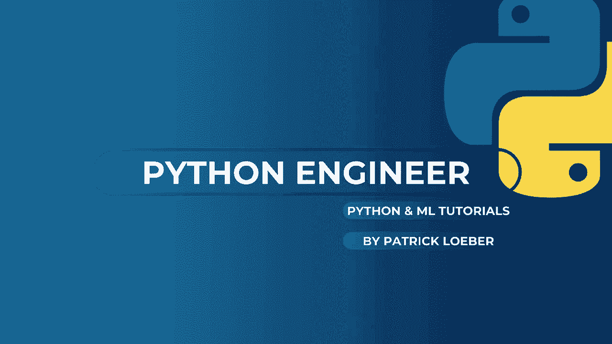
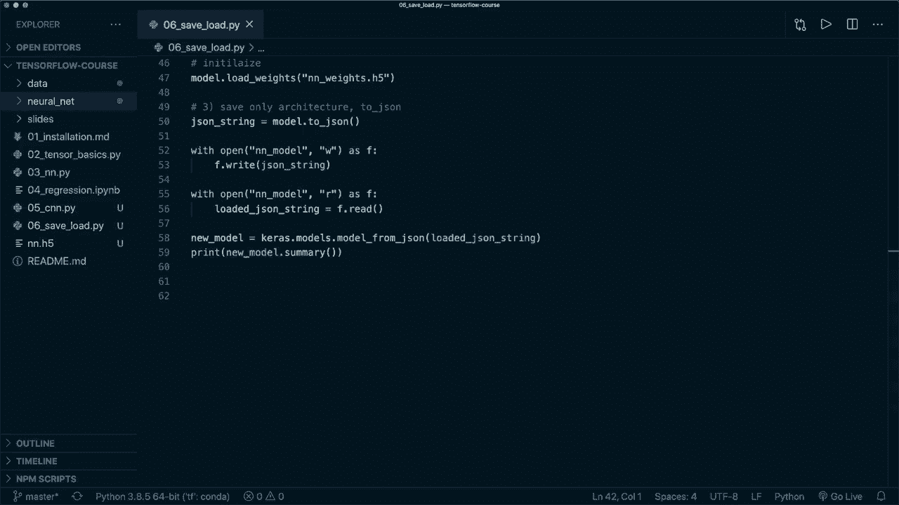

# 面向初学者的 TensorFlow 教程，理论知识、代码思路和应用案例，真正从零开始讲明白！＜快速入门系列＞ - P6：L6- 保存和加载模型 - ShowMeAI - BV1TT4y1m7Xg

🎼，嘿，大家，欢迎来到下一个Tensorflow教程。在这一集中，我想向你展示如何保存和加载我们的模型。使用Tensorflow API这非常简单。所以让我们看看我们是怎么做到的。在这里我有和第3个教程相同的代码，我们实现了一个简单的前馈神经网络，并将其用于Mnes数据集。😊。

所以在我们定义模型后，我们编译并拟合它。我们开始训练，然后进行评估。之后，我们想保存我们的模型，这里有三种不同的选项，我想向你展示这三种，因此我们可以保存和加载整个模型。

我们可以只保存权重，或者只保存架构。所以让我们从整个模型开始，这非常简单，我们只需说模型保存，然后指定文件名，这里有两种不同的可能格式可供使用，因此我们可以使用Tensorflow保存的模型格式或使用HDf5格式，这取决于我们使用的后缀。例如。

如果我们仅使用NN表示神经网络，文件名没有后缀，那么它将使用这种格式。如果我们指定后缀H5，那么它将使用这种格式。因此两者在Tensorflow文档中都正常工作，他们建议使用这种格式，但我认为这种格式也可以。因此你可以两者都使用。

所以让我们使用这两种格式来向你展示差异。所以让我们使用另一个神经网络，称之为没有后缀的神经网络。现在如果我们运行这个，它将开始训练，训练后，它应该以两种格式保存模型。因此我们说。Python，然后是这个文件的名称。

所以这是第6个教程。好了，训练已经完成，并且我们的模型已保存。我们看到了H 5文件。至于另一个，我们只是使用神经网络。然后它使用了保存的模型格式。对此，它会创建一个包含文件的整个文件夹。因此两者都正常工作。然后为了加载它。

让我们使用一个新模型。我们可以通过说新的模型等于Kaas.dot.model.dot.load_model，然后是相同的文件名来加载它。所以让我们使用N.dot.H 5。现在我们有了它，可以做同样的事情。因此现在如果我说新模型.dot.evaluate，那么这应该会产生完全相同的结果。现在我们可以删除所有这些。因此我把它留在这里，以便它。😊。

第一次评估和第二次评估，这样我们可以看到这是相同的。在这里我想提到，上次对于指标，我们只是使用了名称准确性。在当前的Tensorflow版本2.3中，有一个问题。如果你使用字符串，然后在加载这个特定的损失后，它将不会产生相同的结果。

所以你应该在这里使用这个kas矩阵对象，然后它运行良好。但这将在版本2.4中修复。让我们运行它。然后我们应该看到原始模型和加载模型的完全相同的评估结果。好的，这里我们有它。所以这里是原始模型的评估。

然后在加载之后，我们得到了这个。这是完全一样的，别担心这个警告。如果我们使用保存的模型格式，这个警告会出现。但我认为这也是一个缺陷，应该在下一个版本中修复。所以，是的，我认为现在我们看到了如何保存和加载模型。所以就是这么简单。

我们只使用`model dot save`，然后可以再次调用`Kara models load model`。然后我们得到了完全相同的模型。这就是我们如何保存整个模型。现在如果我们只想保存权重，我们也可以非常简单地做到这一点。所以我们可以保存`model dot save weights`，然后叫做`and dot weights dot H 5`。

这里我们再次有两个选项。有文件名后缀或者没有。如果我们想加载权重，那么我们需要像这里那样设置我们的模型。然后在不训练的情况下，我们可以简单地说`model dot load weights`，然后是这个文件名。所以`N dot weights dot H 5`。所以在这里，我们需要初始化我们的模型。现在。

作为最后一个选项，如果我们只想保存架构，我们可以通过说`our cha string equals`来获取架构的Cha字符串，然后使用`model to Chasson`，这会将我们的模型架构保存为Cha字符串。然后，例如，我们可以保存这个，所以我们可以说`with open`，然后是我们的文件名。

所以`N and model`，我们想以写模式打开它，然后是`S F`。然后我们说`F dot right our Cha string`，加载时也是一样。因此在加载时，我们做同样的事情，说`with open`，然后是同样的名称和`end dot model`，然后在这里以读模式作为`F`。然后我们可以说`our loaded Cha string equals`，在这里我们说`F dot read`，所以我们不需要在这里导入Cha模块。

这已经在TensorFlow API中实现了。当我们加载了Cha字符串时，我们可以通过说`new model equals Kas dot model dot model and then underscore from Jason`来设置我们的模型。然后在这里加载的Jason字符串。现在这里，这将只加载架构。如果我们说`print new model dot summary`，那么它看起来会是一样的。

但这里还没有权重。因此我们仍然需要训练它。但没关系，现在你有了三种不同的选择。我认为第一种是最简单的，但也是最贵的。所以有时候你只想保存权重或仅仅是架构。所以，现在你知道使用TensorFlow API是多么简单。

然后你可以开始保存和加载你的模型。没错，这就是现在的内容。希望你喜欢这个教程。请点击点赞按钮并考虑订阅频道。希望在下个视频中见到你。
