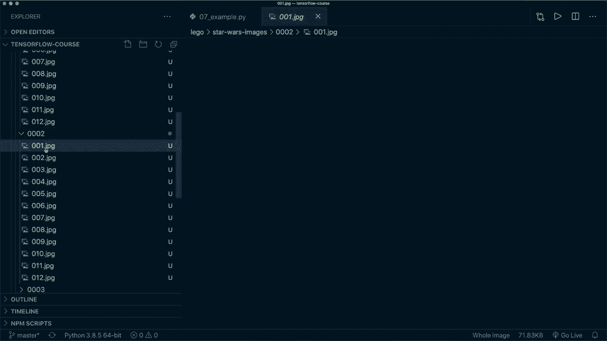

# 面向初学者的 TensorFlow 教程，理论知识、代码思路和应用案例，真正从零开始讲明白！＜快速入门系列＞ - P7：L8- 乐高星球大战小人仔分类任务 完整项目流程 

🎼，大家好，欢迎来到另一个 Tensorflow 教程。今天，我将进行另一个完整的项目演示。我认为这个项目会很有趣，因为我们将使用来自 Kaaggle 的真实图像数据集，包含乐高星球大战小人仔。我们要对角色进行分类。因此，在这个过程中，我们将学习如何下载和组织我们的数据，以及如何将图像加载到 Tensorflow 中并进行预处理。

然后我们设置一个卷积神经网络，训练它并保存我们的模型。在这个过程中，我还会介绍一些新概念，比如图像增强和 Keras 回调。所以我希望你能坚持到最后，我们将看看能否正确识别卢克·天行者。这是可在 Kaggle 上获取的图像数据集，我会在描述中放上链接。

然后你可以直接点击下载并下载数据。我已经做过这一步，并将其复制到我的项目目录中。😊，在这个乐高文件夹中，我们有一些不同的类别，比如哈利·波特和侏罗纪世界。但现在我只会使用星球大战的人物，以便于你更容易跟上。

所以我们来复制这个文件夹，以便我们有一个备份，因为我们将稍微重新组织数据。我们将其重命名为星球大战图像。然后在这里，我们有10个不同的类别，但现在我只会使用前五个。这样做是为了让你更容易理解。现在我们来看看这些图像。所以现在在这个星球大战图像文件夹中。我们有。

例如，class1。这是尤达。

class2 是卢克·天行者。

然后我们还有 R2-D2，还有麦克斯·温度。最后一个角色是格里夫斯将军。所以这些是我们想要识别的角色，现在我想做的第一件事是稍微重新组织一下这个文件夹结构。这样你就可以像这样加载它，同时你还可以通过每个目录中的元数据进行加载。我想让它简单一点，这样我们就可以轻松加载到 Tensorflow 的图像加载器中。

所以我想将数据集分为训练图像、验证图像和测试图像。我们在这里创建三个文件夹，然后在。

在每个文件夹中，我们会为每个角色创建图像。例如，我们有一个训练文件夹，然后在子文件夹中，我们有一个关于尤达的文件夹，卢克·天行者等等。所以这是我们要做的第一件事。在这里，我在一个 Jupyter notebook 中，我们导入所需的内容。

然后这里我命名了包含图像的基本目录，然后我硬编码了每个角色的名称。这五个角色，我还设置了一个随机种子，使其更具可重复性，现在我们要做的第一件事是创建不同的文件夹。

所以我们当然可以用Python自动化这个。如果我运行这个代码并查看，这里创建了这三个新文件夹，然后在每个文件夹内为我们拥有的每个角色创建了一个文件夹。因此，现在这些都是空的，我们将从这里获取图像，然后复制到这里。

我们每个角色大约有12到14幅不同的图像。我知道这不是很多，特别是对于深度学习，但对于本教程来说足够了，我会在最后向你展示我们得到了相当不错的准确率。所以，是的，我们现在想要将大约60%用于训练，25%用于验证，剩下的用于测试，然后将它们复制到这些文件夹中。

所以如果我运行这个。然后它会打印每个目录中图像的总数，以及训练样本、验证样本和测试样本的数量。所以现在如果我们回到这里，这些文件夹都是空的，所以我们实际上可以删除它们，现在移动到垃圾桶，现在在训练文件夹中，例如，我们应该有图像，所以我们为每个角色有训练图像、测试图像和验证图像。

所以再一次，这就是你的结构应该是什么样子。这使得Tensorflow图像数据加载器非常简单。因此，现在我们可以继续设置我们的图像数据生成器，以便从Kras预处理图像中获取图像数据生成器，在这里你可以传入自己的预处理函数，例如，你可以编写一个规范化数据的函数。

但在特殊情况下，我们只想规范化它。我们还可以传入rescale参数，然后在这里我们使用1除以255，因此我们希望我们的图像范围在0到1之间，就像之前的示例一样。然后我们必须调用这个生成器，调用从目录流的函数。在这里，我们传入训练的目录。

所以这是乐高星球大战的图像，然后训练，然后我们可以指定目标大小。因此，现在我认为图像的尺寸必须是512乘512，我们可以指定一个目标大小，Tensorflow会自动为我们调整大小。然后我指定类模式，因为我想将标签作为单个整数值。因此，你也可以，例如，在这里使用独热编码。然后你可以使用批量大小。

然后对于我们的训练图像，我们说shuffle等于true。然后我们指定我们有RGB图像。因此，你可以在文档中检查参数。然后我们指定我在这里硬编码的类名。对于验证和测试我们也做同样的事情。

图像的唯一不同之处在于，我们在训练时使用 `shuffle=True`。而在验证时，我们设置为 `false`。所以这里其实没什么关系，但尤其在测试时，你希望 `shuffle=False`。所以现在如果我们运行这个，那么 Tensorflow 会自动为我们加载这些。例如，我们来打印一下。

测试批次的形状。所以我们说我们只有四个的批次大小。这就是为什么我们有四个不同的标签。如果我们看看第一个批次，那么这是四，因为我们有四个样本，每个图像的大小是 `256 x 256 x 3`，因为我们在这里指定了这个图像大小，并且我们有三个颜色通道。因此，让我们例如用 Matplotlib 绘制一些图像，这里打印了测试批次的前四个图像，这里我们有尤达和杜克·天行者，并且我们打印了训练批次的四个图像。因此，是的，现在我想向你展示的另一件事是，我们可以非常轻松地使用这个图像数据生成器进行图像增强，因此如果我们看看 Tensorflow。

数据增强是一种通过应用随机变换（例如图像旋转或翻转）来增加训练集多样性的技术。因此，这对于提高模型的泛化能力非常有用。我们可以通过这个数据生成器非常容易地实现这一点。因此，我们需要传入的唯一内容就是一些额外的参数。如果我们想要这个。

那么我们只对训练数据集这样做。例如，我们可以指定旋转范围，指定随机水平翻转，还可以指定高度平移、宽度平移以及剪切和缩放。所以现在如果我们使用这个。那么让我应用所有这些。然后再一次，你只希望对你的训练数据这样做，而不是对这些。

这里有几种不同的方法。所以，当然，你也可以编写自己的函数来实现这个。但这个图像数据生成器使得这一切变得非常简单。那么现在让我们再次运行这个图像增强。因此，让我们运行这个和这个，还有这个，再次运行。是的，这里我们可以看到，例如。

我们有轻微的旋转，可能还有不同的缩放因子，或者这里可能有一些剪切效果。因此，是的，让我们再运行一次。那么让我们从批次中随机选择另一个样本。再一次，让我们看看。是的，我认为你绝对可以看到它正在对图像进行处理。因此，这个图像确实是旋转过的。所以，是的，这是一种你可以很容易应用的好技术。

所以我现在要暂时移除这个，因为我们没有那么多图像。在这种情况下，它实际上可能会混淆我们的模型并降低准确性。因此在这个示例中，我将把它排除，但请记住，你可以很容易地在这里做到这一点。那么让我们再次运行这个和这个，然后我们就不应该再看到增强效果了。

所以，是的，我认为这些是没有旋转或其他效果的正常图像。现在我们设置卷积模型。这与教程5中的内容相同，是一个简单的卷积神经网络，具有不同的卷积层、最大池化和激活函数。最后，我们使用一个全连接层。这个最后一层很重要。

在这里，我们仅使用五个输出，因为我们有五个不同的类别。所以让我们运行这个并打印出我们模型的摘要。在这里我们可以检查架构。然后我们设置损失、优化器和指标并编译我们的模型。这再次与上次相同。在这里重要的是要设置from_logits等于true，因为我们在最后一层不使用激活函数。

所以让我们编译它。然后我们可以轻松调用model.fit来训练我们的模型。现在我想给你展示另一个新东西。我想谈谈Keras回调。回调是应用于每个训练epoch之后的函数。所以在这里，你可以，例如，保存检查点或使用其他不同的功能。

我在这里想做的是使用早停回调。这样我们可以很方便地使用它，因为它已经在Keras的回调中实现了。然后我们设置早停。我们希望监控验证损失，并设定耐心为五。这意味着如果验证损失在接下来的五个epoch中没有改善。

然后它将自动进行早停训练。因此，当我们有这个时，我们可以指定这个参数。所以我们可以说回调等于。然后这是一个列表，因为如果需要，我们可以传入更多的回调。然后我们说早停。接着我们使用其余的参数。

现在让我们训练这个并看看会发生什么。好的，训练完成了。我们实际上说我们想要30个epoch，但在第10个epoch后停止了，因为我们的验证损失没有改善。所以这里是我们的最低值，接着在接下来的5个epoch中没有更好。因此它在这里停止了。我们可以看到，如果我们查看训练数据的准确率，那么这里。

例如，我们在最后一个epoch中得到了100和97。这是非常好的。但是现在如果我们看看验证准确率，我们会发现这是最佳的，但实际上却在下降，而我们的验证准确率并不好。所以这是一个。

清晰地表明我们对训练数据存在过拟合问题。在这种情况下，部分原因是我们没有那么多可用的图像，尤其是验证集的图像很少。所以这可能是一个问题。不过，是的，我认为在这种情况下，拥有这个回调非常好。然后我们可以停止并尝试改进这个模型。所以我把这留给你作为作业。你可以。

例如，尝试使用我向你展示的图像增强，或者调整学习率，或者也尝试稍微改变我们模型的架构。所以是的，这就是我们可以做的一件事。😊在下一个教程中，我还会向你展示另一种非常强大的技术，通过这种技术，我们可以在小数据集上实现非常高的验证准确率。所以我希望你也能观看下一个教程。暂时就这样。

我还想做的事情。所以我们可以轻松保存我们的模型，这是一件我已经向你展示过的事情。所以我们可以像这样保存它。然后如果我们查看这个文件夹，它应该在这里。所以是的，就在那里。😊然后我们来绘制一些数据。所以在这里我们看到损失。训练损失下降得非常好，但验证损失就没那么好了。

训练的准确率也是如此，非常好。但是验证的准确率就不好了。所以，这可能是一个指标，表明我们在这里存在过拟合。所以现在让我们在测试数据上评估它。再次在这里，我们看到我们在这个测试数据上的准确率不是很好。

然后如果我们尝试进行预测，我们调用模型预测。然后我们还需要在这里应用软标记，因为我们在模型层的最后一层没有使用它。然后为了获取实际标签，我们必须沿着轴1调用arctmax。所以现在如果我们打印实际标签和预测标签。然后我们看到我们有。

在这种情况下，它的正确率只有50%。所以现在再次打印一些新图像和预测。是的，在这里我们的预测再次是卢克·天行者，所以卢克·天行者。这不是很好。所以是的，但现在我想你应该知道我们如何应用一个完整的项目，使用真实的图像数据集。我们甚至在训练数据集上实现了高准确率，使用了我们所用的技术。

但我们仍然需要改进，使其在验证数据集和新的测试数据集上也表现良好。所以在下一个教程中，我们将学习迁移学习。通过这个，我想我们会实现相当不错的准确率。所以我希望在下一个视频中见到你。如果你喜欢这个教程，请点击喜欢按钮，并考虑订阅频道，下次见。

再见。😊！
